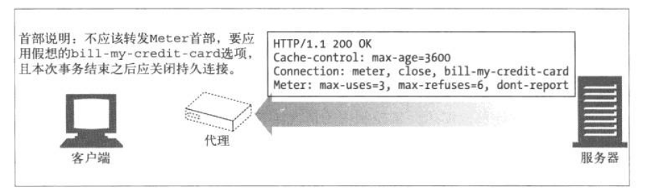
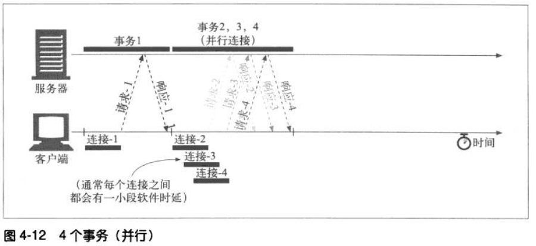
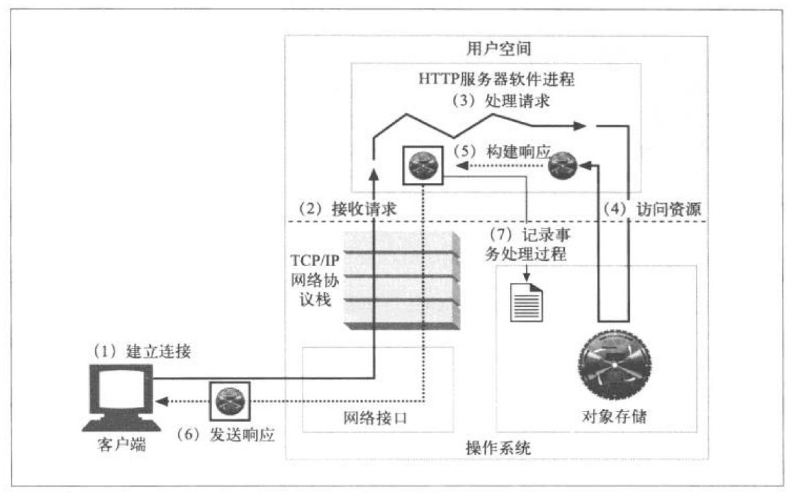

# HTTP权威指南

## 第一部分 HTTP：web的基础

### 第一章 HTTP概述

#### 1.1 HTTP——因特网的多媒体信使

#### 1.2 web客户端和服务器

#### 1.3 资源

##### 1.3.1 媒体类型

因特网上有数千种不同的数据类型，HTTP仔细地给每种要通过web传输的对象都打上名为MIME类型的数据格式标签。

MIME类型是一种文本标记，表示一种主要的对象类型和一个特定的子类型，中间由一条斜杆来分隔

##### 1.3.2 uri（同一资源标识符）

每个web服务器资源都有一个名字，这样客户端就可以说明它们感兴趣的资源是什么了。服务器资源名被称为同一资源标识符。uri有两种形式：分别为url和urn

##### 1.3.3 url（同一资源定位符）

同一资源定位符是资源标识符最常见的形式。url描述了一台特定服务器上某资源的特定位置。它们可以明确说明如何从一个精确、固定的位置获取资源

大部分url都遵循 一种标准格式，这种格式包含三个部分

1. url的第一部分被称为方案，说明访问资源所使用的协议类型。这部分通常就是HTTP协议

2. 第二部分给出服务器的因特网地址

3. 其余部分指定了web服务器上的某个资源（如：/0.jpg）

   ##### 1.3.4 urn

   uri的第二种形式就是统一资源名。urn是作为特定内容的唯一名称使用的，与目前的资源所在地无关。

#### 1.4 事务

一个HTTP事务由一条（从客户端发往服务器的）请求命令和一个（从服务器发回客户端的）响应结果组成。这种通信是通过名为HTTP报文（HTTP massage）的格式化数据块进行的

##### 1.4.1 方法（请求命令）

##### 1.4.2 状态码

每条HTTP响应报文返回时都会携带一个状态码。状态码是一个三位数的代码，告知客户端请求是否成功，或许是否需要采取其他动作。

##### 1.4.3 web页面种可以包含多个对象

#### 1.5 报文

HTTP报文是由一行一行的简单字符串组成的。HTTP报文是纯文本，不是二进制代码。

从客户端发往web服务器的HTTP报文称为请求报文。从服务器发往客户端的报文称为响应报文。

HTTP报文包括以下三个部分：

1. 起始行

   报文的第一行就是起始行，在请求报文中用来说明要做些什么，在响应报文中说明出现了什么情况。

2. 首部字段

   起始行后面有零个或多个首部字段。每个首部字段都包含一个名字和一个值，为了便于解析，两者之教你用冒号（：）来分隔。首部以一个空行结束。添加一个首部字段和添加新行一样简单

3. 主体

   空行之后就是可选的报文主体，其中包含了所有类型的数据。请求主体中包括了要发送给web服务器的数据，响应主体中装载了要返回给客户端的数据。起始行和首部都是文本形式且都是结构化的，而主体则不同，主体中可以包含任意的二进制数据（图片、视频。。。）。当然，主体中也可以包含文本

   

   

   

#### 1.6 连接

##### 1.6.1 TCP/IP

TCP提供了：

1. 无差错的数据传输

2. 按序传输（数据总是会按照发送的顺序到达）

3. 未分段的数据流（可以在任意时刻以任意尺寸将数据发送出去）

互联网自身就是基于TCP/IP的，TCP/IP是全世界的计算机和网络设备常用的层次化分组交换网络协议集

只要建立TCP连接，客户端和服务器之间的报文交换就不会丢失、不会被破坏，也不会在接收时出现错序了

##### 1.6.2 连接、IP地址和端口号

在HTTP客户端向服务器发送报文之前，需要用网际协议（IP）地址和端口号在客户端和服务器之间建立一条TCP/IP连接

##### 1.6.3 使用telnet 实例

telnet 程序可以将键盘连接到某个目标TCP端口，并将此TCP端口的输出送到显示屏上。telnet常用于远程终端对话，它几乎可以连接所有的TCP服务器，包括HTTP服务器

可以通过telnet程序直接与web服务器进行对话

#### 1.7 协议版本

#### 1.8 web的结构组件

代理：位于客户端和服务器之间的HTTP中间实体

缓存：HTTP的仓库，使常用于页面的副本可以保存在离客户端更近的地方

网关：连接其他应用程序的特殊web服务器

隧道：对HTTP通信报文进行盲转发的特殊代理

agent代理：发动自动HTTP请求的半智能web客户端

### 第二章 URL与资源

#### 2.1 浏览因特网资源

#### 2.2 URL的语法

##### 2.2.1 方案——使用什么协议

方案实际上是规定如何指定资源的主要标识符，它会告诉负责解析URL的应用程序应该使用什么协议。方案组件必须以一个字母符号开始，由第一个“：”符号将其与URL的其余 部分隔开，方案名与大小写无关

##### 2.2.2 主机与端口

主机组件标识了因特网上能够访问资源的宿主机器

端口组件标识了服务器正在监听的网络端口

##### 2.2.3 用户名与密码

##### 2.2.4 路径

##### 2.2.5 参数

##### 2.2.6 查询字符串

##### 2.2.7 片段

为了引用部分资源或资源的一个片段，URL支持使用片段组件来表示一个资源内部的片段。比如，URL可以指向HTML文档里面一个特定的图片或小节。片段挂在URL的右手边，最前面有一个字符“#”

#### 2.3 URL 快捷方式

##### 2.3.1 相对URL

相对URL为保持一组资源的便携性提供了一种便携方式。如果使用的是相对的URL，就可以在搬移一组文档的同时，仍然保持链接的有效性，引文相对URL都是相对于新基础进行解释的。这样就可以实现在其他服务器上提供镜像内容之类的功能了

1. 基础URL

   转换处理的第一步就是找到基础URL。基础URL是作为相对URL的参考点使用的，可以来自来自不同的地方

   。　在资源中显示提供

   有些资源会显示地指定基础URL。如，HTML文档中可能会包含一个定义了基础URL的HTML标记＜ｂａｓｅ＞，通过它来转换那个HTML文档中的所有相对URL

   。　封装资源的基础URL

   如果在一个没有显式指定基础URL的资源中发现了一个相对URL，可以将它所属资源的URL作为基础

   。　没有基础的URL

   在某些情况下，没有基础URL。这通常意味着你有一个相对URL，但有时可能只是一个不完整或损坏了的URL

2. 解析相对引用

   

##### 2.3.2 自动扩展URL

自动扩展的方式

1. 主机名扩展
2. 历史扩展

#### 2.4 各种令人头疼的字符

##### 2.4.1 URL字符集

默认的计算机系统字符集通常都倾向于以英语为中心的，以前用的是US-ASCII字符集，后加入转义序列集。通过转义序列集，就可以用US-ASCII字符集的有限字符集对任意字符值或数据进行编码，这样就实现了可移植性和完整性

##### 2.4.2 编码机制

为了避免安全字符集表示法带来的限制，人们设计一种编码机制，用来表示各种不安全的字符。这种编码机制就是通过一种“转移”表示法来表示不安全字符的，这种转义表示法包含一个百分号，后面跟着两个表示字符ASCII码的十六进制数

##### 2.4.3 字符限制

#### 2.5 方案的世界

### 第三章 HTTP报文

1. 报文是如何流动的
2. HTTP报文的三个组成部分（起始行，首部和实体的主体部分）
3. 请求和响应报文之间的区别
4. 请求报文支持的各种功能
5. 和响应报文一起返回的各种状态码
6. 各种各样的HTTP首部都是用来做什么的

#### 3.1 报文流

HTTP报文是在HTTP应用程序之间发送的数据块。这些数据块以一些文本形式的元信息开头，这些信息描述了报文的内容及含义，后面跟着可选的数据部。这些报文在客户端、服务器和代理之间流动。

##### 3.1.1 报文流入源端服务器

HTTP使用术语流入（inbound）和流出（outbound）来描述事物处理的方向。报文流入源端服务器，工作完成之后，会流入用户的Agent代理中

##### 3.1.2  报文向下游流动

#### 3.2 报文的组成部分

HTTP报文是简单的格式化数据块，它们由三个部分组成：对**报文进行描述的起始行**（start line），**包含属性的首部**（header）块，以及**可选的、包含数据的主体**（body）部分。

起始行和首部就是由行分隔的ASCII文本。每行都以一个由两个字符组成的行终止序列作为结束，其中包含一个回车符和一个换行符。这个行终止序列可以写作CRLF。

##### 3.2.1 报文的语法

请求报文的格式：

<method> <request-URL> <version>

<headers>

<entity-body>

响应报文的格式（注意，只有起始行的语法有所不同）

<version> <status> <reason-phrase>

<headers>

<entity-body>

下面一些部分的简要描述

1. <version>

报文所使用的HTTP版本，其格式看起来是这样的：

HTTP/<major>.<mimor>

其中主要版本号（major）和次要版本号（minor）都是整数

2. <status-code>

   这三位数字描述了请求过程中所发生的情况。每个状态码的第一位数字都用于描述状态的一般类别（“成功“、“出错”等）

3. <reason-phrase>

   数字状态码的刻度版本，包含终止序列之前的所有文本

4.  首部

   可以有零个或多个首部，每个首部都包含一个名字，后面跟着一个冒号，然后是一个可选的空格，接着是一个值，最后是一个CRLF。首部是由一个空行(CRLF)结束的，表示了首部列表的结束和实体主体部分的开始

##### 3.2.2 起始行

1. 请求行

2. 响应行

3. 方法

   

4. 状态码

   

5. 原因短语

   原因短语是响应起始行中的最后一个组件。它为状态码提供了文本形式的解释。如，在**HTTP/1.0 200 OK** 中，**OK**就是原因短语。原因短语和状态码是成对出现的。原因短语是状态码的可读版本，应用程序开发者将其传送给用户，用以说明在请求期间发生了什么情况

##### 3.2.3 首部

HTTP首部字段向请求和响应报文中添加了一些附加信息。从本质上来讲，它们只是一些**名/值**对的列表

1. 首部的分类

   

2. 首部延续行

   将长的首部分为多行可以提高可读性，多出来的每行前面至少要有一个空格或制表符

   如：

   ​	HTTP/1.0 200 OK

   ​	Content-Type: image/gif

   ​	Content-Length: 8572

   ​	Server: Test server

   ​		version 1.0

   ##### 3.2.4 实体的主体部分

   HTTP报文的第三部分是可选的实体部分。实体的主体是HTTP报文的负荷。就是HTTP要传输的内容

#### 3.3 方法

##### 3.3.1 安全方法

HTTP定义了一组被称为安全方法的方法。**GET方法**和**HEAD方法**都被认为是安全的，这就意味着使用GET或HEAD的请求都不会产生什么动作。即意味着不会再服务器上产生什么结果

##### 3.3.2 GET

get是最常用的方法。通常用于请求服务器发送某个资源。HTTP/1.1要求服务器实现此方法。

##### 3.3.3 HEAD

head方法与get方法的行为很类似，但服务器在响应中只返回首部。不会返回实体的主体部分。这就允许客户端在未获取实际资源的情况下，对资源的首部进行检查。使用head，可以：

1. 在不获取资源的情况下了解资源的情况（如，判断其类型）
2. 通过查看响应中的状态码，看看某个对象是否存在
3. 通过查看首部，测试资源是否被修改

服务器开发者必须确保返回的首部与GET请求返回的首部完全相同。遵循HTTP/1.1规范，就必须实现HEAD方法

##### 3.3.4 PUT

与GET从服务器读取文档相反，PUT方法会向服务器写入文档。有些发布系统允许用户创建ｗｅｂ页面，并由PUT直接将其安装到web服务器上去

put方法的语义就是让服务器用请求的主体部分来创建一个由所请求的URL命名的新文档，或者，如果那个URL已经存在的话，就用这个主体来替代它

因为put允许用户对内容进行修改，所以很多web服务器都要要求在执行PUT之前，用密码登陆

##### 3.3.5 POST

post方法起初是用来向服务器输入数据的。实际上，通常会用它来支持HTML的表单。表单中填好的数据通常会被送到服务器

##### 3.3.6 TRACE

客户端发起一个请求时，这个请求可能要穿过防火墙、代理、网关或其他一些应用程序。每个中间节点都可能会修改原始的HTTP请求。trace方法允许客户端在最终将请求发送给服务器时，看看它变成什么样子

**trace请求会在目的服务器端发起一个环回诊断。行程的最后一站的服务器会弹回一条trace响应，并在响应主体中携带它收到的原始请求报文**

trace方法主要用于诊断，也就是说。用于验证请求是否如愿穿过了请求/响应链。他也是一种很好的工具，可以用来查看代理和其他应用程序对用户请求所产生效果

尽管trace可以很方便地用于诊断，但它确实也有缺点，它假定中间应用程序对各种不同类型请求（不同的方法——get，head，post等）的处理是相同的。很多HTTP应用程序会根据方法的不同做出不同的事情——比如，代理可能会将post请求直接发送给服务器，而将get请求发送给另一个HTTP应用程序（比如web缓存）。trace并不提供区分这些方法的机制。通常，中间应用程序会自行决定对trace请求的处理方式

trace请求中不能带有实体的主体部分。trace响应的主体部分包含了响应服务器收到的请求的处理方式

##### 3.3.7 OPTIONS

**options方法请求web服务器告知其支持的各种功能。可以询问服务器通常支持哪些方法，或者对某些特殊资源支持哪些方法。**（有些服务器可能只支持对一些特殊类型的对象使用特定的操作）。

这为客户端应用程序提供了一种手段，使其不用实际访问那些资源就能判定访问各种资源的最优方式

##### 3.3.8 DELETE

delete方法是请求服务器删除url所指定的资源，但服务器可以决定是否撤销请求（客户端不知情）

##### 3.3.9 扩展方法

#### 3.4 状态码

##### 3.4.1 信息性状态码

1. 100 continue

   主要用于客户端就要发送一个服务器无法处理或使用之类的大实体时，才会使用100 continue

   服务器收到100 continue之后，应该发送错误码或者100 continue。当服务器还没发状态码之前，客户端已经开始发了部分实体，这时候服务器就不用发100 continue了，但可以在接收完毕之后发送最终状态码

   

2. 101 switching protocols

##### 3.4.2 成功状态码 200-299

##### 3.4.3 重定向状态码 300-399

重定向状态码要么告知客户端使用替代的位置来访问他们所感兴趣的资源，要么提供一个替代的响应而不是资源的内容。如果资源已被移动，服务端可以发送一个重定向状态码和一个**可选的**location首部来告知客户端资源已被移走，以及现在可以从哪里获得此资源。（用处是为了不打扰到使用者的情况下，透明地转入到新的位置）

##### 3.4.4 客户端错误状态码 400-499

有时候客户端发送一些服务器端无法解决的请求，就会触发客户端错误状态码

##### 3.4.5 服务器错误状态码 500- 599

当有时候服务器自身出现问题，这时客户端发送过来一条请求信息时，服务器就会返回一条服务器错误状态码

##### 3.4.6 常用状态码

1xx：指示信息–表示请求已接收，继续处理 
2xx：成功–表示请求已被成功接收、理解、接受 
3xx：重定向–要完成请求必须进行更进一步的操作
4xx：客户端错误–请求有语法错误或请求无法实现
5xx：服务器端错误–服务器未能实现合法的请求 
常见状态代码、状态描述、说明： 
200 OK     //客户端请求成功 
400 Bad Request  //客户端请求有语法错误，不能被服务器所理解 
401 Unauthorized //请求未经授权，这个状态代码必须和 WWW-Authenticate 报头域一起使用
403 Forbidden  //服务器收到请求，但是拒绝提供服务 
404 Not Found  //请求资源不存在，eg：输入了错误的 URL 
500 Internal Server Error //服务器发生不可预期的错误 

503 Server Unavailable  

### 第四章 连接管理

#### 4.1 TCP连接

##### 4.1.1 TCP的可靠数据管道

HTTP连接实际上就是TCP连接和一些使用连接的规则。TCP连接是因特网上的可靠连接。

TCP为HTTP提供了一条可靠的比特传输管道。从TCP连接一端填入的字节会从另一端以原有的顺序、正确地传送出来

##### 4.1.2 TCP流是分段的，由IP分组传送

TCP的数据是通过名为IP分组（IP数据报）的小数据块来发送的。

HTTP就是“HTTP over TCP over IP ”这个“协议栈”中的最顶层了。其**安全版本HTTPS就是在HTTP和TCP之间插入了一个（称为TLS或SSL的）密码加密层**

HTTP要传输一条报文时，会以**流的形式**将报文数据的内容通过一条打开的TCP连接**按序**传输。TCP收到数据流之后，会将数据流砍成被称作**段**的小数据块，并将段封装在**IP分组**中，通过因特网进行传输。

每个TCP段都是由IP分组承载，从一个IP地址发送到另一个IP地址的。每个IP分组中包括：

· 一个IP分组首部（通常为20字节）

· 一个TCP段首部（通常为20字节）

· 一个TCP数据块（0 或多个字节）

IP首部包含了源和目的IP地址、长度和一些其他标记。TCP段的首部包含了TCP端口号、TCP控制标记，以及用于数据排序和完整性检查的一些数字值

##### 4.1.3 保持TCP连接的正确运行

在任意时刻计算机都可以有几条TCP连接处于打开状态。TCP是通过**端口号**来保持所有这些连接的正确运行的。**IP地址可以将你连接到正确的计算机，端口号可以将你连接到正确的应用程序上**

TCP连接是通过4个值来识别的：

<源IP地址、源端口号 、目的IP地址、目的端口号>

##### 4.1.4 用TCP套接字编程

套接字API允许用户创建TCP的端点数据结构，将这些端点与远程服务器的TCP端点进行连接，并对数据流进行读写。

#### 4.2 对TCP性能的考虑

##### 4.2.1 HTTP事务的时延

##### 4.2.2 性能聚焦区域

常见的TCP相关时延

- TCP连接建立握手
- TCP慢启动拥塞控制
- 数据聚集的Nagle算法
- 用于捎带确认的TCP延迟确认算法
- TIME_WAIT时延和端口耗尽

#### 4.3 HTTP连接的处理

##### 4.3.1 常被误解的Connection首部

HTTP的Connection给首部字段中有一个由逗号分隔的**连接标签**列表，这些标签为此连接指定了一些不会传播到其他连接中去的选项。

eg：connection：close 来说明发送完下一条报文之后必须关闭的连接

##### 4.3.2 串行事务处理时延

#### 4.4 并行连接

##### 4.4.1 并行连接可能会提高页面的加载速度

##### 4.4.2 并行连接不一定更快

-  大量连接会消耗大量的内存资源
- 当modem不够时，连接多也提高不了速度

#### 4.5 持久连接

HTTP允许HTTP设备在事务处理结束后将TCP保持在打开状态，以便为未来的HTTP请求重用现存的连接。在事务结束后仍然保持在打开状态的TCP连接称为持久连接

##### 4.5.1 持久连接以及并行连接

##### 4.5.2 HTTP/1.0+keep-alive连接

### 第五章 web服务器

#### 5.1 各种形状和尺寸的web服务器

##### 5.1.1 web服务器的实现

web服务器逻辑实现了HTTP协议、管理着WEB资源，并负责提供web服务器的管理功能。web服务器逻辑和操作系统共同负责管理TCP连接

##### 5.1.2 通用软件web服务器

通用软件web服务器都运行在标准的、有网络功能的计算机系统上

##### 5.1.3 web服务器设备

web服务器设备是预先打包好的软硬件解决方案

##### 5.1.4 嵌入式web服务器

嵌入式服务器是要嵌入到消费类产品中去的小型web服务器

#### 5.2 最小的Perl web服务器

#### 5.3 实际的web服务器会做些什么

1. 建立连接——接受一个客户端连接，或者不希望与这个客户端建立连接，就将其关闭
2. 接收请求——从网络中读取一条HTTP请求报文
3. 处理请求——对请求报文进行解释，并采取行动
4. 访问资源——访问报文中指定的资源
5. 构建响应——创建带有正确首部的HTTP响应报文
6. 发送响应——将响应送回给客户端
7. 记录事务处理过程——将已完成事务有关的内容记录在一个日志文件中

