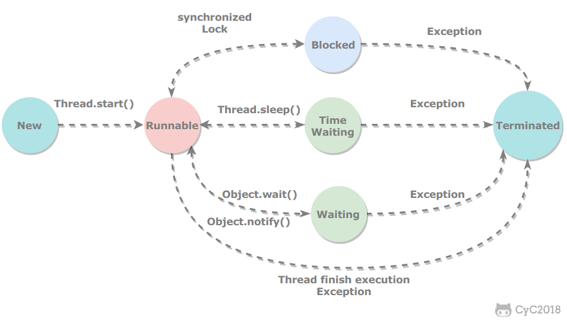

# Java 并发

## 一、基本概念

### 1. 线程状态转换

1. 新建（New）：创建后尚未启用

2. 可运行（Runnable）：可能正在运行，也可能正在等待CPU时间片(包含了操作系统的线程状态的Running和Ready)

3. 阻塞（Block）:等待获取一个排它锁，如果其线程释放了锁就会结束此状态

4. 无限等待（Waiting）：等待其他线程显式地唤醒，否则不会被分配CPU时间片

   | 进入方法                                       | 退出方法                                 |
   | ---------------------------------------------- | ---------------------------------------- |
   | 没有设置 `timeOut` 参数的 `Object.wait()` 函数 | `Object.notify()` / `Object.notifyAll()` |
   | 没有设置 `timeOut` 参数的 `Thread.join()` 函数 | 被调用的线程执行完毕                     |
   | `LockSupport.park()` 方法                      | `LockSupport.unPark(Thread)`             |

5. 限期等待（Timed Waiting）：无需等待其它线程显式地唤醒，在一定时间之后会被系统自动唤醒

   调用 `Thread.sleep()` 方法使线程进入限期等待状态时，常常用“使一个线程睡眠”进行描述。

   调用 `Object.wait()` 方法使线程进入限期等待或者无限期等待时，常常用“挂起一个线程”进行描述。

   睡眠和挂起是用来描述行为，而阻塞和等待用来描述状态。

   阻塞和等待的区别在于，阻塞是被动的，它是在等待获取一个排它锁。而等待是主动的，通过调用 `Thread.sleep()` 和 `Object.wait()` 等方法进入。

   | 进入方法                                     | 退出方法                                            |
   | -------------------------------------------- | --------------------------------------------------- |
   | `Thread.sleep()` 方法                        | 时间结束                                            |
   | 设置了 `TimeOut` 参数的 `Object.wait()` 函数 | 时间结束 / `Object.notify()` / `Object.notifyAll()` |
   | 设置了 `TimeOut` 参数的 `Thread.join()` 函数 | 时间结束 / 线程执行结束                             |
   | `LockSupport.parkNanos()` 方法               | `LockSupport.unpark(Thread)`                        |
   | `LockSupport.parkUntil()` 方法               | `LockSupport.unpark(Thread)`                        |

6. 死亡（Terminated）：线程执行结束 或者 线程发生异常而结束

### 2. 使用线程

有三种使用线程的方法：

- 实现 `Runnable` 接口
- 实现 `Callable` 接口
- 继承 `Thread` 类

实现 Runnable 和 Callable 接口的类只能当做一个可以在线程中运行的任务，不是真正意义上的线程，因此最后还需要通过 Thread 来调用。可以说任务是通过线程驱动从而执行的。

1. 实现 `Runnable` 接口

   需要实现 `Run()` 方法，通过 `Thread` 调用 `start()` 方法来启动线程

   

   