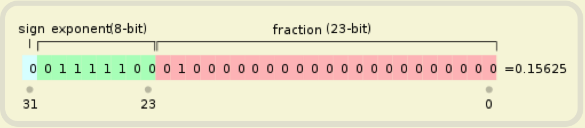
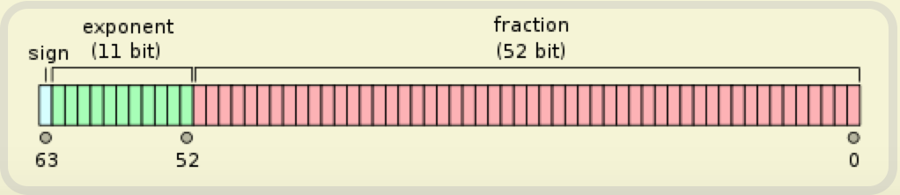

# Java开发手册

## SimpleDateFormat

SimpleDateFormat 是线程不安全的类，一般不要定义为static 变量，如果定义为static，必须加锁，或者使用DateUtils 工具类

### 线程不安全的原因

```java 
 // Called from Format after creating a FieldDelegate
    private StringBuffer format(Date date, StringBuffer toAppendTo,
                                FieldDelegate delegate) {
        // Convert input date to time field list
        calendar.setTime(date); // 线程不安全的地方

        boolean useDateFormatSymbols = useDateFormatSymbols();

        for (int i = 0; i < compiledPattern.length; ) {
            int tag = compiledPattern[i] >>> 8;
            int count = compiledPattern[i++] & 0xff;
            if (count == 255) {
                count = compiledPattern[i++] << 16;
                count |= compiledPattern[i++];
            }

            switch (tag) {
            case TAG_QUOTE_ASCII_CHAR:
                toAppendTo.append((char)count);
                break;

            case TAG_QUOTE_CHARS:
                toAppendTo.append(compiledPattern, i, count);
                i += count;
                break;

            default:
                subFormat(tag, count, delegate, toAppendTo, useDateFormatSymbols);
                break;
            }
        }
        return toAppendTo;
    }
```

```java 
protected Calendar calendar;   // dateFomatter.java
```

多个线程之间共享变量calendar，并修改calendar。因此在多线程环境下，当多个线程同时使用相同的SimpleDateFormat对象（如static修饰）的话，如调用format方法时，多个线程会同时调用calender.setTime方法，导致time被别的线程修改，因此线程是不安全的

### 解决方式

1. 声明成局部变量

2. 对SimpleDateFormat添加同步

   ```java 
   private static SimpleDateFormat sdf = new SimpleDateFormat("yyyy-MM-dd HH:mm:ss");
   
     public static String formatDate(Date date){
         synchronized(sdf){
             return sdf.format(date);
         }
     }
   ```

3. 使用ThreadLocal，每个线程都拥有自己的SimpleDateFormat对象

   ```java 
   private static final ThreadLocal<DateFormat> df = new ThreadLocal<DateFormat>() {
               @Override
               protected DateFormat initialValue() {
                   return new SimpleDateFormat("yyyy-MM-dd");
               }
           };
   ```

4. jdk8 推荐使用DateTimeFormatter 代替SimpleDateFormat

## 浮点数判断

浮点数之间的等值判断，基本数据类型不能用==来比较，包装数据类型不能用equals来判断。

浮点数采用“尾数+阶码”的编码方式，类似于科学计数法的“有效数字+指数”的表示方式。二进制无法精确表示大部分的十进制小数

### IEEE 浮点标准

根据国际标准IEEE（电气和电子工程协会）754，任意一个二进制浮点数V可以表示成下面的形式：
V=(-1)^S * M * 2^E

1.  (-1)^s表示符号位，s为0表示正，s为1表示负
2.  M表示有效数字，大于等于1，小于2
3.  2^E表示指数位

**对于32位的浮点数，最高的1位是符号位s，接着的8位是指数E，剩下的23位为有效数字M。**



**对于64位的浮点数，最高的1位是符号位S，接着的11位是指数E，剩下的52位为有效数字M。**



**对于符号s，存储值非0即1。**

**对于尾数M，只保存后面的小数部分。**这是由于1≤M<2，在计算机内部保存M时，默认这个数的第一位总是1，因此可以被舍去，这样做的好处是可以节省一位有效数字。

**而对于阶码E，情况较为复杂。**

**首先，E要通过中间值换算得到真实值。**这是由于E要能够表示负数，也就是负次幂。而E本身是无符号的，因此IEEE浮点标准规定，在计算真实值时，E要减去一个中间值。单精度情况下，E减去127，双精度情况下，E减去1023。

以二进制数1011.0为例，E的真实值是3，但是存储在计算机中是3+127=130(单精度)，换算成二进制就是10000010。

**另外，当E的值不同时，对最终结果计算方法也不一样，一共有下面三种情况。**

1) 当E不全为0，也不全为1时。 　表示规格化形式的数字。此时E减去中间值得到真实值，M的整数部分取1。

2) 当E全为0时。 　表示非规格化形式的数字，主要是0或者非常接近于0的数。此时E减去中间值得到真实值，M的整数部分取0。

3) 当E全为1时。 　表示特殊值。如果M全为0，表示±无穷大(正负取决于符号s），如果M不全为0，表示这不是一个数（NaN）。

**例子：** 2.4 -> 10.0110011001100110...->(-1)^0 * 1.00110011001100110 * 100000000

| S（1位） | E（8位） | M（23位）            |
| -------- | -------- | -------------------- |
| 0        | 10000000 | 100110011001100110.. |

在进行二进制计算的时候，由于2.4无法用二进制进行精确表示，所以出现第一次精度丢失，在存储过程中M只能保存23位，所以会丢弃多余的部分，出现第二次精度丢失。经历两次精度丢失，因此还原出来的结果也就不正确了。

### 解决方式

- **使用整数替代浮点数。**二进制整数可以完整的表示所有十进制整数，不存在精度丢失问题，因此我们可以将小数位数固定或者较少的数字转换成整数存储。比如存储货币金额，如果存储单位是元，则需要保留两位小数，例如23.45元。如果将单位改成分，则可以完全使用整数存储，例如2345分。
- **使用特殊类处理高精度运算。**例如JAVA中的Bigdecimal类。不过要注意，使用这些特殊类虽然可以解决精度问题，但有可能带来其它问题，JAVA中的Bigdecimal类在处理性能上就比float和double要低很多。
- **浮点数比较指定误差范围**。两个浮点数的差值在此范围之内，则认为是相等的

## 包装类型比较

所有整型包装类对象之间值的比较，全部使用equals 方法比较

### 说明

对于Integer var = ? 在-128 至127 之间的赋值，Integer 对象是在IntegerCache.cache 产生，会复用已有对象，这个区间内的Integer 值可以直接使用==进行判断，但是这个区间之外的所有数据，都会在堆上产生，并不会复用已有对象，这是一个大坑，推荐使用equals 方法进行判断

## 集合转数组

使用集合转数组的方法，必须使用集合的toArray(T[] array)，传入的是类型完全一致、长度为0 的空数组

```java 
List<String> list = new ArrayList<>(2);
list.add("guan");
list.add("bao");
String[] array = list.toArray(new String[0]);
```

### 说明

直接使用toArray 无参方法存在问题，此方法返回值只能是Object[]类，若强转其它类型数组将出现ClassCastException 错误

`Object[] toArray();`

使用toArray 带参方法，数组空间大小的length，

```java
// ArrayList.java
public <T> T[] toArray(T[] a) {
        if (a.length < size)
            // Make a new array of a's runtime type, but my contents:
            return (T[]) Arrays.copyOf(elementData, size, a.getClass());
        System.arraycopy(elementData, 0, a, 0, size);
        if (a.length > size)
            a[size] = null;
        return a;
    }
```

1. 等于0，动态创建与size 相同的数组，性能最好。
2. 大于0 但小于size，重新创建大小等于size 的数组，增加GC 负担。
3. 等于size，在高并发情况下，size 正在变大的情况下，负面影响与2 相同。
4. 大于size，空间浪费，且在size 处插入null 值，存在NPE 隐患。

## 集合删除/添加处理

不要在foreach 循环里进行元素的remove/add 操作。remove 元素请使用Iterator方式，如果并发操作，需要对Iterator 对象加锁

```java
// 正例
List<String> list = new ArrayList<>();
        list.add("1");
        list.add("2");
        Iterator<String> iterator = list.iterator();
        while (iterator.hasNext()) {
            String item = iterator.next();
            if (删除元素的条件) {
                iterator.remove();
            }
        }

// 反例
List<String> list = new ArrayList<>();
        list.add("1");
        list.add("2");
        for (String item : list) {
            if ("1".equals(item)) {
                list.remove(item);
            }
        }

// 反例反编译
List<String> list = new ArrayList();
        list.add("1");
        list.add("2");
        Iterator var2 = list.iterator();

        while(var2.hasNext()) {
            String item = (String)var2.next();
            if ("2".equals(item)) {
                list.remove(item);
            }
        }
```

### 说明

```java
// ArrayList.java
private void fastRemove(int index) {
        modCount++;  // 关注这个值
        int numMoved = size - index - 1;
        if (numMoved > 0)
            System.arraycopy(elementData, index+1, elementData, index,
                             numMoved);
        elementData[--size] = null; // clear to let GC do its work
    }
```

modCount 无论删除还是增加，都会自增

```java
public Iterator<E> iterator() {
        return new Itr();
    }

    /**
     * An optimized version of AbstractList.Itr
     */
    private class Itr implements Iterator<E> {
        int cursor;       // index of next element to return
        int lastRet = -1; // index of last element returned; -1 if no such
        int expectedModCount = modCount;

        Itr() {}

        public boolean hasNext() {
            return cursor != size;
        }

        @SuppressWarnings("unchecked")
        public E next() {
            checkForComodification();
            int i = cursor;
            if (i >= size)
                throw new NoSuchElementException();
            Object[] elementData = ArrayList.this.elementData;
            if (i >= elementData.length)
                throw new ConcurrentModificationException();
            cursor = i + 1;
            return (E) elementData[lastRet = i];
        }

        public void remove() {
            if (lastRet < 0)
                throw new IllegalStateException();
            checkForComodification();

            try {
                ArrayList.this.remove(lastRet);
                cursor = lastRet;  // 矫正cursor
                lastRet = -1;
                expectedModCount = modCount;
            } catch (IndexOutOfBoundsException ex) {
                throw new ConcurrentModificationException();
            }
        }
	...
        final void checkForComodification() {
            if (modCount != expectedModCount)
                throw new ConcurrentModificationException();
        }
    }
```

可以看到迭代器中的`remove`方法让`expectedModCount`与`modCount`保证相等，这便是与`list.remove()`方法的区别。下面需要几点：

1. 在iterator初始化的时候，`expectedModCount == modCount`，并且等于集合容量大小。
2. 报`ConcurrentModificationException`异常是因为`expectedModCount != modCount`

### 分析

删除 1：执行完一次循环后，modCount = 3，expectedModCount = 2，lastRet = 0，cursor == size == 1，所以只执行了一次循环，并未报错。
删除 2：执行完两次循环后，modCount = 3，expectedModCount = 2，lastRet = 1，cursor = 2，size = 1，继续进入第三次循环，进入next()方法的checkForComodification()方法中，由于modCount和expectedModCount不相等，报异常！