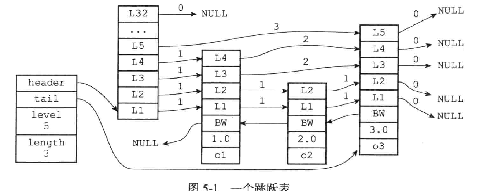

# Redis 设计与实现

## 第一部分 数据结构与对象

### 简单字符串

**空间预分配**

空间预分配用于优化SDS的字符串增长操作：当SDS的API对一个SDS进行修改，并且需要对SDS进行空间扩展的时候，程序不仅会为SDS分配修改所必须要的空间，还会为SDS分配额外的未使用的空间。

额外分配的未使用的空间数量公式：

- 如果对SDS进行修改之后，SDS的长度将小于 1 MB，那么程序分配和 `len` 属性同样大小的未使用空间
- 如果对SDS进行修改之后，SDS的长度将大于等于 1 MB，那么程序会分配 1 MB的未使用空间

通过空间预分配策略，Redis 可以减少连续执行字符串增长操作所需的内存重分配次数

**惰性空间释放**

惰性空间释放用于优化SDS的字符串缩短操作：当SDS的API需要缩短SDS保存的字符串时，程序并不立即使用内存重分配来回收缩短后多出来的字节，而是通过使用free属性将这些字节的数量记录起来，并等待将来使用。

惰性空间释放策略，SDS避免了缩短字符串时所需的内存重分配操作，并未将来可能有的增长操作提供了优化

SDS也提供了真正释放SDS的未使用空间的相应API，避免了释放策略造成的内存浪费。

### 链表

#### 实现

```c
// 节点结构
typedef struct ListNode{
    struct ListNode *prev;
    struct ListNode *next;
    void *value;
}ListNode;
```

```c
// 链表结构
typedef struct list{
    ListNode *head;
    ListNode *tail;
    
    unsigned long len;
    // 节点值复制函数
    void *(*dup) (void *ptr);
    // 节点值释放函数
    void (*free) (void *ptr);
    // 节点值匹配函数
    int (*match) (void *ptr, void *key);
}list;
```

特点：

- 双端：每个节点都存有前置节点和后置节点指针
- 无环：表头节点前置节点指向NULL和表尾节点后置节点指向NULL
- 带表头和表尾节点指针
- 带有链表长度的计数器
- 多态：链表节点采用void* 指针来保存节点值

### 字典

字典，又称符号表、关联数组或者映射，是一种用于保存键值对的抽象数据结构

字典的应用非常广泛，比如Redis 的数据库就是使用字典来作为底层实现的，对数据库的增删改查操作也是构建在对字典的操作上；字典还是哈希键的底层实现之一，当一个哈希键包含的键值对比较多，又或者键值对中的元素都是比较长的字符串时，Redis就会使用字典作为哈希键的底层实现

#### 实现

Redis 的字典使用哈希表作为底层实现，一个哈希表里面可以有多个哈希表节点，每个哈希表节点就保存了字典中的一个键值对。

```c
// 哈希表
typedef struct dictht{
    // 哈希表数组
    dictEntry **table;
    // 哈希表大小
    unsigned long size;
    
    // 哈希表大小掩码，用于计算索引值
    // 总是等于size-1
    unsigned long sizemask;
    
    // 该哈希表已有节点的数量
    unsigned long used;
}dictht;
```

```c
// 哈希表节点
typedef struct dictEntry{
    // 键
    void *key;
    
    // 值
    union {
        void *val;
        uint64_tu64;
        int64_ts64;
    }v;
    
    // 指向下个哈希表节点，形成链表
    struct dictEntry *next;
}dictEntry;
```

```c
typedef struct dict{
    // 类型特定函数
    dictType *type;
    
    // 私有数据
    void *privdata;
    
    // 哈希表
    dictht ht[2];
    
    // rehash 索引
    // 当rehash 不在
}
```

### 跳跃表

跳跃表是一种有序的数据结构，它通过在每个节点中维持多个指向其他节点的指针，从而达到快速访问节点的目的

跳跃表支持平均 `O(logN)`和最坏`O(N)`复杂度的节点查找，还可以通过顺序性操作来批量处理节点，大部分情况下，跳跃表的效率和平衡树差不多

Redis 采用跳跃表作为有序集合键的底层实现之一，如果一个有序集合包含的元素数量比较多，又或者有序集合中元素的成员是比较长的字符串时，Redis会采用跳跃表作为有序集合键的底层实现



#### 实现

```c
// 节点
typedef struct zskiplistNode{
    // 层
    struct zskiplistLevel{
        // 前进指针
        struct zskiplistNode *forward;
        // 跨度
        unsigned int span;
    }level[];
    // 后退指针
    struct zskiplistNode *backward;
    // 分值
    double score;
    // 成员对象
    robj *obj;
}zskiplistNode;
```

- 层：跳跃表节点的level数组可以包含多个元素，每个元素都包含一个指向其他节点的指针，程序可以通过这些层来加快访问其他节点的速度，一般来说，层的数量越多，访问其他节点的速度越快
- 前进指针：每个层都有一个指向表尾的指针（level[i].forward），用于从表头向表尾方向访问节点
- 跨度：层的跨度（level[i].span）用于记录两个节点之间的距离，跨度实际上是用来计算排位的，在查找某个节点的过程中，将沿途节点的跨度累加起来就是目标节点的排位
  - 两个节点的跨度越大，他们相距得越远
  - 指向null的所有前进指针的跨度都为0，因为他们没有连向任何点
- 后退指针：节点的后退指针（backward）用于从表尾向表头方向访问节点，跟可以一次跳过多个节点的前进指针不同，每个节点只有一个后退指针，所以每次只能退回上一个节点
- 分值：节点的分值（score）是一个double类型的浮点数，跳跃表的所有节点都按分值从小到大来排序
- 成员：节点的成员对象（obj）是一个指针，它指向一个字符串对象，而字符串对象则保存着一个SDS值

```c
typedef struct zskiplist{
    structz skiplistNode *header, *tail;
    
    // 表中节点的数量
    unsigned long length;
    
    // 表中层数最大的节点的层数
    int level;
}zskiplist;
```

### 整数集合

整数集合是集合键的底层实现之一，当一个集合只包含整数值元素，并且这个集合的元素数量不多时，Redis就会使用整数集合作为集合键的底层实现

### 压缩链表

### 对象

## 第二部分 单机数据库的实现

### 数据库

#### 服务器中的数据库

Redis服务器将所有数据库都保存在服务器状态 redis.h/redisServer  结构的db数组中，db数组的每个项都是一个redis.h/redisDb结构，每个redisDb结构代表一个数据库：

```c
struct redisServer{
    // ...
    // 一个数组，保存着服务器中的所有数据库
    redisDb *db;
    
    // 服务器的数据库数量，默认16个数据库
    int dbnum;
    // ...
}
```

#### 切换数据库

默认情况下，Redis的目标数据库为0号数据库， 但客户端可以通过`SELECT`命令来切换目标数据库


