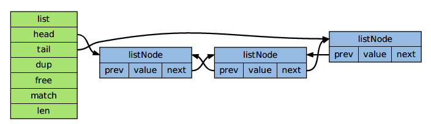

# Redis设计与实现

## 第一章、内部数据结构

### 1 简单动态字符串

Sds （Simple Dynamic String，简单动态字符串）是Redis 底层所使用的字符串表示，它被用在几乎所有的Redis 模块中

#### 1.1 Sds的用途

Sds 在Redis中的主要用途有两个：

- 实现字符串对象
- 在 Redis 程序内部用作char*类型的替代品

##### 实现字符串对象

Redis是一个键值对数据库，数据库的值可以是字符串、集合、列表等多种类型的对象，而数据库的键则总是字符串对象

对于那些包含字符串值的字符串对象来说，每个字符串对象都包含一个Sds 值。

Note: “包含字符串值的字符串对象”，这种说法初听上去可能会有点奇怪，但是在Redis 中，一个字符串对象除了可以保存字符串值之外，还可以保存long 类型的值，所以为了严谨起见，这里需要强调一下：当字符串对象保存的是字符串时，它包含的才是Sds 值，否则的话，它就是一个long 类型的值。

##### 在 Redis 程序内部用作char*类型的替代品

因为char* 类型的功能单一，抽象层次低，并且不能高效地支持一些Redis 常用的操作（比如追加操作和长度计算操作），所以在Redis 程序内部，绝大部分情况下都会使用Sds 而不是char* 来表示字符串。

在Redis 中，客户端传入服务器的协议内容、aof 缓存、返回给客户端的回复，等等，这些重要的内容都是由都是由Sds 类型来保存的。

#### 1.2 Redis 中的字符串

### 3. 双端链表

Redis 的双端链表是由 `listNode` 和 `list` 两个数据构成，如图所示：



数据结构：

```c
// listNode 双端链表的节点，主要存储当前节点的值、上一个节点和下一个节点
typedef struct listNode {
    // 前驱节点
    struct listNode *prev;
    
    // 后继节点
    struct listNode *next;
    
    // 值
    void *value;
} listNode;

// list 是双端链表的本身
typedef struct list {
    // 表头指针
    listNode *head;
    
    // 表尾指针
    listNode *tail;
    
    // 节点数量
    unsigned long len;
    
    // 复制函数
    void *(*dup)(void *ptr);
    //释放函数
    void *(*free)(void *ptr);
    //比对函数
    int (*match)(void *ptr, void *key);
}list;
```

