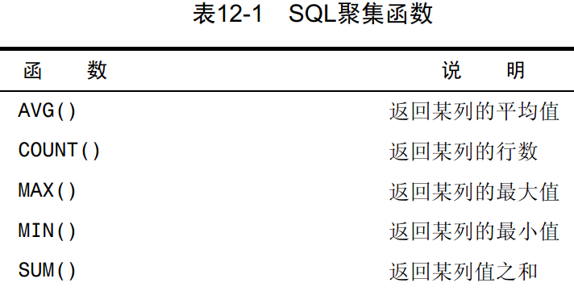
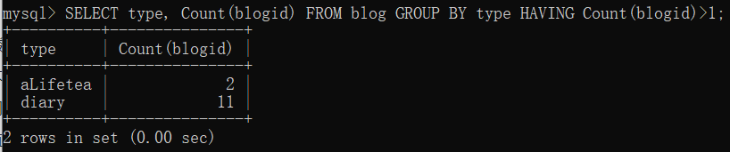

# MySQL 必知必会

## 第一章、了解sql

## 第二章、MySQL简介

## 第三章、使用MySQL

### 1. 连接

连接数据库，需要一下信息：

- 主机名
- 端口（默认为3306）
- 一个合法的用户名
- 用户口令（如果需要）

### 2. 选择数据库

使用USE关键字

```mysql
use database;//database： 数据库名
```

### 3. 了解数据库和表

显示所有数据库：

```mysql
show databases;
```

显示一个数据库里面的表：

```mysql
show tables;
```

显示一个表里面的列：

```mysql
show columns from customers;
describe customers;
```


SHOW 的用法：

SHOW STATUS: 用于显示广泛的服务器状态信息

SHOW CREATE DATABASE 或者 SHOW CREATE TABLE: 用来显示创建特定的数据库或表

SHOW GRANTS:用来显示授予用户的安全权限

SHOW ERRORS 或者SHOW WARNINGS: 用来显示服务器错误或者警告信息

## 第四章、检索数据

### 1. SELECT 语句

它的用途是从一个或多个表中检索信息。

### 2. 检索单个列

SELECT 列名 FROM 表名;

```MYSQL
SELECT name FROM customers;
```

### 3. 检索多个列

SELECT 列名1，列名2，列名3……FROM 表名;

```MYSQL
SELECT customers_name, customers_sex FROM customers;
```

### 4. 检索所有列

SELECT * FROM customers;

```mysql
SELECT * FROM customers;
```

一般，除非你确实需要表中的每个列，否则最好别使用*通配符。虽然使用通配符可能会使你自己省事，不用明确列出所需列，但检索不需要的列通常会降低检索和应用程序的性能。

### 5. 检索不同的行

SELECT DISTINCT 列名 FROM 表名;

```MYSQL
SELECT DISTINCT customer_name FROM customers;
```

不能部分使用DISTINCT DISTINCT关键字应用于所有列而不仅是前置它的列。

```mysql
select distinct email, type from user;
```


### 6. 限制结果

为了返回第一行或前几行，可使用LIMIT子句。

```mysql
SELECT * FROM blog LIMIT 5;
```

为得出下一个5行，可指定要检索的开始行和行数。

```MYSQL
SELECT * FROM blog LIMIT 5,5;
```


LIMIT 检索出来的是从行0开始的，而不是行1：

如下面sql语句表示检索出来的第2行数据：

```mysql 
SELECT * FROM blog LIMIT 1 ,1;
```

在行数不够时，MySQL只能返回它所能返回的最大行数

如：

`SELECT * FROM blog LIMIT 10, 5` 但是表中的数据只有13 行，所以MySQL只能返回3行数据

OFFSET ？:表示从行？ 开始检索：

```mysql
SELECT blogid FROM blog LIMIT 3 OFFSET 5;
```

表示从行5开始，检索3行数据：


### 7. 使用完全限定的表名

使用完全限定的名字来引用列（同时使用表名和列字）

```mysql
SELECT blog.blogid FROM blog;
```


表名也可以是完全限定的:

```mysql
SELECT blog.blogid FROM blog.blog;
```

## 第五章、排序检索数据

### 1. 排序数据

子句（clause）SQL语句由子句构成，有些子句是必需的，而有的是可选的。一个子句通常由一个关键字和所提供的数据组成。子句的例子有 `SELECT` 语句的 `FROM` 子句。

当需要排序时，就需要用到 `ORDER BY` 子句了

```mysql
SELECT title FROM blog ORDER BY blogid LIMIT 5;
```


```mysql
SELECT title FROM blog ORDER BY title;
```


### 2. 按多个列排序

为了按多个列排序，只要指定列名，列名之间用逗号分开即可

```mysql
SELECT * FROM customers ORDER BY customer_name, customer_age;
```

如上述的sql语句，会先按照customer_name排序，如果有多个拥有一样customer_name的数据，他们将再按照customer_age排序。

### 3. 指定排序方向

升序为默认的排序顺序，如果想要降序排序的话，就要使用 **DESC** 关键字,且 **DESC** 关键字只应用到直接位于其前面的列名。如果想在多个列上进行降序排序，必须对每个列指定 **DESC** 关键字。

```mysql
 SELECT blogid,title FROM blog ORDER BY blogid DESC;
```


与**DESC**相反的关键字是**ASC（ASCENDING）**，在升序排序时可以指定它。

使用**ORDER BY**和**LIMIT**的组合，能够找出一个列中最高或最低的值。

## 第六章、过滤数据

### 1. 使用where子句

在SELECT语句中，数据根据WHERE子句中指定的搜索条件进行过滤。WHERE子句在表名（FROM子句）之后给出：

```mysql
SELECT title, blogid FROM blog WHERE blogid = 11;
```


- 在同时使用ORDER BY和WHERE子句时，应该让ORDER BY位于WHERE之后，否则将会产生错误
- MySQL在执行匹配时默认不区分大小写

### 2. WHERE 子句操作符


简单示例：

```MYSQL
 SELECT title, blogid FROM blog WHERE blogid BETWEEN 0 AND 11;
```


空值检查：IS NULL

```mysql
SELECT title FROM blog WHERE description IS NULL;
```


## 第七章、数据过滤

### 1. 组合使用WHERE子句

MySQL允许给出多个WHERE子句。这些子句可以两种方式使用：以AND子句的方式或OR子句的方式使用。

#### 1.1 使用AND操作符

- 为了通过不止一个列进行过滤，可使用AND操作符给WHERE子句附加条件。
- 可以添加多个过滤条件，每添加一条就要使用一个AND

```mysql
SELECT blogid, title FROM blog WHERE blogid>=10 AND description IS NOT NULL;
```


#### 1.2 使用OR操作符

- OR操作符与AND操作符不同，它指示MySQL检索匹配任一条件的行

```mysql
SELECT blogid, title FROM blog WHERE blogid > 10 OR title IS NULL;
```


#### 1.3 计算次序

- WHERE可包含任意数目的AND和OR操作符。允许两者结合以进行复杂和高级的过滤。
- SQL（像多数语言一样）在处理OR操作符前，优先处理AND操作符。
- 所以如果OR 和 AND操作符一起时，需要加上括号（），否则可能会出错


```MYSQL
SELECT blogid, title FROM blog 
	WHERE blogid > 10 OR title IS NOT  NULL AND blogid < 15;
	//这一句sql语句相当于
	// SELECT blogid, title FROM blog 
	//    WHERE blogid > 10 OR （title IS NOT  NULL AND blogid < 15）;
```


```MYSQL
SELECT blogid, title FROM blog 
	WHERE ( blogid > 10 OR title IS NOT  NULL ) AND blogid < 15;
```


### 2. IN操作符

圆括号在WHERE子句中还有另外一种用法。IN操作符用来指定条件范围，范围中的每个条件都可以进行匹配。IN取合法值的由逗号分隔的清单，全都括在圆括号中。

```MYSQL
SELECT userid, type FROM user WHERE type IN ('user');
```


使用IN的优点：

- 在使用长的合法选项清单时，IN操作符的语法更清楚且更直观。
- 在使用IN时，计算的次序更容易管理（因为使用的操作符更少）。
- IN操作符一般比OR操作符清单执行更快。
- IN的最大优点是可以包含其他SELECT语句，使得能够更动态地建立WHERE子句

### 3. 使用NOT操作符

- WHERE子句中的NOT操作符有且只有一个功能，那就是否定它之后所跟的任何条件。
- MySQL 支持使用NOT对IN、BETWEEN和EXISTS子句取反，这与多数其他DBMS允许使用NOT对各种条件取反有很大的差别。

```mysql
 SELECT userid, type FROM user WHERE type NOT IN ('user');
```


## 第八章、使用通配符进行过滤

### 1. LIKE通配符

#### 1.1 百分号（%）通配符

- 最常使用的通配符是百分号（%）。在搜索串中，%表示任何字符 出现任意次数。
- 通配符可在搜索模式中任意位置使用，并且可以使用多个通配符
- 通配符也可以出现在搜索模式的中间
- 尾空格可能会干扰通配符匹配
- 虽然似乎%通配符可以匹配任何东西，但有一个例外，即NULL。即使是WHERE prod_name LIKE '%'也不能匹配用值NULL作为产品名的行。

```mysql
SELECT title FROM blog WHERE title LIKE '%下';
```


#### 1.2 下划线(_)通配符

- 下划线的用途与%一样，但下划线只匹配单个字符而不是多个字符
- 与%能匹配0个字符不一样，_总是匹配一个字符，不能多也不能少

### 2. 使用通配符的技巧

通配符搜索的处理一般要比前面讨论的其他搜索所花时间更长，所以：

- 不要过度使用通配符。如果其他操作符能达到相同的目的，应该使用其他操作符。
- 在确实需要使用通配符时，除非绝对有必要，否则不要把它们用在搜索模式的开始处。把通配符置于搜索模式的开始处，搜索起来是最慢的。
- 仔细注意通配符的位置。如果放错地方，可能不会返回想要的数据

## 第九章、用正则表达式搜索


### 1. 使用MySQL正则表达式

#### 1.1 基本字符匹配

**REGEXP**后所跟的东西作为正则表达式（与文字正文1000匹配的一个正则表达式）处理

```mysql
SELECT blogid, title FROM blog where blogid  REGEXP '.2';
/*.是正则表达式语言中一个特殊的字符。它表示匹配任意一个字符*/
```


- 与LIKE不同：LIKE匹配整个列。如果被匹配的文本在列值中出现，LIKE将不会找到它，相应的行也不被返回（除非使用通配符）。而REGEXP在列值内进行匹配，如果被匹配的文本在列值中出现，REGEXP将会找到它，相应的行将被返回
- MySQL中的正则表达式匹配（自版本3.23.4后）不区分大小写（即，大写和小写都匹配）。为区分大小写，可使用**BINARY**关键字，如 `WHERE prod_name REGEXP BINARY 'JetPack .000'` 。

#### 1.2 进行OR匹配

为搜索两个串之一（或者为这个串，或者为另一个串），使用 | 

```mysql
 SELECT blogid, title FROM blog where blogid  REGEXP '.1|2';
```


#### 1.3 匹配几个字符之一

如果只想匹配特定的字符，可通过指定一组用 [ 和 ] 括起来的字符来完成

```mysql
 SELECT blogid, title FROM blog where blogid  REGEXP '[23]';
 -- 表示匹配含有 2 或者 3 
```


[] 和 | 的差别：

```mysql
SELECT blogid, title FROM blog where blogid  REGEXP '2|3 tom';
-- 将会解析成 '2' or '3 tom'
SELECT blogid, title FROM blog where blogid  REGEXP '[23] tom';
-- 将会解析成 '2 tom' or '3 tom'
```

^ 表示否定一个字符集

如：

```mysql
SELECT blogid, title FROM blog where blogid  REGEXP '[^23]';
-- 表示匹配除了2 和 3 以外的所有结果
```


#### 1.4 匹配范围

使用 - 来定义一个范围

- 用法：如[123456]  ->[1-6]
- 不限于数字 也可以[a-z]

```mysql
SELECT blogid, title FROM blog where blogid  REGEXP '[5-8]';
-- 等同于[5678]
```


#### 1.5 匹配特殊字符

为了匹配特殊字符，必须用 \\\\ 为前导。\\\\-表示查找-，\\\\.表示查找.

#### 1.6 匹配字符类


#### 1.7 匹配多个实例


```mysql
 SELECT userid, type FROM user where type  REGEXP 'users?';
 -- 匹配user 和 users
```


```mysql
SELECT blogid, title FROM blog where blogid  REGEXP '[[:digit:]]{2}';
-- [:digit:]表示匹配所有数字，{2}表示只限于两位
-- 等同于[0-9][0-9]
```


#### 1.8 定位符


```MYSQL
SELECT blogid, title FROM blog where blogid  REGEXP '2$';
-- 表示匹配到以 2 结尾的值
```


^有两种用法。在集合中（用[和]定义），用它来否定该集合，否则，用来指串的开始处

## 第十章、创建计算字段

**客户机与服务器的格式** 可在SQL语句内完成的许多转换和格式化工作都可以直接在客户机应用程序内完成。但一般来说，在数据库服务器上完成这些操作比在客户机中完成要快得多，因为DBMS是设计来快速有效地完成这种处理的。

### 1. 拼接字段

在MySQL的SELECT语句中，可使用 `Concat()` 函数来拼接两个列。

```mysql
SELECT Concat(blogid, '(',title,')') FROM blog;
-- 拼接成 blogid(title) 格式
```


Trim() 函数主要用于删除左右空格的，同理RTrim() 函数删除右边空格，LTrim()函数删除左边空格

```mysql
 SELECT Concat(Trim(blogid), '[',Trim(title),']') FROM blog;
 -- 删除blogid 和 title 左右空格
```


#### 1.1 使用别名

如上面两个图所示，使用拼接后，数据的列并没有名字，所以需要使用别名(别名一般要符合MySQL风格)：

```mysql
SELECT Concat(Trim(blogid), '[',Trim(title),']') AS blogid_title FROM blog;
```


别名还有其他用途。常见的用途包括在实际的表列名包含不符合规定的字符（如空格）时重新命名它，在原来的名字含混或容易误解时扩充它，等等

### 2. 执行算数计算


如：

```mysql
SELECT blogid, blogid*2 AS double_id FROM blog WHERE blogid REGEXP '.2';
-- 检索出所有尾数为2的两位数，并将它们乘2作为新的列
-- 如果是组合运算，可以用括号声明优先顺序
```


如何测试计算SELECT提供了测试和试验函数与计算的一个很好的办法。虽然SELECT通常用来从表中检索数据，但可以省略FROM子句以便简单地访问和处理表达式。例如，SELECT3*2;将返回6，SELECT Trim('abc');将返回abc，而SELECTNow()利用Now()函数返回当前日期和时间。

```mysql
SELECT Now();
-- 返回当前时间
```


## 第十一章、使用数据处理函数

### 1. 函数

SQL支持利用函数来处理数据。函数一般是在数据上执行的，它给数据的转换和处理提供了方便

### 2. 使用函数

#### 2.1 文本函数

用于处理文本串（如删除或填充值，转换值为大写或小写）


SOUNDEX是一个将任何文本串转换为描述其语音表示的字母数字模式的算法。SOUNDEX考虑了类似的发音字符和音节，使得能对串进行发音比较而不是字母比较

```mysql
 SELECT Upper(type) FROM user;
 -- 检索用户类型，并大写展示出来
```


#### 2.2 时间日期函数

是MySQL使用的日期格式。无论你什么时候指定一个日期，不管是插入或更新表值还是用WHERE子句进行过滤，日期必须为格式yyyy-mm-dd。


```mysql
SELECT Year(date) FROM blog;
-- 返回日期的年份
```


```mysql
SELECT blogid, title, date FROM blog WHERE Day(date)=10;
-- 日期函数配合WHERE检索，进行过滤
```


#### 2.3 数值处理函数


## 第十二章、汇总数据

### 1. 聚集函数



#### 1.1 Avg() 函数

AVG()通过对表中行数计数并计算特定列值之和，求得该列的平均值。AVG()可用来返回所有列的平均值，也可以用来返回特定列或行的平均值。

```mysql
SELECT Avg(blogid) AS avg_blogid FROM blog;
-- 返回所有blogid 的平均值
```


#### 1.2 Count() 函数

COUNT()函数进行计数。可利用COUNT()确定表中行的数目或符合特定条件的行的数目。
COUNT()函数有两种使用方式。

- 使用COUNT(*)对表中行的数目进行计数，不管表列中包含的是空值（NULL）还是非空值。
- 使用COUNT(column)对特定列中具有值的行进行计数，忽略NULL值。

```mysql
 SELECT Count(blogid) AS id_2 FROM blog WHERE blogid REGEXP '2';
 -- 统计blogid包含2的值
```


```mysql
SELECT Count(*) AS num FROM blog;
-- 对blog所有行计数，统计blog数量 包含NULL值
```


#### 1.3 Max() 函数

MAX()返回指定列中的最大值。MAX()要求指定列名

```mysql
 SELECT Max(blogid) AS max_id FROM blog;
 -- 统计最大id值
```


```mysql
SELECT Max(date) AS max_date FROM blog;
-- 返回最新日期值
```


#### 1.4 Min() 函数

功能与Max() 函数相反

```mysql
 SELECT Min(date) AS min_date FROM blog;
 -- 返回最旧的日期值
```


#### 1.5 Sum() 函数

SUM()用来返回指定列值的和（总计）

### 2. 聚集不同值

上面几个统计都默认为ALL参数，如果想要不同值，需要用**DISTINCT**关键字：

```mysql
SELECT Sum(DISTINCT blogid) FROM blog;
```


Count() 不能用DISTINCT关键字

Max() Min() 可以用，但没啥意义

### 3. 组合聚集函数


## 第十三章、分组数据

### 1. 数据分组

分组允许把数据分为多个逻辑组，以便能对每个组进行聚集计算。

### 2. 创建分组

```mysql
 SELECT type, Count(userid) FROM user GROUP BY type;
 -- 按type 分组， 并统计每组的数量
```


使用GROUP BY 的一些规定：

- GROUP BY子句可以包含任意数目的列。这使得能对分组进行嵌套，为数据分组提供更细致的控制。
- 如果在GROUP BY子句中嵌套了分组，数据将在最后规定的分组上进行汇总换句话说，在建立分组时，指定的所有列都一起计算（所以不能从个别的列取回数据）。
- GROUP BY子句中列出的每个列都必须是检索列或有效的表达式（但不能是聚集函数）。如果在SELECT中使用表达式，则必须在GROUP BY子句中指定相同的表达式。不能使用别名。
- 除聚集计算语句外，SELECT语句中的每个列都必须在GROUP BY子句中给出。
- 如果分组列中具有NULL值，则NULL将作为一个分组返回。如果列中有多行NULL值，它们将分为一组。
- GROUP BY子句必须出现在WHERE子句之后，ORDER BY子句之前。
- 使用WITH ROLLUP关键字，可以得到每个分组以及每个分组汇总级别（针对每个分组）的值


### 3. 过滤分组

HAVING非常类似于WHERE。事实上，目前为止所学过的所有类型的WHERE子句都可以用HAVING来替代。唯一的差别是WHERE过滤行，而HAVING过滤分组

```mysql
SELECT type, Count(blogid) FROM blog GROUP BY type HAVING Count(blogid)>1;
-- 统计1个以上的以type 分组的数据
```



HAVING 和 WHERE 结合：

```mysql
SELECT type, Count(userid) AS num  FROM user 
WHERE enable = 'use' GROUP BY type 
HAVING Count(userid)>0;
-- 统计以type 分组的用户数量，且用户enable为use，且分组里面的数据量大于0的；
```


### 4. 分组与排序


一般在使用GROUP BY子句时，应该也给出ORDER BY子句。这是保证数据正确排序的唯一方法。千万不要仅依赖GROUP BY排序数据。

```mysql
 SELECT type, Count(userid) FROM user 
 	WHERE enable='use' 
 	GROUP BY type 
 	ORDER BY Count(userid);
 	-- 以type为分组依据， 并按同类型数量进行排序
```


### 5. SELECT 子句顺序


## 第十四章、使用子查询

### 1. 利用子查询进行过滤

```mysql
SELECT email FROM user 
		WHERE userid = (
            SELECT userid FROM userinformation 
            WHERE name = (
                SELECT author FROM blog WHERE blogid = 12));
 -- 查找博客id为12 的作者的邮箱
```


### 2. 作为计算字段使用子查询

```mysql
 SELECT userid, (
     SELECT name FROM userinformation 
     WHERE userinformation.userid = user.userid) 
 AS username, (
     SELECT Count(blogid) FROM blog 
     WHERE blog.author = username) 
 AS blogs 
 FROM user ORDER BY userid;
 -- 检索出用户id 和用户名，并分别统计他们发表的博客数量
```


## 第十五章、联结表

### 1. 关系表

外键：外键为某个表中的一列，它包含另一个表的主键值，定义了两个表之间的关系

可伸缩性：能够适应不断增加的工作量而不失败。设计良好的数据库或应用程序称之为可伸缩性好（scale well）

完全限定列名：在引用的列可能出现二义性时，必须使用完全限定列名（用一个点分隔的表名和列名）。如果引用一个没有用表名限制的具有二义性的列名，MySQL将返回错误

笛卡儿积（cartesian product）：由没有联结条件的表关系返回的结果为笛卡儿积。检索出的行的数目将是第一个表中的行数乘以第二个表中的行数

### 2. 创建联结

联结的创建非常简单，规定要联结的所有表以及它们如何关联即可

```mysql
SELECT name, signature, email 
	FROM userinformation AS a, user AS b WHERE a.userid = b.userid;
```


#### 2.1 内部联结

上面例子为等值联结，它基于两个表的相等测试，也称为内部联结，也可以指定联结类型查询：

```mysql 
SELECT name, signature, email 
	FROM userinformation AS a INNER JOIN user AS b ON a.userid = b.userid;
	-- 使用INNER JOIN ON 指定内连接类型
```


#### 2.2 联结多个表

- SQL对一条SELECT语句中可以联结的表的数目没有限制。创建联结的基本规则也相同。首先列出所有表，然后定义表之间的关系
- MySQL在运行时关联指定的每个表以处理联结。这种处理可能是非常耗费资源的，因此应该仔细，不要联结不必要的表。联结的表越多，性能下降越厉害

## 第十六章、创建高级联结

### 1. 使用表别名

别名除了用于列名和计算字段外，SQL还允许给表名起别名。这样做有两个主要理由：

- 缩短sql语句
- 允许在单条SELECT语句中多次使用相同的表

表别名只在查询执行中使用。与列别名不一样，表别名不返回到客户机。

```mysql
SELECT name, signature, email 
	FROM userinformation AS a INNER JOIN user AS b ON a.userid = b.userid;
	-- 这一条sql语句就采用了表别名，把userinformation 起别名为a，user 为 b
```

### 2. 使用不同类型的联结

#### 2.1 自联结

利用自己与自己联结，如：

```mysql
SELECT u1.userid, u1.email 
	FROM user AS u1, user AS u2 WHERE u1.userid = u2.userid AND u2.enable = 'use';
```


自联结是先检索出一张表，再根据这张表检索出想要的数据；

所以，也可以采用子查询：

```mysql
SELECT userid, email FROM user WHERE userid = (
	SELECT userid FROM user WHERE enable='use');
	-- 虽然逻辑是这样的，但是这句sql语句运行不了，因为子查询返回多个值
```

用自联结而不用子查询：自联结通常作为外部语句用来替代从相同表中检索数据时使用的子查询语句。虽然最终的结果是相同的，但有时候处理联结远比处理子查询快得多。应该试一下两种方法，以确定哪一种的性能更好。

#### 2.2 自然联结

无论何时对表进行联结，应该至少有一个列出现在不止一个表中（被联结的列）。标准的联结（前一章中介绍的内部联结）返回所有数据，甚至相同的列多次出现。自然联结排除多次出现，使每个列只返回一次。

自然联结是这样一种联结，其中你只能选择那些唯一的列。这一般是通过对表使用通配符（SELECT *），对所有其他表的列使用明确的子集来完成的

```mysql
SELECT b.*, a.type, a.email 
	FROM user AS a, userinformation AS b WHERE a.userid = b.userid;
	-- 通配符只对第一个表使用。所有其他列明确列出，所以没有重复的列被检索出来
```


迄今为止我们建立的每个内部联结都是自然联结，很可能我们永远都不会用到不是自然联结的内部联结

#### 2.3 外部联结

联结包含了那些在相关表中没有关联行的行。这种类型的联结称为外部联结。

如：检索使用状况为 `use` 的用户的用户名，邮箱和性别：

```mysql
SELECT a.name, b.email, a.sex 
	FROM userinformation AS a 
	LEFT OUTER JOIN user AS b 
	ON b.userid = a.userid AND b.enable='use';
```


外部联结的类型: 存在两种基本的外部联结形式：左外部联结和右外部联结。它们之间的唯一差别是所关联的表的顺序不同。换句话说，左外部联结可通过颠倒FROM或WHERE子句中表的顺序转换为右外部联结。因此，两种类型的外部联结可互换使用，而究竟使用哪一种纯粹是根据方便而定。

### 3. 使用带聚集函数的联结


### 4. 使用联结和联结条件

- 注意所使用的联结类型。一般我们使用内部联结，但使用外部联结也是有效的。
- 保证使用正确的联结条件，否则将返回不正确的数据。
- 应该总是提供联结条件，否则会得出笛卡儿积。
- 在一个联结中可以包含多个表，甚至对于每个联结可以采用不同的联结类型。虽然这样做是合法的，一般也很有用，但应该在一起测试它们前，分别测试每个联结。这将使故障排除更为简单。


## 第十七章、组合查询

### 1. 组合查询

​			多数SQL查询都只包含从一个或多个表中返回数据的单条SELECT语句。MySQL也允许执行多个查询（多条SELECT语句），并将结果作为单个查询结果集返回。这些组合查询通常称为并（union）或复合查询（compound query）。

有两种基本情况，其中需要使用组合查询：

- 在单个查询中从不同的表返回类似结构的数据；
- 对单个表执行多个查询，按单个查询返回数据。

### 2. 创建组合查询

可用 `UNION` 操作符来组合数条sql查询。利用 `UNION` 可以给出多条 `SELECT` 语句，并将他们的结果并成单个结果集

#### 2.1 使用 UNION

UNION的使用很简单。所需做的只是给出每条SELECT语句，在各条语句之间放上关键字UNION。

```mysql
SELECT name, sex FROM userinformation WHERE userid = 'admin' 
UNION 
SELECT name, sex FROM userinformation WHERE userInformationid = 5;
```

#### 2.2 UNION 规则

1. UNION必须由两条或两条以上的SELECT语句组成，语句之间用关键字UNION分隔（因此，如果组合4条SELECT语句，将要使用3个UNION关键字）。
2. UNION中的每个查询必须包含相同的列、表达式或聚集函数（不过各个列不需要以相同的次序列出）。
3. 列数据类型必须兼容：类型不必完全相同，但必须是DBMS可以隐含地转换的类型（例如，不同的数值类型或不同的日期类型）。

#### 2.3 包含或取消重复的行

在使用UNION时，重复的行被自动取消。这是UNION的默认行为，但是如果需要，可以改变它。事实上，如果想返回所有匹配行，可使用UNION ALL而不是UNION。

#### 2.4 对组合结果进行排序

SELECT语句的输出用ORDER BY子句排序。在用UNION组合查询时，只能使用一条ORDER BY子句，它必须出现在最后一条SELECT语句之后。

## 第十八章、全文本搜索

### 1. 理解全文本搜索

​        并非所有引擎都支持全文本搜索：正如第21章所述，MySQL支持几种基本的数据库引擎。并非所有的引擎都支持本书所描述的全文本搜索。两个最常使用的引擎为MyISAM和InnoDB，前者支持全文本搜索，而后者不支持。这就是为什么虽然本书中创建的多数样例表使用InnoDB ，而有一个样例表（productnotes表）却使用MyISAM的原因。如果你的应用中需要全文本搜索功能，应该记住这一点。


### 2. 使用全文本搜索

​        为了进行全文本搜索，必须索引被搜索的列，而且要随着数据的改变不断地重新索引。在对表列进行适当设计后，MySQL会自动进行所有的索引和重新索引。

​         在索引之后，SELECT可与Match()和Against()一起使用以实际执行搜索。

#### 2.1 启用全文本搜索支持

一般在创建表时启用全文本搜索。CREATE TABLE语句接受FULLTEXT子句，它给出被索引列的一个逗号分隔的列表。

```mysql
CREATE TABLE blog(
	blogid INT NOT NULL AUTO_INCREMENT,
	blog_title VARCHAR(50) NOT NULL,
	blog_description VARCHAR(150) NOT NULL,
	blog_content TEXT NOT NULL,
	create_date DATETIME NOT NULL,
	cover_image VARCHAR(100) NOT NULL,
	blog_author VARCHAR(25) NOT NULL,
	page_view INT NOT NULL,
	PRIMARY KEY(blogid),
	FULLTEXT(blog_content)
)ENGINE=MyISAM;
```

**不要在导入数据时使用FULLTEXT**： 更新索引要花时间，虽然不是很多，但毕竟要花时间。如果正在导入数据到一个新表，此时不应该启用FULLTEXT索引。应该首先导入所有数据，然后再修改表，定义FULLTEXT。这样有助于更快地导入数据（而且使索引数据的总时间小于在导入每行时分别进行索引所需的总时间）。

#### 2.2 进行全文本搜索

在索引之后，使用两个函数Match()和Against()执行全文本搜索，其中Match()指定被搜索的列，Against()指定要使用的搜索表达式。

```mysql
SELECT blog_content FROM blogs 
WHERE Match(blog_content) Against('information');
```


搜索不区分大小写：除非使用BINARY方式（本章中没有介绍），否则全文本搜索不区分大小写

#### 2.3 使用查询扩展

查询扩展用来设法放宽所返回的全文本搜索结果的范围。在使用查询扩展时，MySQL对数据和索引进行两遍扫描来完成搜索：

1. 进行一个基本的全文本搜索，找出与搜索条件匹配的所有行；
2. MySQL检查这些匹配行并选择所有有用的词。
3. MySQL再次进行全文本搜索，这次不仅使用原来的条件，而且还使用所有有用的词。

利用查询扩展，能找出可能相关的结果，即使它们并不精确包含所查找的词。

#### 2.4 布尔文本搜索

MySQL支持全文本搜索的另外一种形式，称为布尔方式（boolean mode）。

- 要匹配的词；
- 要排斥的词（如果某行包含这个词，则不返回该行，即使它包含其他指定的词也是如此）；
- 排列提示（指定某些词比其他词更重要，更重要的词等级更高）；
- 表达式分组；
- 另外一些内容。

即使没有FULLTEXT索引也可以使用：布尔方式不同于迄今为止使用的全文本搜索语法的地方在于，即使没有定义FULLTEXT索引，也可以使用它。但这是一种非常缓慢的操作（其性能将随着数据量的增加而降低）。

```mysql
 SELECT blog_content FROM blogs 
 WHERE Match(blog_content) Against('CARRY' IN BOOLEAN MODE)
```


又如：

```mysql
SELECT blog_content FROM blogs 
WHERE Match(blog_content) Against('CARRY -rope*' IN BOOLEAN MODE);
-- 匹配包含carry 但不包含任意以rope开始的词的行
```


#### 2.5 全文本使用说明

1. 在索引全文本数据时，短词被忽略且从索引中排除。短词定义为那些具有3个或3个以下字符的词（如果需要，这个数目可以更改）。
2. MySQL带有一个内建的非用词（stopword）列表，这些词在索引全文本数据时总是被忽略。如果需要，可以覆盖这个列表（请参阅MySQL文档以了解如何完成此工作）。
3. 许多词出现的频率很高，搜索它们没有用处（返回太多的结果）。因此，MySQL规定了一条50%规则，如果一个词出现在50%以上的行中，则将它作为一个非用词忽略。50%规则不用于IN BOOLEAN MODE。
4. 如果表中的行数少于3行，则全文本搜索不返回结果（因为每个词或者不出现，或者至少出现在50%的行中）。
5. 忽略词中的单引号。例如，don't索引为dont。
6. 不具有词分隔符（包括日语和汉语）的语言不能恰当地返回全文本搜索结果。
7. 如前所述，仅在MyISAM数据库引擎中支持全文本搜索


## 第十九章、插入数据

### 1.  数据插入

INSERT是用来插入（或添加）行到数据库表的。插入可以用几种方式使用：

- 插入完整的行
- 插入行的一部分
- 插入多行
- 插入某些查询的结果

### 2. 插入完整的行

把数据插入表中的最简单的方法是使用基本的INSERT语法，它要求指定表名和被插入到新行中的值

```mysql
INSERT INTO blogs VALUES(NULL, '插入数据1', '插入内容')
-- 严格按照表的列顺序插入内容，如果某列不想插入数据，可采用NULL（列某人可以NULL），如果是字段自动增长，也可以插入NULL，MySQL自动递增。 但是这并不安全
```

另一种比较安全但相对繁琐的插入方法

```mysql
INSERT INTO blogs(blog_title, blog_content) VALUES('插入方式2', '插入内容')
-- 指定插入列名，并按指定的顺序插入数据
```

总是使用列的列表：一般不要使用没有明确给出列的列表的INSERT语句。使用列的列表能使SQL代码继续发挥作用，即使表结构发生了变化。

省略列：如果表的定义允许，则可以在INSERT操作中省略某些列。省略的列必须满足以下某个条件

- 该列定义为允许NULL值
- 在该表定义中给出默认值。这表示如果不给出值，将使用默认值

**提高性能**：数据库经常被多个客户访问，对处理什么请求以及用什么次序处理进行管理是MySQL的任务。INSERT操作可能很耗时（特别是有很多索引需要更新时），而且它可能降低等待处理的SELECT语句的性能。

​		如果数据检索是最重要的（通常是这样），则你可以通过在INSERT和INTO之间添加关键字LOW_PRIORITY，指示MySQL降低INSERT语句的优先级，如下所示：

```MYSQL
INSERT LOW_PRIORITY INTO
```

这也适用于UPDATE和DELETE语句。

### 3. 插入多个行

一次性插入多个行有如下两种方法：

```mysql
INSERT INTO customers(c_id, c_name) VALUES('1', 'tom');
INSERT INTO customers(c_id, c_name) VALUES('2', 'jack');
-- 就是输入多条插入语句，每一条语句利用分号结尾
```

```mysql
INSERT INTO customers(c_id, c_name) VALUES('1', 'tom'), ('2','jack');
-- 只要每一条插入数据的列名和次序一样，可以使用上述的方式插入
-- 此技术可以提高数据库处理的性能，因为MySQL用单条INSERT语句处理多个插入比使用多条INSERT语句快。
```

### 4. 插入检索出来的数据

将一条SELECT语句的结果插入表中：`INSERT SELECT`

```mysql
INSERT INTO new_customers(c_id, c_name) SELECT c_id, c_name FROM old_customers;
-- 将旧表的数据导入新表
```


## 第二十章、更新和删除数据

### 1. 更新数据

可采用两种方式使用UPDATE：

- 更新表中特定行；
- 更新表中所有行。

不要省略where子句：在使用UPDATE时一定要注意细心。因为稍不注意，就会更新表中所有行。

基本的UPDATE 由3部分组成：

- 要更新的表
- 列名和它的新值
- 确定要更新的行的过滤条件

```mysql
UPDATE blogs SET blog_title = '更新数据' WHERE blog_id = 3;
-- 把blog_id 为3 的数据标题更新为‘更新数据’
```

```MYSQL
UPDATE blogs 
SET blog_title = '更新数据', blog_content = '更新数据内容'
WHERE blog_id = 3;
-- 更新多行数据
```

在UPDATE语句中使用子查询UPDATE语句中可以使用子查询，使得能用SELECT语句检索出的数据更新列数据。

IGNORE关键字：如果用UPDATE语句更新多行，并且在更新这些行中的一行或多行时出一个现错误，则整个UPDATE操作被取消（错误发生前更新的所有行被恢复到它们原来的值）。为即使是发生错误，也继续进行更新，可使用IGNORE关键字

```mysql 
UPDATE IGNORE customers ...;
```

为了删除某个列的值，可设置它为NULL（假如表定义允许NULL值）。

### 2. 删除数据

1. 可以两种方式使用DELETE：
   - 从表中删除特定的行；
   - 从表中删除所有的行

2. 不要省略where子句： 在使用DELETE时一定要注意细心。因为稍不注意，就会错误地删除表中所有行

3. DELETE不需要列名或通配符。DELETE删除整行而不是删除列。为了删除指定的列，请使用UPDATE语句

   ```mysql
   DELETE FROM blogs WHERE blog_id = 3;
   ```

4. 删除表的内容而不是表DELETE语句从表中删除行，甚至是删除表中所有行。但是，DELETE不删除表本身。

5. 更快的删除如果想从表中删除所有行，不要使用DELETE。可使用TRUNCATE TABLE语句，它完成相同的工作，但速度更快（TRUNCATE实际是删除原来的表并重新创建一个表，而不是逐行删除表中的数据）。

   ```mysql
   TRUNCATE TABLE blogs;
   ```


### 3. 更新和删除的指导原则

1. 如果省略了WHERE子句，则UPDATE或DELETE将被应用到表中所有的行
2. 使用UPDATE或DELETE时所遵循的习惯：
   - 除非确实打算更新和删除每一行，否则绝对不要使用不带WHERE子句的UPDATE或DELETE语句
   - 保证每个表都有主键（如果忘记这个内容，请参阅第15章），尽可能像WHERE子句那样使用它（可以指定各主键、多个值或值的范围）
   - 在对UPDATE或DELETE语句使用WHERE子句前，应该先用SELECT进行测试，保证它过滤的是正确的记录，以防编写的WHERE子句不正确。
   - 使用强制实施引用完整性的数据库，这样MySQL将不允许删除具有与其他表相关联的数据的行。
3. MySQL没有撤销（undo）按钮。应该非常小心地使用UPDATE和DELETE，否则你会发现自己更新或删除了错误的数据。


## 第二十一章、创建和操纵表

### 1. 创建表

为了用程序创建表，可使用SQL的CREATE TABLE语句。

#### 1.1 表创建基础

为利用CREATE TABLE创建表，必须给出下列信息：

- 新表的名字，在关键字CREATE TABLE之后给出；
- 表列的名字和定义，用逗号分隔。

```mysql
CREATE TABLE blog(
	blogid INT NOT NULL AUTO_INCREMENT,
	blog_title VARCHAR(50) NOT NULL,
	blog_description VARCHAR(150) NOT NULL,
	blog_content TEXT NOT NULL,
	create_date DATETIME NOT NULL,
	cover_image VARCHAR(100) NOT NULL,
	blog_author VARCHAR(25) NOT NULL,
	page_view INT NOT NULL,
		PRIMARY KEY(blogid),
		FULLTEXT(blog_content)
)ENGINE=MyISAM;
```

处理现有的表：在创建新表时，指定的表名必须不存在，否则将出错。如果要防止意外覆盖已有的表，SQL要求首先手工删除该表（请参阅后面的小节），然后再重建它，而不是简单地用创建表语句覆盖它。如果你仅想在一个表不存在时创建它，应该在表名后给出IF NOT EXISTS。这样做不检查已有表的模式是否与你打算创建的表模式相匹配。它只是查看表名是否存在，并且仅在表名不存在时创建它。

#### 1.2 使用 NULL 值

NULL值就是没有值或缺值。允许NULL值的列也允许在插入行时不给出该列的值。不允许NULL值的列不接受该列没有值的行，换句话说，在**插入**或**更新行**时，该列必须有值。

#### 1.3 主键

主键值必须唯一。即，表中的每个行必须具有唯一的主键值。如果主键使用单个列，则它的值必须唯一。如果使用多个列，则这些列的组合值必须唯一。

1. 创建单个列作为主键：

   ```mysql
   CREATE TABLE customers(
   customerid INT NOT NULL,
       PRIMARY KEY(customerid)
   )ENGINE = InnoDB;
   ```

2. 创建多个列作为主键：

   ```mysql
   CREATE TABLE customers(
       customerid INT NOT NULL,
       customer_name VARCHAR(20) NOT NULL,
       PRIMARY KEY(customerid, customer_name)
   )ENGINE = InnoDB;
   ```

主键和NULL值：主键为其值唯一标识表中每个行的列。主键中只能使用不允许NULL值的列。允许NULL值的列不能作为唯一标识。

#### 1.4 使用AUTO_INCREMENT

1. 每个表只允许一个AUTO_INCREMENT列，而且它必须被索引（如，通过使它成为主键）。
2. 覆盖AUTO_INCREMENT： 如果一个列被指定为AUTO_INCRE-MENT，则它需要使用特殊的值吗？你可以简单地在INSERT语句中指定一个值，只要它是唯一的（至今尚未使用过）即可，该值将被用来替代自动生成的值。后续的增量将开始使用该手工插入的值。
3. 确定AUTO_INCREMENT值：使用last_insert_id()函数，`SELECT last_insert_id()` 此语句返回最后一个AUTO_INCREMENT值，然后可以将它用于后续的MySQL语句。

#### 1.5 使用默认值

如果在插入行时没有给出值，MySQL允许指定此时使用的默认值。默认值用CREATE TABLE语句的列定义中的DEFAULT关键字指定

```mysql
CREATE TABLE customer(
    customerid INT NOT NULL AUTO_INCREMENT,
    orders INT NOT NULL DEFAULT 0,
    PRIMARY KEY(customerid)
)ENGINE=InnoDB;
```

不允许函数：与大多数DBMS不一样，MySQL不允许使用函数作为默认值，它只支持常量

使用默认值而不是NULL值：许多数据库开发人员使用默认值而不是NULL列，特别是对用于计算或数据分组的列更是如此。

#### 1.6 引擎类型

与其他DBMS一样，MySQL有一个具体管理和处理数据的内部引擎。在你使用CREATE TABLE语句时，该引擎具体创建表，而在使用SELECT语句或进行其他数据库处理时，该引擎在内部处理你的请求。多数时候，此引擎都隐藏在DBMS内，不需要过多关注它。

但MySQL与其他DBMS不一样，它具有多种引擎。它打包多个引擎，这些引擎都隐藏在MySQL服务器内，全都能执行CREATE TABLE和SELECT等命令。

当然，完全可以忽略这些数据库引擎。如果省略ENGINE=语句，则使用默认引擎（很可能是MyISAM），多数SQL语句都会默认使用它。但并不是所有语句都默认使用它，这就是为什么ENGINE=语句很重要的原因

几个需要知道的引擎：

1. InnoDB：是一个可靠的事务处理引擎，它不支持全文本搜索；
2. MEMORY：MEMORY在功能等同于MyISAM，但由于数据存储在内存（不是磁盘）中，速度很快（特别适合于临时表）；
3. MyISAM：MyISAM是一个性能极高的引擎，它支持全文本搜索（参见第18章），但不支持事务处理。

外键不能跨引擎：混用引擎类型有一个大缺陷。外键（用于强制实施引用完整性，如第1章所述）不能跨引擎，即使用一个引擎的表不能引用具有使用不同引擎的表的外键。

应该使用哪个引擎？这有赖于需要什么样的特性。MyISAM由于其性能和特性可能是最受欢迎的引擎。但如果你不需要可靠的事务处理，可以使用其他引擎。

### 2. 更新表

​        为更新表定义，可使用ALTER TABLE语句。但是，理想状态下，当表中存储数据以后，该表就不应该再被更新。在表的设计过程中需要花费大量时间来考虑，以便后期不对该表进行大的改动。

为了使用ALTER TABLE更改表结构，必须给出下面的信息：

- 在ALTER TABLE之后给出要更改的表名（该表必须存在，否则将出错）；
- 所做更改的列表。

如添加一个列：

```mysql
ALTER TABLE customers
	ADD customer_sex char(3) NOT NULL DEFAULT '男';
```

删除一个列：

```mysql
ALTER TABLE customers
	DROP COLUMN customer_sex;
```

ALTER TABLE的一种常见用途是定义外键:


复杂的表结构更改一般需要手动删除过程，它涉及以下步骤:

1. 用新的列布局创建一个新的表
2. 使用INSERT SELECT语句从旧表复制数据到新表。如果有必要，可使用转换函数计算字段
3. 检验包含所需数据的新表
4. 重命名旧表（如果确定，可以删除它）
5. 用旧表原来的名字重命名新表
6. 根据需要，重新创建触发器、存储过程、索引和外键

**小心使用ALTER TABLE**：使用ALTER TABLE要极为小心，应该在进行改动前做一个完整的备份（模式和数据的备份）。数据库表的更改不能撤销，如果增加了不需要的列，可能不能删除它们。类似地，如果删除了不应该删除的列，可能会丢失该列中的所有数据。

### 3. 删除表

删除表（删除整个表而不是其内容）非常简单，使用DROP TABLE语句即可：

```mysql
DROP TABLE customers;
-- 删除表没有确认，也不能撤销，执行这条语句将永久删除该表。
```

### 4. 重命名表

使用RENAME TABLE语句可以重命名一个表：

```mysql
RENAME TABLE user TO customers;
```

也可以对多个表重命名：

```MYSQL
RENAME TABLE user1 TO customers1,
			user2 TO customers2;
```

## 第二十二章、使用视图

### 1. 视图

视图是虚拟的表。与包含数据的表不一样，视图只包含使用时动态检索数据的查询

#### 1.1 为什么使用视图

1. 一些常见的视图运用：
   - 重用sql语句
   - 简化复杂的sql语句。在编写查询后，可以方便地重用它而不必知道它的基本查询细节
   - 使用表的组成部分而不是整个表
   - 保护数据。可以给用户授予表的特定部分的访问权限而不是整个表的访问权限
   - 更改数据格式和表示。视图可返回与底层表的表示和格式不同的数据

2. 在视图创建之后，可以用与表基本相同的方式利用它们。可以对视图执行SELECT操作，过滤和排序数据，将视图联结到其他视图或表，甚至能添加和更新数据

3. 重要的是知道视图仅仅是用来查看存储在别处的数据的一种设施。视图本身不包含数据，因此它们返回的数据是从其他表中检索出来的。在添加或更改这些表中的数据时，视图将返回改变过的数据

4. 性能问题：因为视图不包含数据，所以每次使用视图时，都必须处理查询执行时所需的任一个检索。如果你用多个联结和过滤创建了复杂的视图或者嵌套了视图，可能会发现性能下降得很厉害。因此，在部署使用了大量视图的应用前，应该进行测试。

#### 1.2 视图的规则和限制

1. 视图创建和使用的一些常见规则：
   - 与表一样，视图必须唯一命名
   - 对于可以创建的视图数目没有限制
   - 为了创建视图，必须有足够的访问权限。
   - 视图可以嵌套，即可以利用从其他视图中检索数据的查询来构造一个视图
   - ORDER BY 可以用在视图中，但如果从该视图检索数据 SELECT 中也含有 ORDER BY ，那么该视图中的 ORDER BY 将被覆盖
   - 视图不能索引，也不能有关联的触发器或默认值
   - 视图可以和表一起使用。

### 2. 使用视图

#### 2.1 创建视图

1. 视图用create view 语句来创建
2. 使用show create view viewname 来查看创建视图的语句
3. 用drop 来删除视图，其语法是 drop view viewname；
4. 更新视图时，可以先使用drop 再用create ，也可以直接用create or replace view 。 如果要更新的视图不存在，则第二条更新语句会创建一个视图；如果更新的视图存在，则第2条语句会替换原有的视图

#### 2.2 利用视图简化复杂的联结

视图最常见的应用之一就是隐藏复杂的sql，这通常会涉及到联结

```mysql
CREATE VIEW customers_comments AS 
	SELECT a.info_name, b.comment_content FROM customer_info AS a, comments AS b 
		WHERE b.info_id = a.info_id;
-- 创建一个用户评论的视图，它联结两张表，返回用户姓名和评论内容
```

创建可重用的视图：创建不受特定数据限制的视图是一种好办法。扩展视图的范围不仅使得它能被重用，而且甚至更有用。这样做不需要创建和维护多个类似视图。

#### 2.3 利用视图重新格式化检索出的数据

视图的另一种常见用途是重新格式化检索出的数据

```mysql
CREATE VIEW reset_title AS SELECT Concat(blogid, '(',title,')') FROM blog;
-- 利用视图格式化数据，为了检索视图中的数据，可以采用以下sql语句
SELECT * FROM reset_title;
```

#### 2.4 用视图过滤掉不想要的数据

视图对于应用普通的WHERE子句也很有用

```mysql
CREATE VIEW important_customers AS SELECT customer_id FROM customers WHERE vip>=3;
-- 过滤掉vip等级小于3的用户
```

WHERE子句与WHERE子句：如果从视图检索数据时使用了一条WHERE子句，则两组子句（一组在视图中，另一组是传递给视图的）将自动组合

#### 2.5 使用视图与计算字段

视图对于简化计算字段的使用特别有用。


#### 2.6 更新视图

​		视图是可更新的（即，可以对它们使用INSERT、UPDATE和DELETE）。更新一个视图将更新其基表（视图本身没有数据），对视图增加或删除行，实际上是对其基表增加或删除行

​		并非所有的视图都是可更新的，基本上可以说，如果MySQL不能正确地确定被更新的基数据，则不允许更新（包括插入和删除）。这实际上意味着，如果视图定义中有以下操作，则不能进行视图的更新：

- 分组（使用GROUP BY和HAVING）；
- 联结；
- 子查询；
- 并；
- 聚集函数（Min()、Count()、Sum()等）；
- DISTINCT；
- 导出（计算）列。

其实，视图的主要作用是用于数据的检索


## 第二十三章、使用存储过程

### 1. 存储过程

​		使用的大多数SQL语句都是针对一个或多个表的单条语句。并非所有操作都这么简单，经常会有一个完整的操作需要多条语句才能完成。

​		存储过程简单来说，就是为以后的使用而保存的一条或多条MySQL语句的集合。可将其视为批文件，虽然它们的作用不仅限于批处理。

### 2.  为什么要使用存储过程

使用存储过程的理由：

- 通过把处理封装在容易使用的单元中，简化复杂的操作。
- 由于不要求反复建立一系列处理步骤，这保证了数据的完整性。如果所有开发人员和应用程序都使用同一（试验和测试）存储过程，则所使用的代码都是相同的。这一点的延伸就是防止错误。需要执行的步骤越多，出错的可能性就越大。防止错误保证了数据的一致性。
- 简化对变动的管理。如果表名、列名或业务逻辑（或别的内容）有变化，只需要更改存储过程的代码。使用它的人员甚至不需要知道这些变化。
- 这一点的延伸就是安全性。通过存储过程限制对基础数据的访问减少了数据讹误（无意识的或别的原因所导致的数据讹误）的机会
- 提高性能。因为使用存储过程比使用单独的SQL语句要快。
- 存在一些只能用在单个请求中的MySQL元素和特性，存储过程可以使用它们来编写功能更强更灵活的代码

使用存储过程有3个主要的好处，即简单、安全、高性能。不过，在将SQL代码转换为存储过程前，也必须知道它的一些缺陷。

- 一般来说，存储过程的编写比基本SQL语句复杂，编写存储过程需要更高的技能，更丰富的经验
- 你可能没有创建存储过程的安全访问权限。许多数据库管理员限制存储过程的创建权限，允许用户使用存储过程，但不允许他们创建存储过程。

### 3. 使用存储过程

使用存储过程需要知道如何执行（运行）它们。存储过程的执行远比其定义更经常遇到。

#### 3.1 执行存储过程

MySQL称存储过程的执行为调用，因此MySQL执行存储过程的语句为CALL。CALL接受存储过程的名字以及需要传递给它的任意参数。

```mysql
CALL actorsort();
-- 使用call 可以执行存储过程，如果存储过程需要接收参数，则需要传递参数如：CALL actorsort(@avg, @min, @max)
```

#### 3.2 创建存储过程

```mysql
CREATE PROCEDURE actorsort()
BEGIN
	SELECT Count(actor_id) AS actor_num FROM actor;
END
```

#### 3.3 删除存储过程

```mysql
DROP PROCEDURE actorsort;
-- 注意没有加（）,如果actorsort不存在，将返回一个错误，所以可以：
DORP PROCEDURE IF EXISTS;
-- 这样就不会返回错误
```

#### 3.4 使用参数

​		关键字OUT指出相应的参数用来从存储过程传出一个值（返回给调用者）。MySQL支持IN（传递给存储过程）、OUT（从存储过程传出，如这里所用）和INOUT（对存储过程传入和传出）类型的参数。存储过程的代码位于BEGIN和END语句内，如前所见，它们是一系列SELECT语句，用来检索值，然后保存到相应的变量（通过指定INTO关键字）。

```mysql
CREATE PROCEDURE actorsort(
	OUT actor_num DECIMAL(8, 2),
	OUT actor_avg_pay DECIMAL(8, 2),
	OUT actor_high_pay DECIMAL(8, 2),
	OUT actor_low_pay DECIMAL(8, 2)
)
BEGIN
	SELECT Count(actor_id) INTO actor_num FROM actor;
	SELECT Avg(amount) INTO actor_avg_pay FROM payment;
	SELECT Max(amout) INTO actor_high_pay FROM payment;
	SELECT Min(amount) INTO actor_low_pay FROM payment;
END
```

```mysql
CALL actorsort(@actorNum, @avgPay, @highPay, @lowPay);
-- 参数前面必须加@， 这条语句并不返回数据，所以通过下面语句返回数据
SELECT @actorNum, @avgPay, @highPay, @lowPay;
```


使用 IN ：

```mysql
CREATE PROCEDURE pay_date(
	IN pay_id INT, -- IN 表示需要输入值， 接受int类型
	OUT payment_time datetime -- out 表示输出值， 输出值类型为datetime
)
BEGIN
	SELECT payment_date FROM payment WHERE payment_id = pay_id INTO payment_time;
END;
```

```mysql
CALL pay_date(2, @paytime);
-- 输入pay_id 为2 的参数
SELECT @paytime;
```


#### 3.5 建立智能存储过程

上面的例子只是简单的select 语句，但是存储过程可以添加业务逻辑和智能处理使其更加能处理复杂问题

```mysql
CREATE PROCEDURE tex_deal(
	IN pay_id INT, -- 输入pay_id
	IN istex BOOLEAN, -- 输入是否需要交税
	OUT total_money DECIMAL(8, 2) -- 返回总金额
)COMMENT '实现账单总金额，可选择添加税务'
BEGIN
	-- 声明总金额的变量
	DECLARE total DECIMAL(8, 2);
	-- 声明纳税百分比，占总金额6%
	DECLARE taxrate INT DEFAULT 5;
	-- 先计算不用交税的总金额
	SELECT SUM(rental_id*amount) FROM payment WHERE payment_id = pay_id INTO total;
	-- 计算如果需要交税的总金额
	IF istex THEN
		SELECT total + (total/100*taxrate) INTO total;
	END IF;
	-- 输出处理结果后的总金额
	SELECT total INTO total_money;
END;
```

IF语句：IF语句还支持ELSEIF和ELSE子句（前者还需要使用THEN子句，后者不使用）

```mysql
-- 不需要交税的
CALL tex_deal(2,0,@totalMoney);

SELECT @totalMoney;
-- 需要交税的
CALL tex_deal(2,1,@totalMoney);

SELECT @totalMoney;
```


#### 3.6 检查存储过程

为显示用来创建一个存储过程的CREATE语句，使用SHOW CREATE PROCEDURE语句：

```mysql
SHOW CREATE PROCEDURE tex_deal;
```

为了获得包括何时、由谁创建等详细信息的存储过程列表，使用SHOW PROCEDURE STATUS。

```mysql
SHOW PROCEDURE STATUS LIKE 'tex_deal';
-- 因为SHOW PROCEDURE STATUS 是输出所有存储过程，所以需要使用 LIKE 关键字过滤输出
```

## 第二十四章、使用游标

### 1. 游标

1. 使用游标可以对检索出来的行中进行前进或者后退一行或多行。
2. 游标（cursor）是一个存储在MySQL服务器上的数据库查询，它不是一条SELECT语句，而是被该语句检索出来的结果集。在存储了游标之后，应用程序可以根据需要滚动或浏览其中的数据。
3. 游标主要用于交互式应用，其中用户需要滚动屏幕上的数据，并对数据进行浏览或做出更改
4. 不像多数DBMS，MySQL游标只能用于存储过程（和函数）。

### 2. 使用游标

使用游标的几个明确的步骤：

1. 在能够使用游标前，必须声明（定义）它。这个过程实际上没有检索数据，它只是定义要使用的SELECT语句。
2. 一旦声明后，必须打开游标以供使用。这个过程用前面定义的SELECT语句把数据实际检索出来。
3. 对于填有数据的游标，根据需要取出（检索）各行。
4. 在结束游标使用时，必须关闭游标。

在声明游标后，可根据需要频繁地打开和关闭游标。在游标打开后，可根据需要频繁地执行取操作。

#### 2.1 创建游标

游标用DECLARE语句创建。DECLARE命名游标，并定义相应的SELECT语句，根据需要带WHERE和其他子句

```mysql
CREATE PROCEDURE learn_cursor()
BEGIN
	DECLARE actor_number CURSOR	-- 声明游标
		FOR
			SELECT first_name FROM actor;
END;
```


#### 2.2 打开和关闭游标

```mysql
OPEN actor_number;

CLOSE actor_number;
```

隐含关闭：如果没明确关闭游标，MySQL将会在到达END语句时自动关闭它。

```mysql
CREATE PROCEDURE learn_cursor()
BEGIN
	DECLARE actor_number CURSOR
	FOR
	SELECT first_name FROM actor;
OPEN actor_number;
CLOSE actor_number;
END;

-- 对上面例子做个整合
```

#### 	2.3 使用游标

​		在一个游标被打开后，可以使用FETCH语句分别访问它的每一行。FETCH指定检索什么数据（所需的列），检索出来的数据存储在什么地方。它还向前移动游标中的内部行指针，使下一条FETCH语句检索下一行（不重复读取同一行）。

```mysql
-- 从游标检索单个行
CREATE PROCEDURE learn_cursor()
BEGIN
	DECLARE o INT;
	DECLARE actor_number CURSOR
	FOR
	SELECT actor_id FROM actor;
OPEN actor_number;
-- 把actor_id 赋予给 变量 o
	FETCH actor_number INTO o;
CLOSE actor_number;
END;
```

```mysql
-- 从游标检索多个行
CREATE PROCEDURE learn_cursor()
BEGIN
	-- 声明done 默认为0（结束条件）
	DECLARE done BOOLEAN DEFAULT 0;
	DECLARE o INT;
	DECLARE actor_number CURSOR
	FOR
	SELECT actor_id FROM actor;
	-- 条件出现时被执行的代码，当sqlstatus 为02000 时，done = 1
	-- 02000 是一个未找到条件，当REPEAT由于没有更多的行供循环而不能继续时，出现这个条件。
	DECLARE CONTINUE HANDLER FOR SQLSTATE '02000' SET done = 1;
OPEN actor_number;
	REPEAT -- 循环
		FETCH actor_number INTO o;
		-- 可以在循环内放入任意需要的处理（在FETCH语句之后，循环结束之前）。
	UNTIL done END REPEAT;-- 当done 为1 的时候，退出循环
CLOSE actor_number;
END;
```

[MySQL 错误代码](http://dev.mysql.com/doc/mysql/en/error-handling.html)

DECLARE语句的次序：DECLARE语句的发布存在特定的次序。用DECLARE语句定义的局部变量必须在定义任意游标或句柄之前定义，而句柄必须在游标之后定义。不遵守此顺序将产生错误消息。

一个使用游标的例子：

```mysql
CREATE PROCEDURE search_actor()
BEGIN
	DECLARE done BOOLEAN DEFAULT 0;
	DECLARE act_id INT;
	DECLARE all_name VARCHAR(90);
	-- 创建游标
	DECLARE actors CURSOR
	FOR
		SELECT actor_id FROM actor;
	-- 声明终结条件，这个条件必须放在select 下面
	DECLARE CONTINUE HANDLER FOR SQLSTATE '02000' SET done=1;
	-- 创建表，存储处理结果
	CREATE TABLE IF NOT EXISTS actor_fullname(actor_id INT, actor_name VARCHAR(90));
	OPEN actors;
		REPEAT
			FETCH actors INTO act_id;
			-- 拼接姓名
			SELECT CONCAT(last_name,' ',first_name) INTO all_name FROM actor WHERE actor_id = act_id;
			INSERT INTO actor_fullname(actor_id, actor_name)VALUES(act_id, all_name);
		UNTIL done END REPEAT;
	CLOSE actors;
	-- 显示拼接结果，当存储过程多次使用时，会产生重复数据，所以加上distinct
	SELECT DISTINCT * FROM actor_fullname ORDER BY actor_id;
END;

-- 调用存储过程
CALL search_actor();
-- 删除存储过程
DROP PROCEDURE search_actor;
```


## 第二十五章、触发器


1. 在某个表发生更改时自动处理。这确切地说就是触发器
2. 触发器是MySQL响应以下任意语句而自动执行的一条MySQL语句（或位于BEGIN和END语句之间的一组语句）：
   - DELETE；
   - INSERT；
   - UPDATE。

### 1. 创建触发器

在创建触发器时，需要给出4条信息：

- 唯一的触发器名；
- 触发器关联的表；
- 触发器应该响应的活动（DELETE、INSERT或UPDATE）；
- 触发器何时执行（处理之前或之后）。

```mysql
-- 创建触发器，并在actor表插入之后把 actor add 赋予@add， 如果没有into @add 会报错
CREATE TRIGGER new_actor AFTER INSERT ON actor FOR EACH ROW SELECT 'actor add' INTO @add;
-- 插入数据
INSERT INTO actor(first_name, last_name, last_update) VALUES('kc','l', NOW());
-- 显示触发器结果
SELECT @add;
```


​		注意，MySQL的触发器只适用于表，不能用于视图，单一触发器不能与多个事件或多个表关联，所
以，如果你需要一个对INSERT和UPDATE操作执行的触发器，则应该定义两个触发器。

​		触发器失败：如果BEFORE触发器失败，则MySQL将不执行请求的操作。此外，如果BEFORE触发器或语句本身失败，MySQL将不执行AFTER触发器（如果有的话）。

### 2. 删除触发器

```mysql
DROP TRIGGER new_actor;
-- 触发器不能更新或覆盖。为了修改一个触发器，必须先删除它，然后再重新创建
```

### 3. 使用触发器

#### 3.1 insert 触发器

INSERT触发器在INSERT语句执行之前或之后执行。需要知道以下几点：

- 在INSERT触发器代码内，可引用一个名为NEW的虚拟表，访问被插入的行；
- 在BEFORE INSERT触发器中，NEW中的值也可以被更新（允许更改被插入的值）；
- 对于AUTO_INCREMENT列，NEW在INSERT执行之前包含0，在INSERT执行之后包含新的自动生成值。

```MYSQL
CREATE TRIGGER new_actors AFTER INSERT ON actor FOR EACH ROW SELECT new.actor_id INTO @actorid;
INSERT INTO actor(first_name, last_name, last_update) VALUES('KC','L', NOW());
SELECT @actorid;
```

#### 3.2 DELETE 触发器

DELETE触发器在DELETE语句执行之前或之后执行。需要知道以下两点：

- 在DELETE触发器代码内，你可以引用一个名为OLD的虚拟表，访问被删除的行；
- OLD中的值全都是只读的，不能更新

```mysql
CREATE TABLE IF NOT EXISTS deleted_actor(
	actor_id INT NOT NULL PRIMARY KEY,
	first_name VARCHAR(45),
	last_name VARCHAR(45),
	last_update datetime
	)ENGINE = INNODB;

CREATE TRIGGER delete_actor BEFORE DELETE ON actor FOR EACH ROW
BEGIN

	INSERT INTO deleted_actor(actor_id, first_name, last_name, last_update) 
			VALUES(old.actor_id, old.first_name, old.last_name, old.last_update);
END;
-- 由于MySQL不区分大小写，所以删除两条数据
DELETE FROM actor WHERE first_name = 'kc';
SELECT * FROM deleted_actor;
```


#### 3.3 update 触发器

UPDATE触发器在UPDATE语句执行之前或之后执行。需要知道以下几点：

- 在UPDATE触发器代码中，你可以引用一个名为OLD的虚拟表访问以前（UPDATE语句前）的值，引用一个名为NEW的虚拟表访问新更新的值；
- 在BEFORE UPDATE触发器中，NEW中的值可能也被更新（允许更改将要用于UPDATE语句中的值）；
- OLD中的值全都是只读的，不能更新

```mysql
CREATE TRIGGER update_actor BEFORE UPDATE ON actor FOR EACH ROW 
	SET new.first_name = UPPER(new.first_name);
	-- 把字母小写改成大写字符
INSERT INTO actor(first_name, last_name, last_update) VALUES('kc','l', NOW());

UPDATE actor SET first_name = 'kaichuan' WHERE last_name = 'l';
SELECT * FROM actor WHERE last_name='l';
```


#### 3.4 关于触发器的进一步介绍

使用触发器时需要记住的重点。

- 与其他DBMS相比，MySQL 5中支持的触发器相当初级。未来的MySQL版本中有一些改进和增强触发器支持的计划。
- 创建触发器可能需要特殊的安全访问权限，但是，触发器的执行是自动的。如果INSERT、UPDATE或DELETE语句能够执行，则相关的触发器也能执行。
- 应该用触发器来保证数据的一致性（大小写、格式等）。在触发器中执行这种类型的处理的优点是它总是进行这种处理，而且是透明地进行，与客户机应用无关。
- 触发器的一种非常有意义的使用是创建审计跟踪。使用触发器，把更改（如果需要，甚至还有之前和之后的状态）记录到另一个表非常容易。
- 遗憾的是，MySQL触发器中不支持CALL语句。这表示不能从触发器内调用存储过程。所需的存储过程代码需要复制到触发器内。

## 第二十六章、管理事务处理

### 1. 事务处理

​		并非所有引擎都支持事务处理：正如第21章所述，MySQL支持几种基本的数据库引擎。正如本章所述，并非所有引擎都支持明确的事务处理管理。MyISAM和InnoDB是两种最常使用的引擎。前者不支持明确的事务处理管理，而后者支持。如果应用中需要事务处理功能，则一定要使用正确的引擎类型

​		事务处理（transaction processing）可以用来维护数据库的完整性，它保证成批的MySQL操作要么完全执行，要么完全不执行。


## 第三十章、改善性能

### 1. 改善性能

1. 首先，MySQL（与所有DBMS一样）具有特定的硬件建议。在学习和研究MySQL时，使用任何旧的计算机作为服务器都可以。但对用于生产的服务器来说，应该坚持遵循这些硬件建议。
2. 一般来说，关键的生产DBMS应该运行在自己的专用服务器上。
3. MySQL是用一系列的默认设置预先配置的，从这些设置开始通常是很好的。但过一段时间后你可能需要调整内存分配、缓冲区大小等。（为查看当前设置，可使用SHOW VARIABLES;和SHOW STATUS;。）
4. MySQL一个多用户多线程的DBMS，换言之，它经常同时执行多个任务。如果这些任务中的某一个执行缓慢，则所有请求都会执行缓慢。如果你遇到显著的性能不良，可使用SHOW PROCESSLIST显示所有活动进程（以及它们的线程ID和执行时间）。你还可以用KILL命令终结某个特定的进程（使用这个命令需要作为管理员登录）。
5. 总是有不止一种方法编写同一条SELECT语句。应该试验联结、并、子查询等，找出最佳的方法。
6. 使用EXPLAIN语句让MySQL解释它将如何执行一条SELECT语句。
7. 一般来说，存储过程执行得比一条一条地执行其中的各条MySQL语句快。
8. 应该总是使用正确的数据类型。
9. 决不要检索比需求还要多的数据。换言之，不要用SELECT *（除非你真正需要每个列）。
10. 有的操作（包括INSERT）支持一个可选的DELAYED关键字，如果使用它，将把控制立即返回给调用程序，并且一旦有可能就实际执行该操作。
11. 在导入数据时，应该关闭自动提交。你可能还想删除索引（包括FULLTEXT索引），然后在导入完成后再重建它们。
12. 必须索引数据库表以改善数据检索的性能。确定索引什么不是一件微不足道的任务，需要分析使用的SELECT语句以找出重复的WHERE和ORDER BY子句。如果一个简单的WHERE子句返回结果所花的时间太长，则可以断定其中使用的列（或几个列）就是需要索引的对象。
13. 你的SELECT语句中有一系列复杂的OR条件吗？通过使用多条SELECT语句和连接它们的UNION语句，你能看到极大的性能改进。
14. 索引改善数据检索的性能，但损害数据插入、删除和更新的性能。如果你有一些表，它们收集数据且不经常被搜索，则在有必要之前不要索引它们。（索引可根据需要添加和删除。）
15. LIKE很慢。一般来说，最好是使用FULLTEXT而不是LIKE。
16. 数据库是不断变化的实体。一组优化良好的表一会儿后可能就面目全非了。由于表的使用和内容的更改，理想的优化和配置也会改变。
17. 最重要的规则就是，每条规则在某些条件下都会被打破。

[MySQL优化](http://dev.mysql.com/doc/)

