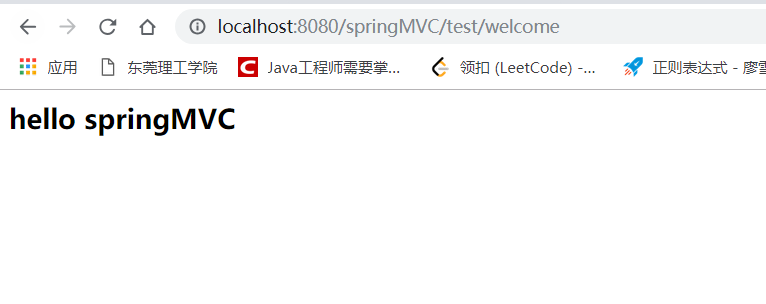
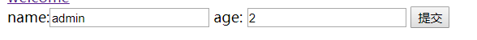

# springMVC 学习笔记


## 一、配置

### 1. 工程创建

利用maven创建工程

```xml
<!-- https://mvnrepository.com/artifact/org.springframework/spring-webmvc -->
    <dependency>
      <groupId>org.springframework</groupId>
      <artifactId>spring-webmvc</artifactId>
      <version>5.1.5.RELEASE</version>
    </dependency>
```

### 2.配置web.xml

```xml
<!DOCTYPE web-app PUBLIC
        "-//Sun Microsystems, Inc.//DTD Web Application 2.3//EN"
        "http://java.sun.com/dtd/web-app_2_3.dtd" >

<web-app xmlns="http://xmlns.jcp.org/xml/ns/javaee"
         xmlns:xsi="http://www.w3.org/2001/XMLSchema-instance"
         xsi:schemaLocation="
            http://xmlns.jcp.org/xml/ns/javaee
            http://xmlns.jcp.org/xml/ns/javaee/web-app_3_1.xsd"
         version="3.1">
    <display-name>Archetype Created Web Application</display-name>

    <servlet>
        <!--
        servlet-name 名字可随便取，但要与servlet-mapping servlet-name保持一致
        当servlet-url拦截到请求时，通过servlet-name 调用servlet-class
        -->
        <servlet-name>springmvc</servlet-name>
        <!--
		作用主要是拦截符合特定格式的url请求
		初始化DispatcherServlet上下文对应WebApplicationContext，并将其与业务层、持久化层的WebApplicationContext建立关联
		初始化Spring MVC的各个组成组件，并装配到DispatcherServlet中
			-->
        <servlet-class>org.springframework.web.servlet.DispatcherServlet</servlet-class>
        <!--在tomcat启动时，自动配置该servlet 内容-->
        <load-on-startup>1</load-on-startup>
    </servlet>
    <servlet-mapping>
        <servlet-name>springmvc</servlet-name>
        <!--表示拦截所有请求-->
        <url-pattern>/</url-pattern>
        <!--
		< url-pattern > / </ url-pattern >   不会匹配到*.jsp，即：*.jsp不会进入spring的 DispatcherServlet类 。
		< url-pattern > /* </ url-pattern > 会匹配*.jsp，会出现返回jsp视图时再次进入spring的DispatcherServlet 类，导致找不到对应的controller所以报404错。 

		总之，关于web.xml的url映射的小知识:
		< url-pattern>/</url-pattern>  会匹配到/login这样的路径型url，不会匹配到模式为*.jsp这样的后缀型url
		< url-pattern>/*</url-pattern> 会匹配所有url：路径型的和后缀型的url(包括/login,*.jsp,*.js和*.html等)
		-->
    </servlet-mapping>
</web-app>

```

### 3.配置springmvc.xml

```xml
<?xml version="1.0" encoding="UTF-8"?>
<beans xmlns="http://www.springframework.org/schema/beans"
       xmlns:xsi="http://www.w3.org/2001/XMLSchema-instance"
       xmlns:context="http://www.springframework.org/schema/context"
       xmlns:mvc="http://www.springframework.org/schema/mvc"
       xsi:schemaLocation="
	        http://www.springframework.org/schema/mvc
	        http://www.springframework.org/schema/mvc/spring-mvc-3.2.xsd
		http://www.springframework.org/schema/beans
		http://www.springframework.org/schema/beans/spring-beans-3.2.xsd
		http://www.springframework.org/schema/context
		http://www.springframework.org/schema/context/spring-context-3.2.xsd">


<!--扫描web层的@Controller-->
    <context:component-scan base-package="cn.forlkc.controller"/>

    <!--视图解析器配置-->
    <bean class="org.springframework.web.servlet.view.InternalResourceViewResolver">
        <!--配置前缀和后缀名，如WelcomeController 中方法welcome 返回 "welcome" 经过视图解析器后转变为  /views/welcome.jsp-->
        <property name="prefix" value="/views/" />
        <property name="suffix" value=".jsp" />
    </bean>

</beans>
```

### 4. 测试

```java
package cn.forlkc.controller;

import org.springframework.stereotype.Controller;
import org.springframework.web.bind.annotation.RequestMapping;

@Controller
@RequestMapping("/test")
public class WelcomeController {
    //加上类上面的RequestMapping 总路径就是（"/test/welcome"）在jsp页面上访问("test/welcome")
    @RequestMapping("/welcome")
    public String welcome(){
        return "welcome";
    }
}

```

```jsp
<html>
<body>
<h2>Hello World!</h2>

<a href="test/welcome">welcome</a>
</body>
</html>

```

```jsp
<%@ page contentType="text/html;charset=UTF-8" language="java" %>
<html>
<head>
    <title>welcome</title>
</head>
<body>
<h2>hello springMVC</h2>
</body>
</html>

```




## 二、RequestMapping映射及其属性

```java
/**
 * Annotation for mapping web requests onto methods in request-handling classes
 * with flexible method signatures.
 *
 * <p>Both Spring MVC and Spring WebFlux support this annotation through a
 * {@code RequestMappingHandlerMapping} and {@code RequestMappingHandlerAdapter}
 * in their respective modules and package structure. For the exact list of
 * supported handler method arguments and return types in each, please use the
 * reference documentation links below:
 * <ul>
 * <li>Spring MVC
 * <a href="https://docs.spring.io/spring/docs/current/spring-framework-reference/web.html#mvc-ann-arguments">Method Arguments</a>
 * and
 * <a href="https://docs.spring.io/spring/docs/current/spring-framework-reference/web.html#mvc-ann-return-types">Return Values</a>
 * </li>
 * <li>Spring WebFlux
 * <a href="https://docs.spring.io/spring/docs/current/spring-framework-reference/web-reactive.html#webflux-ann-arguments">Method Arguments</a>
 * and
 * <a href="https://docs.spring.io/spring/docs/current/spring-framework-reference/web-reactive.html#webflux-ann-return-types">Return Values</a>
 * </li>
 * </ul>
 *
 * <p><strong>Note:</strong> This annotation can be used both at the class and
 * at the method level. In most cases, at the method level applications will
 * prefer to use one of the HTTP method specific variants
 * {@link GetMapping @GetMapping}, {@link PostMapping @PostMapping},
 * {@link PutMapping @PutMapping}, {@link DeleteMapping @DeleteMapping}, or
 * {@link PatchMapping @PatchMapping}.</p>
 *
 * <p><b>NOTE:</b> When using controller interfaces (e.g. for AOP proxying),
 * make sure to consistently put <i>all</i> your mapping annotations - such as
 * {@code @RequestMapping} and {@code @SessionAttributes} - on
 * the controller <i>interface</i> rather than on the implementation class.
 * @since 2.5
 * @see GetMapping
 * @see PostMapping
 * @see PutMapping
 * @see DeleteMapping
 * @see PatchMapping
 * @see org.springframework.web.servlet.mvc.method.annotation.RequestMappingHandlerAdapter
 * @see org.springframework.web.reactive.result.method.annotation.RequestMappingHandlerAdapter
 */
@Target({ElementType.METHOD, ElementType.TYPE})
@Retention(RetentionPolicy.RUNTIME)
@Documented
@Mapping
public @interface RequestMapping {

	//为这个映射起个名称，在类和方法上都可以取，如为类起"test"， 方法"method"
    //串联起来就是test#method
	String name() default "";

	/**
	 * The primary mapping expressed by this annotation.
	 * <p>This is an alias for {@link #path}. For example
	 * {@code @RequestMapping("/foo")} is equivalent to
	 * {@code @RequestMapping(path="/foo")}.
	 * <p><b>Supported at the type level as well as at the method level!</b>
	 * When used at the type level, all method-level mappings inherit
	 * this primary mapping, narrowing it for a specific handler method.
	 */
    //路径
	@AliasFor("path")
	String[] value() default {};

	/**
	 * The path mapping URIs (e.g. "/myPath.do").
	 * Ant-style path patterns are also supported (e.g. "/myPath/*.do").
	 * At the method level, relative paths (e.g. "edit.do") are supported
	 * within the primary mapping expressed at the type level.
	 * Path mapping URIs may contain placeholders (e.g. "/${connect}").
	 * <p><b>Supported at the type level as well as at the method level!</b>
	 * When used at the type level, all method-level mappings inherit
	 * this primary mapping, narrowing it for a specific handler method.
	 * @see org.springframework.web.bind.annotation.ValueConstants#DEFAULT_NONE
	 * @since 4.2
	 */
	@AliasFor("value")
	String[] path() default {};

	/**
	 * The HTTP request methods to map to, narrowing the primary mapping:
	 * GET, POST, HEAD, OPTIONS, PUT, PATCH, DELETE, TRACE.
	 * <p><b>Supported at the type level as well as at the method level!</b>
	 * When used at the type level, all method-level mappings inherit
	 * this HTTP method restriction (i.e. the type-level restriction
	 * gets checked before the handler method is even resolved).
	 */
    //方法
	RequestMethod[] method() default {};

	/**
	 * The parameters of the mapped request, narrowing the primary mapping.
	 * <p>Same format for any environment: a sequence of "myParam=myValue" style
	 * expressions, with a request only mapped if each such parameter is found
	 * to have the given value. Expressions can be negated by using the "!=" operator,
	 * as in "myParam!=myValue". "myParam" style expressions are also supported,
	 * with such parameters having to be present in the request (allowed to have
	 * any value). Finally, "!myParam" style expressions indicate that the
	 * specified parameter is <i>not</i> supposed to be present in the request.
	 * <p><b>Supported at the type level as well as at the method level!</b>
	 * When used at the type level, all method-level mappings inherit
	 * this parameter restriction (i.e. the type-level restriction
	 * gets checked before the handler method is even resolved).
	 * <p>Parameter mappings are considered as restrictions that are enforced at
	 * the type level. The primary path mapping (i.e. the specified URI value)
	 * still has to uniquely identify the target handler, with parameter mappings
	 * simply expressing preconditions for invoking the handler.
	 */
    //参数
	String[] params() default {};

	/**
	 * The headers of the mapped request, narrowing the primary mapping.
	 * <p>Same format for any environment: a sequence of "My-Header=myValue" style
	 * expressions, with a request only mapped if each such header is found
	 * to have the given value. Expressions can be negated by using the "!=" operator,
	 * as in "My-Header!=myValue". "My-Header" style expressions are also supported,
	 * with such headers having to be present in the request (allowed to have
	 * any value). Finally, "!My-Header" style expressions indicate that the
	 * specified header is <i>not</i> supposed to be present in the request.
	 * <p>Also supports media type wildcards (*), for headers such as Accept
	 * and Content-Type. For instance,
	 * <pre class="code">
	 * &#064;RequestMapping(value = "/something", headers = "content-type=text/*")
	 * </pre>
	 * will match requests with a Content-Type of "text/html", "text/plain", etc.
	 * <p><b>Supported at the type level as well as at the method level!</b>
	 * When used at the type level, all method-level mappings inherit
	 * this header restriction (i.e. the type-level restriction
	 * gets checked before the handler method is even resolved).
	 * @see org.springframework.http.MediaType
	 */
    //请求头，作用和参数差不多，为了限制条件
	String[] headers() default {};

	/**
	 * The consumable media types of the mapped request, narrowing the primary mapping.
	 * <p>The format is a single media type or a sequence of media types,
	 * with a request only mapped if the {@code Content-Type} matches one of these media types.
	 * Examples:
	 * <pre class="code">
	 * consumes = "text/plain"
	 * consumes = {"text/plain", "application/*"}
	 * </pre>
	 * Expressions can be negated by using the "!" operator, as in "!text/plain", which matches
	 * all requests with a {@code Content-Type} other than "text/plain".
	 * <p><b>Supported at the type level as well as at the method level!</b>
	 * When used at the type level, all method-level mappings override
	 * this consumes restriction.
	 * @see org.springframework.http.MediaType
	 * @see javax.servlet.http.HttpServletRequest#getContentType()
	 */
	String[] consumes() default {};

	/**
	 * The producible media types of the mapped request, narrowing the primary mapping.
	 * <p>The format is a single media type or a sequence of media types,
	 * with a request only mapped if the {@code Accept} matches one of these media types.
	 * Examples:
	 * <pre class="code">
	 * produces = "text/plain"
	 * produces = {"text/plain", "application/*"}
	 * produces = MediaType.APPLICATION_JSON_UTF8_VALUE
	 * </pre>
	 * <p>It affects the actual content type written, for example to produce a JSON response
	 * with UTF-8 encoding, {@link org.springframework.http.MediaType#APPLICATION_JSON_UTF8_VALUE} should be used.
	 * <p>Expressions can be negated by using the "!" operator, as in "!text/plain", which matches
	 * all requests with a {@code Accept} other than "text/plain".
	 * <p><b>Supported at the type level as well as at the method level!</b>
	 * When used at the type level, all method-level mappings override
	 * this produces restriction.
	 * @see org.springframework.http.MediaType
	 */
	String[] produces() default {};

}

```


​	应用：

```java
@Controller
//表示请求路径为 /test 请求方法只接受post 而且参数必须包含name和age 且age不能为0 请求首部必须是Accept-Encoding=gzip, deflate
//缺失任何条件均拒绝
@RequestMapping(value = "/test", method = RequestMethod.POST,params = {"name", "age!=0"}, headers = {"Accept-Encoding=gzip, deflate"})
public class WelcomeController {
    @RequestMapping("/welcome")
    public String welcome(){
        return "welcome";
    }
}

```

```html
<html>
<body>
<h2>Hello World!</h2>

<a href="test/welcome">welcome</a>
<form action="test/welcome" method="post">
    name:<input name="name" type="text">
    age: <input name="age" type="number">
<input type="submit" value="提交">
</form>
</body>
</html>

```


直接用 `a` 标签（默认get方式）访问：


用表单 post方式访问：




设置age = 0 访问：


## 三、Result 风格


### 1. 在web.xml添加过滤器

```xml
<filter>
        <filter-name>HiddenHttpMethodFilter</filter-name>
        <filter-class>org.springframework.web.filter.HiddenHttpMethodFilter</filter-class>
    </filter>

    <filter-mapping>
        <filter-name>HiddenHttpMethodFilter</filter-name>
        <url-pattern>/*</url-pattern>
        <!--<servlet-name>mcpMvc</servlet-name>-->
    </filter-mapping>
```

### 2. 在前端配置隐藏域

在前端中没有`put` 和 `delete `方法，所以在使用 `put ` 和 `delete` 方法时,

需要 使用 `post ` 方法，在配置隐藏域

```html
<form action="test/welcomeRes/123" method="post">
    <input type="submit" value="增">
</form>
<form action="test/welcomeRes/1234" method="post">
    <!--type必须是hidden, name必须为_method, value 为大写的请求方法-->
    <input type="hidden" name="_method" value="DELETE" />
    <input type="submit" value="删">
</form>
<form action="test/welcomeRes/1235" method="post">
    <input type="hidden" name="_method" value="PUT" />
    <input type="submit" value="改">
</form>
<form action="test/welcomeRes/1236" method="get">
    <input type="submit" value="查">
</form>
```

### 3.写controller代码

首先必须指定请求方法，因为这是他们唯一的标识

其次，统一请求路径，通过请求方法分配到不同的方法中

```java
//value = "/welcomeRes/{id}" id 是请求参数这样可以直接在请求路径后面添加参数值
//@PathVariable("id") 获取id 并将它赋值给Integer id 中
@RequestMapping(value = "/welcomeRes/{id}", method = RequestMethod.POST)
    public String welcomeAdd(@PathVariable("id") Integer id){
        System.out.println("welcomeAdd id = " + id );
        return "welcome";
    }
    @RequestMapping(value = "/welcomeRes/{id}", method = RequestMethod.DELETE)
    public String welcomeDelete(@PathVariable("id") Integer id){
        System.out.println("welcomeDelete id = " + id );
        return "welcome";
    } @RequestMapping(value = "/welcomeRes/{id}", method = RequestMethod.PUT)
    public String welcomePut(@PathVariable("id") Integer id){
        System.out.println("welcomePut id = " + id );
        return "welcome";
    }
    @RequestMapping(value = "/welcomeRes/{id}", method = RequestMethod.GET)
    public String welcomeGet(@PathVariable("id") Integer id){
        System.out.println("welcomeGet id = " + id );
        return "welcome";
    }
```

### 4.结果截图


### 5. 碰到问题

在没有添加`@ResponseBody`注解时，转到welcome.jsp 时报错


这是网上的答案：

看到很多人解决办法使用 @ResponseBody注解 这个意思是按照json的处理办法，返回一个处理的字符串，如果你的项目使用了restful风格 但是返回的结果又是json'的话，那么可以使用这个办法，如果你的项目必须要返回一个一页那么有下面几种思路

1. 第一种：降低tomcat版本 使用tomcat7

2. 第二种：将请求先转给一个页面，再转换jsp页面

3. 第三种：

   ```html
   1 在你的success页面头部文件将
   2 <%@ page language="java" contentType="text/html; charset=UTF-8"
   3 pageEncoding="UTF-8" isErrorPage="true"%>
   4 多加一句话：isErrorPage设置为true，默认为false
   ```

问题解决

## 四、springmvc 传参

### 1. 传参格式

**1. springMVC通过@RequestParam(） 获取由前端传送过来的参数，再赋予给对应方法参数**

**2. 也可以通过路径传参，在请求路径@RequestMapping(value = "/welcomeRes/{id}"设置{id}值，再  @PathVariable("id") 获取取其值并保存在对应的方法参数中**

```java
@RequestMapping(value = "/welcomeRes/{id}", method = RequestMethod.PUT)
    public String welcomePut(@PathVariable("id") Integer id, @RequestParam("name") String name){
        System.out.println("welcomePut id = " + id );
        System.out.println("name = " + name);
        return "welcome";
    }
```

```html
<form action="test/welcomeRes/1235" method="post">
    <input type="hidden" name="_method" value="PUT" />
    name: <input type="text" name="name">
    <input type="submit" value="改">
</form>
```


RequestParam代码：

```java
public @interface RequestParam {

    //value的值就是前端的name属性的值
	@AliasFor("name")
	String value() default "";

	/**
	 * The name of the request parameter to bind to.
	 * @since 4.2
	 */
	@AliasFor("value")
	String name() default "";
    //设置为true就是前端必须传递这个参数，否则拒绝请求
    //如果为false， 则可以省略，其中默认为true
	boolean required() default true;
    //为此参数设置一个默认值
	String defaultValue() default ValueConstants.DEFAULT_NONE;

}
```

### 2. 其他相关注解

```java
@RequestHeader("")
@CookieValue（""）
//诸如此类，用法相同
```

### 3. object注入

前端传来一组对象数据，springmvc自动将他们注入到对象中

```java
public class User {
    private String name;
    private int age;

    public String getName() {
        return name;
    }

    public void setName(String name) {
        this.name = name;
    }

    public int getAge() {
        return age;
    }

    public void setAge(int age) {
        this.age = age;
    }

    @Override
    public String toString() {
        return "User{" +
                "name='" + name + '\'' +
                ", age=" + age +
                '}';
    }
}

```

```java
 @RequestMapping(value = "/welcomeResobj", method = RequestMethod.GET)
    public String welcomeResobj(User user) {
        System.out.println(user);
        return "welcome";
    }
```

```html
<form action="test/welcomeResobj" method="get">
    姓名：<input name="name">
    <p></p>
    年龄：<input name="age">
    <input type="submit" value="obj注入">
</form>
```


注意：在进行obj注入时，前端的name属性必须和后端实体类的属性名一致

springmvc 支持级联注入

如，user 里面有个address类属性，其中address又包含有city， stress等属性，只需要在前端把相关的name属性设置为

```html
<input type="text" name="address.city">
<input type="text" name="address.stress">
```

就可以了

## 五、springmvc 传输数据

### 1. ModelAndView

#### 1.1 ModelAndView 分析

从名字可以得出，这个类包含 model 和 view 两个功能

model传输数据，view 传输视图

他把数据存储在`request`中

#### 1.2 源码

它的源码讲得挺清楚就不分析了

```java
public class ModelAndView {

	/** View instance or view name String. */
	@Nullable
	private Object view;

	/** Model Map. */
	@Nullable
	private ModelMap model;

	/** Optional HTTP status for the response. */
	@Nullable
	private HttpStatus status;

	/** Indicates whether or not this instance has been cleared with a call to {@link #clear()}. */
	private boolean cleared = false;


	/**
	 * Default constructor for bean-style usage: populating bean
	 * properties instead of passing in constructor arguments.
	 * @see #setView(View)
	 * @see #setViewName(String)
	 */
	public ModelAndView() {
	}

	/**
	 * Convenient constructor when there is no model data to expose.
	 * Can also be used in conjunction with {@code addObject}.
	 * @param viewName name of the View to render, to be resolved
	 * by the DispatcherServlet's ViewResolver
	 * @see #addObject
	 */
	public ModelAndView(String viewName) {
		this.view = viewName;
	}

	/**
	 * Convenient constructor when there is no model data to expose.
	 * Can also be used in conjunction with {@code addObject}.
	 * @param view the View object to render
	 * @see #addObject
	 */
	public ModelAndView(View view) {
		this.view = view;
	}

	/**
	 * Create a new ModelAndView given a view name and a model.
	 * @param viewName name of the View to render, to be resolved
	 * by the DispatcherServlet's ViewResolver
	 * @param model a Map of model names (Strings) to model objects
	 * (Objects). Model entries may not be {@code null}, but the
	 * model Map may be {@code null} if there is no model data.
	 */
	public ModelAndView(String viewName, @Nullable Map<String, ?> model) {
		this.view = viewName;
		if (model != null) {
			getModelMap().addAllAttributes(model);
		}
	}

	/**
	 * Create a new ModelAndView given a View object and a model.
	 * <em>Note: the supplied model data is copied into the internal
	 * storage of this class. You should not consider to modify the supplied
	 * Map after supplying it to this class</em>
	 * @param view the View object to render
	 * @param model a Map of model names (Strings) to model objects
	 * (Objects). Model entries may not be {@code null}, but the
	 * model Map may be {@code null} if there is no model data.
	 */
	public ModelAndView(View view, @Nullable Map<String, ?> model) {
		this.view = view;
		if (model != null) {
			getModelMap().addAllAttributes(model);
		}
	}

	/**
	 * Create a new ModelAndView given a view name and HTTP status.
	 * @param viewName name of the View to render, to be resolved
	 * by the DispatcherServlet's ViewResolver
	 * @param status an HTTP status code to use for the response
	 * (to be set just prior to View rendering)
	 * @since 4.3.8
	 */
	public ModelAndView(String viewName, HttpStatus status) {
		this.view = viewName;
		this.status = status;
	}

	/**
	 * Create a new ModelAndView given a view name, model, and HTTP status.
	 * @param viewName name of the View to render, to be resolved
	 * by the DispatcherServlet's ViewResolver
	 * @param model a Map of model names (Strings) to model objects
	 * (Objects). Model entries may not be {@code null}, but the
	 * model Map may be {@code null} if there is no model data.
	 * @param status an HTTP status code to use for the response
	 * (to be set just prior to View rendering)
	 * @since 4.3
	 */
	public ModelAndView(@Nullable String viewName, @Nullable Map<String, ?> model, @Nullable HttpStatus status) {
		this.view = viewName;
		if (model != null) {
			getModelMap().addAllAttributes(model);
		}
		this.status = status;
	}

	/**
	 * Convenient constructor to take a single model object.
	 * @param viewName name of the View to render, to be resolved
	 * by the DispatcherServlet's ViewResolver
	 * @param modelName name of the single entry in the model
	 * @param modelObject the single model object
	 */
	public ModelAndView(String viewName, String modelName, Object modelObject) {
		this.view = viewName;
		addObject(modelName, modelObject);
	}

	/**
	 * Convenient constructor to take a single model object.
	 * @param view the View object to render
	 * @param modelName name of the single entry in the model
	 * @param modelObject the single model object
	 */
	public ModelAndView(View view, String modelName, Object modelObject) {
		this.view = view;
		addObject(modelName, modelObject);
	}


	/**
	 * Set a view name for this ModelAndView, to be resolved by the
	 * DispatcherServlet via a ViewResolver. Will override any
	 * pre-existing view name or View.
	 */
	public void setViewName(@Nullable String viewName) {
		this.view = viewName;
	}

	/**
	 * Return the view name to be resolved by the DispatcherServlet
	 * via a ViewResolver, or {@code null} if we are using a View object.
	 */
	@Nullable
	public String getViewName() {
		return (this.view instanceof String ? (String) this.view : null);
	}

	/**
	 * Set a View object for this ModelAndView. Will override any
	 * pre-existing view name or View.
	 */
	public void setView(@Nullable View view) {
		this.view = view;
	}

	/**
	 * Return the View object, or {@code null} if we are using a view name
	 * to be resolved by the DispatcherServlet via a ViewResolver.
	 */
	@Nullable
	public View getView() {
		return (this.view instanceof View ? (View) this.view : null);
	}

	/**
	 * Indicate whether or not this {@code ModelAndView} has a view, either
	 * as a view name or as a direct {@link View} instance.
	 */
	public boolean hasView() {
		return (this.view != null);
	}

	/**
	 * Return whether we use a view reference, i.e. {@code true}
	 * if the view has been specified via a name to be resolved by the
	 * DispatcherServlet via a ViewResolver.
	 */
	public boolean isReference() {
		return (this.view instanceof String);
	}

	/**
	 * Return the model map. May return {@code null}.
	 * Called by DispatcherServlet for evaluation of the model.
	 */
	@Nullable
	protected Map<String, Object> getModelInternal() {
		return this.model;
	}

	/**
	 * Return the underlying {@code ModelMap} instance (never {@code null}).
	 */
	public ModelMap getModelMap() {
		if (this.model == null) {
			this.model = new ModelMap();
		}
		return this.model;
	}

	/**
	 * Return the model map. Never returns {@code null}.
	 * To be called by application code for modifying the model.
	 */
	public Map<String, Object> getModel() {
		return getModelMap();
	}

	/**
	 * Set the HTTP status to use for the response.
	 * <p>The response status is set just prior to View rendering.
	 * @since 4.3
	 */
	public void setStatus(@Nullable HttpStatus status) {
		this.status = status;
	}

	/**
	 * Return the configured HTTP status for the response, if any.
	 * @since 4.3
	 */
	@Nullable
	public HttpStatus getStatus() {
		return this.status;
	}


	/**
	 * Add an attribute to the model.
	 * @param attributeName name of the object to add to the model (never {@code null})
	 * @param attributeValue object to add to the model (can be {@code null})
	 * @see ModelMap#addAttribute(String, Object)
	 * @see #getModelMap()
	 */
	public ModelAndView addObject(String attributeName, @Nullable Object attributeValue) {
		getModelMap().addAttribute(attributeName, attributeValue);
		return this;
	}

	/**
	 * Add an attribute to the model using parameter name generation.
	 * @param attributeValue the object to add to the model (never {@code null})
	 * @see ModelMap#addAttribute(Object)
	 * @see #getModelMap()
	 */
	public ModelAndView addObject(Object attributeValue) {
		getModelMap().addAttribute(attributeValue);
		return this;
	}

	/**
	 * Add all attributes contained in the provided Map to the model.
	 * @param modelMap a Map of attributeName -> attributeValue pairs
	 * @see ModelMap#addAllAttributes(Map)
	 * @see #getModelMap()
	 */
	public ModelAndView addAllObjects(@Nullable Map<String, ?> modelMap) {
		getModelMap().addAllAttributes(modelMap);
		return this;
	}


	/**
	 * Clear the state of this ModelAndView object.
	 * The object will be empty afterwards.
	 * <p>Can be used to suppress rendering of a given ModelAndView object
	 * in the {@code postHandle} method of a HandlerInterceptor.
	 * @see #isEmpty()
	 * @see HandlerInterceptor#postHandle
	 */
	public void clear() {
		this.view = null;
		this.model = null;
		this.cleared = true;
	}

	/**
	 * Return whether this ModelAndView object is empty,
	 * i.e. whether it does not hold any view and does not contain a model.
	 */
	public boolean isEmpty() {
		return (this.view == null && CollectionUtils.isEmpty(this.model));
	}

	/**
	 * Return whether this ModelAndView object is empty as a result of a call to {@link #clear}
	 * i.e. whether it does not hold any view and does not contain a model.
	 * <p>Returns {@code false} if any additional state was added to the instance
	 * <strong>after</strong> the call to {@link #clear}.
	 * @see #clear()
	 */
	public boolean wasCleared() {
		return (this.cleared && isEmpty());
	}
}
```


#### 1.3 一个简单的例子

```java
@Controller
@RequestMapping("/ModelAndView")
public class ModelAndViewController {
    @RequestMapping("/getData")
    public ModelAndView getData(){
        ModelAndView modelAndView = new ModelAndView("welcome");
        User user = new User();
        user.setAge(12);
        user.setName("asd");
		
        modelAndView.addObject("user", user);

        return modelAndView;
    }
}
```

```jsp
<%@ page contentType="text/html;charset=UTF-8" pageEncoding="utf-8" language="java" isErrorPage="true" %>
<html>
<head>
    <title>welcome</title>
</head>
<body>
<h2>hello springMVC</h2>

${requestScope.get("user")}
</body>
</html>

```


#### 1.4 类似方法操作（Model、Map、ModelMap）

以model为例：

```java
@RequestMapping("/getDataModel")
    public String getDataModel(Model model){

        User user = new User();
        user.setAge(13);
        user.setName("asd");
        model.addAttribute("user", user);

        return "welcome";
    }
```

```html
<a href="ModelAndView/getDataModel">getDataModel</a>
```


这几个操作同样是把数据存储在request域中，如果想存储在session中，只需要加个注解就好

```java
@SessionAttributes(types = User.class)
```

### 2. modelAttribute

在更新前先执行modelAttribute注解的方法

设计思想在功能单一的控制器中使用，因为该注解方法会在每一个方法执行前执行

## 六、视图，视图解析器，国际化

视图：view

视图解析器：ViewResolver


国际化：i18n

### 1. 国际化命名规范

基名-语言-国家(地区).properties

如：i18n_zh_CN.properties

​	：i18n_en_US.properties

​	：i18n_zh_HK.properties(中国香港)

### 2. 国际化资源文件配置

```properties
resource.welcome=welcome
resource.hello=hello
```

```properties
resource.welcome=\u6b22\u8fce
resource.hello=\u4f60\u597d
#在jdk/bin 文件夹里面有个native2ascii.exe 可以将中文转变为ASCII码
#转换成ASCII码的好处就是不会产生中文乱码
```

```xml
<!--
国际化：
id是固定的
ResourceBundleMessageSource 需要在响应时才加载
-->
<bean id="messageSource" class="org.springframework.context.support.ResourceBundleMessageSource">
    <property name="basename" value="i18n"></property>
</bean>
```

```jsp
<%@ taglib prefix="fmt" uri="http://java.sun.com/jstl/fmt" %>
<!--上面那个是jsp国际化标签，需要下载对应的包才可以使用，而且包的版本要和tomcat中的包版本相对应-->
<%@ page contentType="text/html;charset=UTF-8" pageEncoding="utf-8" language="java" isErrorPage="true" %>
<html>
<head>
    <title>welcome</title>
</head>
<body>
<h2>hello springMVC</h2>


<fmt:message key="resource.welcome" />,
<fmt:message key="resource.hello" />
</body>
</html>

```


浏览器改为美国英语后：


## 七、 转换器

将原类型转换成目标类型.

### 1. 自定义转换器

接口代码：

```java
/**
 * A converter converts a source object of type {@code S} to a target of type {@code T}.
 *
 * <p>Implementations of this interface are thread-safe and can be shared.
 *
 * <p>Implementations may additionally implement {@link ConditionalConverter}.
 *
 * @author Keith Donald
 * @since 3.0
 * @param <S> the source type
 * @param <T> the target type
 */
@FunctionalInterface
public interface Converter<S, T> {

	/**
	 * Convert the source object of type {@code S} to target type {@code T}.
	 * @param source the source object to convert, which must be an instance of {@code S} (never {@code null})
	 * @return the converted object, which must be an instance of {@code T} (potentially {@code null})
	 * @throws IllegalArgumentException if the source cannot be converted to the desired target type
	 */
	@Nullable
	T convert(S source);

}
```

具体实现：

```xml
<!--1.配置自定义的converter-->
<bean id="myConverter" class="cn.forlkc.converters.MyConverter"></bean>

<!--2.将自定义的converter注册到org.springframework.context.support.ConversionServiceFactoryBean中-->
<bean id="conversionService" class="org.springframework.context.support.ConversionServiceFactoryBean">
    <property name="converters">
        <set>
            <ref bean="myConverter"></ref>
        </set>
    </property>
</bean>
<!--mvc 的基本配置，协调冲突， 加载静态资源，3.注册转换器-->
<mvc:annotation-driven conversion-service="conversionService"></mvc:annotation-driven>
<mvc:default-servlet-handler></mvc:default-servlet-handler>
```

```java
package cn.forlkc.converters;

import cn.forlkc.entities.User;
import org.springframework.core.convert.converter.Converter;

public class MyConverter implements Converter<String, User> {
    @Override
    public User convert(String source) {
        String[] userStr = source.toString().split("-");
        User user = new User();
        user.setName(userStr[0]);
        user.setAge(Integer.parseInt(userStr[1]));
        return user;
    }
}
```

```java
@RequestMapping("/converter")
    @ResponseBody
    public String converter(@RequestParam("userStr") User user){
        System.out.println(user);
        return user.toString();
    }
```

运行结果：


### 2. 数据格式化

对前端数据的一个约束：

基本配置：

```java
 	@NumberFormat(pattern = "####")
    private int age;
    @DateTimeFormat(pattern = "yyyy-MM-dd")
    private Calendar birthday;
```

```xml
<!--2.将自定义的converter注册到org.springframework.context.support.ConversionServiceFactoryBean中-->
    <bean id="conversionService" class="org.springframework.format.support.FormattingConversionServiceFactoryBean">
        <property name="converters">
            <!--自定义转换器-->
            <set>
                <ref bean="myConverter"></ref>
            </set>
        </property>
    </bean>
```

测试结果：


## 八、 返回json和XML

添加依赖：

```xml
<dependency>
  <groupId>com.fasterxml.jackson.core</groupId>
  <artifactId>jackson-databind</artifactId>
  <version>2.9.0</version>
</dependency>
```

注解为ResponseBody

```java
@RequestMapping("/getJson")
    @ResponseBody
    public User getJson(){

        User user = new User();
        user.setAge(13);
        user.setName("刘楷川");

        return user;
    }
```

```javascript
<script>
    $('#btn').click(function(){
        $.post("ModelAndView/getJson.json",
            function (data){
                console.log(data)
            });
    })
</script>
```


XML：

请求方式：

A.   设置请求头[Accept=application/xml](http://localhost:8081/spring-mvc-showcase/mapping/produces)

B.      url后带.xml后缀，默认可以省略。

\1.      在返回JavaBean类声明之前加上@XmlRootElement

@XmlRootElement

**public** **class** User｛｝

默认返回均为xml，如果想返回json的时候必须带上.json后缀即可。

\2.      编写控制层返回json代码

   @RequestMapping(value="/mapping/user", method=RequestMethod.**GET**)

​    **public** @ResponseBody User byProducesJson() {

​       **return** **new** User();

​    }

 

\3.      测试：

http://localhost:8081/springmvc/mapping/user       默认：xml

http://localhost:8081/springmvc/mapping/user.json   返回：json

## 九 、文件上传

1. 添加依赖：

```xml
<!-- File Upload -->
    <dependency>
      <groupId>commons-fileupload</groupId>
      <artifactId>commons-fileupload</artifactId>
      <version>1.2.2</version>
    </dependency>
    <dependency>
      <groupId>commons-io</groupId>
      <artifactId>commons-io</artifactId>
      <version>2.0.1</version>
    </dependency>
```

2. 配置实现类：

   ```xml
   <!--引入文件上传的实现类-->
       <bean id="multipartResolver" class="org.springframework.web.multipart.commons.CommonsMultipartResolver">
           <!--设置最大上传文件大小-->
           <property name="maxUploadSize" value="102400000" />
           <property name="defaultEncoding" value="UTF-8" />
       </bean>
   ```

   

3. java 代码：

   ```java
   @RequestMapping("/fileUploud")
       @ResponseBody
       public String fileUploud(@RequestParam("desc") String desc, @RequestParam("file")MultipartFile file, HttpServletRequest request) throws IOException {
           System.out.println(desc);
   
           //获取项目根路径
           String path = request.getSession().getServletContext().getRealPath("");
           //获取文件后缀名
           String backName = file.getOriginalFilename().substring(file.getContentType().lastIndexOf("/")+1);
           //生成UUID随机文件名   UUID主要是为了避免文件名重复 导致覆盖旧的文件
           String fileName = UUID.randomUUID().toString().replaceAll("-","") + "." + backName;
           //拼接成完整路径
           path =path + "/uploud/" + fileName;
           //创建文件到指定路径
           file.transferTo(new File(path));
           //返回文件路径
           return path;
       }
   ```

4.  html 代码：

   ```html
   <form action="fileUploud" method="post" enctype="multipart/form-data">
       描述信息：<input type="text" name="desc" /> <br/>
       <input type="file" name="file" value="图片上传">
       <input type="submit" value="提交">
   </form>
   ```

5. 输出结果：

   

