# 并发编程的艺术

## 并发编程的挑战

并发编程的目的是为了让程序运行得更快，但是，并不是启动更多的线程就能让程序最大限度地并发执行。在进行并发编程时，如果希望通过多线程执行任务让程序运行得更快，会面临非常多的挑战，比如上下文切换的问题、死锁的问题，以及受限于硬件和软件的资源限制问题

### 上下文切换

单核处理器也支持多线程执行代码，CPU通过给每个线程分配CPU时间片来实现这个机制。时间片是CPU分配给各个线程的时间，因为时间片非常短，所以CPU通过不停地切换线程执行，让我们感觉多个线程是同时执行的，时间片一般是几十毫秒（ms）。

CPU通过时间片分配算法来循环执行任务，当前任务执行一个时间片后会切换到下一个任务。但是，在切换前会保存上一个任务的状态，以便下次切换回这个任务时，可以再加载这个任务的状态。所以任务从保存到再加载的过程就是一次上下文切换。

#### 多线程一定快吗

因为线程有创建和上下文切换的开销

#### 如何减少上下文切换

减少上下文切换的方法有无锁并发编程、CAS算法、使用最少线程和使用协程。

-   无锁并发编程。多线程竞争锁时，会引起上下文切换，所以多线程处理数据时，可以用一些办法来避免使用锁，如将数据的ID按照Hash算法取模分段，不同的线程处理不同段的数据
-   CAS算法。Java的Atomic包使用CAS算法来更新数据，而不需要加锁。
-   使用最少线程。避免创建不需要的线程，比如任务很少，但是创建了很多线程来处理，这样会造成大量线程都处于等待状态。
-   协程：在单线程里实现多任务的调度，并在单线程里维持多个任务间的切换。

### 死锁

避免死锁的几个常见方法。

-   避免一个线程同时获取多个锁。
-   避免一个线程在锁内同时占用多个资源，尽量保证每个锁只占用一个资源。
-   尝试使用定时锁，使用lock.tryLock（timeout）来替代使用内部锁机制。
-   对于数据库锁，加锁和解锁必须在一个数据库连接里，否则会出现解锁失败的情况。

### 资源限制的挑战

1.  什么是资源限制

    资源限制是指在进行并发编程时，程序的执行速度受限于计算机硬件资源或软件资源。

    例如，服务器的带宽只有2Mb/s，某个资源的下载速度是1Mb/s每秒，系统启动10个线程下载资源，下载速度不会变成10Mb/s，所以在进行并发编程时，要考虑这些资源的限制。硬件资源限制有带宽的上传/下载速度、硬盘读写速度和CPU的处理速度。软件资源限制有数据库的连接数和socket连接数等。

2.  资源限制引发的问题

    在并发编程中，将代码执行速度加快的原则是将代码中串行执行的部分变成并发执行，但是如果将某段串行的代码并发执行，因为受限于资源，仍然在串行执行，这时候程序不仅不会加快执行，反而会更慢，因为增加了上下文切换和资源调度的时间。

    例如，之前看到一段程序使用多线程在办公网并发地下载和处理数据时，导致CPU利用率达到100%，几个小时都不能运行完成任务，后来修改成单线程，一个小时就执行完成了。

3.  如何解决资源限制的问题

    对于硬件资源限制，可以考虑使用集群并行执行程序。既然单机的资源有限制，那么就让程序在多机上运行。比如使用ODPS、Hadoop或者自己搭建服务器集群，不同的机器处理不同的数据。可以通过“数据ID%机器数”，计算得到一个机器编号，然后由对应编号的机器处理这笔数据。

    对于软件资源限制，可以考虑使用资源池将资源复用。比如使用连接池将数据库和Socket连接复用，或者在调用对方webservice接口获取数据时，只建立一个连接。

4.  在资源限制情况下进行并发编程

    如何在资源限制的情况下，让程序执行得更快呢？方法就是，根据不同的资源限制调整程序的并发度，比如下载文件程序依赖于两个资源——带宽和硬盘读写速度。有数据库操作时，涉及数据库连接数，如果SQL语句执行非常快，而线程的数量比数据库连接数大很多，则某些线程会被阻塞，等待数据库连接。

## Java 并发机制的底层实现原理

Java代码在编译后会变成Java字节码，字节码被类加载器加载到JVM里，JVM执行字节码，最终需要转化为汇编指令在CPU上执行，Java中所使用的并发机制依赖于JVM的实现和CPU的指令。

### volatile 的应用

在多线程并发编程中synchronized和volatile都扮演着重要的角色，volatile是轻量级的synchronized，它在多处理器开发中保证了共享变量的“可见性”。可见性的意思是当一个线程修改一个共享变量时，另外一个线程能读到这个修改的值。如果volatile变量修饰符使用恰当的话，它比synchronized的使用和执行成本更低，因为它不会引起线程上下文的切换和调度

#### volatile 的定义与实现原理

Java语言规范第3版中对volatile的定义如下：Java编程语言允许线程访问共享变量，为了确保共享变量能被准确和一致地更新，线程应该确保通过排他锁单独获得这个变量。Java语言提供了volatile，在某些情况下比锁要更加方便。如果一个字段被声明成volatile，Java线程内存模型确保所有线程看到这个变量的值是一致的。

CPU的术语定义：

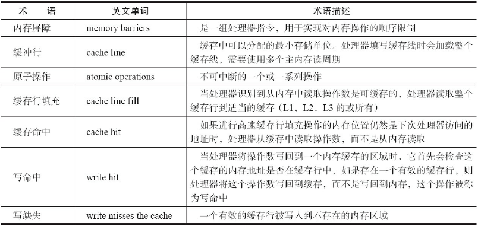

对volatile生命的变量进行写操作的汇编代码如下：

```c
0x01a3de1d: movb $0×0,0×1104800(%esi);0x01a3de24: lock addl $0×0,(%esp);
```

**volatile的两条实现原则**

-   Lock前缀指令会引起处理器缓存回写到内存
-   一个处理器的缓存回写到内存会导致其他处理器的缓存无效

### synchronized的实现原理与应用

在多线程并发编程中synchronized一直是元老级角色，很多人都会称呼它为重量级锁。但是，随着Java SE 1.6对synchronized进行了各种优化之后，有些情况下它就并不那么重了。Java SE 1.6中为了减少获得锁和释放锁带来的性能消耗而引入的偏向锁和轻量级锁，以及锁的存储结构和升级过程。

synchronized实现同步的基础：Java中的每一个对象都可以作为锁。具体表现为以下3种形式。

-   对于普通同步方法，锁是当前实例对象。
-   对于静态同步方法，锁是当前类的Class对象。
-   对于同步方法块，锁是Synchonized括号里配置的对象。

#### Java 对象头

synchronized用的锁是存在Java对象头里的。如果对象是数组类型，则虚拟机用3个字宽（Word）存储对象头，如果对象是非数组类型，则用2字宽存储对象头。在32位虚拟机中，1字宽等于4字节，即32bit


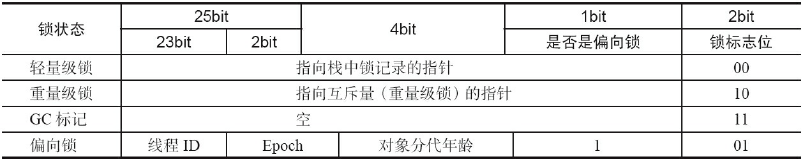

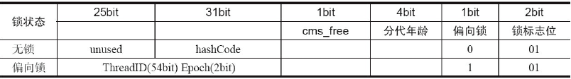

#### 锁的升级与对比

Java SE 1.6为了减少获得锁和释放锁带来的性能消耗，引入了“偏向锁”和“轻量级锁”，在Java SE 1.6中，锁一共有4种状态，级别从低到高依次是：无锁状态、偏向锁状态、轻量级锁状态和重量级锁状态，这几个状态会随着竞争情况逐渐升级。锁可以升级但不能降级，意味着偏向锁升级成轻量级锁后不能降级成偏向锁。这种锁升级却不能降级的策略，目的是为了提高获得锁和释放锁的效率

##### 偏向锁

HotSpot[1]的作者经过研究发现，大多数情况下，锁不仅不存在多线程竞争，而且总是由同一线程多次获得，为了让线程获得锁的代价更低而引入了偏向锁。当一个线程访问同步块并获取锁时，会在对象头和栈帧中的锁记录里存储锁偏向的线程ID，以后该线程在进入和退出同步块时不需要进行CAS操作来加锁和解锁，只需简单地测试一下对象头的Mark Word里是否存储着指向当前线程的偏向锁。如果测试成功，表示线程已经获得了锁。如果测试失败，则需要再测试一下Mark Word中偏向锁的标识是否设置成1（表示当前是偏向锁）：如果没有设置，则使用CAS竞争锁；如果设置了，则尝试使用CAS将对象头的偏向锁指向当前线程。

1.  偏向锁的撤销

    偏向锁使用了一种等到竞争出现才释放锁的机制，所以当其他线程尝试竞争偏向锁时，持有偏向锁的线程才会释放锁。偏向锁的撤销，需要等待全局安全点（在这个时间点上没有正在执行的字节码）。它会首先暂停拥有偏向锁的线程，然后检查持有偏向锁的线程是否活着，如果线程不处于活动状态，则将对象头设置成无锁状态；如果线程仍然活着，拥有偏向锁的栈会被执行，遍历偏向对象的锁记录，栈中的锁记录和对象头的Mark Word要么重新偏向于其他线程，要么恢复到无锁或者标记对象不适合作为偏向锁，最后唤醒暂停的线程。

    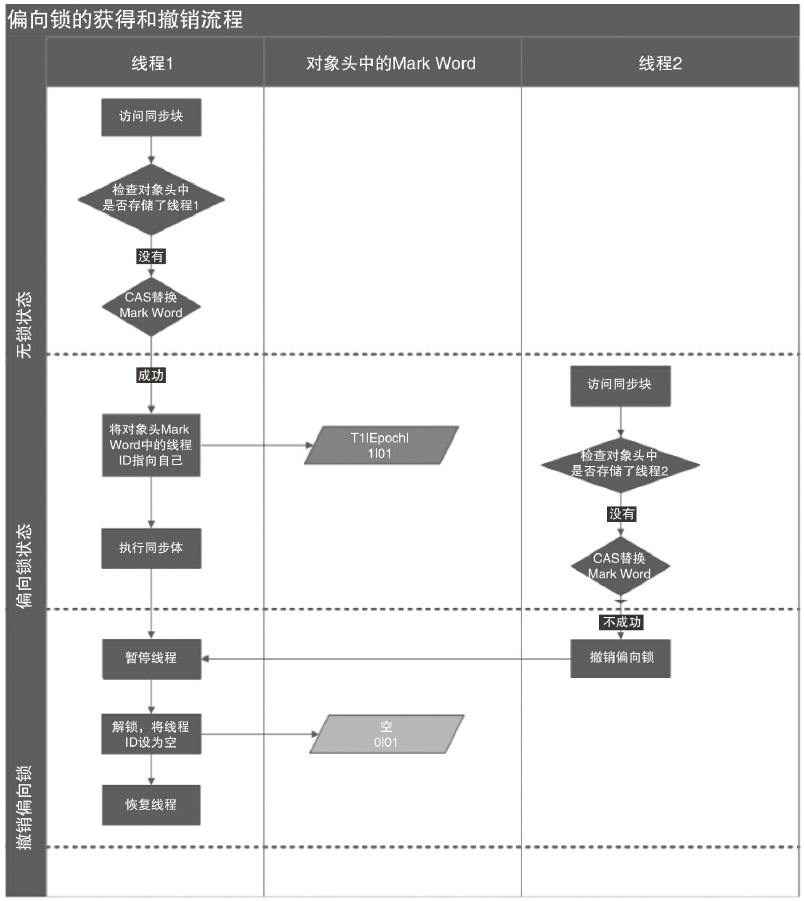

2.  关闭偏向锁

    偏向锁在Java 6和Java 7里是默认启用的，但是它在应用程序启动几秒钟之后才激活，如有必要可以使用JVM参数来关闭延迟：-XX:BiasedLockingStartupDelay=0。如果你确定应用程序里所有的锁通常情况下处于竞争状态，可以通过JVM参数关闭偏向锁：-XX:-UseBiasedLocking=false，那么程序默认会进入轻量级锁状态

##### 轻量级锁

1.  轻量级锁加锁

    线程在执行同步块之前，JVM会先在当前线程的栈桢中创建用于存储锁记录的空间，并将对象头中的Mark Word复制到锁记录中，官方称为Displaced Mark Word。然后线程尝试使用CAS将对象头中的Mark Word替换为指向锁记录的指针。如果成功，当前线程获得锁，如果失败，表示其他线程竞争锁，当前线程便尝试使用自旋来获取锁。

2.  轻量级锁解锁

    轻量级解锁时，会使用原子的CAS操作将Displaced Mark Word替换回到对象头，如果成功，则表示没有竞争发生。如果失败，表示当前锁存在竞争，锁就会膨胀成重量级锁

    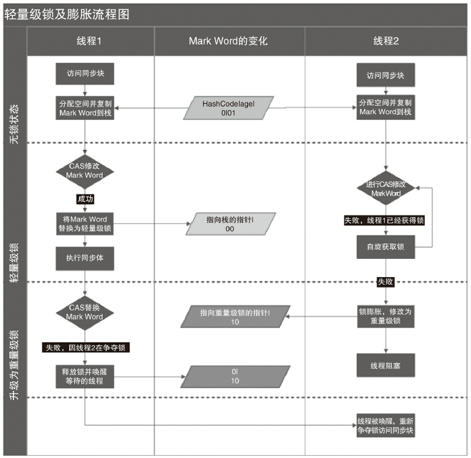

    因为自旋会消耗CPU，为了避免无用的自旋（比如获得锁的线程被阻塞住了），一旦锁升级成重量级锁，就不会再恢复到轻量级锁状态。当锁处于这个状态下，其他线程试图获取锁时，都会被阻塞住，当持有锁的线程释放锁之后会唤醒这些线程，被唤醒的线程就会进行新一轮的夺锁之争。

3.  锁的优缺点对比

    

#### 原子操作的实现原理

原子操作（atomic operation）意为“不可被中断的一个或一系列操作”。

##### 术语定义

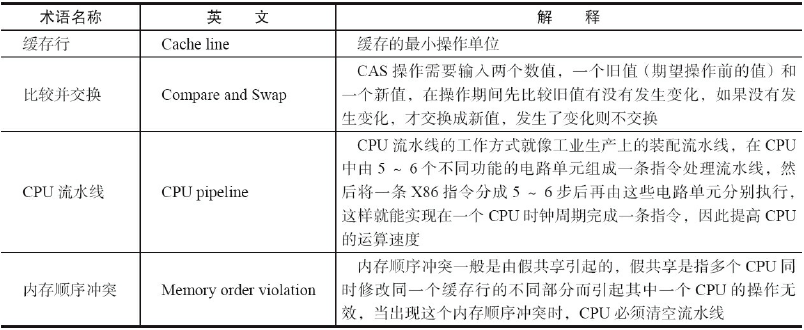

##### 处理器如何实现原子操作

## Java 内存模型

### Java 内存模型的基础

#### 并发编程模型的两个关键问题

两个关键问题：线程之间如何通信及线程之间如何同步（这里的线程是指并发执行的活动实体）。通信是指线程之间以何种机制来交换信息。在命令式编程中，线程之间的通信机制有两种：共享内存和消息传递

在共享内存的并发模型里，线程之间共享程序的公共状态，通过写-读内存中的公共状态进行隐式通信。在消息传递的并发模型里，线程之间没有公共状态，线程之间必须通过发送消息来显式进行通信。

同步是指程序中用于控制不同线程间操作发生相对顺序的机制。在共享内存并发模型里，同步是显式进行的。程序员必须显式指定某个方法或某段代码需要在线程之间互斥执行。在消息传递的并发模型里，由于消息的发送必须在消息的接收之前，因此同步是隐式进行的。

Java的并发采用的是共享内存模型，Java线程之间的通信总是隐式进行，整个通信过程对程序员完全透明。

#### Java 内存模型的抽象结构

在Java中，所有实例域、静态域和数组元素都存储在堆内存中，堆内存在线程之间共享。局部变量，方法定义参数和异常处理器参数不会在线程之间共享，它们不会有内存可见性问题，也不受内存模型的影响。

Java线程之间的通信由Java内存模型（本文简称为JMM）控制，JMM决定一个线程对共享变量的写入何时对另一个线程可见。从抽象的角度来看，JMM定义了线程和主内存之间的抽象关系：线程之间的共享变量存储在主内存（Main Memory）中，每个线程都有一个私有的本地内存（Local Memory），本地内存中存储了该线程以读/写共享变量的副本。本地内存是JMM的一个抽象概念，并不真实存在。它涵盖了缓存、写缓冲区、寄存器以及其他的硬件和编译器优化。

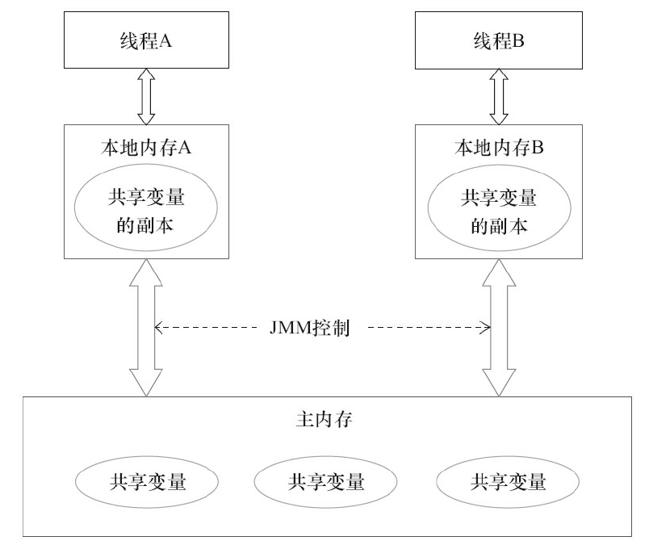
如果线程A与线程B之间要通信的话，必须要经历下面2个步骤。

1.  线程A把本地内存A中更新过的共享变量刷新到主内存中去。
2.  线程B到主内存中去读取线程A之前已更新过的共享变量。

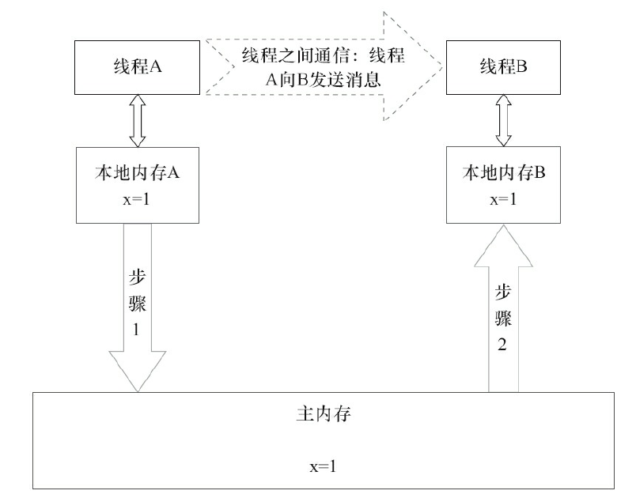

#### 从源代码到指令序列的重排序

在执行程序时，为了提高性能，编译器和处理器常常会对指令做重排序。重排序分3种类型。

1.  编译器优化的重排序。编译器在不改变单线程程序语义的前提下，可以重新安排语句的执行顺序。
2.  指令级并行的重排序。现代处理器采用了指令级并行技术（Instruction-LevelParallelism，ILP）来将多条指令重叠执行。如果不存在数据依赖性，处理器可以改变语句对应机器指令的执行顺序。
3.  内存系统的重排序。由于处理器使用缓存和读/写缓冲区，这使得加载和存储操作看上去可能是在乱序执行。

从Java源代码到最终实际执行的指令序列，会分别经历下面3种重排序:


上述的1属于编译器重排序，2和3属于处理器重排序。这些重排序可能会导致多线程程序出现内存可见性问题。对于编译器，JMM的编译器重排序规则会禁止特定类型的编译器重排序（不是所有的编译器重排序都要禁止）。对于处理器重排序，JMM的处理器重排序规则会要求Java编译器在生成指令序列时，插入特定类型的内存屏障（Memory Barriers，Intel称之为Memory Fence）指令，通过内存屏障指令来禁止特定类型的处理器重排序。

JMM属于语言级的内存模型，它确保在不同的编译器和不同的处理器平台之上，通过禁止特定类型的编译器重排序和处理器重排序，为程序员提供一致的内存可见性保证。

#### 并发编程模型的分类

现代的处理器使用写缓冲区临时保存向内存写入的数据。写缓冲区可以保证指令流水线持续运行，它可以避免由于处理器停顿下来等待向内存写入数据而产生的延迟。同时，通过以批处理的方式刷新写缓冲区，以及合并写缓冲区中对同一内存地址的多次写，减少对内存总线的占用。虽然写缓冲区有这么多好处，但每个处理器上的写缓冲区，仅仅对它所在的处理器可见。这个特性会对内存操作的执行顺序产生重要的影响：处理器对内存的读/写操作的执行顺序，不一定与内存实际发生的读/写操作顺序一致。

#### happens-before 简介

从JDK 5开始，Java使用新的JSR-133内存模型。JSR-133使用happens-before的概念来阐述操作之间的内存可见性。在JMM中，如果一个操作执行的结果需要对另一个操作可见，那么这两个操作之间必须要存在happens-before关系。这里提到的两个操作既可以是在一个线程之内，也可以是在不同线程之间。
与程序员密切相关的happens-before规则如下。

-   程序顺序规则：一个线程中的每个操作，happens-before于该线程中的任意后续操作。
-   监视器锁规则：对一个锁的解锁，happens-before于随后对这个锁的加锁。
-   volatile变量规则：对一个volatile域的写，happens-before于任意后续对这个volatile域的读。
-   传递性：如果A happens-before B，且B happens-before C，那么A happens-before C。

两个操作之间具有happens-before关系，并不意味着前一个操作必须要在后一个操作之前执行！happens-before仅仅要求前一个操作（执行的结果）对后一个操作可见，且前一个操作按顺序排在第二个操作之前

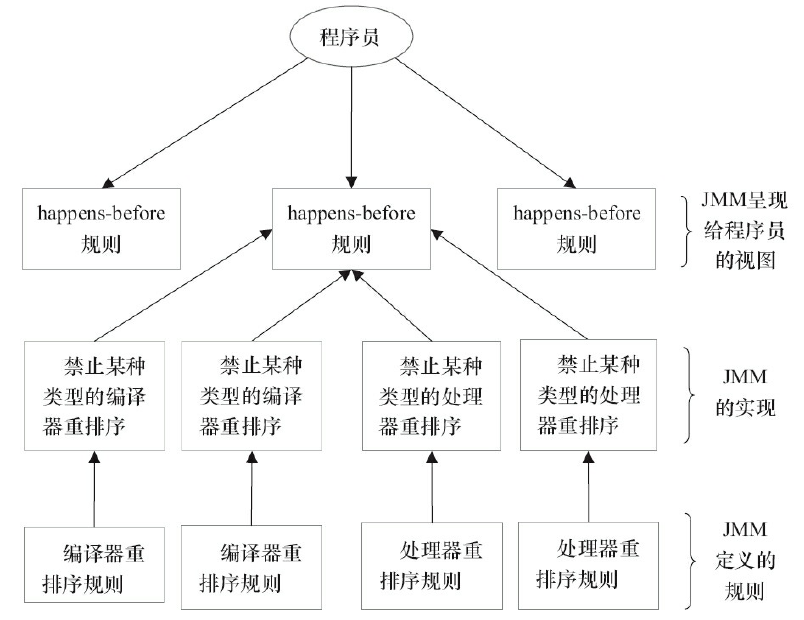

### 重排序

重排序是指编译器和处理器为了优化程序性能而对指令序列进行重新排序的一种手段。

#### 数据依赖性

如果两个操作访问同一个变量，且这两个操作中有一个为写操作，此时这两个操作之间就存在数据依赖性。数据依赖分为下列3种类型


上面3种情况，只要重排序两个操作的执行顺序，程序的执行结果就会被改变。

编译器和处理器在重排序时，会遵守数据依赖性，编译器和处理器不会改变存在数据依赖关系的两个操作的执行顺序。

这里所说的数据依赖性仅针对单个处理器中执行的指令序列和单个线程中执行的操作，不同处理器之间和不同线程之间的数据依赖性不被编译器和处理器考虑。

#### as-if-serial语义

as-if-serial语义的意思是：不管怎么重排序（编译器和处理器为了提高并行度），（单线程）程序的执行结果不能被改变。编译器、runtime和处理器都必须遵守as-if-serial语义。

为了遵守as-if-serial语义，编译器和处理器不会对存在数据依赖关系的操作做重排序，因为这种重排序会改变执行结果。但是，如果操作之间不存在数据依赖关系，这些操作就可能被编译器和处理器重排序

#### 程序顺序规则

如果A happens-before B，JMM并不要求A一定要在B之前执行。JMM仅仅要求前一个操作（执行的结果）对后一个操作可见，且前一个操作按顺序排在第二个操作之前。这里操作A的执行结果不需要对操作B可见；而且重排序操作A和操作B后的执行结果，与操作A和操作B按happens-before顺序执行的结果一致。在这种情况下，JMM会认为这种重排序并不非法（not illegal），JMM允许这种重排序。

#### 重排序对多线程的影响

在单线程程序中，对存在控制依赖的操作重排序，不会改变执行结果（这也是as-if-serial语义允许对存在控制依赖的操作做重排序的原因）；但在多线程程序中，对存在控制依赖的操作重排序，可能会改变程序的执行结果。

### 顺序一致性

顺序一致性内存模型是一个理论参考模型，在设计的时候，处理器的内存模型和编程语言的内存模型都会以顺序一致性内存模型作为参照。

#### 顺序一致性内存模型

顺序一致性内存模型有两大特性。

1.  一个线程中的所有操作必须按照程序的顺序来执行。
2.  （不管程序是否同步）所有线程都只能看到一个单一的操作执行顺序。在顺序一致性内存模型中，每个操作都必须原子执行且立刻对所有线程可见

#### 同步程序的顺序一致性效果

```java
class SynchronizedExample {
	int a = 0;
	boolean flag = false;
	public synchronized void writer() { // 获取锁
		a = 1;
		flag = true;
	} // 释放锁
	public synchronized void reader() { // 获取锁
		if (flag) {
		int i = a;
		……
		} // 释放锁
	}
}
```

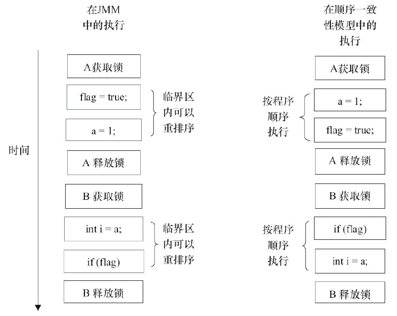

JMM在具体实现上的基本方针为：在不改变（正确同步的）程序执行结果的前提下，尽可能地为编译器和处理器的优化打开方便之门。

#### 未同步程序的执行特性

对于未同步或未正确同步的多线程程序，JMM只提供最小安全性：线程执行时读取到的值，要么是之前某个线程写入的值，要么是默认值（0，Null，False），JMM保证线程读操作读取到的值不会无中生有（Out Of Thin Air）的冒出来。为了实现最小安全性，JVM在堆上分配对象时，首先会对内存空间进行清零，然后才会在上面分配对象（JVM内部会同步这两个操作）。因此，在已清零的内存空间（Pre-zeroed Memory）分配对象时，域的默认初始化已经完成了。

JMM不保证未同步程序的执行结果与该程序在顺序一致性模型中的执行结果一致。因为如果想要保证执行结果一致，JMM需要禁止大量的处理器和编译器的优化，这对程序的执行性能会产生很大的影响。而且未同步程序在顺序一致性模型中执行时，整体是无序的，其执行结果往往无法预知。而且，保证未同步程序在这两个模型中的执行结果一致没什么意义。

### volatile 的内存语义

#### volatile 的特性

-   可见性。对一个volatile变量的读，总是能看到（任意线程）对这个volatile变量最后的写入。
-   原子性：对任意单个volatile变量的读/写具有原子性，但类似于volatile++这种复合操作不具有原子性。

#### volatile 写-读建立的happens-before关系

从JSR-133开始（即从JDK5开始），volatile变量的写-读可以实现线程之间的通信。

从内存语义的角度来说，volatile的写-读与锁的释放-获取有相同的内存效果：volatile写和锁的释放有相同的内存语义；volatile读与锁的获取有相同的内存语义

#### volatile写-读的内存语义

volatile写的内存语义如下：

当写一个volatile变量时，JMM会把该线程对应的本地内存中的共享变量值刷新到主内存。

volatile读的内存语义如下：

当读一个volatile变量时，JMM会把该线程对应的本地内存置为无效。线程接下来将从主内存中读取共享变量。

#### volatile内存语义的实现

为了实现volatile内存语义，JMM会分别限制这两种类型的重排序类型

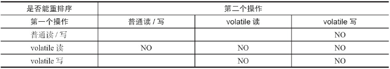

第三行最后一个单元格的意思是：在程序中，当第一个操作为普通变量的读或写时，如果第二个操作为volatile写，则编译器不能重排序这两个操作。

-   当第二个操作是volatile写时，不管第一个操作是什么，都不能重排序。这个规则确保volatile写之前的操作不会被编译器重排序到volatile写之后。
-   当第一个操作是volatile读时，不管第二个操作是什么，都不能重排序。这个规则确保volatile读之后的操作不会被编译器重排序到volatile读之前。
-   当第一个操作是volatile写，第二个操作是volatile读时，不能重排序。

为了实现volatile的内存语义，编译器在生成字节码时，会在指令序列中插入内存屏障来禁止特定类型的处理器重排序。对于编译器来说，发现一个最优布置来最小化插入屏障的总数几乎不可能。为此，JMM采取保守策略。下面是基于保守策略的JMM内存屏障插入策略。

-   在每个volatile写操作的前面插入一个StoreStore屏障。
-   在每个volatile写操作的后面插入一个StoreLoad屏障。
-   在每个volatile读操作的后面插入一个LoadLoad屏障。
-   在每个volatile读操作的后面插入一个LoadStore屏障。

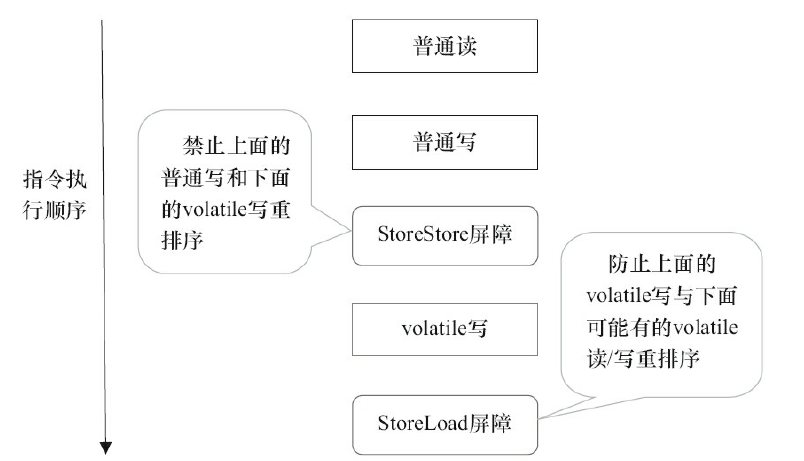

StoreStore屏障可以保证在volatile写之前，其前面的所有普通写操作已经对任意处理器可见了。这是因为StoreStore屏障将保障上面所有的普通写在volatile写之前刷新到主内存。

volatile写后面的StoreLoad屏障。此屏障的作用是避免volatile写与后面可能有的volatile读/写操作重排序

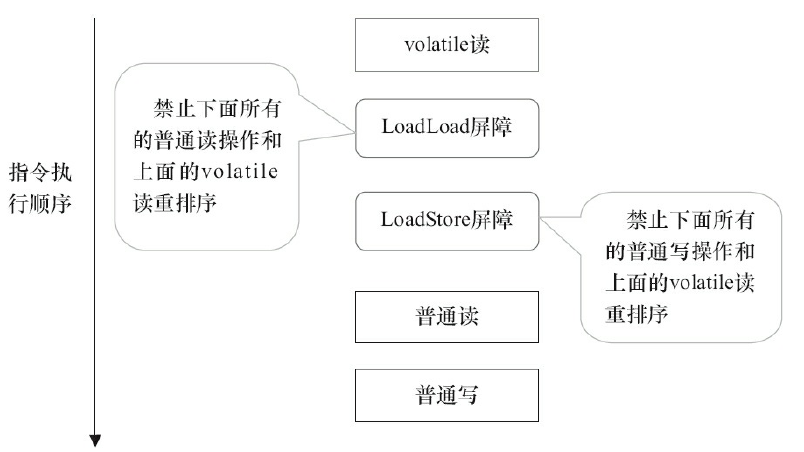

### 锁的内存语义

#### 锁的释放-获取建立的happens-before关系

锁是Java并发编程中最重要的同步机制。锁除了让临界区互斥执行外，还可以让释放锁的线程向获取同一个锁的线程发送消息。

### final 域的内存语义

#### final域的重排序规则

对于final域，编译器和处理器要遵守两个重排序规则。

1.  在构造函数内对一个final域的写入，与随后把这个被构造对象的引用赋值给一个引用变量，这两个操作之间不能重排序。
2.  初次读一个包含final域的对象的引用，与随后初次读这个final域，这两个操作之间不能重排序。

## Java并发编程基础

### 线程简介

#### 什么是线程

现代操作系统调度的最小单元是线程，也叫轻量级进程（Light Weight Process），在一个进程里可以创建多个线程，这些线程都拥有各自的计数器、堆栈和局部变量等属性，并且能够访问共享的内存变量。处理器在这些线程上高速切换，让使用者感觉到这些线程在同时执行。

#### 为什么要使用多线程

-   更多的处理器核心
-   更快的响应时间
-   更好的编程模型

#### 线程优先级

在Java线程中，通过一个整型成员变量priority来控制优先级，优先级的范围从1~10，在线程构建的时候可以通过setPriority(int)方法来修改优先级，默认优先级是5，优先级高的线程分配时间片的数量要多于优先级低的线程。设置线程优先级时，针对频繁阻塞（休眠或者I/O操作）的线程需要设置较高优先级，而偏重计算（需要较多CPU时间或者偏运算）的线程则设置较低的优先级，确保处理器不会被独占。在不同的JVM以及操作系统上，线程规划会存在差异，有些操作系统甚至会忽略对线程优先级的设定，**程序正确性不能依赖线程的优先级高低**

#### 线程的状态

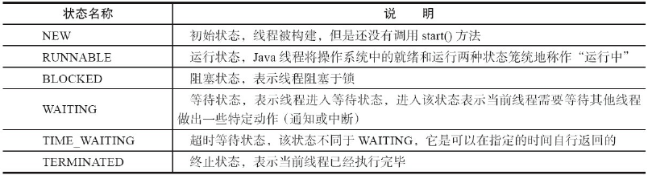

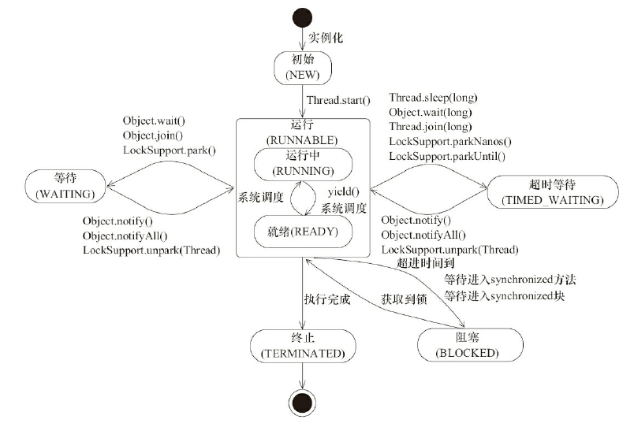

#### daemon 线程

Daemon线程是一种支持型线程，因为它主要被用作程序中后台调度以及支持性工作。这意味着，当一个Java虚拟机中不存在非Daemon线程的时候，Java虚拟机将会退出。可以通过调用Thread.setDaemon(true)将线程设置为Daemon线程。

Daemon属性需要在启动线程之前设置，不能在启动线程之后设置。

在构建Daemon线程时，不能依靠finally块中的内容来确保执行关闭或清理资源的逻辑。

### 启动和终止线程

#### 构造线程

在运行线程之前首先要构造一个线程对象，线程对象在构造的时候需要提供线程所需要的属性，如线程所属的线程组、线程优先级、是否是Daemon线程等信息

#### 启动线程

线程对象在初始化完成之后，调用start()方法就可以启动这个线程。线程start()方法的含义是：当前线程（即parent线程）同步告知Java虚拟机，只要线程规划器空闲，应立即启动调用start()方法的线程。

#### 理解中断

中断可以理解为线程的一个标识位属性，它表示一个运行中的线程是否被其他线程进行了中断操作。中断好比其他线程对该线程打了个招呼，其他线程通过调用该线程的interrupt()方法对其进行中断操作。

线程通过检查自身是否被中断来进行响应，线程通过方法isInterrupted()来进行判断是否被中断，也可以调用静态方法Thread.interrupted()对当前线程的中断标识位进行复位。如果该线程已经处于终结状态，即使该线程被中断过，在调用该线程对象的isInterrupted()时依旧会返回false。

#### 过期的suspend()、resume()和stop()

不建议使用的原因主要有：以suspend()方法为例，在调用后，线程不会释放已经占有的资源（比如锁），而是占有着资源进入睡眠状态，这样容易引发死锁问题。同样，stop()方法在终结一个线程时不会保证线程的资源正常释放，通常是没有给予线程完成资源释放工作的机会，因此会导致程序可能工作在不确定状态下。

#### 安全地终止线程

中断状态是线程的一个标识位，而中断操作是一种简便的线程间交互方式，而这种交互方式最适合用来取消或停止任务。除了中断以外，还可以利用一个boolean变量来控制是否需要停止任务并终止该线程。

### 线程间通信

#### volatile 和 synchronized 关键字

Java支持多个线程同时访问一个对象或者对象的成员变量，由于每个线程可以拥有这个变量的拷贝（虽然对象以及成员变量分配的内存是在共享内存中的，但是每个执行的线程还是可以拥有一份拷贝，这样做的目的是加速程序的执行，这是现代多核处理器的一个显著特性），所以程序在执行过程中，一个线程看到的变量并不一定是最新的。

关键字volatile可以用来修饰字段（成员变量），就是告知程序任何对该变量的访问均需要从共享内存中获取，而对它的改变必须同步刷新回共享内存，它能保证所有线程对变量访问的可见性。

关键字synchronized可以修饰方法或者以同步块的形式来进行使用，它主要确保多个线程在同一个时刻，只能有一个线程处于方法或者同步块中，它保证了线程对变量访问的可见性和排他性。

#### 等待/通知机制

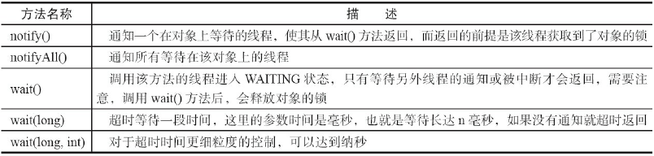

-   使用wait()、notify()和notifyAll()时需要先对调用对象加锁。
-   调用wait()方法后，线程状态由RUNNING变为WAITING，并将当前线程放置到对象的等待队列。
-   notify()或notifyAll()方法调用后，等待线程依旧不会从wait()返回，需要调用notify()或notifAll()的线程释放锁之后，等待线程才有机会从wait()返回。
-   notify()方法将等待队列中的一个等待线程从等待队列中移到同步队列中，而notifyAll()方法则是将等待队列中所有的线程全部移到同步队列，被移动的线程状态由WAITING变为BLOCKED。
-   从wait()方法返回的前提是获得了调用对象的锁。

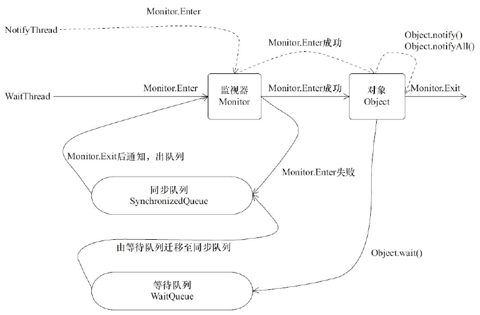

#### 等待/通知的经典范式

该范式分为两部分，分别针对等待方（消费者）和通知方（生产者）。

等待方遵循如下原则。

1.  获取对象的锁。
2.  如果条件不满足，那么调用对象的wait()方法，被通知后仍要检查条件。
3.  条件满足则执行对应的逻辑

通知方遵循如下原则。

1.  获得对象的锁。
2.  改变条件。
3.  通知所有等待在对象上的线程。

#### 管道输入/输出流

管道输入/输出流和普通的文件输入/输出流或者网络输入/输出流不同之处在于，它主要用于线程之间的数据传输，而传输的媒介为内存。

管道输入/输出流主要包括了如下4种具体实现：PipedOutputStream、PipedInputStream、PipedReader和PipedWriter，前两种面向字节，而后两种面向字符。