# 深入理解JVM

## 第一部分、走进Java

1.  JDK 和 JRE

    JDK: Java程序设计语言、Java虚拟机、Java类库

    JRE: Java类库API中的Java SE API 的子集和Java虚拟机

## 第二部分、自动内存管理

### 运行时数据区域

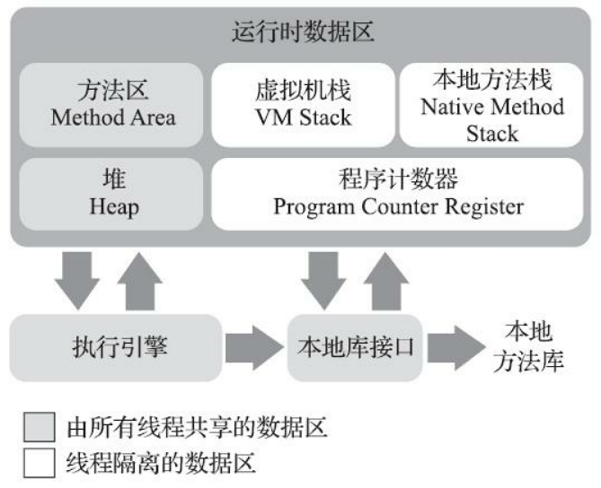

#### 程序计数器

程序计数器（Program Counter Register）是一块较小的内存空间，它可以看作是当前线程所执行的字节码的行号指示器

在Java虚拟机的概念模型里，字节码解释器工作时就是通过改变这个计数器的值来选取下一条需要执行的字节码指令，它是程序控制流的指示器

#### Java虚拟机栈

虚拟机栈描述的是Java方法执行的线程内存模型：每个方法被执行的时候，Java虚拟机都会同步创建一个栈帧（Stack Frame）用于存储局部变量表、操作数栈、动态连接、方法出口等信息。每一个方法被调用直至执行完毕的过程，就对应着一个栈帧在虚拟机栈中从入栈到出栈的过程

如果线程请求的栈深度大于虚拟机所允许的深度，将抛出StackOverflowError异常

#### 本地方法栈

本地方法栈（Native Method Stacks）与虚拟机栈所发挥的作用是非常相似的，其区别只是虚拟机栈为虚拟机执行Java方法（也就是字节码）服务，而本地方法栈则是为虚拟机使用到的本地（Native）方法服务。

#### Java 堆

Java堆是被所有线程共享的一块内存区域，在虚拟机启动时创建。此内存区域的唯一目的就是存放对象实例。Java堆是垃圾收集器管理的内存区域

如果在Java堆中没有内存完成实例分配，并且堆也无法再扩展时，Java虚拟机将会抛出OutOfMemoryError异常。

#### 方法区

方法区（Method Area）与Java堆一样，是各个线程共享的内存区域，它用于存储已被虚拟机加载的类型信息、常量、静态变量、即时编译器编译后的代码缓存等数据

根据《Java虚拟机规范》的规定，如果方法区无法满足新的内存分配需求时，将抛出OutOfMemoryError异常

#### 运行时常量池

运行时常量池（Runtime Constant Pool）是方法区的一部分。Class文件中除了有类的版本、字段、方法、接口等描述信息外，还有一项信息是常量池表（Constant Pool Table），用于存放编译期生成的各种字面量与符号引用，这部分内容将在类加载后存放到方法区的运行时常量池中。

#### 直接内存

直接内存（Direct Memory）并不是虚拟机运行时数据区的一部分，也不是《Java虚拟机规范》中定义的内存区域。但是这部分内存也被频繁地使用，而且也可能导致OutOfMemoryError异常出现

在JDK 1.4中新加入了NIO（New Input/Output）类，引入了一种基于通道（Channel）与缓冲区（Buffer）的I/O方式，它可以使用Native函数库直接分配堆外内存，然后通过一个存储在Java堆里面的DirectByteBuffer对象作为这块内存的引用进行操作

本机直接内存的分配不会受到Java堆大小的限制，但是，既然是内存，则肯定还是会受到本机总内存（包括物理内存、SWAP分区或者分页文件）大小以及处理器寻址空间的限制，一般服务器管理员配置虚拟机参数时，会根据实际内存去设置-Xmx等参数信息，但经常忽略掉直接内存，使得各个内存区域总和大于物理内存限制（包括物理的和操作系统级的限制），从而导致动态扩展时出现OutOfMemoryError异常。

### 垃圾收集器与内存分配策略

#### Java 判断对象是否生存

##### 引用计数法算法

在对象中添加一个引用计数器，每当有一个地方引用它时，计数器值就加一；当引用失效时，计数器值就减一；任何时刻计数器为零的对象就是不可能再被使用的

缺点：循环引用回收不了

##### 可达性分析算法

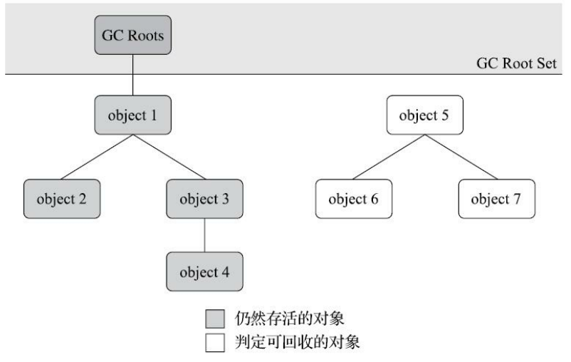

通过一系列称为“GC Roots”的根对象作为起始节点集，从这些节点开始，根据引用关系向下搜索，搜索过程所走过的路径称为“引用链”（Reference Chain），如果某个对象到GC Roots间没有任何引用链相连，或者用图论的话来说就是从GC Roots到这个对象不可达时，则证明此对象是不可能再被使用的

Java 中大多数主流虚拟机就是使用可达性分析算法：

```java
/**
 * VM Args: -XX:+PrintGCDetails
 */
public class ReferenceCountingGC {

    public Object instance = null;
    private static final int _1MB = 1024 * 1024;
    // 占用内存
    private byte[] bigSize = new byte[2 * _1MB];

    public static void main(String[] args) {
        ReferenceCountingGC referenceCountingGC = new ReferenceCountingGC();
        ReferenceCountingGC referenceCountingGC1 = new ReferenceCountingGC();
        referenceCountingGC.instance = referenceCountingGC1;
        referenceCountingGC1.instance = referenceCountingGC;

        referenceCountingGC = null;
        referenceCountingGC1 = null;

        System.gc();
    }
}
```

```c
[GC (System.gc()) [PSYoungGen: 9351K->744K(76288K)] 9351K->752K(251392K), 0.0009492 secs] [Times: user=0.00 sys=0.00, real=0.00 secs] 
[Full GC (System.gc()) [PSYoungGen: 744K->0K(76288K)] [ParOldGen: 8K->624K(175104K)] 752K->624K(251392K), [Metaspace: 3224K->3224K(1056768K)], 0.0037176 secs] [Times: user=0.00 sys=0.00, real=0.00 secs] 
Heap
 PSYoungGen      total 76288K, used 655K [0x000000076b200000, 0x0000000770700000, 0x00000007c0000000)
  eden space 65536K, 1% used [0x000000076b200000,0x000000076b2a3ee8,0x000000076f200000)
  from space 10752K, 0% used [0x000000076f200000,0x000000076f200000,0x000000076fc80000)
  to   space 10752K, 0% used [0x000000076fc80000,0x000000076fc80000,0x0000000770700000)
 ParOldGen       total 175104K, used 624K [0x00000006c1600000, 0x00000006cc100000, 0x000000076b200000)
  object space 175104K, 0% used [0x00000006c1600000,0x00000006c169c1d8,0x00000006cc100000)
 Metaspace       used 3231K, capacity 4496K, committed 4864K, reserved 1056768K
  class space    used 350K, capacity 388K, committed 512K, reserved 1048576K

Process finished with exit code 0
```

在Java技术体系里面，固定可作为GC Roots的对象包括以下几种：

-   在虚拟机栈（栈帧中的本地变量表）中引用的对象，譬如各个线程被调用的方法堆栈中使用到的参数、局部变量、临时变量等。
-   在方法区中类静态属性引用的对象，譬如Java类的引用类型静态变量。
-   在方法区中常量引用的对象，譬如字符串常量池（String Table）里的引用。
-   在本地方法栈中JNI（即通常所说的Native方法）引用的对象。
-   Java虚拟机内部的引用，如基本数据类型对应的Class对象，一些常驻的异常对象（比如NullPointExcepiton、OutOfMemoryError）等，还有系统类加载器。
-   所有被同步锁（synchronized关键字）持有的对象。
-   反映Java虚拟机内部情况的JMXBean、JVMTI中注册的回调、本地代码缓存等。

#### 垃圾收集算法

##### 标记-清除算法

算法分为“标记”和“清除”两个阶段：首先标记出所有需要回收的对象，在标记完成后，统一回收掉所有被标记的对象，也可以反过来，标记存活的对象，统一回收所有未被标记的对象

缺点：

-   执行效率不稳定，如果Java堆中包含大量对象，而且其中大部分是需要被回收的，这时必须进行大量标记和清除的动作，导致标记和清除两个过程的执行效率都随对象数量增长而降低
-   内存空间的碎片化问题，标记、清除之后会产生大量不连续的内存碎片，空间碎片太多可能会导致当以后在程序运行过程中需要分配较大对象时无法找到足够的连续内存而不得不提前触发另一次垃圾收集动作

##### 标记-复制算法

它将可用内存按容量划分为大小相等的两块，每次只使用其中的一块。当这一块的内存用完了，就将还存活着的对象复制到另外一块上面，然后再把已使用过的内存空间一次清理掉。

如果内存中多数对象都是存活的，这种算法将会产生大量的内存间复制的开销，但对于多数对象都是可回收的情况，算法需要复制的就是占少数的存活对象，而且每次都是针对整个半区进行内存回收，分配内存时也就不用考虑有空间碎片的复杂情况，只要移动堆顶指针，按顺序分配即可。这样实现简单，运行高效

缺点：

-   复制回收算法的代价是将可用内存缩小为了原来的一半，空间浪费过多
-   对象存活率较高时就要进行较多的复制操作，效率将会降低

**Appel式回收**

新生代分为一块较大的Eden空间和两块较小的Survivor空间，每次分配内存只使用Eden和其中一块Survivor。发生垃圾搜集时，将Eden和Survivor中仍然存活的对象一次性复制到另外一块Survivor空间上，然后直接清理掉Eden和已用过的那块Survivor空间。

HotSpot虚拟机默认Eden和Survivor的大小比例是8∶1

任何人都没有办法百分百保证每次回收都只有不多于10%的对象存活，因此Appel式回收还有一个充当罕见情况的“逃生门”的安全设计，当Survivor空间不足以容纳一次Minor GC之后存活的对象时，就需要依赖其他内存区域（实际上大多就是老年代）进行分配担保（Handle Promotion）。

缺点：

-   需要有额外的空间进行分配担保，以应对被使用的内存中所有对象都100%存活的极端情况

##### 标记-整理算法

针对老年代对象的存亡特征，由Edward Lueders提出了另外一种有针对性的“标记-整理”算法，其中的标记过程仍然与“标记-清除”算法一样，但后续步骤不是直接对可回收对象进行清理，而是让所有存活的对象都向内存空间一端移动，然后直接清理掉边界以外的内存

缺点：

-   在老年代这种每次回收都有大量对象存活区域，移动存活对象并更新所有引用这些对象的地方将会是一种极为负重的操作，而且这种对象移动操作必须全程暂停用户应用程序才能进行

#### 经典垃圾收集器

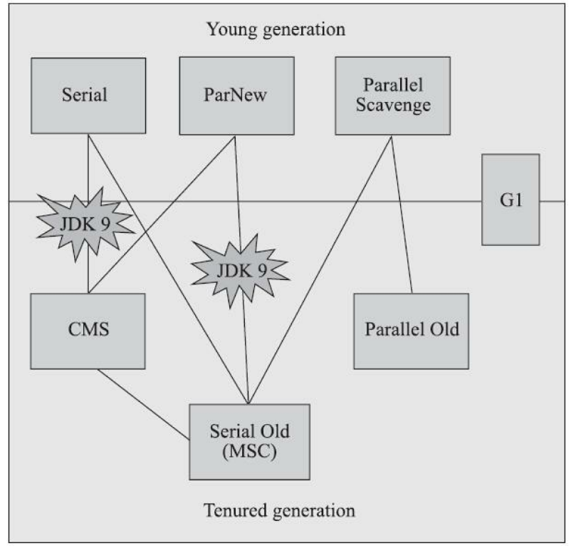

##### Serial 收集器

这个收集器是一个单线程工作的收集器，但它的“单线程”的意义并不仅仅是说明它只会使用一个处理器或一条收集线程去完成垃圾收集工作，更重要的是强调在它进行垃圾收集时，必须暂停其他所有工作线程，直到它收集结束

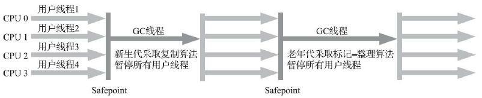

它是HotSpot虚拟机运行在客户端模式下的默认新生代收集器，有着优于其他收集器的地方，那就是简单而高效（与其他收集器的单线程相比），对于内存资源受限的环境，它是所有收集器里额外内存消耗（Memory Footprint）最小的；对于单核处理器或处理器核心数较少的环境来说，Serial收集器由于没有线程交互的开销，专心做垃圾收集自然可以获得最高的单线程收集效率。在用户桌面的应用场景以及近年来流行的部分微服务应用中，分配给虚拟机管理的内存一般来说并不会特别大，收集几十兆甚至一两百兆的新生代（仅仅是指新生代使用的内存，桌面应用甚少超过这个容量），垃圾收集的停顿时间完全可以控制在十几、几十毫秒，最多一百多毫秒以内，只要不是频繁发生收集，这点停顿时间对许多用户来说是完全可以接受的

##### ParNew 收集器

ParNew收集器实质上是Serial收集器的多线程并行版本，除了同时使用多条线程进行垃圾收集之外，其余的行为都与Serial收集器完全一致

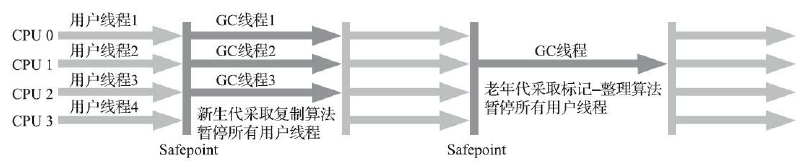

除了Serial收集器外，目前只有它能与CMS收集器配合工作。

##### Parallel Scavenge 收集器

Parallel Scavenge收集器是一款新生代收集器，基于标记-复制算法实现的收集器，能够并行收集的多线程收集器

Parallel Scavenge收集器的目标是达到一个可控制的吞吐量（Throughput），也经常被称作“吞吐量优先收集器”


高吞吐量则可以最高效率地利用处理器资源，尽快完成程序的运算任务，主要适合在后台运算而不需要太多交互的分析任务

Parallel Scavenge收集器的几个重要参数：

-   -XX：MaxGCPauseMillis：控制最大垃圾收集停顿时间，该参数允许的值是一个大于0的毫秒数，收集器将尽力保证内存回收花费的时间不超过用户设定值。
-   -XX：GCTimeRatio：直接设置吞吐量大小，该参数的值则应当是一个大于0小于100的整数，也就是垃圾收集时间占总时间的比率，相当于吞吐量的倒数。默认值为99，即允许最大1%（即1/(1+99)）的垃圾收集时间。
-   -XX：+UseAdaptiveSizePolicy：自适应的调节策略，当这个参数被激活之后，就不需要人工指定新生代的大小（-Xmn）、Eden与Survivor区的比例（-XX：SurvivorRatio）、晋升老年代对象大小（-XX：PretenureSizeThreshold）等细节参数了，虚拟机会根据当前系统的运行情况收集性能监控信息，动态调整这些参数以提供最合适的停顿时间或者最大的吞吐量

##### Serial Old 收集器

Serial Old是Serial收集器的老年代版本，它是一个单线程收集器，使用标记-整理算法。这个收集器的主要意义也是供客户端模式下的HotSpot虚拟机使用。如果在服务端模式下，它可能有两种用途：一种是在JDK 5以及之前的版本中与Parallel Scavenge收集器搭配使用，另外一种就是作为CMS收集器发生失败时的后备预案，在并发收集发生Concurrent Mode Failure时使用

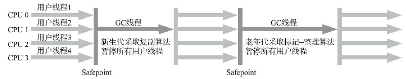

##### Parallel Old 收集器

Parallel Old是Parallel Scavenge收集器的老年代版本，支持多线程并发收集，基于标记-整理算法实现，这个收集器是直到JDK 6时才开始提供的

在注重吞吐量或者处理器资源较为稀缺的场合，都可以优先考虑Parallel Scavenge加Parallel Old收集器这个组合

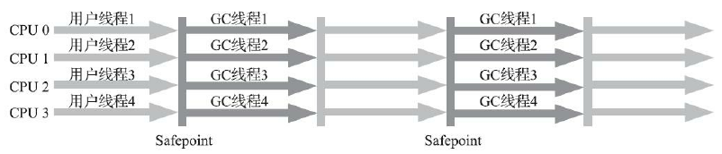

##### CMS 收集器

CMS（Concurrent Mark Sweep）收集器是一种以获取最短回收停顿时间为目标的收集器，适用于互联网网站或者基于浏览器的B/S系统的服务端上。

CMS收集器是基于标记-清除算法实现的，它的运作过程分为四个步骤：
1）初始标记（CMS initial mark）
2）并发标记（CMS concurrent mark）
3）重新标记（CMS remark）
4）并发清除（CMS concurrent sweep）

其中初始标记、重新标记这两个步骤仍然需要暂停用户线程，但耗时不长

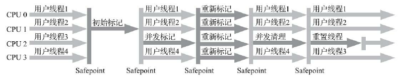

优点：并发收集，低停顿

缺点：

-   CMS收集器对处理器资源非常敏感，会因为占用了一部分线程（或者说处理器的计算能力）而导致应用程序变慢，降低总吞吐量。CMS默认启动的回收线程数是（处理器核心数量+3）/4
-   CMS收集器无法处理“浮动垃圾”（Floating Garbage），有可能出现“Concurrent Mode Failure”失败进而导致另一次完全“Stop The World”的Full GC的产生。
    -   浮动垃圾：在CMS的并发标记和并发清理阶段，用户线程是还在继续运行的，程序在运行自然就还会伴随有新的垃圾对象不断产生，但这一部分垃圾对象是出现在标记过程结束以后，CMS无法在当次收集中处理掉它们，只好留待下一次垃圾收集时再清理掉。
    -   -XX：CMSInitiatingOccupancyFraction：该参数的值可来提高CMS的触发百分比，降低内存回收频率，获取更好的性能。在JDK5的默认设置下，CMS收集器当老年代使用了68%的空间后就会被激活，到了JDK 6时，CMS收集器的启动阈值就已经默认提升至92%，但这又会更容易面临另一种风险：要是CMS运行期间预留的内存无法满足程序分配新对象的需要，就会出现一次“并发失败”（Concurrent Mode Failure），这时候虚拟机将不得不启动后备预案：冻结用户线程的执行，临时启用Serial Old收集器来重新进行老年代的垃圾收集，但这样停顿时间就很长了
-   CMS是一款基于“标记-清除”算法实现的收集器，收集结束时会有大量空间碎片产生
    -   -XX：+UseCMSCompactAtFullCollection(Java9 已废弃)，该参数用于在CMS收集器不得不进行Full GC时开启内存碎片的合并整理过程，需移动存活对象，所以会停顿。
    -   -XX：CMSFullGCsBeforeCompaction(Java 9 已废弃)，该参数的作用是要求CMS收集器在执行过若干次（数量由参数值决定）不整理空间的Full GC之后，下一次进入Full GC前会先进行碎片整理（默认值为0，表示每次进入Full GC时都进行碎片整理）

#####  Garbage First 收集器

Garbage First（简称G1）收集器是垃圾收集器技术发展历史上的里程碑式的成果，它开创了收集器面向局部收集的设计思路和基于Region的内存布局形式。

G1是一款主要面向服务端应用的垃圾收集器，在多 CPU 和大内存的场景下有很好的性能。HotSpot开发团队最初赋予它的期望是（在比较长期的）未来可以替换掉JDK 5中发布的CMS收集器

Mixed GC模式：G1可以面向堆内存任何部分来组成回收集（Collection Set，一般简称CSet）进行回收，衡量标准不再是它属于哪个分代，而是哪块内存中存放的垃圾数量最多，回收收益最大

Region：G1不再坚持固定大小以及固定数量的分代区域划分，而是把连续的Java堆划分为多个大小相等的独立区域（Region），每一个Region都可以根据需要，扮演新生代的Eden空间、Survivor空间，或者老年代空间。收集器能够对扮演不同角色的Region采用不同的策略去处理。

Region中还有一类特殊的Humongous区域，专门用来存储大对象。G1认为只要大小超过了一个Region容量一半的对象即可判定为大对象，对于那些超过了整个Region容量的超级大对象，将会被存放在N个连续的Humongous Region之中，G1的大多数行为都把Humongous Region作为老年代的一部分来进行看待

-   -XX：G1HeapRegionSize ，该参数可以设置每个Region的大小，取值范围为1MB～32MB，且应为2的N次幂

G1仍然保留新生代和老年代的概念，但新生代和老年代不再是固定的了，它们都是一系列区域（不需要连续）的动态集合。

G1收集器之所以能建立可预测的停顿时间模型，是因为它将Region作为单次回收的最小单元，即每次收集到的内存空间都是Region大小的整数倍，这样可以有计划地避免在整个Java堆中进行全区域的垃圾收集

-   -XX：MaxGCPauseMillis，该参数是设定允许的收集停顿时间，默认200毫秒

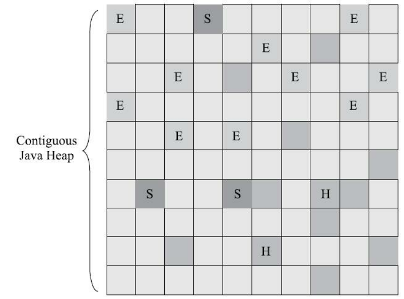

如果不去计算用户线程运行过程中的动作（如使用写屏障维护记忆集的操作），G1收集器的运作过程大致可划分为以下四个步骤：

-   初始标记：仅仅只是标记一下GC Roots能直接关联到的对象，并且修改TAMS指针的值，让下一阶段用户线程并发运行时，能正确地在可用的Region中分配新对象。这个阶段需要停顿线程，但耗时很短，而且是借用进行Minor GC的时候同步完成的，所以G1收集器在这个阶段实际并没有额外的停顿
-   并发标记：从GC Root开始对堆中对象进行可达性分析，递归扫描整个堆里的对象图，找出要回收的对象，这阶段耗时较长，但可与用户程序并发执行。当对象图扫描完成以后，还要重新处理SATB记录下的在并发时有引用变动的对象。
-   最终标记：对用户线程做另一个短暂的暂停，用于处理并发阶段结束后仍遗留下来的最后那少量的SATB记录。
-   筛选回收：负责更新Region的统计数据，对各个Region的回收价值和成本进行排序，根据用户所期望的停顿时间来制定回收计划，可以自由选择任意多个Region构成回收集，然后把决定回收的那一部分Region的存活对象复制到空的Region中，再清理掉整个旧Region的全部空间。这里的操作涉及存活对象的移动，是必须暂停用户线程，由多条收集器线程并行完成的。

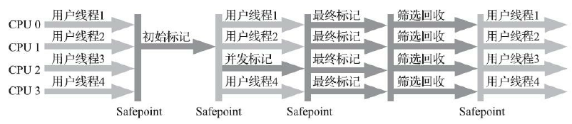

##### 垃圾收集器参数总结

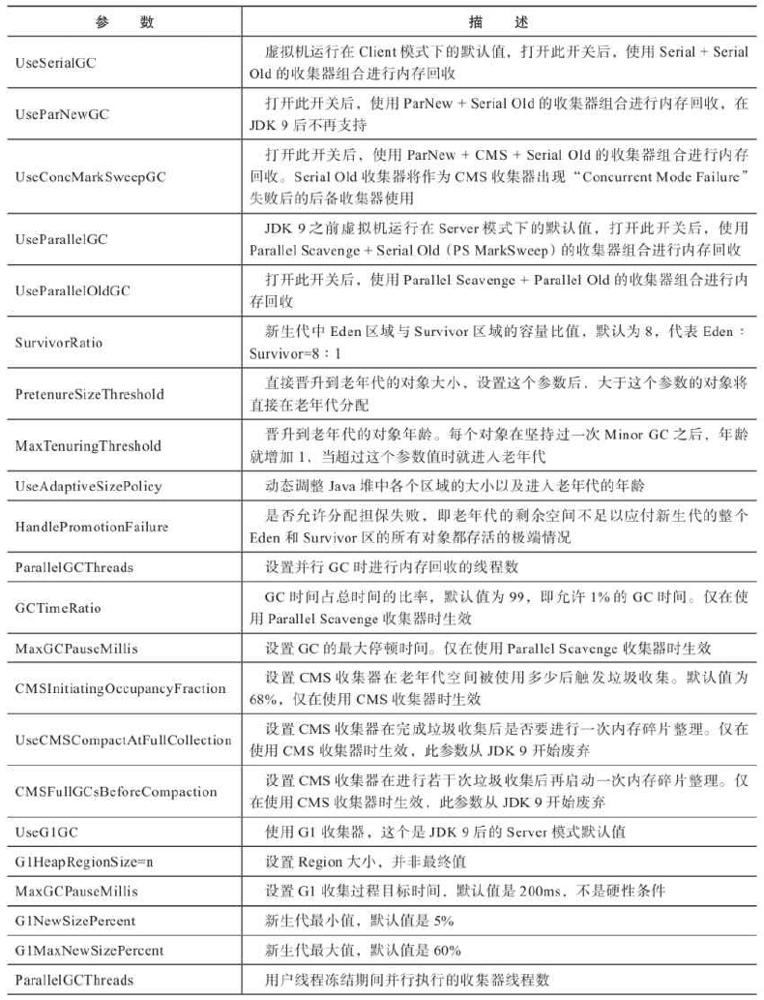

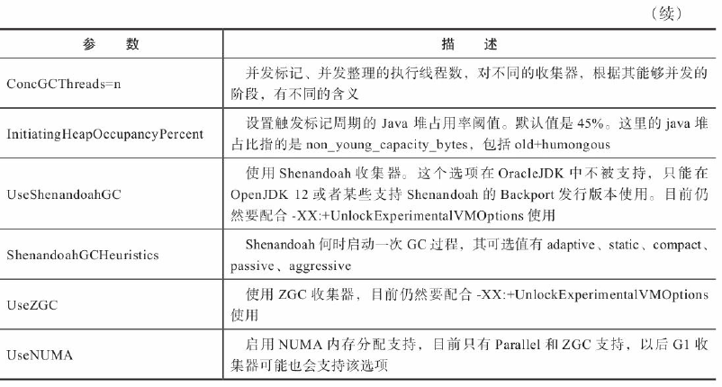

##### 虚拟机及垃圾收集器日志

-   查看GC基本信息，在JDK 9之前使用-XX：+PrintGC，JDK 9后使用-Xlog：gc
-   查看GC详细信息，在JDK 9之前使用-XX：+PrintGCDetails，在JDK 9之后使用-X-log：gc*
-   查看GC前后的堆、方法区可用容量变化，在JDK 9之前使用-XX：+PrintHeapAtGC，JDK 9之后使用-Xlog：gc+heap=debug
-   查看GC过程中用户线程并发时间以及停顿的时间，在JDK 9之前使用-XX：+PrintGCApplicationConcurrentTime以及-XX：+PrintGCApplicationStoppedTime，JDK 9之后使用-Xlog：
    safepoint
-   查看收集器Ergonomics机制（自动设置堆空间各分代区域大小、收集目标等内容，从Parallel收集器开始支持）自动调节的相关信息。在JDK 9之前使用-XX：+PrintAdaptiveSizePolicy，JDK 9之后使用-Xlog：gc+ergo*=trace
-   查看熬过收集后剩余对象的年龄分布信息，在JDK 9前使用-XX：+PrintTenuring-Distribution，JDK 9之后使用-Xlog：gc+age=trace