# 计算机与网络

## 第一章、 概述

### 1. 计算机网络的定义

1. 定义：计算机网络主要是由一些通用的、可编程的硬件互连而成的，而这些硬件并非专门用来实现某一特定目的（例如，传送数据或视频信号）。这些可编程的硬件能够用来传送多种不同类型的数据，并能支持广泛的和日益增长的应用。

### 2. 几种不同类别的网络

#### 1. 从网络的作用范围来分类

- 广域网：作用范围几十——几千公里
- 局域网：5-50公里
- 城域网：1公里左右
- 个人局域网：10米左右
- 若中央处理机之间的距离非常近（如仅1米的数量级甚至更小些），则一般就称之为多处理机系统，而不称它为计算机网络。 

#### 2. 从网络使用者进行分类

- 公用网：按规定交纳费用的人都可以使用的网络。因此也可称为公众网。
- 专用网：为特殊业务工作的需要而建造的网络
- 公用网和专用网都可以传送多种业务。如传送的是计算机数据，则分别是公用计算机网络和专用计算机网络

#### 3. 用来把用户接入到互联网的网络

- 接入网 AN (Access Network)，它又称为本地接入网或居民接入网。
- 接入网是一类比较特殊的计算机网络，用于将用户接入互联网。
- 接入网本身既不属于互联网的核心，也不属于互联网的边缘部分
- 接入网是从某个端系统到另一个端系统的路径中，由这个端系统到第一个路由器（也称为边缘路由器）之间的一些物理链路所组成的。
- 从覆盖范围上来看，很多接入网还是属于局域网
- 从作用上来看，接入网只是起到让用户能够与互联网连接的桥梁的作用

### 3.计算机网络的性能

#### 1. 计算机网络的性能指标

1. 速率：数据的传送速率，它也称为数据率 (data rate)或比特率 (bit rate)。单位是 bit/s，或 kbit/s、Mbit/s、 Gbit/s 等。例如4*10^10 bit/s 的数据率就记为 40 Gbit/s。

2. 带宽：表示网络中某通道传送数据的能力。表示在单位时间内网络中的某信道所能通过的“最高数据率”。单位是 bit/s ，即 “比特每秒”

3. 吞吐量：单位时间内，通过某个网络的数据量

4. 时延：指数据从网络的一端传送到另一端所需要的时间

   - 发送时延：也称为传输时延，发送数据时，数据帧从结点进入到传输媒体所需要的时间。

     

   - 传播时延：电磁波在信道中需要传播一定的距离而花费的时间

     

   - 处理时延：主机或路由器在收到分组时，为处理分组（例如分析首部、提取数据、差错检验或查找路由）所花费的时间。 

   - 排队时延：分组在路由器输入输出队列中排队等待处理所经历的时延。

   - 总时延：发送时延、传播时延、处理时延和排队时延之和。

5. 时延带宽积：链路的时延带宽积又称为以比特为单位的链路长度。 

   

6. 往返时间RTT：往返时间表示从发送方发送数据开始，到发送方收到来自接收方的确认，总共经历的时间。

#### 2. 计算机网络的非性能指标

- 费用
- 质量
- 标准化
- 可靠性
- 可扩展性和可升级性 
- 易于管理和维护 

### 4.  计算机网络的体系结构

## 第二章、 物理层

### 1. 物理层的基本概念

1. 物理层的作用：尽可能屏蔽掉传输媒体和通信手段的差异，使物理层上面的链路层感觉不到这些差异。
2. 物理层的协议也经常被称为物理层规程。
3. 将物理层的主要任务描述为确定与传输媒体的接口有关的一些特性：
   - 机械特性： 指明接口所用的接线器的形状和尺寸、引脚数目和排列、固定和锁定装置等
   - 电气特性： 指明在接口电缆的各条线上出现的电压的范围
   - 功能特性： 指明某条线上出现的某一电平的电压的意义
   - 过程特性： 指明对于不同功能的各种可能事件的出现顺序

### 2. 数据通信的基础知识

#### 2.1 数据通信系统的模型

1. 一个数据通信系统可划分为三大部分，即**源系统**（发送端，发送方）、**传输系统**（或传输网络）和**目的系统**（接收端，接收方）
2. 源系统一般包括：源点和发送器
3. 目的系统一般包括：接收器和终点
4. 信号：
   - 模拟信号： （连续信号）代表消息的参数的取值是连续的
   - 数字信号： （离散信号）代表消息的参数的取值是离散的

#### 2.2 有关信道的几个基本概念

1. 单向通信： （单工通信）只能有一个方向的通信而没有反方向的交互

2. 双向交替通信： （半双工通信）通信的双方都可以发送消息，但不能双方同时发送（或接受）消息

3. 双向同时通信： （全双工通信）通信的双方可以同时发送和接收消息

4. 基带信号： （即基本频带信号）来自信源的信号。像计算机输出的代表各种文字或图像文件的数据信号都属于基带信号。

5. 基带调制： 仅对基带信号的波形进行变换，使它能够与信道特性相适应。变换后的信号仍然是基带信号。把这种过程称为编码 (coding)。

6. 带通调制： 使用载波 (carrier)进行调制，把基带信号的频率范围搬移到较高的频段，并转换为模拟信号，这样就能够更好地在模拟信道中传输（即仅在一段频率范围内能够通过信道） 。

7. 带通信号 ： 经过载波调制后的信号。

8. 常见的编码格式： 

   - 不归零制：正电平代表 1，负电平代表 0。
   - 归零制：正脉冲代表 1，负脉冲代表 0。
   - 曼彻斯特编码：位周期中心的向上跳变代表 0，位周期中心的向下跳变代表 1。但也可反过来定义。
   - 差分曼彻斯特编码：在每一位的中心处始终都有跳变。位开始边界有跳变代表 0，而位开始边界没有跳变代表 1。

   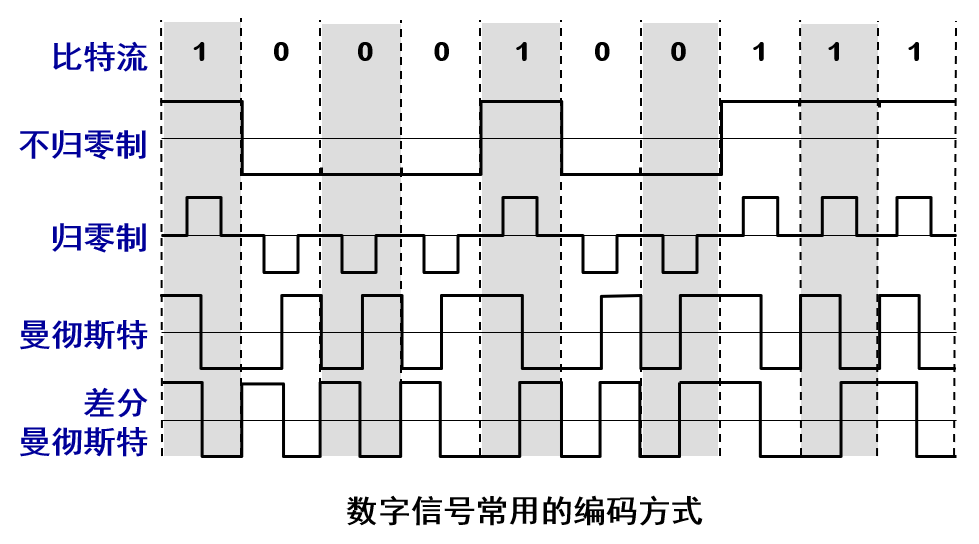

#### 2.3 信道的极限容量

1. 任何实际的信道都不是理想的，在传输信号时会产生各种失真以及带来多种干扰。 
2. 码元传输的速率越高，或信号传输的距离越远，或传输媒体质量越差，在信道的输出端的波形的失真就越严重。 
3. 限制码元在信道上的传输速率的因素
   - 信道能够通过的频率范围： 在任何信道中，码元传输的速率是有上限的，否则就会出现码间串扰的问题，使接收端对码元的判决（即识别）成为不可能。
   - 信噪比： 信号的平均功率和噪声的平均功率之比。
   - - 信噪比(dB) = 10 log10(S/N)    (dB) 
   - 香农公式：C = W*log2(1+S/N)  (bit/s)   W:Hz   

### 3. 物理层下面的传输媒体

#### 3.1 导引型传输媒体

##### 3.1.1 双绞线

1. 最常用的传输媒体。
2. 模拟传输和数字传输都可以使用双绞线，其通信距离一般为几到十几公里。
3. 屏蔽双绞线 STP (Shielded Twisted Pair)
   - 带金属屏蔽层
4. 无屏蔽双绞线 UTP (Unshielded Twisted Pair) 

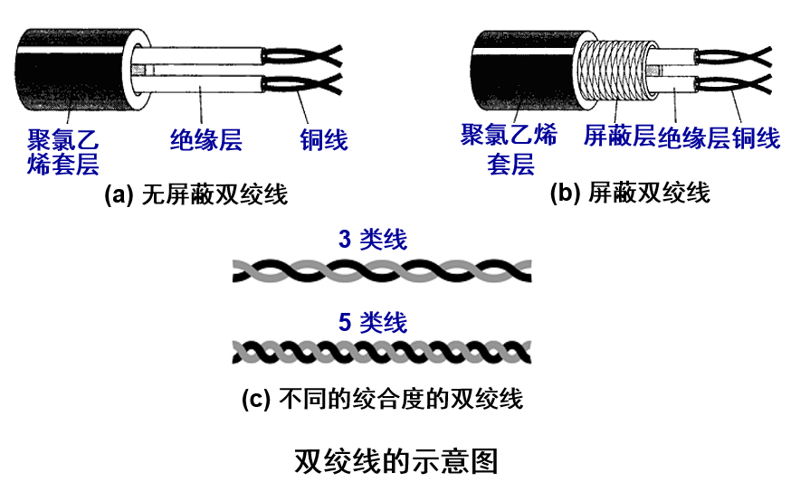

##### 3.1.2 同轴电缆

1. 同轴电缆具有很好的抗干扰特性，被广泛用于传输较高速率的数据。
2. 同轴电缆的带宽取决于电缆的质量。
   50欧   同轴电缆 —— LAN / 数字传输常用
   75欧   同轴电缆 —— 有线电视 / 模拟传输常用
3. 

##### 3.1.3 光缆

1. 光纤是光纤通信的传输媒体。
2. 多模光纤： 可以存在多条不同角度入射的光线在一条光纤中传输
3. 单模光纤： 若光纤的直径减小到只有一个光的波长，则光纤就像一根波导那样，它可使光线一直向前传播，而不会产生多次反射。
4. 光纤的优点：
   - 通信容量非常大
   - 传输损耗小，中继距离长，对远距离传输特别经济
   - 抗雷电和电磁干扰性能好
   - 无串音干扰，保密性好，也不易被窃听或截取数据
   - 体积小，重量轻。

#### 3.2 非引导型传输媒体

1. 短波通信（即高频通信）主要是靠电离层的反射，但短波信道的通信质量较差，传输速率低。
2. 微波在空间主要是直线传播。
3. 传统微波通信有两种方式： 
   - 地面微波接力通信
   - 卫星通信  

### 4. 信道复用技术

复用 (multiplexing) 是通信技术中的基本概念。
它允许用户使用一个共享信道进行通信，降低成本，提高利用率。

#### 4.1 频分复用、时分复用和统计时分复用

##### 4.1.1 频分复用

1. 将整个带宽分为多份，用户在分配到一定的频带后，在通信过程中自始至终都占用这个频带
2. 频分复用的所有用户在同样的时间占用不同的带宽资源（请注意，这里的“带宽”是频率带宽而不是数据的发送速率）。 

##### 4.1.2 时分复用

1. 时分复用是将时间划分为一段段等长的时分复用帧（TDM 帧）。
2. 每一个时分复用的用户在每一个 TDM 帧中占用固定序号的时隙。
3. 时分复用的所有用户是在不同的时间占用同样的频带宽度。

##### 4.1.3 统计时分复用

1. 统计时分复用使用STDM帧来传送复用的数据
2. 统计时分复用是一种改进的时分复用

#### 4.2 波分复用

1. 波分复用就是光的频分复用。使用一根光纤来同时传输多个光载波信号。

#### 4.3 码分复用CDM（码分地址CDMA）

1. 各用户使用经过特殊挑选的不同码型，因此彼此不会造成干扰。
2. 这种系统发送的信号有很强的抗干扰能力，其频谱类似于白噪声，不易被敌人发现。 
3. 每一个比特时间划分为 m 个短的间隔，称为码片 (chip)。
4. 每个站被指派一个唯一的 m bit 码片序列。
5. 扩频通信通常有两大类：
   - 一种是直接序列扩频DSSS (Direct Sequence Spread Spectrum)，如上面讲的使用码片序列就是这一类。
   - 另一种是跳频扩频FHSS (Frequency Hopping Spread Spectrum)。
6. CDMA的重要特点
   - 每个站分配的码片序列不仅必须各不相同，并且还必须互相正交 (orthogonal)。
   - 在实用的系统中是使用伪随机码序列。 

### 5. 数字传输系统

1. 与模拟通信相比，数字通信无论是在传输质量上还是经济上都有明显的优势。
2. 旧的数字系统存在的缺点： 
   - 速率标准不统一
   - 不是同步传输
3. 同步光纤网 SONET：
   - 同步光纤网 SONET (Synchronous Optical Network)  的各级时钟都来自一个非常精确的主时钟。
   - SONET 为光纤传输系统定义了同步传输的线路速率等级结构
4. 同步数字系列 SDH ：SDH 的基本速率为 155.52 Mbit/s，称为第 1 级同步传递模块 
5. SONET / SDH 标准的意义：
   - 使不同的数字传输体制在 STM-1 等级上获得了统一。
   - 第一次真正实现了数字传输体制上的世界性标准。
   - 已成为公认的新一代理想的传输网体制。
   - SDH 标准也适合于微波和卫星传输的技术体制。

### 6. 宽带接入技术

#### 6.1 非对称数字用户线 (ADSL)技术

1. ADSL (Asymmetric Digital Subscriber Line) 技术就是用数字技术对现有的模拟电话用户线进行改造，使它能够承载宽带业务。
2. ADSL 技术就把 0~4 kHz 低端频谱留给传统电话使用，而把原来没有被利用的高端频谱留给用户上网使用。
3. ADSL技术的传输距离：
   - ADSL 的传输距离取决于数据率和用户线的线径（用户线越细，信号传输时的衰减就越大）。
   - ADSL 所能得到的最高数据传输速率与实际的用户线上的信噪比密切相关。
4. ADSL的特点：
   - 上行和下行带宽做成不对称的。
   - ADSL 在用户线（铜线）的两端各安装一个 ADSL 调制解调器。

#### 6.2 光纤同轴混合网（HFC网）

1. HFC (Hybrid Fiber Coax) 网是在目前覆盖面很广的有线电视网 CATV 的基础上开发的一种居民宽带接入网。
2. HFC 网除可传送 CATV 外，还提供电话、数据和其他宽带交互型业务。
3. HFC 网的主干线路采用光纤
4. HFC 网将原 CATV 网中的同轴电缆主干部分改换为光纤，并使用模拟光纤技术。
5. HFC 网具有双向传输功能，扩展了传输频带

#### 6.3 **FTTx** **技术**

1. FTTx 是一种实现宽带居民接入网的方案，代表多种宽带光纤接入方式。

## 第三章、 数据链路层

### 1. 使用点对点信道的数据链路层

#### 1.1 数据链路和帧

1. 链路：一个节点到相邻节点的一段物理线路，而中间没有任何其他的交换节点
2. 数据链路：将实现一些必要的通信协议的硬件和软件加到链路上
3. 帧：点对点信道的数据链路层的协议数据单元
4. 数据链路层把网络层交下来的数据构成帧发送到链路上，以及把接收到的帧的数据取出并上交给网络层

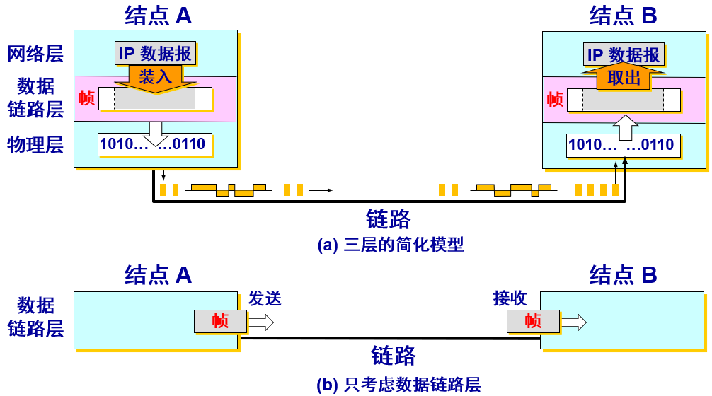

5. 点对点信道的数据链路层在进行通信时的主要步骤：

   i   节点A的数据链路层把网络层交下来的`IP`数据报添加首部和尾部封装成帧

   ii  节点A把封装好的帧发送给节点B的数据链路层

   iii 若节点B的数据链路层收到的帧无差错，则从收到的帧中提取出`IP`数据报交给上面的网络层；否则丢弃这个帧

#### 1.2 三个基本问题

##### 1.2.1 封装成帧

1. 封装成帧就是在一段数据的前后分别添加首部和尾部
2. 首部和尾部的一个重要作用就是进行帧定界。  

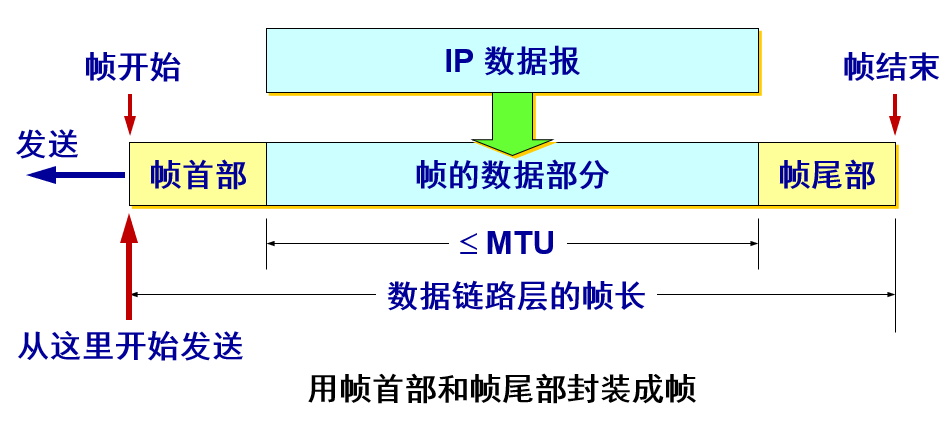

3. 用控制字符进行帧定界的方法举例 
   - 当数据是由可打印的 ASCII 码组成的文本文件时，帧定界可以使用特殊的帧定界符。
   - 控制字符 SOH (Start Of Header) 放在一帧的最前面，表示帧的首部开始。另一个控制字符 EOT (End Of Transmission) 表示帧的结束。

##### 1.2.2 透明传输

1. 如果数据中的某个字节的二进制代码恰好和 SOH 或 EOT 一样，数据链路层就会错误地“找到帧的边界”。

2. 解决透明传输问题——字节填充

   - 发送端的数据链路层在数据中出现控制字符“SOH”或“EOT”的前面插入一个转义字符“ESC” (其十六进制编码是 1B)。
   - 接收端的数据链路层在将数据送往网络层之前删除插入的转义字符。
   - 如果转义字符也出现在数据当中，那么应在转义字符前面插入一个转义字符 ESC。当接收端收到连续的两个转义字符时，就删除其中前面的一个。 

   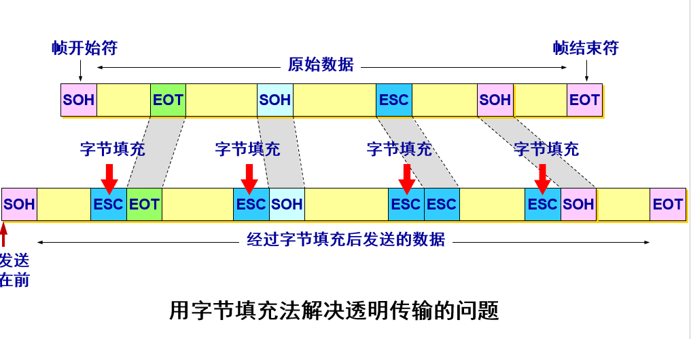

##### 1.2.3 差错检测

1. 比特差错：比特在传输过程中可能会出现差错：0 变成 1 或 1 变成 0
2. 误码率：在一段时间内，传输错误的比特占所有传输比特总数的比率
3. 循环冗余检验：在发送端，先把划分为组，假定每组 `k` 个比特。现假定待传送的数据 `M=101001`（`k=6`）. `CRC` 运算就是在数据 `M` 的后面添加供差错检测用的 `n` 位冗余码，然后构成一个帧发送出去，一个发送（`k+n`）位。
4. 冗余码的计算 :
   - 用二进制的模 2 运算进行 2^n 乘 M 的运算，这相当于在 M 后面添加 n 个 0。
   - 得到的 (k + n) 位的数除以事先选定好的长度为 (n + 1) 位的除数 P，得出商是 Q 而余数是 R，余数 R 比除数 P 少 1 位，即 R 是 n 位。 
   - 将余数 R 作为冗余码拼接在数据 M 后面发送出去。
   - 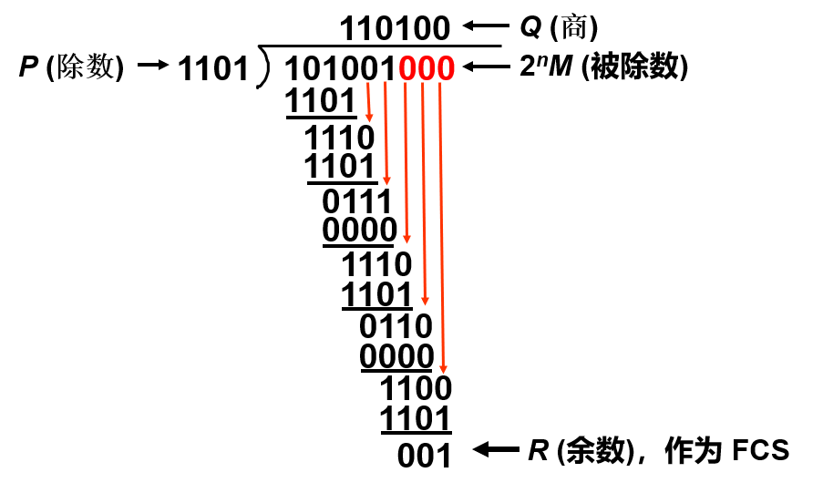
5. 帧检验序列：在数据后面添加上的冗余码
6. 循环冗余检验 CRC 和帧检验序列 FCS 并不等同。
   - CRC 是一种常用的检错方法，而 FCS 是添加在数据后面的冗余码。
   - FCS 可以用 CRC 这种方法得出，但 CRC 并非用来获得 FCS 的唯一方法。  

### 2. 点对点协议 `PPP`

#### 2.1 `PPP` 协议的特点

1. `PPP` 协议：用户计算机和 `ISP` 进行通信时所使用的数据链路层协议
2. `PPP` 协议应满足的要求：
   - 简单
   - 封装成帧
   - 透明性
   - 多种网络层协议
   - 多种类型链路
   - 差错检测
   - 检测连接状态
   - 最大传输单元
   - 网络层地址协商
   - 数据压缩协商

#### 2.2 `PPP` 协议的组成

- 一个将 IP 数据报封装到串行链路的方法。

- 链路控制协议 LCP (Link Control Protocol)。

- 网络控制协议 NCP (Network Control Protocol)。   

##### 2.2.1 各字段的意义

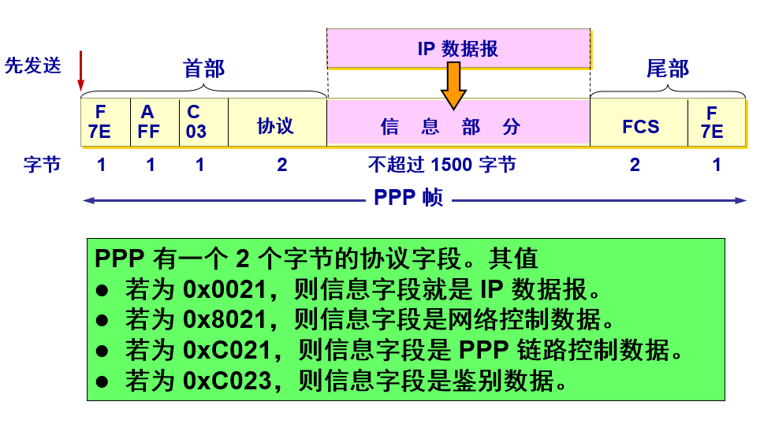

F：flag 帧的开始和结束标志

FCS：帧检验序列

A：address，C：control。这两个字段并无携带 `PPP` 帧的信息

##### 2.2.2 字节填充

当信息字段带有和标志字段一样的比特(0x7E)时,就必须采取一些措施使这种形式上和标志字段一样的比特组合不出现在信息字段中，当 `PPP` 使用异步传输时：

- 将信息字段中出现的每一个 0x7E 字节转变成为 2 字节序列 (0x7D, 0x5E)。 

- 若信息字段中出现一个 0x7D 的字节, 则将其转变成为 2 字节序列 (0x7D, 0x5D)。

- 若信息字段中出现 ASCII 码的控制字符（即数值小于 0x20 的字符），则在该字符前面要加入一个 0x7D 字节，同时将该字符的编码加以改变。  

##### 2.2.3 零比特填充

`PPP` 协议在SONET/SDH链路时，使用同步传输（一连串的比特连续传送）而不是异步传输（逐个字符传输）。在这种情况下，`PPP` 协议采用零比特填充方法来实现透明传输

- 在发送端，只要发现有 5 个连续 1，则立即填入一个 0。
- 接收端对帧中的比特流进行扫描。每当发现 5 个连续1时，就把这 5 个连续 1 后的一个 0 删除。

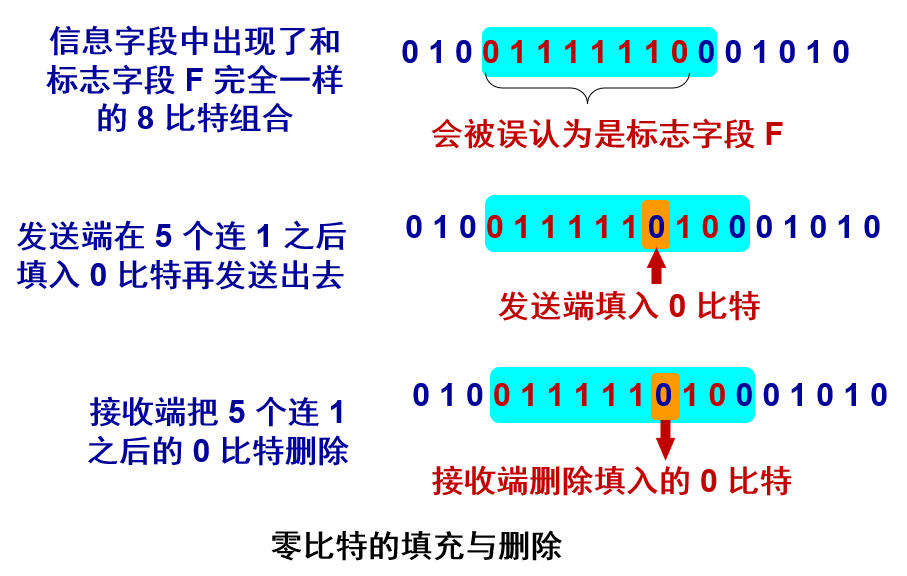

#### 2.3 `PPP` 协议的工作状态

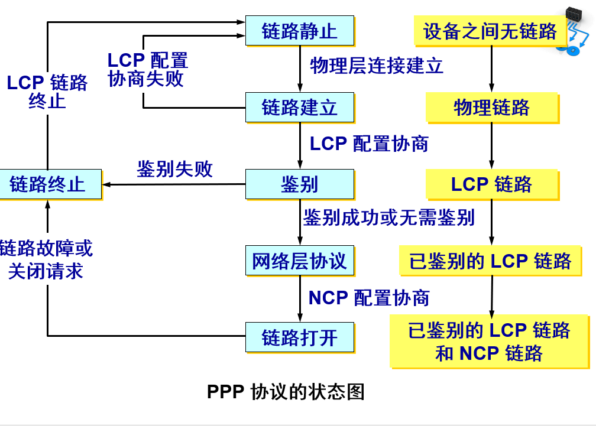

### 3. 使用广播信道的数据链路层

#### 3.1 局域网的数据链路层

1. 局域网的特点：网络为一个单位所拥有，且地理位置和站点数目均有限

2. 局域网的主要优点：

   - 具有广播功能，从一个站点可很方便地访问全网
   - 便于系统的扩展和逐渐演变，各设备的位置可灵活调整和改变
   - 提高了系统的可靠性、可用性、生存性

3. 局域网的分类：

   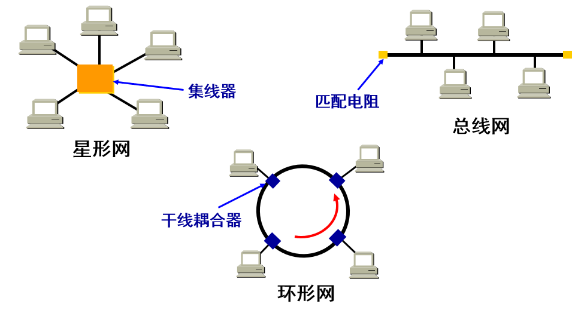

4. 媒体共享技术：

   - 静态划分信道：频分复用、时分复用、波分复用、码分复用 
   - 动态媒体接入控制（多点接入）：
     - 随机接入
     - 受控接入

##### 3.1.1 以太网的两个标准

1. DIX Ethernet V2 是世界上第一个局域网产品（以太网）的规约。
2. IEEE 802.3 是第一个 IEEE 的以太网标准。

##### 3.1.2 适配器的作用

1. 网络接口板又称为通信适配器 (adapter) 或网络接口卡 NIC (Network Interface Card)，或“网卡”。 
2. 适配器的重要功能：
   - 进行串行/并行转换。
   - 对数据进行缓存。
   - 在计算机的操作系统安装设备驱动程序。
   - 实现以太网协议。  

#### 3.2 CSMA/CD 协议 

1. 以太网采用广播的方式发送
2. 为了通信的方便，以太网采取了两种措施：

   - 采用较为灵活的无连接的工作方式
     - 不必先建立连接就可以直接发送数据。
     - 对发送的数据帧不进行编号，也不要求对方发回确认。
     - **这样做的理由是局域网信道的质量很好，因信道质量产生差错的概率是很小的。** 
     - **以太网提供的服务是不可靠的交付，即尽最大努力的交付。**
     - 当目的站收到有差错的数据帧时就丢弃此帧，其他什么也不做。差错的纠正由高层来决定。
     - 如果高层发现丢失了一些数据而进行重传，但以太网并不知道这是一个重传的帧，而是当作一个新的数据帧来发送。  
   - 以太网发送的数据都使用曼彻斯特 (Manchester) 编码
     - 曼彻斯特编码缺点是：它所占的频带宽度比原始的基带信号增加了一倍。
3. CSMA/CD协议的要点
- 多点接入： 表示许多计算机以多点接入的方式连接在一根总线上。
   - 载波监听： 指每一个站在发送数据之前先要检测一下总线上是否有其他计算机在发送数据，如果有，则暂时不要发送数据，以免发生碰撞。 
- 碰撞检测： 计算机边发送数据边检测信道上的信号电压大小。
4. CSMA/CD 重要特性
   - 使用 CSMA/CD 协议的以太网不能进行全双工通信而只能进行双向交替通信（半双工通信）。
   - 每个站在发送数据之后的一小段时间内，存在着遭遇碰撞的可能性。 
   - 这种发送的不确定性使整个以太网的平均通信量远小于以太网的最高数据率。

5. 争用期：（碰撞窗口）以太网的端到端往返时延 2t
6. CSMA/CD协议的要点:
   - 准备发送。但在发送之前，必须先检测信道。
   - 检测信道。若检测到信道忙，则应不停地检测，一直等待信道转为空闲。若检测到信道空闲，并在 96 比特时间内信道保持空闲（保证了帧间最小间隔），就发送这个帧。
   - 检查碰撞。在发送过程中仍不停地检测信道，即网络适配器要边发送边监听。这里只有两种可能性：
     ①发送成功：在争用期内一直未检测到碰撞。这个帧肯定能够发送成功。发送完毕后，其他什么也不做。然后回到 (1)。
     ②发送失败：在争用期内检测到碰撞。这时立即停止发送数据，并按规定发送人为干扰信号。适配器接着就执行指数退避算法，等待 r 倍 512 比特时间后，返回到步骤 (2)，继续检测信道。但若重传达 16 次仍不能成功，则停止重传而向上报错。

#### 3.3 使用集线器的星形拓扑

1. 采用双绞线的以太网采用星形拓扑，在星形的中心则增加了一种可靠性非常高的设备，叫做集线器 (hub)。
2. 集线器的一些特点：
   - 集线器是使用电子器件来模拟实际电缆线的工作，因此整个系统仍然像一个传统的以太网那样运行。 
   - 使用集线器的以太网在逻辑上仍是一个总线网，各工作站使用的还是 CSMA/CD 协议，并共享逻辑上的总线。 
   -  集线器很像一个多接口的转发器，工作在物理层。
   -  集线器采用了专门的芯片，进行自适应串音回波抵消，减少了近端串音。

#### 3.4 以太网的信道利用率

#### 3.5 以太网的 MAC 层

##### 3.5.1 MAC层的硬件地址

1. 生产适配器时，6 字节的 MAC 地址已被固化在适配器的 ROM，因此，MAC 地址也叫作硬件地址 (hardware address)或物理地址。

##### 3.5.2 MAC帧的格式

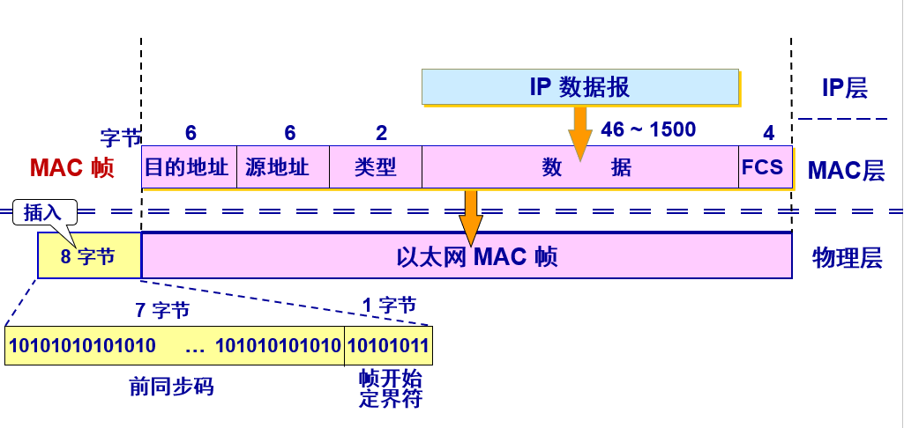

无效的MAC帧：

- 数据字段的长度与长度字段的值不一致；
- 帧的长度不是整数个字节；
- 用收到的帧检验序列 FCS 查出有差错；
- 数据字段的长度不在 46 ~ 1500 字节之间。
- 有效的 MAC 帧长度为 64 ~ 1518 字节之间。

### 4. 扩展的以太网

#### 4.1 在物理层扩展以太网

1. 使用光纤扩展：

   - 主机使用光纤（通常是一对光纤）和一对光纤调制解调器连接到集线器。 

   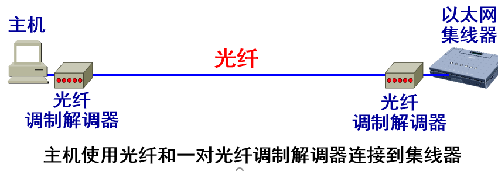

2. 使用集线器扩展:

   - 使用多个集线器可连成更大的、多级星形结构的以太网。
   - 优点
     - 使原来属于不同碰撞域的以太网上的计算机能够进行跨碰撞域的通信。
     - 扩大了以太网覆盖的地理范围。
   - 缺点
     - 碰撞域增大了，但总的吞吐量并未提高。
     - 如果不同的碰撞域使用不同的数据率，那么就不能用集线器将它们互连起来。   

#### 4.2 在数据链路层扩展以太网

1. 早期使用网桥，现在使用以太网交换机。
2. 网桥：
   - 网桥工作在数据链路层。
   - 它根据 MAC 帧的目的地址对收到的帧进行转发和过滤。
   - 当网桥收到一个帧时，并不是向所有的接口转发此帧，而是先检查此帧的目的 MAC 地址，然后再确定将该帧转发到哪一个接口，或把它丢弃。 

##### 4.2.1 以太网交换机的特点

1. 以太网交换机：
   - 以太网交换机实质上就是一个多接口的网桥。
     - 通常都有十几个或更多的接口。
   - 每个接口都直接与一个单台主机或另一个以太网交换机相连，并且一般都工作在全双工方式。
   - 以太网交换机具有并行性。
     - 能同时连通多对接口，使多对主机能同时通信。
   - 相互通信的主机都是独占传输媒体，无碰撞地传输数据。
2. 以太网交换机的特点：
   - 以太网交换机的接口有存储器，能在输出端口繁忙时把到来的帧进行缓存。
   - 以太网交换机是一种即插即用设备，其内部的帧交换表（又称为地址表）是通过自学习算法自动地逐渐建立起来的。
   - 以太网交换机使用了专用的交换结构芯片，用硬件转发，其转发速率要比使用软件转发的网桥快很多。
3. 以太网交换机的优点：
   - 用户独享带宽，增加了总容量。
   - 从共享总线以太网转到交换式以太网时，所有接入设备的软件和硬件、适配器等都不需要做任何改动。
   - 以太网交换机一般都具有多种速率的接口，方便了各种不同情况的用户。
4. 以太网交换机的交换方式：
   - 存储转发方式
     - 把整个数据帧先缓存后再进行处理。
   - 直通 (cut-through) 方式
     - 接收数据帧的同时就立即按数据帧的目的 MAC 地址决定该帧的转发接口，因而提高了帧的转发速度。
     - 缺点是它不检查差错就直接将帧转发出去，因此有可能也将一些无效帧转发给其他的站。

##### 4.2.2 以太网交换机的自学习功能

1. 以太网交换机运行自学习算法自动维护交换表。
2. book.P100

##### 4.2.3 从总线以太网到星形以太网

星形以太网交换机不使用共享总线，没有碰撞问题，因此不使用 CSMA/CD 协议，而是以全双工方式工作。但仍然采用以太网的帧结构。

#### 4.3 虚拟以太网

### 5. 高速以太网

## 第四章、 网络层

### 1. 网络层提供的两种服务

**互联网采用的设计思路**：网络层向上只提供简单灵活的、无连接的、尽最大努力交付的数据报服务。

**网络层不提供服务质量的承诺。**

### 2. 网络协议IP

与IP协议配套使用的其他三个协议：地址解析协议`ARP`、网际控制报文协议`ICMP`、网际组管理协议`IGMP`

#### 2.1 虚拟互连网络

1. 将网络互连起来的一些中间设备：
   - 转发器：物理层使用的中间设备
   - 网桥（桥接器）：数据链路层使用的中间设备
   - 路由器：网络层使用的中间设备
   - 网关： 在网络层以上使用的中间设备（用网关连接两个不兼容的系统需要在高层进行协议的转换）
2. 互联网可以由多种异构网络互连组成

#### 2.2 分类的IP地址

##### 2.2.1 IP地址及其表示方法

1. 整个互联网就是一个单一的、抽象的网络

2. IP地址就是给互联网上的每一台主机（或路由器）的每一个接口分配一个在全世界范围内是唯一的32位标识符

3. IP地址的编址方法共经过了三个历史阶段：

   - 分类的IP地址
   - 子网的划分
   - 构成超网

4. 每一类地址都由两个固定长度的字段组成，其中一个字段是**网络号** `net-id`**（一个网络号在整个互联网范围内必须是唯一的）**，它标志主机（或路由器）所连接到的网络，而另一个字段则是**主机号`host-id`**（主机号在它前面的网络号所指明的网络范围内必须是唯一的）**，**它标志该主机（或路由器）。

5. 两级的`IP`地址结构：

   

6. 这种两级的`IP`地址可记为：

   

7. 各类`IP`地址的网络号字段和主机号字段：

   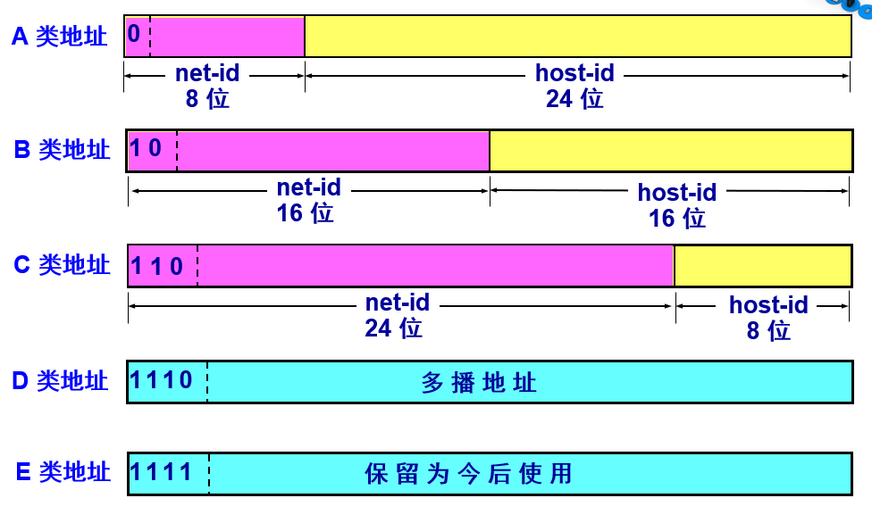

   

   

##### 2.2.2 常用的三种类别的`IP`地址

1. A类地址中网络号字段全为0 的`IP`地址是个保留地址，意思是**本网络**

2. A类地址中网络号为127（01111111）保留作为本地软件**环回测试**本主机的进程之间的通信之用（所以A类地址可指派的网络号是126个 2^7 - 2）

3. A类地址中的主机号占三个字节，因此每一个A类网络中的最大主机数是2^24 - 2 （主机号全为0表示该`IP`地址是**本主机**，主机号全为1表示该网络上的所有主机）

4. `IP`地址的指派范围：

   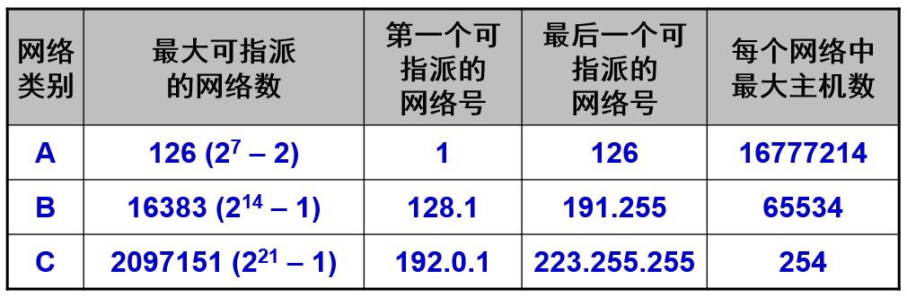

5. 一般不使用的特殊`IP`地址：

   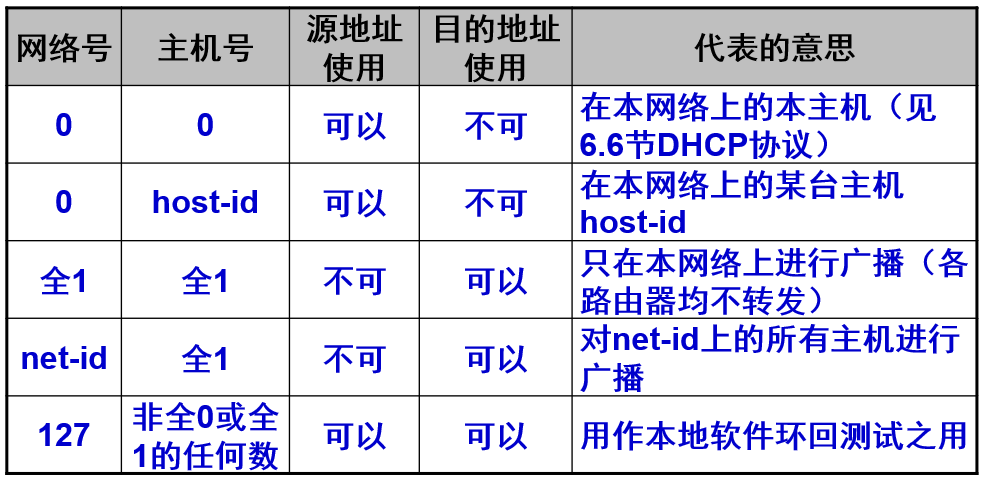

6. `IP`地址具有一下一些重要特点：

   - 每一个`IP`地址都由网络号和主机号组成，好处如下：
   - - `IP`地址管理机构在分配`IP`地址时只分配网络号，而剩下的主机号则由得到该网络号的单位自行分配
     - 路由器仅根据目的主机所连接的网络号来转发分组，这样就可以使路由表中的项目数大幅度减少，从而减小了路由表所占的存储空间以及查找路由表的时间
   - 实际上`IP`地址是标志一台主机（或路由器）和一条链路的接口
   - 一个网络是指具有相同网络号`net-id`的主机的集合
   - 在`IP`地址中，所有分配到网络号的网络都是平等的

7. 多归属主机：该主机必须同时具有两个相应的`IP`地址，且网络号必须是不同的

##### 2.2.3 `IP`地址与硬件地址

1. 从层次看：

   - 物理地址是数据链路层和物理层使用的地址
   - `IP`地址是网络层和以上各层使用的地址，是一种逻辑地址

2. `IP`地址与硬件地址的区别

   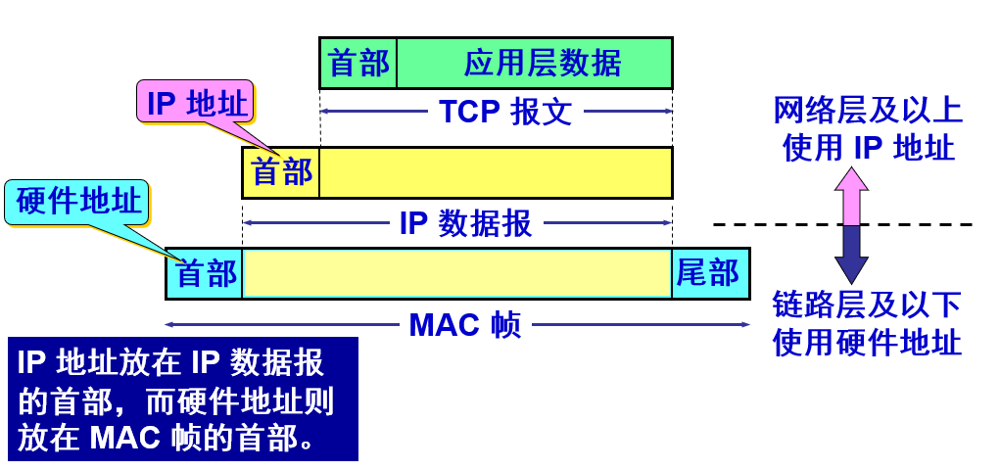

##### 2.2.4 地址解析协议`ARP`

1. `ARP`的作用：

   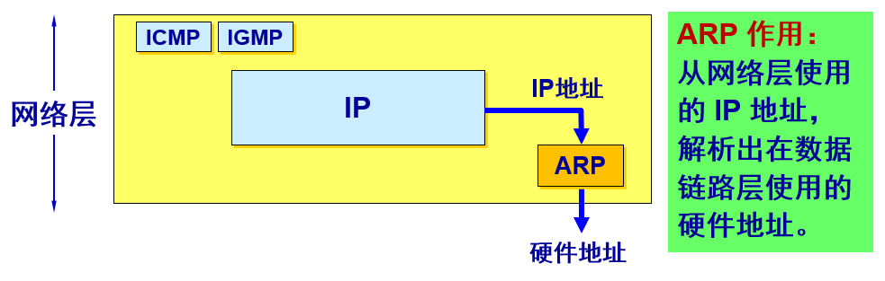

2. `ARP`高速缓存：存放本局域网上的各主机和路由器的`IP`地址到硬件地址的映射表

##### 2.2.5 `IP`数据报的格式

1. `IP`数据报的格式

   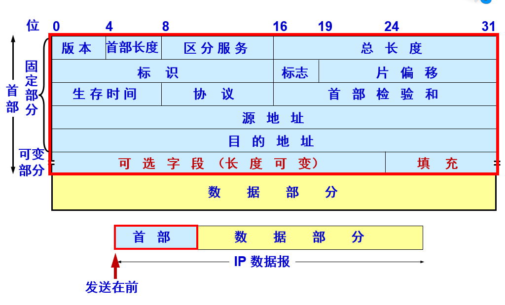

##### 2.2.6 `IP`层转发分组的流程

1. 从数据报的首部提取目的主机的`IP`地址D，得出目的网络地址N
2. 若N就是与此路由器直接相连的某个网络地址，则进行直接交付，不需要再经过其他的路由器，直接把数据报交付给目的主机，否则就是间接交付，执行3
3. 若路由表中有目的地址为D的特定主机路由，则把数据报传送给路由表中所指明的下一跳路由器，否则，执行4
4. 若路由表中有到达网络N的路由，则把数据报传送给路由表中所指明的下一跳路由器；否则，执行5
5. 若路由表中有一个默认路由，则把数据报传送给路由表中所指明的默认路由器；否则，执行6
6. 报告转发分组出错

### 3. 划分子网和构造超网

#### 3.1 划分子网

##### 3.1.1 从二级地址 `IP` 到三级 `IP` 地址

1. 早期两级 `IP` 地址设计的缺点：
   - `IP` 地址空间的利用率有时很低
   - 两级 `IP` 地址不够灵活
   - 给每一个物理网络分配一个网络号会使路由表变得太大而使网络性能变坏
2. 从 1985 年起在 IP 地址中又增加了一个“子网号字段”，使两级的 IP 地址变成为三级的 IP 地址。这种做法叫作划分子网 (subnetting) 。
3. 划分子网的思路：从主机号借用若干个位作为子网号 subnet-id，而主机号 host-id 也就相应减少了若干个位。

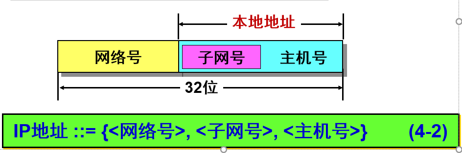

4. 优点： 
   - 减少了 IP 地址的浪费
   - 使网络的组织更加灵活
   - 更便于维护和管理
5. 划分子网纯属一个单位内部的事情，对外部网络透明，对外仍然表现为没有划分子网的一个网络。

##### 3.1.2 子网掩码

1. 使用子网掩码(subnet mask)可以找出 IP 地址中的子网部分。  
2. 规则：
   - 子网掩码长度＝32位
   - 某位＝1：IP地址中的对应位为网络号和子网号
   - 某位＝0：IP地址中的对应位为主机号
3. 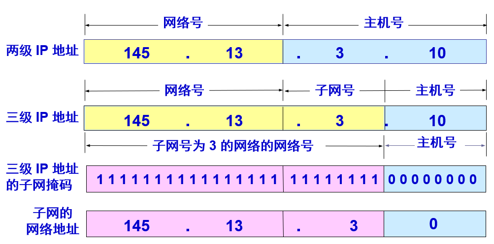

#### 3.2 使用子网时分组的转发

### 4. 无分类编址CIDR

#### 1. 网络前缀

##### 1. CIDR最主要的特点

1. CIDR消除了传统的A、B、C、D类地址以及划分子网的概念，因而可以更加有效的利用IPV4的地址空间
2. CIDR 使用各种长度的“网络前缀”来代替分类地址中的网络号和子网号
3. IP 地址从三级编址（使用子码掩码）又回到两级编址

##### 2. 无分类两级编址

- 
- CIDR 使用“斜线记法”(slash notation)，它又称为 CIDR 记法，即在 IP 地址面加上一个斜线“/”，然后写上网络前缀所占的位数（这个数值对应于三级编址中子网掩码中 1 的个数）。例如： 220.78.168.0/24

##### 3. CIDR地址块

- CIDR把网络前缀一致的地址集合叫做地址块
- 128.14.32.0/20 表示的地址块共有 212 个地址（因为斜线后面的 20 是网络前缀的位数，所以这个地址的主机号是 12 位）。
- - 这个地址块的起始地址是 128.14.32.0。
  - 在不需要指出地址块的起始地址时，也可将这样的地址块简称为“/20地址块”。
  - 128.14.32.0/20 地址块的最小地址：128.14.32.0
  - 128.14.32.0/20 地址块的最大地址：128.14.47.255
  - 全 0 和全 1 的主机号地址一般不使用。

##### 4. 路由聚合

- 一个CIDR块可以表示很多地址，这种地址的聚合常被称为路由聚合，它使得路由表中的一个项目可以表示很多个原来传统分类地址的路由
- 路由聚合有利于减少路由器之间的路由选择信息的交换，从而提高了整个互联网的性能
- 路由聚合也称为构成超网

##### 5. 构成超网

- 前缀长度不超过 23 位的 CIDR 地址块都包含了多个 C  类地址。
- 这些C类地址合起来就构成超网
- **CIDR** **地址块中的地址数一定是**2 **的整数次幂**
- 网络前缀越短，其地址块所包含的地址数就越多
- CIDR 可以更加有效地利用IPV4 的地址空间，可以根据客户的需要分配适当大小的 CIDR地址块

#### 2. 最长前缀匹配

- 使用CIDR时，路由表中的每个项目由 网络前缀 和 下一跳地址 组成。在查找路由表时，可能匹配到的结果不止一个
- 应当从匹配结果中选择具有最长网络前缀的路由：最长前缀匹配 
- 网络前缀越长，其地址块就越小，因而路由就越具体 (more specific) 。

#### 3. 使用二叉线索来查找路由表

- 当路由表项目很大时，为了更加有效地查找，通常是将无分类编址的路由表存放在一种层次的数据结构中，然后自上而下地按层次查找。这里最常用的就是二叉线索

### 5. 网际控制报文协议ICMP

#### 1. ICMP 的报文种类

- ICMP报文的种类有两种，即ICMP差错报告报文和ICMP询问报文
- ICMP 报文的前 4 个字节是统一的格式，共有三个字段：即类型、代码和检验和。接着的 4 个字节的内容与 ICMP 的类型有关。 

##### 1.1 ICMP的差错报告报文有四种

- 终点不可达
- 时间超过
- 参数问题
- 改变路由（重定向）

##### 1.2 ICMP的询问报文有两种

- 回送请求和回答报文
- 时间戳请求和回答报文

##### 1.3 ICMP的应用

- `PING` 命令用了 ICMP的回送请求和回送回答报文；
- `tracert` 命令利用了IP数据报的 TTL字段和 ICMP 时间超过差错报告报文实现对源点到终点的跟踪

### 6. 互联网的路由选择协议

#### 1. 有关路由选择协议的几个基本概念

##### 1.1 从路由算法的自适应性考虑

- 静态路由选择策略——即非自适应路由选择，其特点是简单和开销较小，但不能及时适应网络状态的变化
- 动态路由选择策略——即自适应路由选择，其特点就是较能适应网络状态的变化，但实现起来较为复杂，开销也大

##### 1.2 自治系统 AS

- 自治系统AS的定义：在单一的技术管理下的一组路由器，而这些路由器使用一种AS内部的路由选择协议和共同的度量以确定分组在该AS内的路由，同时还使用一种AS之间的路由选择协议用以确定分组在AS之间的路由
- 现在对自治系统 AS 的定义是强调下面的事实：尽管一个 AS 使用了多种内部路由选择协议和度量，但重要的是一个 AS 对其他 AS 表现出的是一个单一的和一致的路由选择策略。

- 内部网关协议（IGP）：在一个自治系统内部使用的路由选择协议，如RIP、OSPF
- 外部网关协议（EGP）：若源站和目的站处于不同的自治系统中，当数据报传到一个自治系统边缘时，就需要使用一种协议将路由选择信息传递到另一个自治系统里面，这样的协议就叫做外部网关协议，如BGP-4

#### 2. 内部网关协议RIP

##### 2.1 工作原理

- RIP 是一种分布式的、基于距离向量的路由选择协议
- RIP 协议要求网络中的每一个路由器都要维护从它自己到其他每一个目的网络的距离记录
- RIP 认为一个好的路由就是它通过的路由器的数目少，即距离短
- RIP 允许一条路径最多只能包含15个路由器
- 距离的最大值为16 时即相当于不可达。可见RIP 只适用于小型互联网
- RIP 不能在两个网络之间同时使用多条路由

##### 2.2 RIP 协议的三个特点

- 仅和相邻路由器交换信息
- 交换的信息是当前本路由器所知道的全部信息，即自己的路由表
- 按固定的时间间隔交换路由信息

##### 2.3 路由表的建立

1. 路由器在刚刚开始工作时，只知道到直接连接的网络的距离（此距离定义为1）。它的路由表是空的。

2. 以后，每一个路由器也只和数目非常有限的相邻路由器交换并更新路由信息。

3. 经过若干次更新后，所有的路由器最终都会知道到达本自治系统中任何一个网络的最短距离和下一跳路由器的地址。

4. RIP 协议的收敛 (convergence) 过程较快。“收敛”就是在自治系统中所有的结点都得到正确的路由选择信息的过程。 

5. 距离向量算法：

   路由器收到相邻路由器（其地址为 X）的一个 RIP 报文：
   (1) 先修改此 RIP 报文中的所有项目：把“下一跳”字段中的地址都改为 X，并把所有的“距离”字段的值加 1。
   (2) 对修改后的 RIP 报文中的每一个项目，重复以下步骤：
        若项目中的目的网络不在路由表中，则把该项目加到路由表中。
            否则
                若下一跳字段给出的路由器地址是同样的，则把收到的项目替换原路由表中的项目。
                   否则 
                       若收到项目中的距离小于路由表中的距离，则进行更新，
   	          否则，什么也不做。
   (3) 若 3 分钟还没有收到相邻路由器的更新路由表，则把此相邻路由器记为不可达路由器，即将距离置为 16（表示不可达）。
   (4) 返回。

##### 2.4 RIP 报文

- RIP 报文由首部和路由部分组成
- RIP2 报文中的路由部分由若干个路由信息组成。每个路由信息需要用20个字节，地址族标识符字段用来标志所使用的地址协议
- 路由标记填入自治系统的号码
- 后面是某个网络地址、该网络的子网掩码、下一跳路由器地址以及到此网络的距离
- 一个RIP报文 最多可包括25  个路由，因而RIP 报文最大长度是 4 + 20*25 = 504字节，如果超过，则必须再用一个RIP 报文来传送
- RIP 报文具有简单的鉴别功能

##### 2.5 RIP 的特点

- RIP 协议的特点：好消息传播得快，坏消息传播得慢
- RIP存在的一个问题：当网络出现故障时，要经过比较长的时间 (例如数分钟) 才能将此信息传送到所有的路由器。
- 优点：实现简单，开销较小
- 缺点：
- - RIP限制了网络得规模，它能使用的最大距离为15 
  - 路由器之间的交换路由信息是整张路由表，当随着网络规模的变大，开销也增加
  - 坏消息传得慢，使更新过程得收敛时间过长

#### 3. 内部网关协议OSPF

##### 3.1 OSPF 协议的基本特点

- “开放”表明 OSPF 协议不是受某一家厂商控制，而是公开发表的。
- “最短路径优先”是因为使用了 Dijkstra 提出的最短路径算法 SPF
- 采用分布式的链路状态协议 (link state protocol)。

##### 3.2 三个要点

- 向本自治系统中所有路由发送信息，这里使用的是洪泛法
- 发送的信息就是与本路由相邻的所有路由器的链路状态，但这只是路由器所知道的部分信息
- - 链路状态 就是说明本路由器都和哪些路由相邻，以及该链路的度量
- 只有当链路状态发生变化时，路由器才使用洪泛法向所有的路由器发送此信息

##### 3.3 链路状态数据库

- 由于各个路由器之间频繁地交换链路状态信息，因此所有的路由器最终都能建立一个链路状态数据库
- 这个数据库实际上就是全网的拓扑结构图，它在全网范围内是一致的
- OSPF的链路状态数据库能较快地更新，使得各个路由器能及时更新路由表
- OSPF的更新过程能收敛得快是其重要优点

##### 3.4 OSPF 的区域

- 为了使OSPF 能够用于规模更大的网路，OSPF 将一个自治系统再划分为若干个更小的范围，称为区域
- 每一个区域都有一个32 位的区域标识符
- 区域也不能太大，在一个区域内的路由器最好不超过200 个

##### 3.5 划分区域

- 划分区域的最大好处就是将利用洪泛法交换链路状态信息的范围局限于每一个区域而不是整个自治系统，这样减少了整个网络上的通信量
- 在一个区域内部的路由器只知道本区域完整网络的拓扑，而不知道其他区域的网络拓扑结构
- OSPF 使用层次结构的区域划分。在上层的区域叫做主干区域
- 主干区域的标识符规定为0.0.0.0 主干区域的作用是用来联通其他在下层的区域

##### 3.6 OSPF 直接用IP 数据报传送

- OSPF 不用UDP 而是直接用IP数据报传送
- OSPF构成的数据报很短，这样做可减少路由信息的通信量
- 数据报很短的另一个好处就是可以不必将长的数据报分片传送
- 但分片传送的数据报只要丢失一个，就无法组装成原来的数据报，而整个数据报就必须重传

##### 3.7 OSPF 的其他特点

- OSPF 对不同的链路可根据 IP 分组的不同服务类型 TOS 而设置成不同的代价。因此，OSPF 对于不同类型的业务可计算出不同的路由。
- 如果到同一个目的网络有多条相同代价的路径，那么可以将通信量分配给这几条路径。这叫作多路径间的负载平衡。
- 所有在 OSPF 路由器之间交换的分组都具有鉴别的功能。
- 支持可变长度的子网划分和无分类编址 CIDR。
- 每一个链路状态都带上一个 32 位的序号，序号越大状态就越新。

##### 3.8 OSPF 的五种分组类型

- 问候分组
- 数据库描述分组
- 链路状态请求分组
- 链路状态更新分组（用洪泛法对全网更新链路状态）
- 链路状态确认分组

#### 4. 外部网关BGP

- BGP是不同自治系统的路由器之间的路由交换信息协议

##### 4.1 BGP 交换路由信息

- 一个BGP发言人与其他自治系统中的BGP发言人要交换路由信息，就要先建立TCP 连接，然后在此连接上交换BGP　报文已建立BGP会话，利用BGP会话交换路由信息
- 使用TCP 连接能提供可靠服务，也简化了路由选择协议
- 使用TCP连接交换路由信息的两个BGP发言人彼此成为了对方的邻站或对等站

##### 4.2 BGP协议的特点

- BGP协议交换路由信息的节点数量级是自治系统数的数量级，这要比这些自治系统里面的网络数少很多
- 每一个自治系统中的BGP发言人的数目很少，这样就使得自治系统之间的路由选择不至于过分复杂
- BGP 支持 CIDR，因此 BGP 的路由表也就应当包括目的网络前缀、下一跳路由器，以及到达该目的网络所要经过的各个自治系统序列
- 在BGP 刚刚运行时，BGP 的邻站是交换整个的 BGP 路由表。但以后只需要在发生变化时更新有变化的部分。这样做对节省网络带宽和减少路由器的处理开销都有好处。 

##### 4.3 BGP 共使用四种类型报文

- 打开报文：用来与相邻的另一个BGP发言人建立关系
- 更新报文：用来发送某一路由的信息，以及列出要撤销的多条路由
- 保活报文：用来确认打开报文和周期性地证实邻站关系
- 通知报文：用来发送检测到的差错

## 第五章、 运输层

### 1. 运输层协议概述

#### 1.1 进程之间的通信

​		从通信和信息处理的角度看，运输层向它上面的应用层提供通信服务，它属于面向通信部分的最高层，同时也是用户功能中的最低层。
​		当网络的边缘部分中的两个主机使用网络的核心部分的功能进行端到端的通信时，只有位于网络边缘部分的主机的协议栈才有运输层，而网络核心部分中的路由器在转发分组时都只用到下三层的功能。 

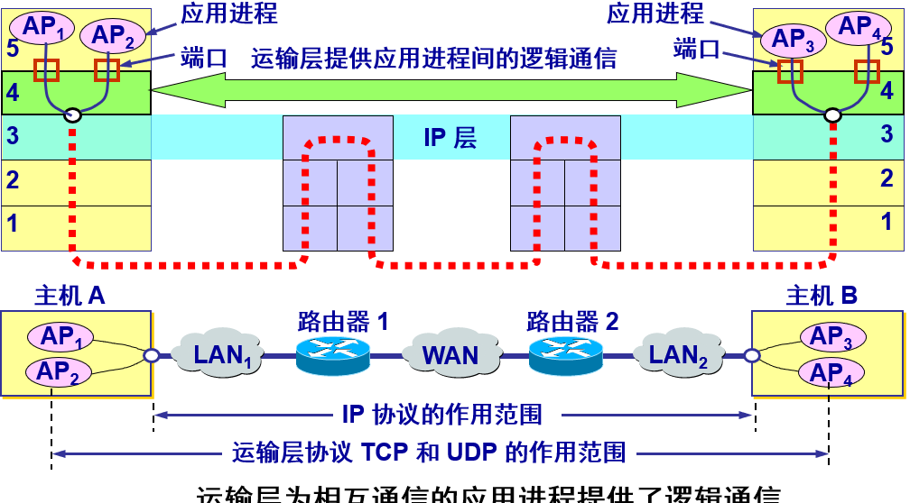

#### 1.2 运输层的两个主要协议

UDP 用户数据报协议 和 TCP 传输控制协议

​		两个对等运输实体在通信时传送的数据单位叫作运输协议数据单元 TPDU (Transport Protocol Data Unit)。

​		TCP 传送的数据单位协议是 TCP 报文段(segment)。UDP 传送的数据单位协议是 UDP 报文或用户数据报。 

##### TCP 与 UDP

UDP：一种无连接协议

- 提供无连接服务
- 在传送数据之前不需要先建立连接
- 传送的数据单位协议是UDP报文或用户数据报
- 对方的运输层在接收到UDP报文后，不需要给出任何确认
- 虽然UDP不提供可靠交付，但在某些情况下UDP是一种有效的工作方式

TCP：一种面向连接的协议

- 提供面向连接的服务
- 传送的数据单元协议是TCP报文段
- TCP不提供广播或多播服务
- 由于 TCP 要提供可靠的、面向连接的运输服务，因此不可避免地增加了许多的开销。这不仅使协议数据单元的首部增大很多，还要占用许多的处理机资源。

#### 1.3 运输层的端口

##### 1. 端口号

​		虽然通信的终点是应用进程，但我们可以把端口想象是通信的终点，因为我们只要把要传送的报文交到目的主机的某一个合适的目的端口，剩下的工作（即最后交付目的进程）就由 TCP 来完成。

##### 2. TCP/IP 运输层端口

- 端口使用一个16位端口号进行标志
- 端口号只具有本地意义，即端口号只是为了标志本计算机应用层的各进程
- 在互联网中，不同计算机相同的端口号是没有联系的
- 两个计算机中的进程要互相通信，不仅必须知道对方的 IP 地址（为了找到对方的计算机），而且还要知道对方的端口号（为了找到对方计算机中的应用进程）。

##### 3. 两大类端口

1. 服务器端使用的端口号
   - 熟知端口，数值一般为0~1023。
   - 登记端口号，数值为1024~49151，为没有熟知端口号的应用程序使用，使用这个端口号必须在IANA登记，以防重复
2. 客户端使用的端口号
   - 又称为短暂端口号，数值为 49152~65535，留给客户进程选择暂时使用
   - 当服务器进程收到客户进程的报文时，就知道了客户进程所使用的动态端口号。通信结束后，这个端口号可供其他客户进程以后使用。 

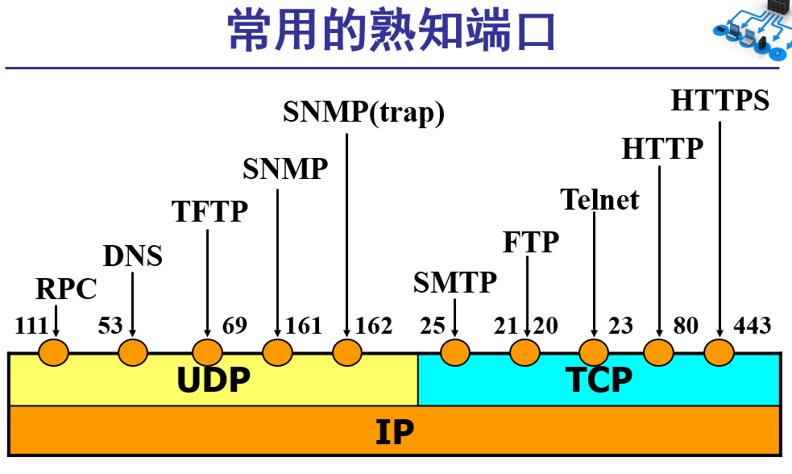

### 2. 用户数据报协议UDP

#### 2.1 UDP概述

UDP 只在 IP 的数据报服务之上增加了很少一点的功能：
	1. 复用和分用的功能
	2. 差错检测的功能
虽然 UDP 用户数据报只能提供不可靠的交付，但 UDP 在某些方面有其特殊的优点。

##### 1. UDP 的主要特点：

1. UDP 是无连接的：发送数据之前不需要建立连接，，因此减少了开销和发送数据之前的时延
2. UDP 使用尽最大努力交付：即不保证可靠交付，因此主机不需要维持复杂的连接状态表
3. UDP 是面向报文的：UDP 对应用层交下来的报文，既不合并，也不拆分，而是保留这些报文的边界。UDP 一次交付一个完整的报文
4. UDP 没有拥塞控制：因此网络出现的拥塞不会使源主机的发送速率降低。这对某些实时应用是很重要的。很适合多媒体通信的要求。
5. UDP 支持一对一、一对多、多对一和多对多的交互通信
6. UDP 的首部开销小，只有 8 个字节，比 TCP 的 20 个字节的首部要短

##### 2. 面向报文的UDP

- 发送方 UDP 对应用程序交下来的报文，在添加首部后就向下交付 IP 层。UDP 对应用层交下来的报文，既不合并，也不拆分，而是保留这些报文的边界。
- 应用层交给 UDP 多长的报文，UDP 就照样发送，即一次发送一个报文。
- 接收方 UDP 对 IP 层交上来的 UDP 用户数据报，在去除首部后就原封不动地交付上层的应用进程，一次交付一个完整的报文。
- 应用程序必须选择合适大小的报文。
  - 若报文太长，UDP 把它交给 IP 层后，IP 层在传送时可能要进行分片，这会降低 IP 层的效率。
  - 若报文太短，UDP 把它交给 IP 层后，会使 IP 数据报的首部的相对长度太大，这也降低了 IP 层的效率

#### 2.2 UDP 的首部格式

用户数据报 UDP 有两个字段：数据字段和首部字段。首部字段很简单，只有 8 个字节。

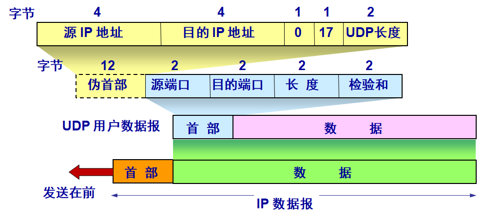

### 3. 传输控制协议 TCP 概述

#### 3.1 TCP 的主要特点

- TCP 是面向连接的运输层协议。
- 每一条 TCP 连接只能有两个端点 (endpoint)，每一条 TCP 连接只能是点对点的（一对一）。 
- TCP 提供可靠交付的服务。
- TCP 提供全双工通信
- 面向字节流
  - TCP 中的“流”(stream)指的是流入或流出进程的字节序列
  - “面向字节流”的含义是：虽然应用程序和 TCP 的交互是一次一个数据块，但 TCP 把应用程序交下来的数据看成仅仅是一连串无结构的字节流。

注意：

- TCP 连接是一条虚连接而不是一条真正的物理连接。
- TCP 对应用进程一次把多长的报文发送到TCP 的缓存中是不关心的。
- TCP 根据对方给出的窗口值和当前网络拥塞的程度来决定一个报文段应包含多少个字节（UDP 发送的报文长度是应用进程给出的）。
- TCP 可把太长的数据块划分短一些再传送。
- TCP 也可等待积累有足够多的字节后再构成报文段发送出去。 

#### 3.2 TCP 的连接

- TCP 把连接当作最基本的抽象
- 每一条TCP 连接有两个端点
- TCP 连接的端点不是主机，不是主机的IP 地址，不是应用进程，也不是运输层的协议端口。TCP 连接的端点叫做套接字 (socket) 或插口
- 端口号拼接到 (contatenated with) IP 地址即构成了套接字。

##### 1. 套接字

每一条 TCP 连接唯一地被通信两端的两个端点（即两个套接字）所确定

### 4. 可靠传输的工作原理

理想的传输条件有以下两个特点：
	(1) 传输信道不产生差错。
	(2) 不管发送方以多快的速度发送数据，接收方总是来得及处理收到的数据

#### 4.1 停止等待协议

“停止等待”就是每发送完一个分组就停止发送，等待对方的确认。在收到确认后再发送下一个分组

##### 1. 无差错情况

A 发送分组 M1，发完就暂停发送，等待 B 的确认 (ACK)。B 收到了 M1 向 A 发送  ACK。A 在收到了对 M1 的确认后，就再发送下一个分组  M2。

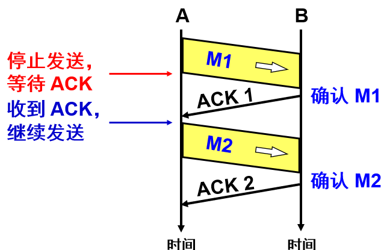

##### 2. 出现差错

在接收方 B 会出现两种情况：

1. B 接收 M1 时检测出了差错，就丢弃 M1，其他什么也不做（不通知 A 收到有差错的分组）。
2. M1 在传输过程中丢失了，这时 B 当然什么都不知道，也什么都不做。

如何保证 B 正确收到了 M1 呢？
解决方法：超时重传

1. A 为每一个已发送的分组都设置了一个超时计时器。
2. A 只要在超时计时器到期之前收到了相应的确认，就撤销该超时计时器，继续发送下一个分组 M2 。

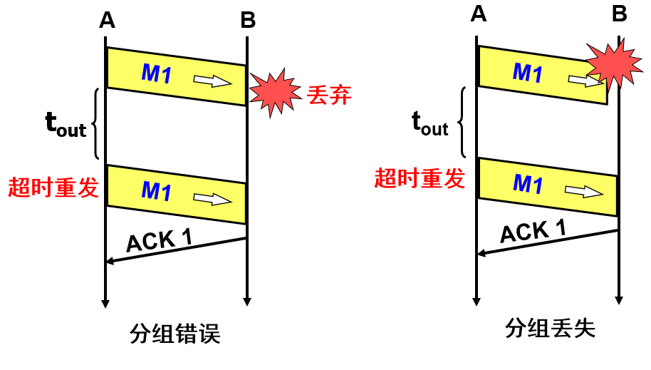

##### 3. 确认丢失或确认迟到

**确认丢失**

- 若 B 所发送的对 M1 的确认丢失了，那么 A 在设定的超时重传时间内不能收到确认，但 A 并无法知道：是自己发送的分组出错、丢失了，或者 是 B 发送的确认丢失了。因此 A 在超时计时器到期后就要重传 M1。
- 假定 B 又收到了重传的分组 M1。这时 B 应采取两个行动：
  第一，丢弃这个重复的分组 M1，不向上层交付。
  第二，向 A 发送确认。不能认为已经发送过确认就不再发送，因为 A 之所以重传 M1 就表示 A 没有收到对 M1 的确认。

**确认迟到**

- 传输过程中没有出现差错，但 B 对分组 M1 的确认迟到了。
  A 会收到重复的确认。对重复的确认的处理很简单：收下后就丢弃。
  B 仍然会收到重复的 M1，并且同样要丢弃重复的 M1，并重传确认分组。

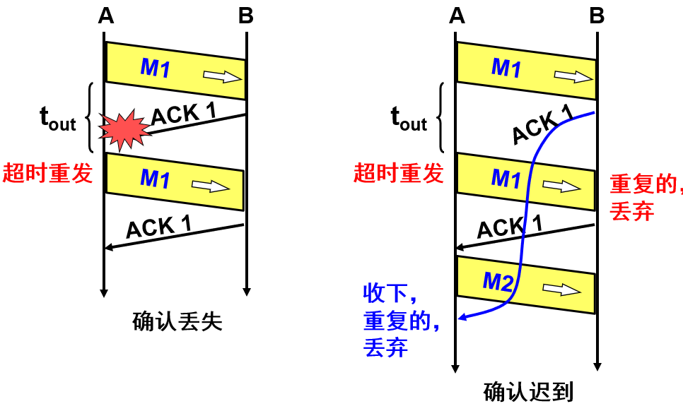

##### 4. 自动重传请求ARQ：

​		通常 A 最终总是可以收到对所有发出的分组的确认。如果 A 不断重传分组但总是收不到确认，就说明通信线路太差，不能进行通信。
​		使用上述的确认和重传机制，我们就可以在不可靠的传输网络上实现可靠的通信。
​		像上述的这种可靠传输协议常称为自动重传请求 ARQ  (Automatic Repeat reQuest)。意思是重传的请求是自动进行的，接收方不需要请求发送方重传某个出错的分组。

停止等待协议的优点是简单，缺点是信道利用率太低

流水线传输：

流水线传输就是发送方可连续发送多个分组，不必每发完一个分组就停顿下来等待对方的确认。这样可使信道上一直有数据不间断地传送

#### 4.2 连续ARQ协议

滑动窗口协议比较复杂，是 TCP 协议的精髓所在。

​		发送方维持的发送窗口，它的意义是：位于发送窗口内的分组都可连续发送出去，而不需要等待对方的确认。这样，信道利用率就提高了。
​		连续 ARQ 协议规定，发送方每收到一个确认，就把发送窗口向前滑动一个分组的位置。

​		接收方一般采用累积确认的方式。即不必对收到的分组逐个发送确认，而是对按序到达的最后一个分组发送确认，这样就表示：到这个分组为止的所有分组都已正确收到了。
​		优点：容易实现，即使确认丢失也不必重传。
​		缺点：不能向发送方反映出接收方已经正确收到的所有分组的信息。

##### Go-back-N

​		如果发送方发送了前 5 个分组，而中间的第 3 个分组丢失了。这时接收方只能对前两个分组发出确认。发送方无法知道后面三个分组的下落，而只好把后面的三个分组都再重传一次。这就叫做 Go-back-N（回退 N），表示需要再退回来重传已发送过的 N 个分组。

​		可见当通信线路质量不好时，连续 ARQ 协议会带来负面的影响。 

##### TCP 可靠通信的具体实现 

- TCP 连接的每一端都必须设有两个窗口——一个发送窗口和一个接收窗口。
- TCP 的可靠传输机制用字节的序号进行控制。TCP 所有的确认都是基于序号而不是基于报文段。
- TCP 两端的四个窗口经常处于动态变化之中。
- TCP连接的往返时间 RTT 也不是固定不变的。需要使用特定的算法估算较为合理的重传时间

### 5. TCP 报文的首部格式

​		TCP 虽然是面向字节流的，但 TCP 传送的数据单元却是报文段。

​		一个 TCP 报文段分为首部和数据两部分，而 TCP 的全部功能都体现在它首部中各字段的作用。

​		TCP 报文段首部的前 20 个字节是固定的，后面有 4n 字节是根据需要而增加的选项 (n 是整数)。因此 TCP 首部的最小长度是 20 字节

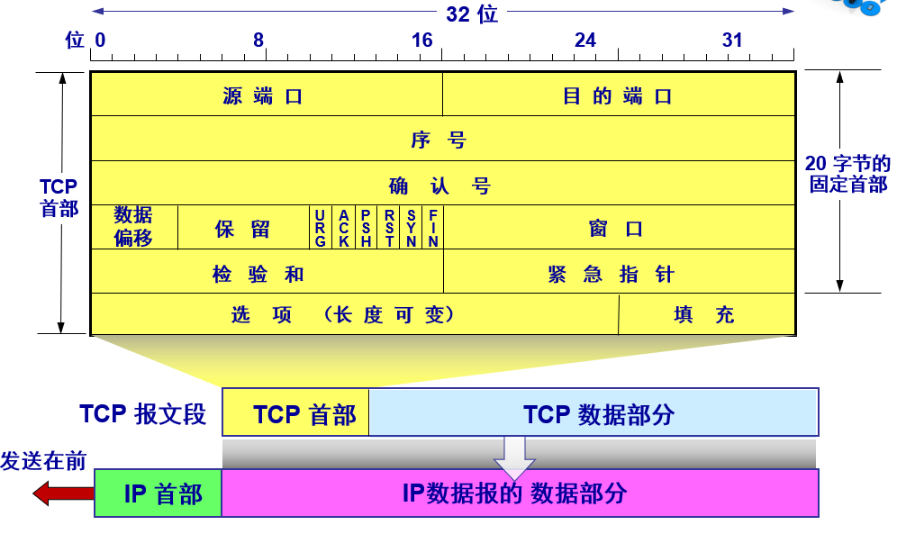

### 6. TCP可靠传输的实现

#### 6.1 以字节为单位的滑动窗口

- TCP的滑动窗口是以字节为单位的
- 发送缓存：用来暂时存放：
  - 发送应用程序传送给发送方TCP 准备发送的数据
  - TCP 以发送的，但未得到确认的数据
- 接收缓存：用来暂时存放：
  - 按序到达的、但尚未被接收应用程序读取的数据
  - 不按序到达的数据
- A 的发送窗口并不总是和 B 的接收窗口一样大（因为有一定的时间滞后）。
- TCP 标准没有规定对不按序到达的数据应如何处理。通常是先临时存放在接收窗口中，等到字节流中所缺少的字节收到后，再按序交付上层的应用进程。
- TCP 要求接收方必须有累积确认的功能，这样可以减小传输开销。  

#### 6.2 超时重传时间的选择

- TCP 每发送一个数据报，就对这个数据报设置一个定时器
- 只要计时器设置的重传时间到了但还没有收到确认信息，就重传这一段数据
- TCP 采取了一种自适应算法，它记录一个报文段发出的时间，以及收到相应的确认时间。这两个时间差就是报文段的往返时间RTT

##### 6.2.1 加权平均往返时间

##### 6.2.2 超时重传时间RTO

RTTD 是 RTT 的偏差的加权平均值。

##### 6.2.3 Karn 算法

- karn算法：在计算平均往返时间 RTT 时，只要报文段重传了，就不采用其往返时间样本。

- 这样得出的加权平均平均往返时间 RTTS 和超时重传时间 RTO 就较准确。
- 当报文段的时延突然增大了很多时，在原来得出的重传时间内，不会收到确认报文段。于是就重传报文段。但根据 Karn 算法，不考虑重传的报文段的往返时间样本。这样，超时重传时间就无法更新

- 修正的Karn 算法：
  - 报文段每重传一次，就把RTO增大一些
  - 

#### 6.3 选择确认SACK

- 问题：若收到的报文段无差错，只是未按序号，中间还缺少一些序号的数据，那么能否设法只传送缺少的数据而不重传已经正确到达接收方的数据？
  - 答案是可以的。选择确认 SACK  (Selective ACK) 就是一种可行的处理方法。

- 接收方收到了和前面的字节流不连续的两个字节块。
- 如果这些字节的序号都在接收窗口之内，那么接收方就先收下这些数据，但要把这些信息准确地告诉发送方，使发送方不要再重复发送这些已收到的数据。

### 7. TCP 的拥塞控制

#### 1. 拥塞控制的一般原理

##### 1.1 开环控制与闭环控制

- 开环控制方法就是在设计网络时事先将有关发生拥塞的因素考虑周到，力求网络在工作时不产生拥塞
- 闭环控制方法是基于反馈环路的概念。属于闭环控制的有以下几种措施： 
  (1) 监测网络系统以便检测到拥塞在何时、何处发生。
  (2) 将拥塞发生的信息传送到可采取行动的地方。
  (3) 调整网络系统的运行以解决出现的问题。

##### 1.2 监测网络的拥塞指标

- 主要指标有：
  - 由于缺少缓存空间而被丢弃的分组的百分数；
  - 平均队列长度；
  - 超时重传的分组数；
  - 平均分组时延；
  - 分组时延的标准差，等等。
- 上述这些指标的上升都标志着拥塞的增长。

#### 2. TCP 的拥塞控制方法

- TCP 采用基于窗口的方法进行拥塞控制。该方法属于闭环控制方法

- TCP 发送方维持一个拥塞窗口

- 拥塞窗口的大小取决于网络的拥塞程度，并且动态地在变化。

- 发送端利用拥塞窗口根据网络的拥塞情况调整发送的数据量。

- 所以，发送窗口大小不仅取决于接收方公告的接收窗口，还取决于网络的拥塞状况，所以真正的发送窗口值为：

  

##### 2.1 控制拥塞窗口的原则

- 只要网络没出现拥塞，拥塞窗口就可以大一些，这样能更好利用网络的资源
- 但只要出现拥塞或者可能出现拥塞，就必须减小一点，以便缓解网络出现的拥塞

##### 2.2 拥塞的判断

- 重传定时器超时
  现在通信线路的传输质量一般都很好，因传输出差错而丢弃分组的概率是很小的（远小于 1 %）。只要出现了超时，就可以猜想网络可能出现了拥塞。
- 收到三个相同（重复）的 ACK
  个别报文段会在网络中丢失，预示可能会出现拥塞（实际未发生拥塞），因此可以尽快采取控制措施，避免拥塞。

##### 2.3 TCP 拥塞控制算法

- 四种：
  1. 慢开始
  2. 拥塞避免
  3. 快重传
  4. 快恢复

###### 2.3.1 慢开始

- 用来确定网络的拥塞能力

- 算法的思路：由小到大逐渐增大拥塞窗口数值。

- 初始拥塞窗口 cwnd 设置：

  - 旧的规定：在刚刚开始发送报文段时，先把初始拥塞窗口cwnd 设置为 1 至 2 个发送方的最大报文段 SMSS (Sender Maximum Segment Size) 的数值。
  - 新的 RFC 5681 把初始拥塞窗口 cwnd 设置为不超过2至4个SMSS 的数值。

- 慢开始门限 ssthresh（状态变量）：防止拥塞窗口cwnd 增长过大引起网络拥塞。

- 拥塞窗口 cwnd  控制方法：在每收到一个对新的报文段的确认后，可以把拥塞窗口增加最多一个 SMSS 的数值。

  

  其中 N 是原先未被确认的、但现在被刚收到的确认报文段所确认的字节数。

- 不难看出，当 N < SMSS 时，拥塞窗口每次的增加量要小于 SMSS。

- 用这样的方法逐步增大发送方的拥塞窗口 cwnd，可以使分组注入到网络的速率更加合理。

- 传播轮次
- - 慢开始后，每经过一个传播轮次，拥塞窗口就加倍
  - 一个传播轮次所经历的时间其实就是往返时间RTT
  - “传输轮次”更加强调：把拥塞窗口 cwnd 所允许发送的报文段都连续发送出去，并收到了对已发送的最后一个字节的确认。
- 设置慢开始门限状态变量ssthresh
- - 慢开始门限ssthresh的用法如下
  - 当 cwnd < ssthresh 时，使用慢开始算法。
  - 当 cwnd > ssthresh 时，停止使用慢开始算法而改用拥塞避免算法。
  - 当 cwnd = ssthresh 时，既可使用慢开始算法，也可使用拥塞避免算法。

###### 2.3.2 拥塞避免算法

- 思路：让拥塞窗口 cwnd 缓慢地增大，即每经过一个往返时间 RTT 就把发送方的拥塞窗口 cwnd 加 1，而不是加倍，使拥塞窗口 cwnd 按线性规律缓慢增长。
- 因此在拥塞避免阶段就有“加法增大”  (Additive Increase) 的特点。这表明在拥塞避免阶段，拥塞窗口 cwnd 按线性规律缓慢增长，比慢开始算法的拥塞窗口增长速率缓慢得多。
- “拥塞避免”并非指完全能够避免了拥塞。利用以上的措施要完全避免网络拥塞还是不可能的。
- “拥塞避免”是说在拥塞避免阶段把拥塞窗口控制为按线性规律增长，使网络比较不容易出现拥塞。 

###### 2.3.3 当网络出现拥塞时

- 无论在慢开始阶段还是在拥塞避免阶段，只要发送方判断网络出现拥塞（重传定时器超时）：
  - ssthresh = max(cwnd/2，2)
  - cwnd = 1
  - 执行慢开始算法
- 这样做的目的就是要迅速减少主机发送到网络中的分组数，使得发生拥塞的路由器有足够时间把队列中积压的分组处理完毕。 

###### 2.3.4 快重传算法

- 采用快重传FR (Fast Retransmission) 算法可以让发送方尽早知道发生了个别报文段的丢失。
- 快重传 算法首先要求接收方不要等待自己发送数据时才进行捎带确认，而是要立即发送确认，即使收到了失序的报文段也要立即发出对已收到的报文段的重复确认。
- 发送方只要一连收到三个重复确认，就知道接收方确实没有收到报文段，因而应当立即进行重传（即“快重传”），这样就不会出现超时，发送方也不就会误认为出现了网络拥塞。
- 使用快重传可以使整个网络的吞吐量提高约20%。
- 快重传并非取消重传计时器，而是在某些情况下可更早地重传丢失的报文段。 

###### 2.3.5 快恢复算法

- 当发送端收到连续三个重复的确认时，由于发送方现在认为网络很可能没有发生拥塞，因此现在不执行慢开始算法，而是执行快恢复算法 FR (Fast Recovery) 算法：
  	(1) 慢开始门限 ssthresh = 当前拥塞窗口 cwnd / 2 ；
  	(2) 新拥塞窗口 cwnd = 慢开始门限 ssthresh ；
  	(3) 开始执行拥塞避免算法，使拥塞窗口缓慢地线性增大。 

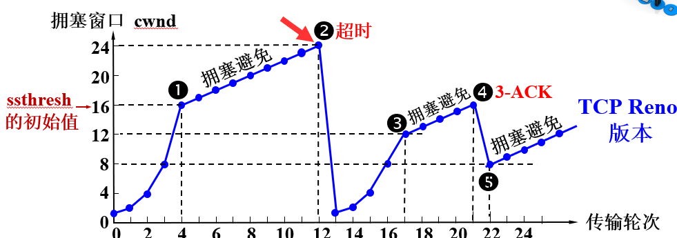

### 8. TCP 的运输连接管理

运输连接的三个阶段：

- TCP 是面向连接的协议
- 运输连接有三个阶段：
- 1. 连接建立
  2. 数据传输
  3. 连接释放
- 运输连接的管理就是使运输连接的建立和释放都能正常地进行。
- TCP连接的建立采用客户服务器方式。
- 主动发起连接建立的应用进程叫做客户(client)，
- 被动等待连接建立的应用进程叫做服务器(server)。

#### 1. TCP 连接的建立

- TCP 建立连接的过程叫做握手。
- 握手需要在客户和服务器之间交换三个 TCP 报文段。称之为三报文握手。
- 采用三报文握手主要是为了防止已失效的连接请求报文段突然又传送到了，因而产生错误。

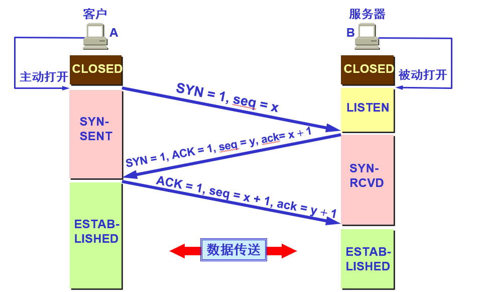

#### 2. TCP 连接释放

- TCP 连接释放过程是四报文握手。

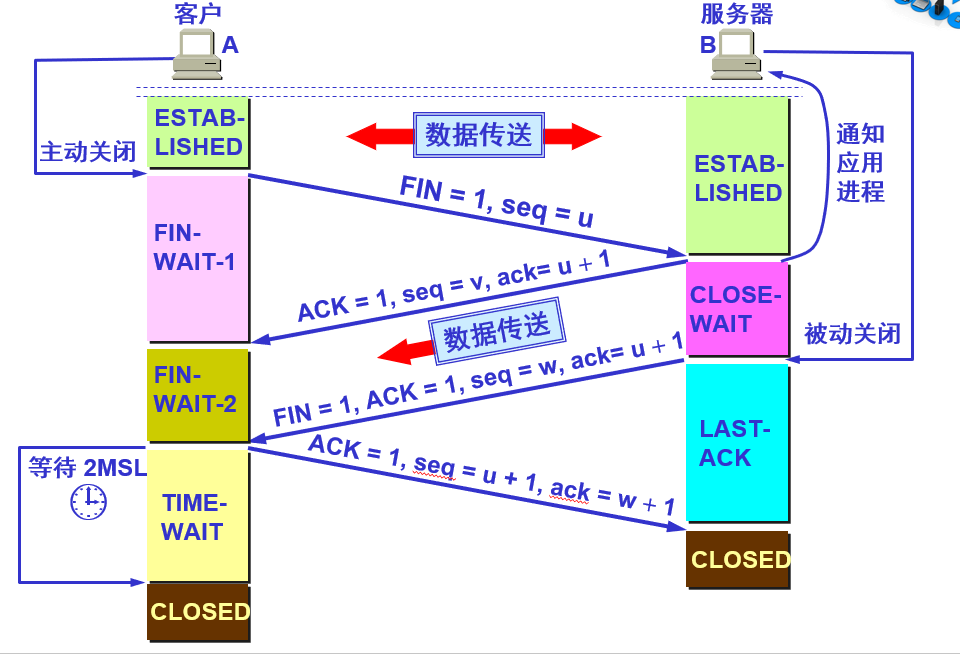

## 第六章、 应用层

### 1. 域名系统 DNS

#### 1.1 域名系统概述

1. 许多应用层软件经常直接使用域名系统 DNS ，但计算机用户只是间接而不是直接使用域名系统
2. 互联网采用层次结构的命名树作为主机的名字，并使用分布式的域名系统 DNS
3. 名字到 IP 地址的解析是由若干个域名服务器程序完成。域名服务器程序在专设的结点上运行，运行该程序的机器称为域名服务器

#### 1.2 互联网的域名结构

1. 互联网采用层次树状结构的命名方法

2. 任何一个连接在互联网上的主机或路由器，都有一个唯一的层次结构的名字，即域名

3. 域名的结构由标号序列组成，各标号之间用点隔开

   

4. 各标号分别代表不同级别的域名

5. 域名只是个逻辑概念，并不代表计算机所在的物理地点

6. 变长的域名和使用有助记忆的字符串，是为了便于人来使用。而IP地址是定长的32位二进制数字则非常利于机器进行处理

##### 1.2.2 顶级域名 TLD (top level domain)

1. 国家级顶级域名：

   - .cn 中国
   - .us 美国
   - .uk 英国

2. 通用顶级域名

   - .com (公司和企业)
   - .net (网络服务机构)
   - .org (非赢利性组织)
   - .edu (美国专用教育机构)
   - .gov (美国专用政府部门)
   - .mil (美国专用军事组织)
   - .int (国际组织)

3. 基础结构顶级域名

   arpa 这种顶级域名只有一个，用于反向域名解析，因此又称反向域名

4. 新增加的下列的通用顶级域名

   **.aero**   **（航空运输企业）**

   **.biz**  **（公司和企业）**

   **.cat**  **（加泰隆人的语言和文化团体）**

   **.coop**  **（合作团体）**

   **.info**  **（各种情况）**

   **.jobs**  **（人力资源管理者）**

   **.mobi （移动产品与服务的用户和提供者） **

   **.museum** **（博物馆）**

   **.name**  **（个人）**

   **.pro**  **（有证书的专业人员）**

   **.travel**  **（旅游业）** 

##### 1.2.3 互联网的域名空间

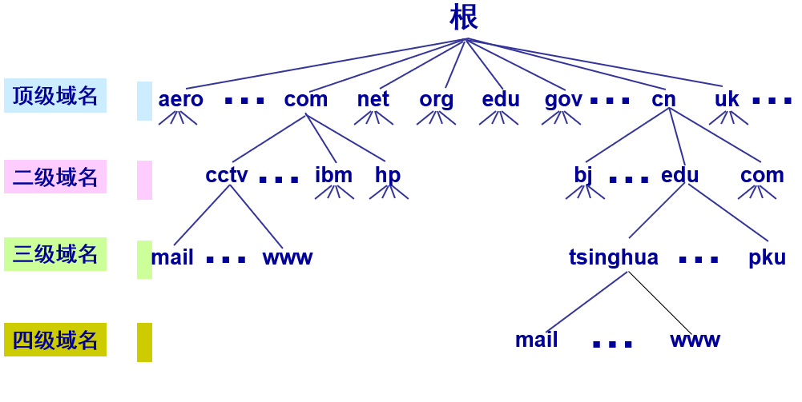

#### 1.3 域名服务器

1. 一个服务器所负责的管辖的（或有权限的）范围叫做区
2. 各单位根据具体情况来划分自己管辖范围的区。但在一个区中的所有节点必须是能联通的。
3. 每一个区设置相应的权限域名服务器，用来保存该区中的所有主机的域名到 IP 地址的映射
4. DNS 服务器的管辖范围不是以 域 为单位，而是以区为单位的

##### 1.3.1 区的不同划分方法举例

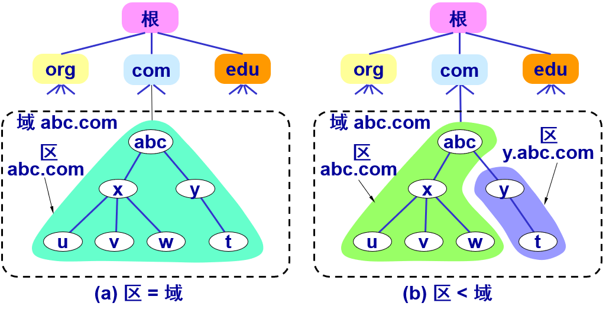

##### 1.3.2 域名服务器有以下四种类型

- 根域名服务器
- 顶级域名服务器
- 权限域名服务器
- 本地域名服务器

1. 根域名服务器
   - 根域名服务器是**最高层次**的域名服务器，也是**最重要的**域名服务器。所有的根域名服务器都知道所有的顶级域名服务器的域名和IP地址
   - 不管是哪一个本地域名服务器，若要对互联网上任何一个域名解析，只要自己无法解析，就首先求助于根域名服务器
   - 在互联网上共有13个不同IP地址的根域名服务器，它们的名字是用一个英文字母命名，从a-m
   - 根域名服务器共有13套装置，不是13个机器
2. 顶级域名服务器
   - 顶级域名服务器负责管理在该顶级域名服务器注册的所有二级域名
   - 当收到 DNS 查询请求时，就给出相应的回答（可能是最后的结果，也可能是下一步应当找的域名服务器的 IP 地址）
3. 权限域名服务器
   - 负责一个区的域名服务器
   - 当一个权限域名服务器还不能给出最后的查询回答时，就会告诉发出查询请求的 DNS客户，下一步应当找哪一个权限域名服务器
4. 本地域名服务器
   - 本地域名服务器对域名系统非常重要
   - 当一个主机发出DNS 查询请求时，这个查询请求报文就发送给本地域名服务器
   - 这种域名服务器有时候也称为默认域名服务器

##### 1.3.3 提高域名服务器的可靠性

- DNS 域名服务器都把数据复制到几个域名服务器上保存，其中一个是主域名服务器，其他的都是辅助域名服务器
- 当主域名服务器出故障时，辅助域名服务器可以保证DNS 的查询工作不会中断
- 主域名服务器定期把数据复制到辅助域名服务器上，而更改数据只能在主域名服务器上进行，这样就保持了数据的一致性

##### 1.3.4 域名的解析过程

- 主机向本地域名服务器的查询一般是采用**递归查询**。如果被主机查询的本地域名服务器不知道被查询域名的IP地址，那么本地域名服务器就以DNS客户的身份，向其他根域名服务器继续发出查询请求报文

- 本地域名服务器向根域名服务器查询一般采用**迭代查询**。当根域名服务器收到本地域名服务器的迭代查询请求报文时，要么给出所要查询的IP地址，要么告诉本地域名服务器：“你下一步应该到哪个域名服务器查询”。然后让本地域名服务器进行后续的查询

  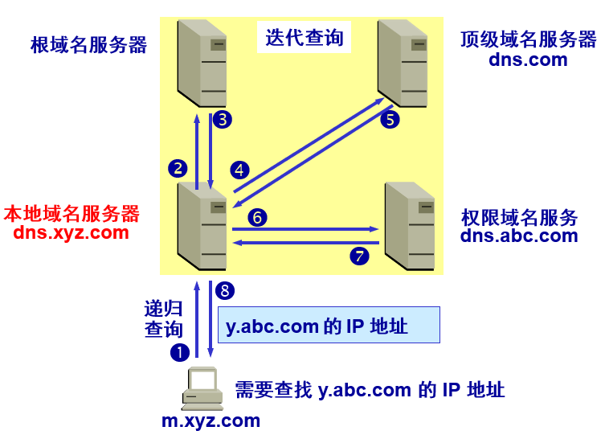

#### 1.4 域名的高速缓存

- 每个域名服务器都要维护一个高速缓存，存放最近用过的域名以及从何处获得域名映射信息的记录
- 可大大减轻根域名服务器的负荷，使互联网上的DNS 查询请求报文和回答报文的数量大大减少
- 为保持高速缓存中的内容正确，域名服务器应该为每项内容设置一个计时器，并处理超过合理时间的项
- 当权限域名服务器回答一个查询请求时，在响应中都指明绑定有效存在的时间值。增加此时间值可减少网络开销，而减少此时间值可提高域名转换的准确性

### 2. 万维网 WWW

#### 1. 万维网概述

- 万维网并非某种特殊的网络
- 万维网是一个大规模的、联机式的信息储藏所
- 万维网用链接的方式能非常方便地从互联网上的一个站点访问另一个站点，从而主动地按需获取丰富的信息
- 这种访问方式叫做链接

#### 2. 超媒体与超文本

- 万维网是分布式超媒体系统，它是超文本系统的扩充
- 一个超文本由多个信息源链接成。利用一个链接可使用户找到一个文档。这些文档可以位于世界上任何一个接在互联网上的超文本系统中。超文本是万维网的基础
- 超媒体与超文本的区别是文档内容不同，超文本文档仅包含文本信息，而超媒体文档还包含其他表示方式的信息，如图形、图像、声音、动画，甚至活动视频图像。

#### 3. 万维网的工作方式

- 万维网以客户-服务器方式工作
- 浏览器就是在用户计算机上的万维网客户程序，万维网文档所驻留的计算机则运行服务器程序，因此这个计算机也称为万维网服务器
- 客户程序向服务器程序发出请求，服务器程序向客户程序送回客户所要的万维网文档
- 在一个客户程序主窗口上显示出的万维网文档称为页面

#### 4. 万维网必须解决的问题

1. 怎样标志分布在整个互联网上的万维网文档？
   - 使用统一资源定位符URL来标志万维网上的各种文档
   - 使每一个文档在整个互联网的范围内具有唯一的标识符URL
2. 用什么协议实现万维网上的各种超链的链接
   - 在万维网客户程序与万维网服务器程序之间进行交互所使用的协议，是超文本传送协议HTTP
   - HTTP是一个应用层的协议，它使用TCP连接进行可靠的传送
3. 怎样使各种万维网文档都能在互联网上的各种计算机上显示出来，同时使用户清楚地知道在什么地方存在着超链？ 
   - 超文本标记语言 HTML (HyperText Markup Language) 使得万维网页面的设计者可以很方便地用一个超链从本页面的某处链接到互联网上的任何一个万维网页面，并且能够在自己的计算机屏幕上将这些页面显示出来。 
4. 怎样使用户能够很方便地找到所需的信息？
   - 为了在万维网上方便地查找信息，用户可使用各种的搜索工具（即搜索引擎）

### 3. 统一资源定位符URL

#### 1. URL的格式

- 资源定位符URL是对可以从互联网上得到的资源的位置和访问方法的一种简洁表示
- URL 给资源位置提供一种抽象的可识别方法，并用这种方法给资源定位
- 只要能够对资源定位，系统就能对资源进行各种操作，如CRUD
- URL 相当于一个文件名在网络范围的扩展，因此URL 是与互联网互连的机器上的任何可访问对象的一个指针

#### 2. URL 的一般形式

1. 由以冒号隔开的两部分组成，并与大小写无关

2. URL 的一般格式：

   

### 4. 超文本传送协议 HTTP

#### 1. 超文本传送协议的操作过程

1. 为了使超文本的链接能够高效率地完成，需要用HTTP协议来传送一切必须的信息
2. 从层次的角度来看，HTTP使面向事务的应用层协议，它是万维网上能够可靠地交换文件的重要基础

#### 2. HTTP的主要特点

1. HTTP是面向事务的客户服务器协议
2. HTTP 1.0 协议是无状态的
3. HTTP协议本身也是无连接的，他虽然使用了面向连接的TCP向上提供的服务

#### 3. 持续连接

1. HTTP/1.1 协议使用持续连接
2. 万维网服务器在发送响应后仍然在一段时间内保持这条连接，使同一个客户（浏览器）和该服务器可以继续在这条连接上传送后续的 HTTP 请求报文和响应报文。
3. 这并不局限于传送同一个页面上链接的文档，而是只要这些文档都在同一个服务器上就行。

##### 3.1 持续连接的两种工作方式

1. 非流水线方式：客户在收到前一个响应后才能发出下一个请求。这比非持续连接的两倍RTT的开销节省了建立TCP连接的一个RTT时间。但服务器在发送完一个对象后，其TCP连接就处于空闲状态，浪费了服务器资源
2. 流水线方式：客户在接收到HTTP的响应报文之前就能够接着发送新的请求报文。一个接一个的请求报文到达服务器之后，服务器就可连续发回响应报文。使用流水线方式时，客户访问的所有对象只需要一个RTT时间，使TCP连接的空闲时间减少，提高了下载文档的效率

#### 4. 代理服务器

1. 代理服务器又称为万维网高速缓存，它代表浏览器发出HTTP请求
2. 万维网高速缓存把最近的一些请求和响应暂存在本地磁盘中
3. 当与暂时存放的请求相同的新请求到达时，万维网高速缓存就把暂存的响应发送出去，而不需要按URL的地址再去互联网访问该资源
4. 使用高速缓存可以减少访问互联网服务器的时延

#### 5. HTTP 报文的结构

HTTP有两类报文：

请求报文——从客户端向服务器发送请求的报文

响应报文——从服务器到客户的回答

由于 HTTP 是面向正文的 (text-oriented)，因此在报文中的每一个字段都是一些 ASCII 码串，因而每个字段的长度都是不确定的。

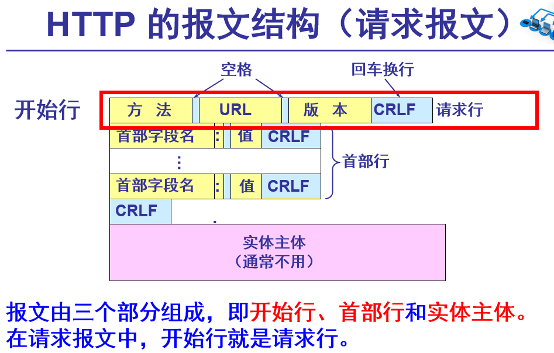

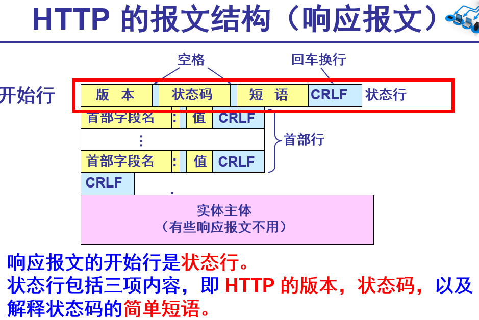

#### 6. 状态码

状态码都是3位数字组成

- 1xx 表示通知信息的，如请求收到了或正在进行处理
- 2xx 表示成功，如接受或知道了。
- 3xx 表示重定向，表示要完成请求还必须采取进一步的行动。
- 4xx 表示客户的差错，如请求中有错误的语法或不能完成。
- 5xx 表示服务器的差错，如服务器失效无法完成请求。

#### 7. 在服务器上存放客户的信息

- 万维网站点使用Cookie 来跟踪用户
- Cookie 表示在HTTP服务器和客户之间传递的状态信息
- 使用Cookie的网站服务器为用户产生唯一的识别码。利用此识别码，网站就能够跟踪该用户在该网站上的活动

#### 8. HTTP文档

1. HTML 和 css 之间的差别：HTML用于结构化内容，css用于格式化结构化的内容
2. 静态文档：该文档创作完毕后就存储在万维网服务器上，在被用户浏览过程中，内容不会改变
3. 动态文档：指文档的内容在浏览器访问万维网时，由应用程序动态创建
4. 动态文档和静态文档之间的主要差别体现在服务器一端。这主要是文档内容的生成方法不同。而从浏览器的角度看，这两种文档并没有区别。

#### 9. 万维网信息检索系统

1. 全文检索搜索和分类目录搜索

   - 在万维网中用来进行搜索的程序叫做搜索引擎
   - 全文检索搜索引擎是一种纯技术型的检索工具。它的工作原理是通过搜索软件到互联网上的各个网站搜集信息，找到一个网站后可以从这个网站再链接到另一个网站。然后按照一定的规则建立一个很大的在线数据库供客户查询
   - 用户在查询时只要输入关键词，就从已经建立的索引数据库上进行查询（并不是实时地在互联网上检索到的信息）。 

2. 分类目录搜索

   - 分类目录搜索引擎并不采集网站的任何信息，而是利用各网站向搜索引擎提交的网站信息时填写的关键词和网站描述等信息，经过人工审核编辑后，如果认为符合网站登录的条件，则输入到分类目录的数据库中，供网上用户查询。

   - 分类目录搜索也叫做分类网站搜索。 

3. 垂直搜索引擎

   - 垂直搜索引擎 (Vertical Search Engine) 针对某一特定领域、特定人群或某一特定需求提供搜索服务

   - 垂直搜索也是提供关键字来进行搜索的，但被放到了一个行业知识的上下文中，返回的结果更倾向于信息、消息、条目等。 

### 5. 电子邮件

#### 1. 电子邮件概述

- 电子邮件 (e-mail) 是互联网上使用得最多的和最受用户欢迎的一种应用。
- 电子邮件把邮件发送到收件人使用的邮件服务器，并放在其中的收件人邮箱中，收件人可随时上网到自己使用的邮件服务器上读取
- 电子邮件不仅有使用方便，而且还有传送迅速和费用低廉的优点
- 现在电子邮件不仅可传送文字信息，而且还可附上声音和图像

#### 2. 电子邮件的一些标准

- 发送邮件的协议：SMTP
- 读取邮件的协议：POP3 和 IMAP
- MIME 在其邮件首部说明了邮件的数据类型（如文字，声音，图像……），使用MIME 可在邮件中同时传送多种类型的数据

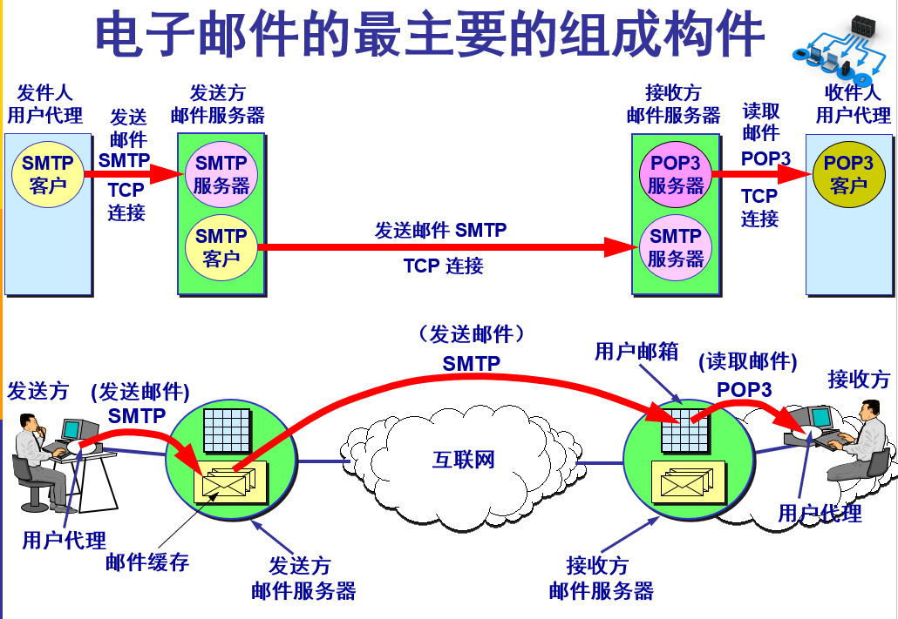

### 6. 动态主机配置协议 DHCP

DHCP 是一种即插即用的机制，它使一台电脑在接入新的网络获取IP地址时不用手工配置