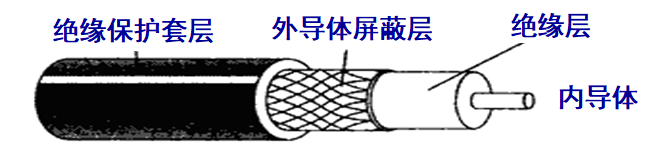
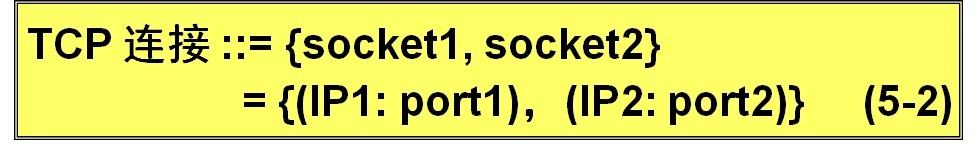

# 计算机与网络

## 第一章、 概述

## 第二章、 物理层

### 1. 物理层的基本概念

1. 物理层的作用：尽可能屏蔽掉传输媒体和通信手段的差异，使物理层上面的链路层感觉不到这些差异。
2. 物理层的协议也经常被称为物理层规程。
3. 将物理层的主要任务描述为确定与传输媒体的接口有关的一些特性：
   - 机械特性： 指明接口所用的接线器的形状和尺寸、引脚数目和排列、固定和锁定装置等
   - 电气特性： 指明在接口电缆的各条线上出现的电压的范围
   - 功能特性： 指明某条线上出现的某一电平的电压的意义
   - 过程特性： 指明对于不同功能的各种可能事件的出现顺序

### 2. 数据通信的基础知识

#### 2.1 数据通信系统的模型

1. 一个数据通信系统可划分为三大部分，即**源系统**（发送端，发送方）、**传输系统**（或传输网络）和**目的系统**（接收端，接收方）
2. 源系统一般包括：源点和发送器
3. 目的系统一般包括：接收器和终点
4. 信号：
   - 模拟信号： （连续信号）代表消息的参数的取值是连续的
   - 数字信号： （离散信号）代表消息的参数的取值是离散的

#### 2.2 有关信道的几个基本概念

1. 单向通信： （单工通信）只能有一个方向的通信而没有反方向的交互

2. 双向交替通信： （半双工通信）通信的双方都可以发送消息，但不能双方同时发送（或接受）消息

3. 双向同时通信： （全双工通信）通信的双方可以同时发送和接收消息

4. 基带信号： （即基本频带信号）来自信源的信号。像计算机输出的代表各种文字或图像文件的数据信号都属于基带信号。

5. 基带调制： 仅对基带信号的波形进行变换，使它能够与信道特性相适应。变换后的信号仍然是基带信号。把这种过程称为编码 (coding)。

6. 带通调制： 使用载波 (carrier)进行调制，把基带信号的频率范围搬移到较高的频段，并转换为模拟信号，这样就能够更好地在模拟信道中传输（即仅在一段频率范围内能够通过信道） 。

7. 带通信号 ： 经过载波调制后的信号。

8. 常见的编码格式： 

   - 不归零制：正电平代表 1，负电平代表 0。
   - 归零制：正脉冲代表 1，负脉冲代表 0。
   - 曼彻斯特编码：位周期中心的向上跳变代表 0，位周期中心的向下跳变代表 1。但也可反过来定义。
   - 差分曼彻斯特编码：在每一位的中心处始终都有跳变。位开始边界有跳变代表 0，而位开始边界没有跳变代表 1。

   

#### 2.3 信道的极限容量

1. 任何实际的信道都不是理想的，在传输信号时会产生各种失真以及带来多种干扰。 
2. 码元传输的速率越高，或信号传输的距离越远，或传输媒体质量越差，在信道的输出端的波形的失真就越严重。 
3. 限制码元在信道上的传输速率的因素
   - 信道能够通过的频率范围： 在任何信道中，码元传输的速率是有上限的，否则就会出现码间串扰的问题，使接收端对码元的判决（即识别）成为不可能。
   - 信噪比： 信号的平均功率和噪声的平均功率之比。
   - - 信噪比(dB) = 10 log10(S/N)    (dB) 

### 3. 物理层下面的传输媒体

#### 3.1 导引型传输媒体

##### 3.1.1 双绞线

1. 最常用的传输媒体。
2. 模拟传输和数字传输都可以使用双绞线，其通信距离一般为几到十几公里。
3. 屏蔽双绞线 STP (Shielded Twisted Pair)
   - 带金属屏蔽层
4. 无屏蔽双绞线 UTP (Unshielded Twisted Pair) 

##### 3.1.2 同轴电缆

1. 同轴电缆具有很好的抗干扰特性，被广泛用于传输较高速率的数据。
2. 同轴电缆的带宽取决于电缆的质量。
   50欧   同轴电缆 —— LAN / 数字传输常用
   75欧   同轴电缆 —— 有线电视 / 模拟传输常用
3. 

##### 3.1.3 光缆

1. 光纤是光纤通信的传输媒体。
2. 多模光纤： 可以存在多条不同角度入射的光线在一条光纤中传输
3. 单模光纤： 若光纤的直径减小到只有一个光的波长，则光纤就像一根波导那样，它可使光线一直向前传播，而不会产生多次反射。
4. 光纤的优点：
   - 通信容量非常大
   - 传输损耗小，中继距离长，对远距离传输特别经济
   - 抗雷电和电磁干扰性能好
   - 无串音干扰，保密性好，也不易被窃听或截取数据
   - 体积小，重量轻。

#### 3.2 非引导型传输媒体

1. 短波通信（即高频通信）主要是靠电离层的反射，但短波信道的通信质量较差，传输速率低。
2. 微波在空间主要是直线传播。
3. 传统微波通信有两种方式： 
   - 地面微波接力通信
   - 卫星通信  

### 4. 信道复用技术

复用 (multiplexing) 是通信技术中的基本概念。
它允许用户使用一个共享信道进行通信，降低成本，提高利用率。

#### 4.1 频分复用、时分复用和统计时分复用

##### 4.1.1 频分复用

1. 将整个带宽分为多份，用户在分配到一定的频带后，在通信过程中自始至终都占用这个频带
2. 频分复用的所有用户在同样的时间占用不同的带宽资源（请注意，这里的“带宽”是频率带宽而不是数据的发送速率）。 

##### 4.1.2 时分复用

1. 时分复用是将时间划分为一段段等长的时分复用帧（TDM 帧）。
2. 每一个时分复用的用户在每一个 TDM 帧中占用固定序号的时隙。
3. 时分复用的所有用户是在不同的时间占用同样的频带宽度。

##### 4.1.3 统计时分复用

1. 统计时分复用使用STDM帧来传送复用的数据
2. 统计时分复用是一种改进的时分复用

#### 4.2 波分复用

1. 波分复用就是光的频分复用。使用一根光纤来同时传输多个光载波信号。

#### 4.3 码分复用CDM（码分地址CDMA）

1. 各用户使用经过特殊挑选的不同码型，因此彼此不会造成干扰。
2. 这种系统发送的信号有很强的抗干扰能力，其频谱类似于白噪声，不易被敌人发现。 
3. 每一个比特时间划分为 m 个短的间隔，称为码片 (chip)。
4. 每个站被指派一个唯一的 m bit 码片序列。
5. 扩频通信通常有两大类：
   - 一种是直接序列扩频DSSS (Direct Sequence Spread Spectrum)，如上面讲的使用码片序列就是这一类。
   - 另一种是跳频扩频FHSS (Frequency Hopping Spread Spectrum)。
6. CDMA的重要特点
   - 每个站分配的码片序列不仅必须各不相同，并且还必须互相正交 (orthogonal)。
   - 在实用的系统中是使用伪随机码序列。 

### 5. 数字传输系统

1. 与模拟通信相比，数字通信无论是在传输质量上还是经济上都有明显的优势。
2. 旧的数字系统存在的缺点： 
   - 速率标准不统一
   - 不是同步传输
3. 同步光纤网 SONET：
   - 同步光纤网 SONET (Synchronous Optical Network)  的各级时钟都来自一个非常精确的主时钟。
   - SONET 为光纤传输系统定义了同步传输的线路速率等级结构
4. 同步数字系列 SDH ：SDH 的基本速率为 155.52 Mbit/s，称为第 1 级同步传递模块 
5. SONET / SDH 标准的意义：
   - 使不同的数字传输体制在 STM-1 等级上获得了统一。
   - 第一次真正实现了数字传输体制上的世界性标准。
   - 已成为公认的新一代理想的传输网体制。
   - SDH 标准也适合于微波和卫星传输的技术体制。

### 6. 宽带接入技术

#### 6.1 非对称数字用户线 (ADSL)技术

1. ADSL (Asymmetric Digital Subscriber Line) 技术就是用数字技术对现有的模拟电话用户线进行改造，使它能够承载宽带业务。
2. ADSL 技术就把 0~4 kHz 低端频谱留给传统电话使用，而把原来没有被利用的高端频谱留给用户上网使用。
3. ADSL技术的传输距离：
   - ADSL 的传输距离取决于数据率和用户线的线径（用户线越细，信号传输时的衰减就越大）。
   - ADSL 所能得到的最高数据传输速率与实际的用户线上的信噪比密切相关。
4. ADSL的特点：
   - 上行和下行带宽做成不对称的。
   - ADSL 在用户线（铜线）的两端各安装一个 ADSL 调制解调器。

#### 6.2 光纤同轴混合网（HFC网）

1. HFC (Hybrid Fiber Coax) 网是在目前覆盖面很广的有线电视网 CATV 的基础上开发的一种居民宽带接入网。
2. HFC 网除可传送 CATV 外，还提供电话、数据和其他宽带交互型业务。
3. HFC 网的主干线路采用光纤
4. HFC 网将原 CATV 网中的同轴电缆主干部分改换为光纤，并使用模拟光纤技术。
5. HFC 网具有双向传输功能，扩展了传输频带

#### 6.3 **FTTx** **技术**

1. FTTx 是一种实现宽带居民接入网的方案，代表多种宽带光纤接入方式。

## 第三章、 数据链路层

### 1. 使用点对点信道的数据链路层

#### 1.1 数据链路和帧

1. 链路：一个节点到相邻节点的一段物理线路，而中间没有任何其他的交换节点
2. 数据链路：将实现一些必要的通信协议的硬件和软件加到链路上
3. 帧：点对点信道的数据链路层的协议数据单元
4. 数据链路层把网络层交下来的数据构成帧发送到链路上，以及把接收到的帧的数据取出并上交给网络层

5. 点对点信道的数据链路层在进行通信时的主要步骤：

   i   节点A的数据链路层把网络层交下来的`IP`数据报添加首部和尾部封装成帧

   ii  节点A把封装好的帧发送给节点B的数据链路层

   iii 若节点B的数据链路层收到的帧无差错，则从收到的帧中提取出`IP`数据报交给上面的网络层；否则丢弃这个帧

#### 1.2 三个基本问题

##### 1.2.1 封装成帧

1. 封装成帧就是在一段数据的前后分别添加首部和尾部
2. 首部和尾部的一个重要作用就是进行帧定界。  

3. 用控制字符进行帧定界的方法举例 
   - 当数据是由可打印的 ASCII 码组成的文本文件时，帧定界可以使用特殊的帧定界符。
   - 控制字符 SOH (Start Of Header) 放在一帧的最前面，表示帧的首部开始。另一个控制字符 EOT (End Of Transmission) 表示帧的结束。

##### 1.2.2 透明传输

1. 如果数据中的某个字节的二进制代码恰好和 SOH 或 EOT 一样，数据链路层就会错误地“找到帧的边界”。

2. 解决透明传输问题——字节填充

   - 发送端的数据链路层在数据中出现控制字符“SOH”或“EOT”的前面插入一个转义字符“ESC” (其十六进制编码是 1B)。
   - 接收端的数据链路层在将数据送往网络层之前删除插入的转义字符。
   - 如果转义字符也出现在数据当中，那么应在转义字符前面插入一个转义字符 ESC。当接收端收到连续的两个转义字符时，就删除其中前面的一个。 

   

##### 1.2.3 差错检测

1. 比特差错：比特在传输过程中可能会出现差错：0 变成 1 或 1 变成 0
2. 误码率：在一段时间内，传输错误的比特占所有传输比特总数的比率
3. 循环冗余检验：在发送端，先把划分为组，假定每组 `k` 个比特。现假定待传送的数据 `M=101001`（`k=6`）. `CRC` 运算就是在数据 `M` 的后面添加供差错检测用的 `n` 位冗余码，然后构成一个帧发送出去，一个发送（`k+n`）位。
4. 冗余码的计算 :
   - 用二进制的模 2 运算进行 2^n 乘 M 的运算，这相当于在 M 后面添加 n 个 0。
   - 得到的 (k + n) 位的数除以事先选定好的长度为 (n + 1) 位的除数 P，得出商是 Q 而余数是 R，余数 R 比除数 P 少 1 位，即 R 是 n 位。 
   - 将余数 R 作为冗余码拼接在数据 M 后面发送出去。
   - 
5. 帧检验序列：在数据后面添加上的冗余码
6. 循环冗余检验 CRC 和帧检验序列 FCS 并不等同。
   - CRC 是一种常用的检错方法，而 FCS 是添加在数据后面的冗余码。
   - FCS 可以用 CRC 这种方法得出，但 CRC 并非用来获得 FCS 的唯一方法。  

### 2. 点对点协议 `PPP`

#### 2.1 `PPP` 协议的特点

1. `PPP` 协议：用户计算机和 `ISP` 进行通信时所使用的数据链路层协议
2. `PPP` 协议应满足的要求：
   - 简单
   - 封装成帧
   - 透明性
   - 多种网络层协议
   - 多种类型链路
   - 差错检测
   - 检测连接状态
   - 最大传输单元
   - 网络层地址协商
   - 数据压缩协商

#### 2.2 `PPP` 协议的组成

- 一个将 IP 数据报封装到串行链路的方法。

- 链路控制协议 LCP (Link Control Protocol)。

- 网络控制协议 NCP (Network Control Protocol)。   

##### 2.2.1 各字段的意义

F：flag 帧的开始和结束标志

FCS：帧检验序列

A：address，C：control。这两个字段并无携带 `PPP` 帧的信息

##### 2.2.2 字节填充

当信息字段带有和标志字段一样的比特(0x7E)时,就必须采取一些措施使这种形式上和标志字段一样的比特组合不出现在信息字段中，当 `PPP` 使用异步传输时：

- 将信息字段中出现的每一个 0x7E 字节转变成为 2 字节序列 (0x7D, 0x5E)。 

- 若信息字段中出现一个 0x7D 的字节, 则将其转变成为 2 字节序列 (0x7D, 0x5D)。

- 若信息字段中出现 ASCII 码的控制字符（即数值小于 0x20 的字符），则在该字符前面要加入一个 0x7D 字节，同时将该字符的编码加以改变。  

##### 2.2.3 零比特填充

`PPP` 协议在SONET/SDH链路时，使用同步传输（一连串的比特连续传送）而不是异步传输（逐个字符传输）。在这种情况下，`PPP` 协议采用零比特填充方法来实现透明传输

- 在发送端，只要发现有 5 个连续 1，则立即填入一个 0。
- 接收端对帧中的比特流进行扫描。每当发现 5 个连续1时，就把这 5 个连续 1 后的一个 0 删除。

#### 2.3 `PPP` 协议的工作状态

### 3. 使用广播信道的数据链路层

#### 3.1 局域网的数据链路层

1. 局域网的特点：网络为一个单位所拥有，且地理位置和站点数目均有限

2. 局域网的主要优点：

   - 具有广播功能，从一个站点可很方便地访问全网
   - 便于系统的扩展和逐渐演变，各设备的位置可灵活调整和改变
   - 提高了系统的可靠性、可用性、生存性

3. 局域网的分类：

   

4. 媒体共享技术：

   - 静态划分信道：频分复用、时分复用、波分复用、码分复用 
   - 动态媒体接入控制（多点接入）：
     - 随机接入
     - 受控接入

##### 3.1.1 以太网的两个标准

1. DIX Ethernet V2 是世界上第一个局域网产品（以太网）的规约。
2. IEEE 802.3 是第一个 IEEE 的以太网标准。

##### 3.1.2 适配器的作用

1. 网络接口板又称为通信适配器 (adapter) 或网络接口卡 NIC (Network Interface Card)，或“网卡”。 
2. 适配器的重要功能：
   - 进行串行/并行转换。
   - 对数据进行缓存。
   - 在计算机的操作系统安装设备驱动程序。
   - 实现以太网协议。  

#### 3.2 CSMA/CD 协议 

1. 以太网采用广播的方式发送
2. 为了通信的方便，以太网采取了两种措施：

   - 采用较为灵活的无连接的工作方式
     - 不必先建立连接就可以直接发送数据。
     - 对发送的数据帧不进行编号，也不要求对方发回确认。
     - **这样做的理由是局域网信道的质量很好，因信道质量产生差错的概率是很小的。** 
     - **以太网提供的服务是不可靠的交付，即尽最大努力的交付。**
     - 当目的站收到有差错的数据帧时就丢弃此帧，其他什么也不做。差错的纠正由高层来决定。
     - 如果高层发现丢失了一些数据而进行重传，但以太网并不知道这是一个重传的帧，而是当作一个新的数据帧来发送。  
   - 以太网发送的数据都使用曼彻斯特 (Manchester) 编码
     - 曼彻斯特编码缺点是：它所占的频带宽度比原始的基带信号增加了一倍。
3. CSMA/CD协议的要点
- 多点接入： 表示许多计算机以多点接入的方式连接在一根总线上。
   - 载波监听： 指每一个站在发送数据之前先要检测一下总线上是否有其他计算机在发送数据，如果有，则暂时不要发送数据，以免发生碰撞。 
- 碰撞检测： 计算机边发送数据边检测信道上的信号电压大小。
4. CSMA/CD 重要特性
   - 使用 CSMA/CD 协议的以太网不能进行全双工通信而只能进行双向交替通信（半双工通信）。
   - 每个站在发送数据之后的一小段时间内，存在着遭遇碰撞的可能性。 
   - 这种发送的不确定性使整个以太网的平均通信量远小于以太网的最高数据率。

5. 争用期：（碰撞窗口）以太网的端到端往返时延 2t
6. CSMA/CD协议的要点:
   - 准备发送。但在发送之前，必须先检测信道。
   - 检测信道。若检测到信道忙，则应不停地检测，一直等待信道转为空闲。若检测到信道空闲，并在 96 比特时间内信道保持空闲（保证了帧间最小间隔），就发送这个帧。
   - 检查碰撞。在发送过程中仍不停地检测信道，即网络适配器要边发送边监听。这里只有两种可能性：
     ①发送成功：在争用期内一直未检测到碰撞。这个帧肯定能够发送成功。发送完毕后，其他什么也不做。然后回到 (1)。
     ②发送失败：在争用期内检测到碰撞。这时立即停止发送数据，并按规定发送人为干扰信号。适配器接着就执行指数退避算法，等待 r 倍 512 比特时间后，返回到步骤 (2)，继续检测信道。但若重传达 16 次仍不能成功，则停止重传而向上报错。

#### 3.3 使用集线器的星形拓扑

1. 采用双绞线的以太网采用星形拓扑，在星形的中心则增加了一种可靠性非常高的设备，叫做集线器 (hub)。
2. 集线器的一些特点：
   - 集线器是使用电子器件来模拟实际电缆线的工作，因此整个系统仍然像一个传统的以太网那样运行。 
   - 使用集线器的以太网在逻辑上仍是一个总线网，各工作站使用的还是 CSMA/CD 协议，并共享逻辑上的总线。 
   -  集线器很像一个多接口的转发器，工作在物理层。
   -  集线器采用了专门的芯片，进行自适应串音回波抵消，减少了近端串音。

#### 3.4 以太网的信道利用率

#### 3.5 以太网的 MAC 层

##### 3.5.1 MAC层的硬件地址

1. 生产适配器时，6 字节的 MAC 地址已被固化在适配器的 ROM，因此，MAC 地址也叫作硬件地址 (hardware address)或物理地址。

##### 3.5.2 MAC帧的格式

无效的MAC帧：

- 数据字段的长度与长度字段的值不一致；
- 帧的长度不是整数个字节；
- 用收到的帧检验序列 FCS 查出有差错；
- 数据字段的长度不在 46 ~ 1500 字节之间。
- 有效的 MAC 帧长度为 64 ~ 1518 字节之间。

### 4. 扩展的以太网

#### 4.1 在物理层扩展以太网

1. 使用光纤扩展：

   - 主机使用光纤（通常是一对光纤）和一对光纤调制解调器连接到集线器。 

   

2. 使用集线器扩展:

   - 使用多个集线器可连成更大的、多级星形结构的以太网。
   - 优点
     - 使原来属于不同碰撞域的以太网上的计算机能够进行跨碰撞域的通信。
     - 扩大了以太网覆盖的地理范围。
   - 缺点
     - 碰撞域增大了，但总的吞吐量并未提高。
     - 如果不同的碰撞域使用不同的数据率，那么就不能用集线器将它们互连起来。   

#### 4.2 在数据链路层扩展以太网

1. 早期使用网桥，现在使用以太网交换机。
2. 网桥：
   - 网桥工作在数据链路层。
   - 它根据 MAC 帧的目的地址对收到的帧进行转发和过滤。
   - 当网桥收到一个帧时，并不是向所有的接口转发此帧，而是先检查此帧的目的 MAC 地址，然后再确定将该帧转发到哪一个接口，或把它丢弃。 

##### 4.2.1 以太网交换机的特点

1. 以太网交换机：
   - 以太网交换机实质上就是一个多接口的网桥。
     - 通常都有十几个或更多的接口。
   - 每个接口都直接与一个单台主机或另一个以太网交换机相连，并且一般都工作在全双工方式。
   - 以太网交换机具有并行性。
     - 能同时连通多对接口，使多对主机能同时通信。
   - 相互通信的主机都是独占传输媒体，无碰撞地传输数据。
2. 以太网交换机的特点：
   - 以太网交换机的接口有存储器，能在输出端口繁忙时把到来的帧进行缓存。
   - 以太网交换机是一种即插即用设备，其内部的帧交换表（又称为地址表）是通过自学习算法自动地逐渐建立起来的。
   - 以太网交换机使用了专用的交换结构芯片，用硬件转发，其转发速率要比使用软件转发的网桥快很多。
3. 以太网交换机的优点：
   - 用户独享带宽，增加了总容量。
   - 从共享总线以太网转到交换式以太网时，所有接入设备的软件和硬件、适配器等都不需要做任何改动。
   - 以太网交换机一般都具有多种速率的接口，方便了各种不同情况的用户。
4. 以太网交换机的交换方式：
   - 存储转发方式
     - 把整个数据帧先缓存后再进行处理。
   - 直通 (cut-through) 方式
     - 接收数据帧的同时就立即按数据帧的目的 MAC 地址决定该帧的转发接口，因而提高了帧的转发速度。
     - 缺点是它不检查差错就直接将帧转发出去，因此有可能也将一些无效帧转发给其他的站。

##### 4.2.2 以太网交换机的自学习功能

1. 以太网交换机运行自学习算法自动维护交换表。
2. book.P100

##### 4.2.3 从总线以太网到星形以太网

星形以太网交换机不使用共享总线，没有碰撞问题，因此不使用 CSMA/CD 协议，而是以全双工方式工作。但仍然采用以太网的帧结构。

#### 4.3 虚拟以太网

### 5. 高速以太网

## 第四章、 网络层

### 1. 网络层提供的两种服务

**互联网采用的设计思路**：网络层向上只提供简单灵活的、无连接的、尽最大努力交付的数据报服务。

**网络层不提供服务质量的承诺。**

### 2. 网络协议IP

与IP协议配套使用的其他三个协议：地址解析协议`ARP`、网际控制报文协议`ICMP`、网际组管理协议`IGMP`

#### 2.1 虚拟互连网络

1. 将网络互连起来的一些中间设备：
   - 转发器：物理层使用的中间设备
   - 网桥（桥接器）：数据链路层使用的中间设备
   - 路由器：网络层使用的中间设备
   - 网关： 在网络层以上使用的中间设备（用网关连接两个不兼容的系统需要在高层进行协议的转换）
2. 互联网可以由多种异构网络互连组成

#### 2.2 分类的IP地址

##### 2.2.1 IP地址及其表示方法

1. 整个互联网就是一个单一的、抽象的网络

2. IP地址就是给互联网上的每一台主机（或路由器）的每一个接口分配一个在全世界范围内是唯一的32位标识符

3. IP地址的编址方法共经过了三个历史阶段：

   - 分类的IP地址
   - 子网的划分
   - 构成超网

4. 每一类地址都由两个固定长度的字段组成，其中一个字段是**网络号** `net-id`**（一个网络号在整个互联网范围内必须是唯一的）**，它标志主机（或路由器）所连接到的网络，而另一个字段则是**主机号`host-id`**（主机号在它前面的网络号所指明的网络范围内必须是唯一的）**，**它标志该主机（或路由器）。

5. 两级的`IP`地址结构：

   

6. 这种两级的`IP`地址可记为：

   

7. 各类`IP`地址的网络号字段和主机号字段：

   

   

   

##### 2.2.2 常用的三种类别的`IP`地址

1. A类地址中网络号字段全为0 的`IP`地址是个保留地址，意思是**本网络**

2. A类地址中网络号为127（01111111）保留作为本地软件**环回测试**本主机的进程之间的通信之用（所以A类地址可指派的网络号是126个 2^7 - 2）

3. A类地址中的主机号占三个字节，因此每一个A类网络中的最大主机数是2^24 - 2 （主机号全为0表示该`IP`地址是**本主机**，主机号全为1表示该网络上的所有主机）

4. `IP`地址的指派范围：

   

5. 一般不使用的特殊`IP`地址：

   

6. `IP`地址具有一下一些重要特点：

   - 每一个`IP`地址都由网络号和主机号组成，好处如下：
   - - `IP`地址管理机构在分配`IP`地址时只分配网络号，而剩下的主机号则由得到该网络号的单位自行分配
     - 路由器仅根据目的主机所连接的网络号来转发分组，这样就可以使路由表中的项目数大幅度减少，从而减小了路由表所占的存储空间以及查找路由表的时间
   - 实际上`IP`地址是标志一台主机（或路由器）和一条链路的接口
   - 一个网络是指具有相同网络号`net-id`的主机的集合
   - 在`IP`地址中，所有分配到网络号的网络都是平等的

7. 多归属主机：该主机必须同时具有两个相应的`IP`地址，且网络号必须是不同的

##### 2.2.3 `IP`地址与硬件地址

1. 从层次看：

   - 物理地址是数据链路层和物理层使用的地址
   - `IP`地址是网络层和以上各层使用的地址，是一种逻辑地址

2. `IP`地址与硬件地址的区别

   

##### 2.2.4 地址解析协议`ARP`

1. `ARP`的作用：

   

2. `ARP`高速缓存：存放本局域网上的各主机和路由器的`IP`地址到硬件地址的映射表

##### 2.2.5 `IP`数据报的格式

1. `IP`数据报的格式

   

##### 2.2.6 `IP`层转发分组的流程

1. 从数据报的首部提取目的主机的`IP`地址D，得出目的网络地址N
2. 若N就是与此路由器直接相连的某个网络地址，则进行直接交付，不需要再经过其他的路由器，直接把数据报交付给目的主机，否则就是间接交付，执行3
3. 若路由表中有目的地址为D的特定主机路由，则把数据报传送给路由表中所指明的下一跳路由器，否则，执行4
4. 若路由表中有到达网络N的路由，则把数据报传送给路由表中所指明的下一跳路由器；否则，执行5
5. 若路由表中有一个默认路由，则把数据报传送给路由表中所指明的默认路由器；否则，执行6
6. 报告转发分组出错

### 3. 划分子网和构造超网

#### 3.1 划分子网

##### 3.1.1 从二级地址 `IP` 到三级 `IP` 地址

1. 早期两级 `IP` 地址设计的缺点：
   - `IP` 地址空间的利用率有时很低
   - 两级 `IP` 地址不够灵活
   - 给每一个物理网络分配一个网络号会使路由表变得太大而使网络性能变坏
2. 从 1985 年起在 IP 地址中又增加了一个“子网号字段”，使两级的 IP 地址变成为三级的 IP 地址。这种做法叫作划分子网 (subnetting) 。
3. 划分子网的思路：从主机号借用若干个位作为子网号 subnet-id，而主机号 host-id 也就相应减少了若干个位。

4. 优点： 
   - 减少了 IP 地址的浪费
   - 使网络的组织更加灵活
   - 更便于维护和管理
5. 划分子网纯属一个单位内部的事情，对外部网络透明，对外仍然表现为没有划分子网的一个网络。

##### 3.1.2 子网掩码

1. 使用子网掩码(subnet mask)可以找出 IP 地址中的子网部分。  
2. 规则：
   - 子网掩码长度＝32位
   - 某位＝1：IP地址中的对应位为网络号和子网号
   - 某位＝0：IP地址中的对应位为主机号
3. 

#### 3.2 使用子网时分组的转发

## 第五章、 运输层

### 1. 运输层协议概述

#### 1.1 进程之间的通信

​		从通信和信息处理的角度看，运输层向它上面的应用层提供通信服务，它属于面向通信部分的最高层，同时也是用户功能中的最低层。
​		当网络的边缘部分中的两个主机使用网络的核心部分的功能进行端到端的通信时，只有位于网络边缘部分的主机的协议栈才有运输层，而网络核心部分中的路由器在转发分组时都只用到下三层的功能。 

#### 1.2 运输层的两个主要协议

UDP 用户数据报协议 和 TCP 传输控制协议

​		两个对等运输实体在通信时传送的数据单位叫作运输协议数据单元 TPDU (Transport Protocol Data Unit)。

​		TCP 传送的数据单位协议是 TCP 报文段(segment)。UDP 传送的数据单位协议是 UDP 报文或用户数据报。 

##### TCP 与 UDP

UDP：一种无连接协议

- 提供无连接服务
- 在传送数据之前不需要先建立连接
- 传送的数据单位协议是UDP报文或用户数据报
- 对方的运输层在接收到UDP报文后，不需要给出任何确认
- 虽然UDP不提供可靠交付，但在某些情况下UDP是一种有效的工作方式

TCP：一种面向连接的协议

- 提供面向连接的服务
- 传送的数据单元协议是TCP报文段
- TCP不提供广播或多播服务
- 由于 TCP 要提供可靠的、面向连接的运输服务，因此不可避免地增加了许多的开销。这不仅使协议数据单元的首部增大很多，还要占用许多的处理机资源。

#### 1.3 运输层的端口

##### 1. 端口号

​		虽然通信的终点是应用进程，但我们可以把端口想象是通信的终点，因为我们只要把要传送的报文交到目的主机的某一个合适的目的端口，剩下的工作（即最后交付目的进程）就由 TCP 来完成。

##### 2. TCP/IP 运输层端口

- 端口使用一个16位端口号进行标志
- 端口号只具有本地意义，即端口号只是为了标志本计算机应用层的各进程
- 在互联网中，不同计算机相同的端口号是没有联系的
- 两个计算机中的进程要互相通信，不仅必须知道对方的 IP 地址（为了找到对方的计算机），而且还要知道对方的端口号（为了找到对方计算机中的应用进程）。

##### 3. 两大类端口

1. 服务器端使用的端口号
   - 熟知端口，数值一般为0~1023。
   - 登记端口号，数值为1024~49151，为没有熟知端口号的应用程序使用，使用这个端口号必须在IANA登记，以防重复
2. 客户端使用的端口号
   - 又称为短暂端口号，数值为 49152~65535，留给客户进程选择暂时使用
   - 当服务器进程收到客户进程的报文时，就知道了客户进程所使用的动态端口号。通信结束后，这个端口号可供其他客户进程以后使用。 

### 2. 用户数据报协议UDP

#### 2.1 UDP概述

UDP 只在 IP 的数据报服务之上增加了很少一点的功能：
	1. 复用和分用的功能
	2. 差错检测的功能
虽然 UDP 用户数据报只能提供不可靠的交付，但 UDP 在某些方面有其特殊的优点。

##### 1. UDP 的主要特点：

1. UDP 是无连接的：发送数据之前不需要建立连接，，因此减少了开销和发送数据之前的时延
2. UDP 使用尽最大努力交付：即不保证可靠交付，因此主机不需要维持复杂的连接状态表
3. UDP 是面向报文的：UDP 对应用层交下来的报文，既不合并，也不拆分，而是保留这些报文的边界。UDP 一次交付一个完整的报文
4. UDP 没有拥塞控制：因此网络出现的拥塞不会使源主机的发送速率降低。这对某些实时应用是很重要的。很适合多媒体通信的要求。
5. UDP 支持一对一、一对多、多对一和多对多的交互通信
6. UDP 的首部开销小，只有 8 个字节，比 TCP 的 20 个字节的首部要短

##### 2. 面向报文的UDP

- 发送方 UDP 对应用程序交下来的报文，在添加首部后就向下交付 IP 层。UDP 对应用层交下来的报文，既不合并，也不拆分，而是保留这些报文的边界。
- 应用层交给 UDP 多长的报文，UDP 就照样发送，即一次发送一个报文。
- 接收方 UDP 对 IP 层交上来的 UDP 用户数据报，在去除首部后就原封不动地交付上层的应用进程，一次交付一个完整的报文。
- 应用程序必须选择合适大小的报文。
  - 若报文太长，UDP 把它交给 IP 层后，IP 层在传送时可能要进行分片，这会降低 IP 层的效率。
  - 若报文太短，UDP 把它交给 IP 层后，会使 IP 数据报的首部的相对长度太大，这也降低了 IP 层的效率

#### 2.2 UDP 的首部格式

用户数据报 UDP 有两个字段：数据字段和首部字段。首部字段很简单，只有 8 个字节。

### 3. 传输控制协议 TCP 概述

#### 3.1 TCP 的主要特点

- TCP 是面向连接的运输层协议。
- 每一条 TCP 连接只能有两个端点 (endpoint)，每一条 TCP 连接只能是点对点的（一对一）。 
- TCP 提供可靠交付的服务。
- TCP 提供全双工通信
- 面向字节流
  - TCP 中的“流”(stream)指的是流入或流出进程的字节序列
  - “面向字节流”的含义是：虽然应用程序和 TCP 的交互是一次一个数据块，但 TCP 把应用程序交下来的数据看成仅仅是一连串无结构的字节流。

注意：

- TCP 连接是一条虚连接而不是一条真正的物理连接。
- TCP 对应用进程一次把多长的报文发送到TCP 的缓存中是不关心的。
- TCP 根据对方给出的窗口值和当前网络拥塞的程度来决定一个报文段应包含多少个字节（UDP 发送的报文长度是应用进程给出的）。
- TCP 可把太长的数据块划分短一些再传送。
- TCP 也可等待积累有足够多的字节后再构成报文段发送出去。 

#### 3.2 TCP 的连接

- TCP 把连接当作最基本的抽象
- 每一条TCP 连接有两个端点
- TCP 连接的端点不是主机，不是主机的IP 地址，不是应用进程，也不是运输层的协议端口。TCP 连接的端点叫做套接字 (socket) 或插口
- 端口号拼接到 (contatenated with) IP 地址即构成了套接字。

##### 1. 套接字

每一条 TCP 连接唯一地被通信两端的两个端点（即两个套接字）所确定

### 4. 可靠传输的工作原理

理想的传输条件有以下两个特点：
	(1) 传输信道不产生差错。
	(2) 不管发送方以多快的速度发送数据，接收方总是来得及处理收到的数据

#### 4.1 停止等待协议

“停止等待”就是每发送完一个分组就停止发送，等待对方的确认。在收到确认后再发送下一个分组

##### 1. 无差错情况

A 发送分组 M1，发完就暂停发送，等待 B 的确认 (ACK)。B 收到了 M1 向 A 发送  ACK。A 在收到了对 M1 的确认后，就再发送下一个分组  M2。

##### 2. 出现差错

在接收方 B 会出现两种情况：

1. B 接收 M1 时检测出了差错，就丢弃 M1，其他什么也不做（不通知 A 收到有差错的分组）。
2. M1 在传输过程中丢失了，这时 B 当然什么都不知道，也什么都不做。

如何保证 B 正确收到了 M1 呢？
解决方法：超时重传

1. A 为每一个已发送的分组都设置了一个超时计时器。
2. A 只要在超时计时器到期之前收到了相应的确认，就撤销该超时计时器，继续发送下一个分组 M2 。

##### 3. 确认丢失或确认迟到

**确认丢失**

- 若 B 所发送的对 M1 的确认丢失了，那么 A 在设定的超时重传时间内不能收到确认，但 A 并无法知道：是自己发送的分组出错、丢失了，或者 是 B 发送的确认丢失了。因此 A 在超时计时器到期后就要重传 M1。
- 假定 B 又收到了重传的分组 M1。这时 B 应采取两个行动：
  第一，丢弃这个重复的分组 M1，不向上层交付。
  第二，向 A 发送确认。不能认为已经发送过确认就不再发送，因为 A 之所以重传 M1 就表示 A 没有收到对 M1 的确认。

**确认迟到**

- 传输过程中没有出现差错，但 B 对分组 M1 的确认迟到了。
  A 会收到重复的确认。对重复的确认的处理很简单：收下后就丢弃。
  B 仍然会收到重复的 M1，并且同样要丢弃重复的 M1，并重传确认分组。

##### 4. 自动重传请求ARQ：

​		通常 A 最终总是可以收到对所有发出的分组的确认。如果 A 不断重传分组但总是收不到确认，就说明通信线路太差，不能进行通信。
​		使用上述的确认和重传机制，我们就可以在不可靠的传输网络上实现可靠的通信。
​		像上述的这种可靠传输协议常称为自动重传请求 ARQ  (Automatic Repeat reQuest)。意思是重传的请求是自动进行的，接收方不需要请求发送方重传某个出错的分组。

停止等待协议的优点是简单，缺点是信道利用率太低

流水线传输：

流水线传输就是发送方可连续发送多个分组，不必每发完一个分组就停顿下来等待对方的确认。这样可使信道上一直有数据不间断地传送

#### 4.2 连续ARQ协议

滑动窗口协议比较复杂，是 TCP 协议的精髓所在。

​		发送方维持的发送窗口，它的意义是：位于发送窗口内的分组都可连续发送出去，而不需要等待对方的确认。这样，信道利用率就提高了。
​		连续 ARQ 协议规定，发送方每收到一个确认，就把发送窗口向前滑动一个分组的位置。

​		接收方一般采用累积确认的方式。即不必对收到的分组逐个发送确认，而是对按序到达的最后一个分组发送确认，这样就表示：到这个分组为止的所有分组都已正确收到了。
​		优点：容易实现，即使确认丢失也不必重传。
​		缺点：不能向发送方反映出接收方已经正确收到的所有分组的信息。

##### Go-back-N

​		如果发送方发送了前 5 个分组，而中间的第 3 个分组丢失了。这时接收方只能对前两个分组发出确认。发送方无法知道后面三个分组的下落，而只好把后面的三个分组都再重传一次。这就叫做 Go-back-N（回退 N），表示需要再退回来重传已发送过的 N 个分组。

​		可见当通信线路质量不好时，连续 ARQ 协议会带来负面的影响。 

##### TCP 可靠通信的具体实现 

- TCP 连接的每一端都必须设有两个窗口——一个发送窗口和一个接收窗口。
- TCP 的可靠传输机制用字节的序号进行控制。TCP 所有的确认都是基于序号而不是基于报文段。
- TCP 两端的四个窗口经常处于动态变化之中。
- TCP连接的往返时间 RTT 也不是固定不变的。需要使用特定的算法估算较为合理的重传时间

### 5. TCP 报文的首部格式

​		TCP 虽然是面向字节流的，但 TCP 传送的数据单元却是报文段。

​		一个 TCP 报文段分为首部和数据两部分，而 TCP 的全部功能都体现在它首部中各字段的作用。

​		TCP 报文段首部的前 20 个字节是固定的，后面有 4n 字节是根据需要而增加的选项 (n 是整数)。因此 TCP 首部的最小长度是 20 字节

## 第六章、 应用层