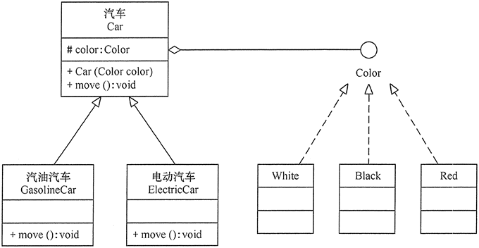
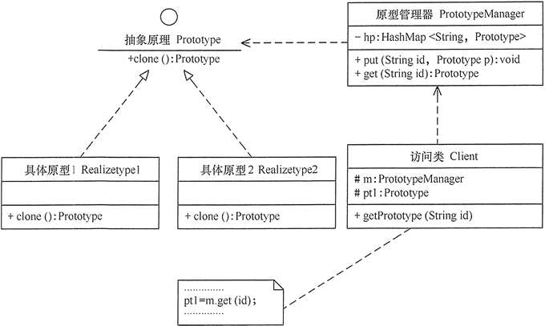

# 软件设计模式

## 一、开闭原则

#### 1. 开闭原则的定义

软件实体应当对扩展开放，对修改关闭这就是开闭原则的经典定义。

这里的软件实体包括以下几部分：

- 项目中划出的模块
- 类与接口
- 方法

#### 2. 开闭原则的作用

开闭原则是面向对象程序设计的终极目标，它使软件实体拥有一定的适应性和灵活性的同时具备稳定性和延续性。

1. 对软件测试的影响

   软件如果遵守开闭原则的话，测试只需要对扩展的功能进行测试

2. 可以提高代码的可复用性

   粒度越小，被复用的可能性就越大，在面向对象的程序设计中，根据原子和抽象编程可以提高代码的可复用性。

3. 可以提高软件的可维护性

   遵守开闭原则的软件，其稳定性高和延续性强，从而易于扩展和维护。

#### 3. 开闭原则的实现方法

可以通过“抽象约束、封装变化”来实现开闭原则，即通过接口或者抽象类为软件实体定义一个相对稳定的抽象层，而将相同的可变因素封装在相同的具体实现类中。

因为抽象灵活性好，适应性广，只要抽象的合理，可以基本保持软件架构的稳定。而软件中易变的细节可以从抽象派生来的实现类来进行扩展，当软件需要发生变化时，只需要根据需求重新派生一个实现类来扩展就可以了。

例子1：

学生可分为小学生，高中生，大学生。。。而他们又都具有一些共同的特点，所以可以将他们这些共同的特点抽象出来，形成一个抽象类，小学生，高中生，大学生为继承此抽象类的具体实现类

## 二、里氏替换原则

#### 1. 里氏替换原则的定义

里氏替换原则主要阐述了有关继承的一些原则，也就是什么时候应该使用继承，什么时候不应该使用继承，以及其中蕴含的原理。里氏替换原是继承复用的基础，它反映了基类与子类之间的关系，是对开闭原则的补充，是对实现抽象化的具体步骤的规范。

#### 2. 里氏替换原则的作用

里氏替换原则的主要作用如下：

- 里氏替换原则是实现开闭原则的重要方式之一
- 它克服了继承中重写父类造成的可复用性变差的特点
- 它是动作正确性的保证。即类的扩展不会给已有的系统引入新的错误，降低了代码出错的可能性

#### 3. 里氏替换原则的实现方法

里氏替换原则通俗来讲就是：子类可以扩展父类的功能，但不能改变父类原有的功能。也就是说：子类继承父类时，除添加新的方法完成新增功能外，尽量不要重写父类的方法。

如果通过重写父类的方法来完成新的功能，这样写起来虽然简单，但是整个继承体系的可复用性会比较差，特别是运用多态比较频繁时，程序运行出错的概率会非常大。

如果程序违背了里氏替换原则，则继承类的对象在基类出现的地方会出现运行错误。这时其修正方法是：取消原来的继承关系，重新设计它们之间的关系。

例子1：几维鸟不是鸟

鸟一般都会飞行，如燕子的飞行速度大概是每小时 120 千米。但是新西兰的几维鸟由于翅膀退化无法飞行。假如要设计一个实例，计算这两种鸟飞行 300 千米要花费的时间。显然，拿燕子来测试这段代码，结果正确，能计算出所需要的时间；但拿几维鸟来测试，结果会发生“除零异常”或是“无穷大”，明显不符合预期，其类图如图 1 所示。


```java
package principle;
public class LSPtest
{
    public static void main(String[] args)
    {
        Bird bird1=new Swallow();
        Bird bird2=new BrownKiwi();
        bird1.setSpeed(120);
        bird2.setSpeed(120);
        System.out.println("如果飞行300公里：");
        try
        {
            System.out.println("燕子将飞行"+bird1.getFlyTime(300)+"小时.");
            System.out.println("几维鸟将飞行"+bird2.getFlyTime(300)+"小时。");
        }
        catch(Exception err)
        {
            System.out.println("发生错误了!");
        }
    }
}
//鸟类
class Bird
{
    double flySpeed;
    public void setSpeed(double speed)
    {
        flySpeed=speed;
    }
    public double getFlyTime(double distance)
    {
        return(distance/flySpeed);
    }
}
//燕子类
class Swallow extends Bird{}
//几维鸟类
class BrownKiwi extends Bird
{
    public void setSpeed(double speed)
    {
           flySpeed=0;
    }
}
```

结果：

```reStructuredText
如果飞行300公里：
燕子将飞行2.5小时.
几维鸟将飞行Infinity小时。
```

程序运行错误的原因是：几维鸟类重写了鸟类的 setSpeed(double speed) 方法，这违背了里氏替换原则。正确的做法是：取消几维鸟原来的继承关系，定义鸟和几维鸟的更一般的父类，如动物类，它们都有奔跑的能力。几维鸟的飞行速度虽然为 0，但奔跑速度不为 0，可以计算出其奔跑 300 千米所要花费的时间。其类图如图 2 所示。几维鸟不是鸟正确实例图


## 三、依赖倒置原则

#### 1. 依赖倒置原则的定义

依赖倒置原则的原始定义为：高层模块不应该依赖低层模块，两者都应该依赖其抽象；抽象不应该依赖细节，细节应该依赖抽象。其核心思想是：要面向接口编程，不要面向实现编程。

依赖倒置原则是实现开闭原则的重要途径之一，它降低了客户与实现模块之间的耦合。

 由于在软件设计中，细节具有多变性，而抽象层则相对稳定，因此以抽象为基础搭建起来的架构要比以细节为基础搭建起来的架构要稳定得多。这里的抽象指的是接口或者抽象类，而细节是指具体的实现类。

使用接口或者抽象类的目的是制定好规范和契约，而不去涉及任何具体的操作，把展现细节的任务交给它们的实现类去完成。

#### 2. 依赖倒置原则的作用

依赖倒置原则的作用主要如下：

- 可以降低类间的耦合性
- 可以提高系统的耦合性
- 减少并行开发引起的风险
- 提高代码的可读性和可维护性

#### 3. 依赖倒置原则的实现方法

依赖倒置原则的目的是通过要面向接口的编程来降低类间的耦合性，所以我们应该：

- 每个类尽量提供其接口或抽象类，或两者都提供
- 变量的声明类型尽量是接口或抽象类
- 任何类都不应该从具体类派生
- 使用继承时，尽量遵循里氏替换原则

例子1：顾客购物


## 四、单一职责原则

#### 1. 单一职责原则的定义

单一职责原则规定一个类应该有且仅有一个引起它变化的原因，否则类应该被拆分

陔原则提出了一个类不应该担任太多的职责，如果一个对象担任太多的职责，那么他至少存在以下两个缺点

- 一个职责的变化可能会削弱或抑制这个类的其他职责的能力
- 当客户端需要该对象的某一个职责时，不得不将其他不需要的职责全部包含进来，从而造成冗余代码或代码的浪费

#### 2. 单一职责原则的优点

单一职责原则的核心就是控制类的粒度大小，将对象解耦，提高其内聚性，遵循单一职责原则将具备以下优点：

- 降低类的复杂度。一个类只负责一项职责，其逻辑肯定要比负责多项职责简单得多
- 提高类的可读性。复杂性降低，自然可读性会提高
- 提高系统的可维护性。可读性提高，那自然更容易维护
- 变更引起的风险降低。变更是必然的，如果单一职责原则遵守得好，当修改一个功能时，可以显著降低对其他功能的影响。

#### 3. 单一职责原则的实现方法

单一职责原则是最简单但又最难运用的原则，需要设计人员发现类的不同职责并将其分离，再封装到不同的类或模块中。而发现类的多重职责需要设计人员具有较强的分析设计能力和相关重构经验。

例子1：大学学生工作管理程序

 		大学学生工作主要包括学生生活辅导和学生学业指导两个方面的工作，其中生活辅导主要包括班委建设、出勤统计、心理辅导、费用催缴、班级管理等工作，学业指导主要包括专业引导、学习辅导、科研指导、学习总结等工作。如果将这些工作交给一位老师负责显然不合理，正确的做 法是生活辅导由辅导员负责，学业指导由学业导师负责，其类图如图 1 所示。


注意：单一职责同样也适用于方法。一个方法应该尽可能做好一件事情。如果一个方法处理的事情太多，其颗粒度会变得很粗，不利于重用。

## 五、接口隔离原则

#### 1. 接口隔离原则的定义

接口隔离原则要求程序员尽量将臃肿庞大的接口拆分成更小的和更具体的接口，让接口中只包含客户感兴趣的方法。一个类对另一个类的依赖应该建立在最小的接口上。

以上定义的含义是：要为各个类建立它们需要的专用接口，而不要试图去建立一个很庞大的接口供所有依赖它的类去调用。

接口隔离原则和单一职责都是为了提高类的内聚性，降低他们之间的耦合性，体现了封装的思想，但两者是不同的。

- 单一职责原则注重的是职责，而接口隔离原则注重的是对接口依赖的隔离
- 单一职责原则主要是约束类，它针对的是程序中的实现和细节；接口隔离原则主要是约束接口，主要针对的是抽象和程序整体框架的构建

#### 2. 接口隔离原则的优点

接口隔离原则是为了约束接口，降低类对接口的依赖性，遵循接口隔离原则有以下5个优点

1. 将臃肿庞大的接口分解为多个粒度小的接口，可以用来预防外来变更的扩散，提高系统的灵活性和可维护性
2. 接口隔离提高了系统的内聚性，减少了对外交互，降低了系统的耦合性
3. 如果接口的粒度大小合理，能够保证系统的稳定性；但是，如果定义过小，则会造成接口数量过多，使设计复杂化；如果定义过大，灵活性降低，无法提供定制服务，给整体项目带来无法预料的风险
4. 使用多个专门的接口还能够体现对象的层次，因为可以通过接口的继承，实现对总接口的定义
5. 能减少项目工程中代码冗余。过大的接口里面经常放置许多不同的方法，当实现这个接口的时候，被迫设计冗余的代码

#### 3. 接口隔离原则的实现方法

在具体应用接口隔离原则时，应该根据以下几个规则来衡量。

- 接口尽量小，但是要有限度。一个接口只服务于一个子模块或业务逻辑。
- 为依赖接口的类定制服务。只提供调用者需要的方法，屏蔽不需要的方法。
- 了解环境，拒绝盲从。每个项目或产品都有选定的环境因素，环境不同，接口拆分的标准就不同，深入了解业务逻辑。
- 提高内聚，减少对外交互。使接口用最少的方法去完成最多的事情。

例子1：学生成绩管理系统

学生成绩管理程序一般包含插入成绩、删除成绩、修改成绩、计算总分、计算均分、打印成绩信息、査询成绩信息等功能，如果将这些功能全部放到一个接口中显然不太合理，正确的做法是将它们分别放在输入模块、统计模块和打印模块等 3 个模块中，其类图如图 1 所示。


## 六、迪米特法则

#### 1. 迪米特法则的定义

迪米特法则的定义是：只与你的直接朋友交谈，不跟“陌生人”说话。其含义是：如果两个软件实体无须直接通信，那么就不应当发生直接的相互调用，可以通过第三方转发该调用。其目的是降低类之间的耦合度，提高模块的相对独立性。

迪米特法则中的“朋友”是指：**当前对象本身**、**当前对象的成员对象**、**当前对象所创建的对象**、**当前对象的方法参数**等，这些对象同当前对象存在关联、聚合或组合关系，可以直接访问这些对象的方法。

#### 2. 迪米特法则的优点

迪米特法则要求限制实体之间通信的宽度和深度，正确使用迪米特法则将有以下两个优点：

- 降低了类之间的耦合度，提高了模块的相对独立性
- 由于亲和度降低，从而提高了类的可复用率和系统的扩展性

但是，过度使用迪米特法则会使系统产生大量的中介类，从而增加系统的复杂性，使模块之间的通信效率降低。所以，在釆用迪米特法则时需要反复权衡，确保高内聚和低耦合的同时，保证系统的结构清晰。

#### 2. 迪米特法则的实现方法

从迪米特法则的定义和特点可知，它强调以下两点：

- 从依赖者的角度来说，只依赖应该依赖的对象。
- 从被依赖者的角度说，只暴露应该暴露的方法。

所以，在运用迪米特法则时要注意以下6点：

- 在类的划分下，应该创建弱耦合的类。类与类之间的耦合越弱，就越有利于实现可复用的目标
- 在类的设计上，优先考虑将一个类设置成不变类
- 在类的结构设计上，尽量降低类成员的访问权限
- 在对其他类的引用上，将引用其他对象的次数降到最低
- 不暴露类的属性成员，而应该提供相应的访问器（set方法和get方法）
- 谨慎使用序列化功能

例子1：明星与经纪人关系

明星由于全身心投入艺术，所以许多日常事务由经纪人负责处理，如与粉丝的见面会，与媒体公司的业务洽淡等。这里的经纪人是明星的朋友，而粉丝和媒体公司是陌生人，所以适合使用迪米特法则，其类图如图 1 所示。


## 七、合成复用原则

#### 1. 合成复用原则的定义

合成复用原则（Composite Reuse Principle，CRP）又叫组合/聚合复用原则（Composition/Aggregate Reuse Principle，CARP）。它要求在软件复用时，要尽量先使用组合或者聚合等关联关系来实现，其次才考虑使用继承关系来实现。

如果要使用继承关系，则必须严格遵循里氏替换原则。合成复用原则同里氏替换原则相辅相成的，两者都是开闭原则的具体实现规范。

#### 2. 合成复用原则的重要性

通常类的复用分为继承复用和合成复用两种，继承复用虽然简单易用，但它存在以下的缺点：

- 继承复用破坏了类的封装性。因为继承暴露了父类的细节，父类对子类是透明的，所以这种复用又称为“白箱”复用
- 子类与父类的耦合度高。父类的实现的任何改变都会导致子类的实现发生变化，这不利于类的扩展与维护
- 它限制了复用的灵活性。从父类继承而来的实现是静态的，在编译时已经定义，所以在运行时不可能发生变化

采用组合或聚合复用时，可以将已有对象纳入新对象中，使之成为新对象的一部分，新对象可以调用已有对象的功能，它有以下优点：

- 它维持了类的封装性。因为成分对象的内部细节是新对象看不见的，所以这种复用又称“黑箱”复用
- 新旧类之间的耦合度低。这种复用所需的依赖比较少，新对象可以存储成分对象的唯一方法是通过成分对象的接口
- 复用的灵活性高。这种复用可以在运行时动态进行，新对象可以调用已有对象的功能，从而达到复用

#### 3. 合成复用原则的实现方法

合成复用原则是通过将已有的对象纳入新对象中，作为新对象的成员对象来实现的，新对象可以调用已有对象的功能，从而达到复用。

例子1：汽车分类管理程序

1. 继承类图


2. 合成复用类图




## 八、小结

这 7 种设计原则是软件设计模式必须尽量遵循的原则，各种原则要求的侧重点不同。其中，开闭原则是总纲，它告诉我们要对扩展开放，对修改关闭；里氏替换原则告诉我们不要破坏继承体系；依赖倒置原则告诉我们要面向接口编程；单一职责原则告诉我们实现类要职责单一；接口隔离原则告诉我们在设计接口的时候要精简单一；迪米特法则告诉我们要降低耦合度；合成复用原则告诉我们要优先使用组合或者聚合关系复用，少用继承关系复用。


## 九、单例模式

#### 1. 单例模式的定义与特点

单例（Singleton）模式的定义：指一个类只有一个实例，且该类能自行创建这个实例的一种模式。

单例模式有 3 个特点：

- 单例类只有一个实例对象
- 该单例对象只能由单例类自行创建
- 单例类对外提供一个访问该单例的全局访问点

#### 2. 单例模式的结构与实现

单例模式是设计模式中最简单的模式之一。通常，普通类的构造函数是公有的，外部类可以通过“new 构造函数()”来生成多个实例。但是，如果将类的构造函数设为私有的，外部类就无法调用该构造函数，也就无法生成多个实例。这时该类自身必须定义一个静态私有实例，并向外提供一个静态的公有函数用于创建或获取该静态私有实例。

1. 单例模式的结构

   单例模式的主要角色有两个：

   - 单例类：包含一个实例且能自行创建这个实例的类
   - 访问类：使用单例的类

   

2. 单例模式的实现

   懒汉式单例：

   ```java
   //该模式的特点是类加载时没有生成单例，只有当第一次调用 getlnstance 方法时才去创建这个单例
   public class Singleton{
        // 设置为volatile 使instance的改变对其他线程存在可见性
       private static volatile Singleton instance = null; 
       
       // 设置为private ：对外不提供创建实例的方法
       private Singleton(){}
       
       // synchronized 保证线程的安全，防止创建多个实例
       public static synchronized getInstance(){
           if(instance == null){
               instance = new Singleton();
           }
           return instance;
   	}
   }
   /*
   如果编写的是多线程程序，则不要删除上例代码中的关键字 volatile 和 synchronized，否则将存在线程非安全的问题。如果不删除这两个关键字就能保证线程安全，但是每次访问时都要同步，会影响性能，且消耗更多的资源，这是懒汉式单例的缺点。
   */
   ```

   饿汉式单例：

   ```java
   //该模式的特点是类一旦加载就创建一个单例，保证在调用 getInstance 方法之前单例已经存在了。
   public class Singleton{
   	public static final Singleton instance = new Singleton();
       
       private Singleton(){}
       
       public static getInstance(){
           return instance;
       }
   }
   ```

#### 3. 单例模式的扩展

单例模式可扩展为有限的多例（Multitcm）模式，这种模式可生成有限个实例并保存在 ArmyList 中，客户需要时可随机获取


## 十、原型模式

#### 1. 原型模式的定义与特点

原型（Prototype）模式的定义如下：用一个已经创建的实例作为原型，通过复制该原型对象来创建一个和原型相同或相似的新对象。在这里，原型实例指定了要创建的对象的种类。用这种方式创建对象非常高效，根本无须知道对象创建的细节。

#### 2. 原型模式的定义与特点

由于 Java 提供了对象的 `clone()` 方法，所以用 Java 实现原型模式很简单。

1. 模式的结构

   原型模式包含了以下主要角色

   - 抽象原型类：规定了具体原型对象必须实现的接口
   - 具体原型类：实现抽象原型类的 `clone()` 方法，它是可复制的对象
   - 访问类：使用具体原型类的 `clone()` 方法来复制对象

   

2. 模式的实现

   原型模式的克隆分为浅克隆和深克隆，Java 中的 Object 类提供了浅克隆的 clone() 方法，具体原型类只要实现 Cloneable 接口就可实现对象的浅克隆，这里的 Cloneable 接口就是抽象原型类。其代码如下：

   ```java
   public class Propotype implements Cloneable{
       public Object clone()throws Exception{
           return (Propotype)super.clone();
       }
   }
   ```

#### 3. 原型模式的应用场景

- 对象之间相似或相同，即只是个别属性不同的情况下
- 对象的创建过程比较麻烦，但复制比较简单的时候

#### 4. 原型模式的扩展

原型模式可扩展为带原型管理器的原型模式，它在原型模式的基础上增加了一个原型管理器 PrototypeManager 类。该类用 HashMap 保存多个复制的原型，Client 类可以通过管理器的 get(String id) 方法从中获取复制的原型。



## 十一、工厂方法模式

#### 1. 模式的定义与特点

工厂方法（FactoryMethod）模式的定义：定义一个创建产品对象的工厂接口，将产品对象的实际创建工作推迟到具体子工厂类当中。这满足创建型模式中所要求的“创建与使用相分离”的特点。

我们把被创建的对象称为“产品”，把创建产品的对象称为“工厂”。如果要创建的产品不多，只要一个工厂类就可以完成，这种模式叫“简单工厂模式”，它不属于 GoF 的 23 种经典设计模式，它的缺点是增加新产品时会违背“开闭原则”。

本节介绍的“工厂方法模式”是对简单工厂模式的进一步抽象化，其好处是可以使系统在不修改原来代码的情况下引进新的产品，即满足开闭原则。

工厂方法模式的主要优点有：

- 用户只需要知道具体工厂的名称就可得到所要的产品，无须知道产品的具体创建过程；
- 在系统增加新的产品时只需要添加具体产品类和对应的具体工厂类，无须对原工厂进行任何修改，满足开闭原则；

其缺点是：每增加一个产品就要增加一个具体产品类和一个对应的具体工厂类，这增加了系统的复杂度。

#### 2. 模式的结构与实现

工厂方法模式由抽象工厂、具体工厂、抽象产品和具体产品等4个要素构成。

1. 模式的结构

   工厂方法模式的主要角色如下：

   - 抽象工厂：提供了创建产品的接口，调用者通过它访问具体工厂的工厂方法来创建产品
   - 具体工厂：主要是实现抽象工厂中的抽象方法，完成具体产品的创建
   - 抽象产品：定义了产品的规范，描述了产品的主要特性与功能
   - 具体产品：实现了抽象产品角色所定义的接口，由具体工厂来创建，它同具体工厂之间一一对应

   


## 十二、抽象工厂模式

#### 1. 模式的定义与特点

抽象工厂（AbstractFactory）模式的定义：是一种为访问类提供一个创建一组相关或相互依赖对象的接口，且访问类无须指定所要产品的具体类就能得到同族的不同等级的产品的模式结构。

抽象工厂模式是工厂方法模式的升级版本，工厂方法模式只生产一个等级的产品，而抽象工厂模式可生产多个等级的产品。

使用抽象工厂模式一般要满足以下条件。

- 系统中有多个产品族，每个具体工厂创建同一族但属于不同等级结构的产品。
- 系统一次只可能消费其中某一族产品，即同族的产品一起使用。

抽象工厂模式除了具有工厂方法模式的优点外，其他主要优点如下。

- 可以在类的内部对产品族中相关联的多等级产品共同管理，而不必专门引入多个新的类来进行管理。
- 当增加一个新的产品族时不需要修改原代码，满足开闭原则。

其缺点是：当产品族中需要增加一个新的产品时，所有的工厂类都需要进行修改。

#### 2. 模式的结构与实现

抽象工厂模式同工厂方法模式一样，也是由抽象工厂、具体工厂、抽象产品和具体产品等 4 个要素构成，但抽象工厂中方法个数不同，抽象产品的个数也不同

1. 模式的结构

   抽象工厂模式的主要角色如下。

   - 抽象工厂（Abstract Factory）：提供了创建产品的接口，它包含多个创建产品的方法 newProduct()，可以创建多个不同等级的产品。
   - 具体工厂（Concrete Factory）：主要是实现抽象工厂中的多个抽象方法，完成具体产品的创建。
   - 抽象产品（Product）：定义了产品的规范，描述了产品的主要特性和功能，抽象工厂模式有多个抽象产品。
   - 具体产品（ConcreteProduct）：实现了抽象产品角色所定义的接口，由具体工厂来创建，它 同具体工厂之间是多对一的关系。

   


## 十三、建造者模式

#### 1. 建造者模式的定义与特点

建造者（Builder）模式的定义：指将一个复杂对象的构造与它的表示分离，使同样的构建过程可以创建不同的表示，这样的设计模式被称为建造者模式。它是将一个复杂的对象分解为多个简单的对象，然后一步一步构建而成。它将变与不变相分离，即产品的组成部分是不变的，但每一部分是可以灵活选择的。

该模式的优点如下：

- 各个具体的建造者相互独立，有利于系统的扩展
- 客户端不必知道产品内部组成的细节，便于控制细节风险

其缺点如下：

- 产品的组成部分必须相同，这限制了其使用范围
- 如果产品的内部变化复杂，该模式会增加很多的建造者类

建造者（Builder）模式和工厂模式的关注点不同：建造者模式注重零部件的组装过程，而工厂方法模式更注重零部件的创建过程，但两者可以结合使用

#### 2. 模式结构与实现

建造者（Builder）模式由产品、抽象建造者、具体建造者、指挥者等 4 个要素构成，现在我们来分析其基本结构和实现方法。

1. 模式的结构

   建造者的主要角色如下：

   - 产品：它是包含多个组成部件的复杂对象，由具体建造者来创建其各个部件
   - 抽象建造者：它是一个包含创建产品各个子部件的抽象方法的接口，通常还包含一个返回复杂产品的方法
   - 具体建造者：实现抽象建造者接口，完成复杂产品的各个部件的具体创建方法
   - 指挥者：它调用建造者对象中的部件构造与装配方法完成复杂对象的创建，在指挥者中不涉及具体产品的信息

   

## 十四、代理模式


#### 1. 代理模式的定义与特点

代理模式的定义：由于某些原因需要给某对象提供一个代理以控制对该对象的访问。这时，访问对象不适合或者不能直接引用目标对象，代理对象作为访问对象和目标对象之间的中介

代理模式的主要优点：

- 代理模式在客户端与目标对象之间起到一个中介作用和保护目标对象的作用
- 代理对象可以扩展目标对象的功能
- 代理模式能将客户端与目标对象分离，在一定程度上降低了系统的耦合度

其主要缺点：

- 在客户端和目标对象之间增加一个代理对象，会造成请求处理速度变慢
- 增加了系统的复杂度

#### 2.代理模式的结构与实现

代理模式的结构比较简单，主要是通过定义一个继承抽象主题的代理来包含真实主题，从而实现对真实主题的访问。

1. 模式的结构

   代理模式的主要角色有：

   - 抽象主题类：通过接口或抽象类声明真实主题和代理对象实现的业务方法
   - 真实主题类：实现了抽象主题中的具体业务，是代理对象所代表的真实对象，是最终要引用的对象
   - 代理类：提供了与真实主题相同的接口，其内部含有对真实主题的引用，它可以访问、控制或扩展真实主题的功能

   

#### 3. 代理模式的应用场景

代理模式的应用场景：

- 远程代理：这种方式通常是为了隐藏目标对象存在于不同地址空间的事实，方便客户端访问
- 虚拟代理：这种方法通常用于要创建的目标对象开销很大时
- 安全代理：这种方法通常用于控制不同种类客户对真实对象的访问
- 智能指引：主要用于调用目标对象时，代理附加一些额外的处理功能
- 延迟加载：指为了提高系统的性能，延迟对目标的加载

#### 4. 动态代理


## 十五、适配器模式

#### 1. 模式的定义与特点

适配器模式（Adapter）的定义如下：将一个类的接口转换成客户希望的另外一个接口，使得原本由于接口不兼容而不能一起工作的那些类能一起工作。适配器模式分为类结构型模式和对象结构型模式两种，前者类之间的耦合度比后者高，且要求程序员了解现有组件库中的相关组件的内部结构，所以应用相对较少些。

该模式的主要优点如下。

- 客户端通过适配器可以透明地调用目标接口。
- 复用了现存的类，程序员不需要修改原有代码而重用现有的适配者类。
- 将目标类和适配者类解耦，解决了目标类和适配者类接口不一致的问题。


其缺点是：对类适配器来说，更换适配器的实现过程比较复杂。

#### 2. 模式的结构与实现

类适配器模式可采用多重继承方式实现，但Java不支持多继承，但可以定义一个适配器类来实现当前系统的业务接口，同时又继承现有组件库中已经存在的组件

对象适配器模式可采用将现有组件库中已经实现的组件引入适配器类中，该类同时实现当前系统的业务接口

1. 模式的结构

   适配器模式主要包含以下角色：

   - 目标接口：当前系统业务所期待的接口，它可以是抽象类或接口
   - 适配者类：它是被访问和适配的现存组件库中的组件接口
   - 适配器类：它是一个转换器，通过继承或引用适配者的对象，把适配者接口转换成目标接口，让客户按目标接口的格式访问适配器

   类适配器模式结构图：

   

   对象适配器模式结构图：

   

#### 3. 模式应用场景

适配器模式（Adapter）通常适用于以下场景。

- 以前开发的系统存在满足新系统功能需求的类，但其接口同新系统的接口不一致。
- 使用第三方提供的组件，但组件接口定义和自己要求的接口定义不同。


## 十六、桥接模式

#### 1. 桥接模式的定义与特点

桥接（Bridge）模式的定义如下：将抽象与实现分离，使它们可以独立变化。它是用组合关系代替继承关系来实现，从而降低了抽象和实现这两个可变维度的耦合度。
桥接（Bridge）模式的优点是：
由于抽象与实现分离，所以扩展能力强；其实现细节对客户透明。缺点是：由于聚合关系建立在抽象层，要求开发者针对抽象化进行设计与编程，这增加了系统的理解与设计难度。

#### 2. 桥接模式的结构与实现

可以将抽象化部分与实现化部分分开，取消二者的继承关系，改用组合关系。

1. 模式的结构

   桥接模式主要包含以下主要角色：

   - 抽象化角色：定义抽象类，并包含一个对实现化对象的引用
   - 扩展抽象化角色：是抽象化角色的子类，实现父类中的业务方法，并通过组合关系调用实现化角色中的业务方法
   - 实现化角色：定义实现化角色的接口，供扩展抽象化角色调用
   - 具体实现化角色：给出实现化角色的具体实现

   桥接模式结构图：

   

   #### 3. 桥接模式的应用场景

   桥接模式通常适用于以下场景。

   1. 当一个类存在两个独立变化的维度，且这两个维度都需要进行扩展时。
   2. 当一个系统不希望使用继承或因为多层次继承导致系统类的个数急剧增加时。
   3. 当一个系统需要在构件的抽象化角色和具体化角色之间增加更多的灵活性时。


## 十七、装饰者模型

#### 1. 装饰者模式的定义与特点

装饰（Decorator）模式的定义：指在不改变现有对象结构的情况下，动态地给该对象增加一些职责（即增加其额外功能）的模式，它属于对象结构型模式。

装饰模式的主要优点：

- 采用装饰者模式扩展对象的功能比采用继承方式更加灵活
- 可以设计出多个不同的具体装饰类、创造出多个不同的组合

其主要缺点就是：装饰者模式增加了许多子类，如果过度使用会使程序变得复杂

#### 2. 装饰模式的结构与实现

通常情况下，扩展一个类的功能会使用继承方式来实现。但继承具有静态特征，耦合度高，并且随着扩展功能的增多，子类会很膨胀。如果使用组合关系来创建一个包装对象（即装饰对象）来包裹真实对象，并在保持真实对象的类结构不变的前提下，为其提供额外的功能，这就是装饰模式的目标。

1. 模式的结构

   装饰者模型主要有以下几个角色：

   - 抽象构件角色：定义一个抽象接口以规范准备接收附加责任的对象
   - 具体构件角色：实现抽象构件，通过装饰角色为其添加一些职责
   - 抽象装饰角色：继承抽象构件，并包含具体构件的实例，可以通过其子类扩展具体构件的功能
   - 具体装饰角色：实现抽象装饰的相关方法，并给具体构件对象添加附加的责任

装饰者模式结构图：


## 十八、外观模式

#### 1. 外观模式的定义与特点

外观（Facade）模式的定义：是一种通过为多个复杂的子系统提供一个一致的接口，而使这些子系统更加容易被访问的模式。该模式对外有一个统一接口，外部应用程序不用关心内部子系统的具体的细节，这样会大大降低应用程序的复杂度，提高了程序的可维护性。

1. 降低了子系统与客户端之间的耦合度，使得子系统的变化不会影响调用它的客户类。
2. 对客户屏蔽了子系统组件，减少了客户处理的对象数目，并使得子系统使用起来更加容易。
3. 降低了大型软件系统中的编译依赖性，简化了系统在不同平台之间的移植过程，因为编译一个子系统不会影响其他的子系统，也不会影响外观对象。


外观（Facade）模式的主要缺点如下。

1. 不能很好地限制客户使用子系统类。
2. 增加新的子系统可能需要修改外观类或客户端的源代码，违背了“开闭原则”。


#### 2.  外观模式的结构与实现

外观（Facade）模式的结构比较简单，主要是定义了一个高层接口。它包含了对各个子系统的引用，客户端可以通过它访问各个子系统的功能。现在来分析其基本结构和实现方法。
外观（Facade）模式包含以下主要角色。

1. 模式的结构外观（Facade）角色：为多个子系统对外提供一个共同的接口。
2. 子系统（Sub System）角色：实现系统的部分功能，客户可以通过外观角色访问它。
3. 客户（Client）角色：通过一个外观角色访问各个子系统的功能。


#### 3. 外观模式的应用场景

通常在以下情况下可以考虑使用外观模式。

1. 对分层结构系统构建时，使用外观模式定义子系统中每层的入口点可以简化子系统之间的依赖关系。
2. 当一个复杂系统的子系统很多时，外观模式可以为系统设计一个简单的接口供外界访问。
3. 当客户端与多个子系统之间存在很大的联系时，引入外观模式可将它们分离，从而提高子系统的独立性和可移植性。


## 十九、享元模式

#### 1. 享元模式的定义和特点

享元（Flyweight）模式的定义：运用共享技术来有効地支持大量细粒度对象的复用。它通过共享已经存在的又橡来大幅度减少需要创建的对象数量、避免大量相似类的开销，从而提高系统资源的利用率。

享元模式的主要优点是：相同对象只要保存一份，这降低了系统中对象的数量，从而降低了系统中细粒度对象给内存带来的压力。

其主要缺点是：

1. 为了使对象可以共享，需要将一些不能共享的状态外部化，这将增加程序的复杂性。
2. 读取享元模式的外部状态会使得运行时间稍微变长。

#### 2. 享元模式的结构和实现

享元模式有两种状态：

1. 内部状态：即不会随环境变化而变化的可共享部分
2. 外部状态：指随环境改变而改变的不可共享部分。

享元模式的实现主要要领就是区分应用中的这两种状态，并将外部状态外部化

1. 模式的结构

   享元模式的主要角色有以下几种：

   - 抽象享元角色：是所有具体享元类的基类，为具体享元类规范需要实现的公共接口，非享元的外部状态以参数的形式通过方法传入
   - 具体享元角色：实现抽象享元角色中所规定的接口
   - 非享元角色：是不可共享的外部状态，它以参数的形式注入具体享元的相关方法
   - 享元工厂角色：负责创建和管理享元角色。当客户对象请求一个享元对象时，享元工厂检查系统中是否存在符合要求的享元对象，如果存在则提供给客户；如果不存在的话，则创建一个新的享元对象

2. 享元模式结构图

   

## 二十、组合模式

#### 1. 组合模式的定义与特点

组合模式的定义：组合模式又叫部分-整体模式，它是一种将对象组合成树状的层次结构的模式，用来表示“部分-整体”的关系，使用户对单个对象和组合对象具有一致的访问性。

组合对象的主要优点：

- 组合模式使得客户端代码可以一致地处理单个对象和组合对象，无须关心自己处理的对象是单个对象，还是组合对象，这简化了客户端代码
- 更容易在组合体内加入新的对象，客户端不会因为加入了新对象而更改源代码，满足开闭原则

其主要缺点是：

- 设计复杂，客户端需要花更多的时间清理类之间的层次关系
- 不容易限制容器中的构件
- 不容易用继承的方法来增加构件的新功能

#### 2. 组合模式的结构与实现

1. 模式的结构：

   组合模式主要包含以下几个角色：

   1. 抽象构件（Component）角色：它的主要作用是为树叶构件和树枝构件声明公共接口，并实现它们的默认行为。在透明式的组合模式中抽象构件还声明访问和管理子类的接口；在安全式的组合模式中不声明访问和管理子类的接口，管理工作由树枝构件完成。
   2. 树叶构件（Leaf）角色：是组合中的叶节点对象，它没有子节点，用于实现抽象构件角色中 声明的公共接口。
   3. 树枝构件（Composite）角色：是组合中的分支节点对象，它有子节点。它实现了抽象构件角色中声明的接口，它的主要作用是存储和管理子部件，通常包含 Add()、Remove()、GetChild() 等方法。

   组合模式分为透明式的组合模式和安全式的组合模式

   - 透明式的组合方式：在该方式中，由于抽象构件声明了所有子类中的全部方法，所以客户端无须区别树叶对象和树枝对象，对客户端来说是透明的。但其缺点是：树叶构件本来没有 Add()、Remove() 及 GetChild() 方法，却要实现它们（空实现或抛异常），这样会带来一些安全性问题。

     

   - 安全式组合模式：在该方式中，将管理子构件的方法移到树枝构件中，抽象构件和树叶构件没有对子对象的管理方法，这样就避免了上一种方式的安全性问题，但由于叶子和分支有不同的接口，客户端在调用时要知道树叶对象和树枝对象的存在，所以失去了透明性。

     

