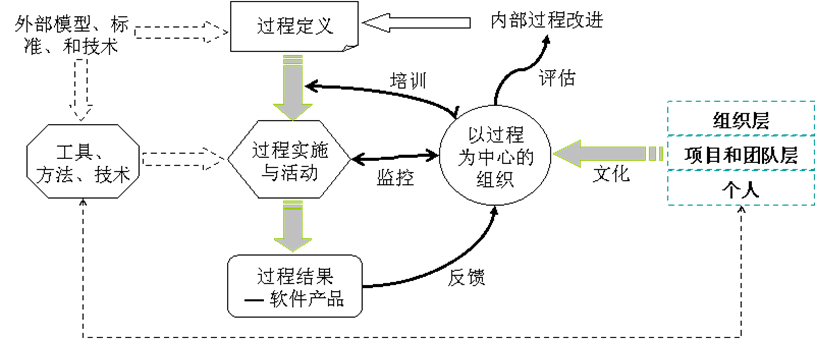

# 软件过程管理

## 第一章、软件过程规范

### 1. 过程

#### 1.1 过程的定义：

“过程”是为完成一个特定的目标而进行的一系列操作步骤，如软件开发过程。

#### 1.2 软件过程的分类和组成

软件的基本过程：软件获取、供应、开发、运行和维护的过程，包括需求分析、软件设计、编码等过程

软件支持过程：对软件主要过程提供支持的过程，包括文档编制过程、配置管理过程、质量保证过程、验证和确认过程（测试过程）、评审过程等

软件组织过程：对软件主要过程和支持过程的组织保证过程，包括管理过程、基础设施过程、改进过程和培训过程

### 2. 过程规范

#### 2.1 什么是过程规范

过程规范就是对输入/输出和活动所构成的过程进行明文规定或约定俗成的标准。软件过程规范是软件开发组织行动的准则与指南，可以依据上述各类过程的特点而建立相应的规范，如软件基本过程规范、软件支持过程规范和软件组织过程规范。 

1. 软件过程规范的建立：
   - 软件能力成熟度模型（CMM/CMMI）
   - 个体软件过程（PSP）
   - 团队软件过程（TSP）
   - IBM-Raional统一过程（RUP）
   - 极限编程（XP）
   - 微软软件框架（MSF）

#### 2.2 过程规范的内容和示例

1. 任务规范
2. 日常规章制度
3. 软件工具

#### 2.3 过程规范的影响和作用

1. 消极影响的存在和消除
2. 规范存在的必要性
3. 过程规范的作用
   - 帮助团队实现共同目标
   - 一个规范的软件过程必将带来稳定的、高水平的过程质量
   - 过程规范使软件组织的生产效率更高

### 3. 软件生命周期的过程需求

#### 3.1 软件工程过程

软件工程过程是软件系统、产品的定义、设计、实现以及维护的过程

1. 开发过程：定义并开发软件产品的活动过程，包括需求分析、软件设计和编程等
2. 运行过程：在规定的环境中为其用户提供运行计算机系统服务的活动过程，包括软件部署
3. 维护过程：提供维护软件产品服务的活动过程，也就是通过对软件的修改、变更，使得软件系统保持合适的运行状态，这一过程包括软件产品的移植和退役

#### 3.2  软件支持过程

1. 文档编制：
   - 明确并定义文档开发中所采用的标准、软件过程中所需要的各类文档。
   - 详细说明所有文档的内容、目的及相关的输出产品。
   - 根据定义的标准与已确定的计划来编写、审查、修改和发布所有文档。
   - 按已定义的标准和具体的规则维护文档。
2. 配置管理：
   -  软件过程或项目中的配置项（如程序、文件和数据等有关内容）被标识、定义。
   - 根据已定义的配置项建立基线，以便对更改与发布进行有效的控制，并控制配置项的存储、处理与分发，确保配置项的完全性与一致性。
   - 记录并报告配置项的状态以及已发生变更的需求。
3. 质量保证：
   - 针对过程或项目确定质量保证活动、制定出相应的计划与进度表。
   - 确定质量保证活动的有关标准、方法、规程与工具。
   - 确定进行质量保证活动所需的资源、组织及其组织成员的职责。
   - 有足够的能力确保必要的质量保证活动独立于管理者以及过程实际执行者之外进行开展和实施。
   - 在与各类相关的计划进度保持一致的前提下，实施所制定的质量保证活动 。 
4. 验证：
   - 根据需要验证的工作产品所制定的规范（如产品规格说明书）实施必要的检验活动
   - 有效地发现各类阶段性产品所存在的缺陷，并跟踪和消除缺陷。
5. 确认：
   -  根据客户实际需求，确认所有工作产品相应的质量准则，并实施必需的确认活动。
   - 提供有关证据，以证明开发出的工作产品满足或适合指定的需求
6. 联合评审：
   - 与客户、供应商以及其他利益相关方（或独立的第三方）对开发的活动和产品进行评估 。
   - 为联合评审的实施制定相应的计划与进度，跟踪评审活动，直至结束 。
7. 审核：
   - 判断是否与指定的需求、计划以及合同相一致 。
   - 由合适的、独立的一方来安排对产品或过程的审核工作 。
   - 以确定其是否符合特定需求 
8. 问题解决：
   -  提供及时的、有明确职责的以及文档化的方式，以确保所有发现的问题都经过相应的分析并得到解决 
   - 提供一种相应的机制，以识别所发现的问题并根据相应的趋势采取行动 

#### 3.3 软件过程管理

1. 项目管理过程：是计划、跟踪和协调项目执行及生产所需资源的管理过程。项目管理过程的活动，包括软件基本过程的范围确定、策划、执行和控制、评审和评价等。 
2. 质量管理过程：是对项目产品和服务的质量加以管理，从而获得最大的客户满意度。此过程包括在项目以及组织层次上建立对产品和过程质量管理的关注 
3. 风险管理过程：在整个项目的生命周期中对风险不断的识别、诊断和分析，回避风险、降低风险或消除风险，并在项目以及组织层次上建立有效的风险管理机制 
4. 子合同商管理过程：选择合格的子合同商并对其进行管理的过程 

#### 3.4 软件组织过程

1. 业务规划过程：是为组织与项目成员提供对愿景的描述以及企业文化的介绍，从而使项目成员能更有效地工作。 
2. 定义过程：是建立一个可重复使用的过程定义库，从而对其它过程等提供指导、约束和支持
3. 改进过程：是为了满足业务变化的需要，提高过程的效率与有效性，而对软件过程进行持续的评估、度量、控制和改善的过程  
4. 人力资源和培训过程：为项目或其它组织过程提供培训合格的人员所需的活动 
5. 基础设施过程：是建立生存周期过程基础结构、为其他过程建立和维护所需基础设施的过程 

#### 3.5 软件客户——供应商的过程

客户－供应商过程是内部直接影响到客户、外部直接影响开发、向客户交付软件以及软件正确操作与使用的过程，包括软件获得、客户需求管理、提供软件、操作软件以及提供客户服务等5个子过程

### 4. 软件生命周期标准

### 5. 软件过程建模

#### 5.1 软件过程建模型

#### 5.2 基于UML的过程建模

#### 5.3 基于IDEF3的过程建模

#### 5.4 基于Agent的自适应软件过程模型

#### 5.5 基于SOA的软件过程模型

## 第二章、软件过程成熟度

### 1. 过程成熟度标准

#### 1.1 软件过程不成熟的特点

- 软件过程能力低：不能按预定计划开发出客户满意的产品，项目拖延、费用大大超出预算已成惯例
- 过程性能的不可预见性：对进度和预算估计、产品质量的目标缺乏历史数据和有效方法的客观基础，开发的进度、成本和产品的质量都难以预测
- 过程的不可视性：软件过程缺乏定义、缺乏文档和缺乏跟踪，在整个软件过程中，不清楚每个阶段进出的标准、执行的方法和规则
- 过程的不稳定性：实际的、具体的操作过程是在一个项目开始后临时拼凑而成，每个项目都不一样
- 过程的被动性：缺乏改进的主动性

#### 1.2 软件过程成熟的标准

- 软件过程能力高：具有全组织范围的管理软件开发和维护过程的能力
- 软件过程性能可预见性：对进度、预算和质量做出现实的和准确的估计和预测
- 过程的一致性：可遵循的标准、规则和指导性原则
- 过程的丰富性
- 过程的可视性
- 过程的稳定性
- 过程的不断改进

### 2. 能力成熟度模型概述

#### 2.1 CMM的基本内容

1. CMM是软件过程能力成熟度模型（Capacity Maturity Model，CMM）的简称

2. CMM描述一条从无序的、混乱的过程到成熟的、有纪律的过程的改进途径，描绘出软件组织如何增加对软件开发和维护的过程控制，如何向软件工程和管理的优秀文化演变等方面的指导 

3. CMM的结构：

   

#### 2.2 系统工程能力模型

​        国际系统工程委员会（International Council on Systems Engineering，INCOSE）基于各种工程标准为评估系统工程能力建立了对照表。在此期间，该对照表发展为成熟的能力模型，称为系统工程能力评估模型（Systems Engineering Capability Assessment Model，SECAM）。SECAM扩充了连续式模型——软件过程改进和能力确定模型(Software Process Improvement Capability dEtermination，SPICE)的概念，但是比SE-CMM更加明确地注重在系统工程实践上，采用EIA632标准作为过程模型设计参考的基础。

#### 2.3 集成化产品开发模型

IPPD（集成化产品与过程开发）强调在贯穿整个生命周期期间所有技术及业务的相关人员的参与

#### 2.4 CMMI介绍

### 3. 过程成熟度级别

#### 

#### 3.1 成熟度等级的行为特征 

- 初始级：具有明显的不成熟过程的特点
- 可重复级（受管理级）：建立了管理软件项目的方针和实施这些方针的规程，使软件项目的有效管理过程制度化，有能力去跟踪成本、进度和质量。一个有效过程可特征化为已文档化的、已实施的、可培训的和可测量的软件过程 
- 已定义级：包含一组协调的、集成的、适度定义的软件工程过程和管理过程，具有良好的文档化、标准化，使软件过程具有可视性、一致性、稳定性和可重复性，软件过程被集成为一个有机的整体 
- 定量管理级（已管理级）：是量化的管理过程。在上述已定义级的基础上，可以建立有关软件过程和产品质量的、一致的度量体系，采集详细的数据进行分析，从而对软件产品和过程进行有效的定量控制和管理
- 优化级：不断改善组织的软件过程能力和项目的过程性能，利用来自过程和来自新思想、新技术的先导性试验的定量反馈信息，使持续过程改进成为可能。为了预防缺陷出现，组织有办法识别出弱点并预先针对性地加强过程 

#### 3.2 理解成熟度等级

理解可重复级和已定义级：注意力逐渐从技术问题转向组织体系和管理问题  

理解定量管理级和优化级 ：

#### 3.3 成熟度等级的过程特征

可重复级：焦点开始集中在软件过程的管理上，一个受管理的过程则是一个可重复的过程 。从管理角度可以看到一个按计划执行的并且阶段可控的、规范化的软件开发过程 

已定义级：通过裁剪组织的标准软件过程来建立自定义的软件过程 

定量管理级：对软件产品的质量、开发进度和其它开发目标进行有效的评估和预测 

优化级：其焦点是软件过程的持续改进

#### 3.4 CMMI过程域

#### 3.5 CMM/CMMI比较分析

### 4. 软件过程的可视性

### 5. 过程能力和效能预测

### 6. 软件过程框架

#### 6.1 软件过程环境和过程框架

1. 软件过程环境的内容：

   - 不同的过程对象
   - 不同的过程层次
   - 过程资源的差异
   - 过程文化的差异
   - 开发类型的不同

2. 软件过程框架

   

#### 6.2 软件过程文化

过程文化的类型:

1. 过程至上，奉过程为教条：一切围绕着过程，组织、质量和效率都服从于过程，过程的执行严格，过程结果可靠、稳定，认为生产的“东西”是过程的一个节点，只是全局的一部分。但效率较低，缺乏灵活性、创造性。
2. 以过程为焦点，关注过程，强调过程的重要性：但不拘于过程，让过程服从于质量和效率、服从于组织的业务目标……
3. 过程只能起辅助作用，人决定一切, 过程可能流于形式…..

#### 6.3 PSP/TSP和CMM组成的软件过程框架

1. PSP/TSP/CMM之间的关系

   

2. 组织过程的目标

   

   

## 第三章、软件过程的组织管理

### 1. 组织过程焦点

#### 1.1 组织过程焦点-执行约定

1. 组织应遵循一个文档化的关5于协调软件流程的制定与改进活动的组织方针
2. 高级管理人员发起对软件过程制定和改进的组织活动
3. 高级管理人员监督软件过程的制定和改进的组织活动

#### 1.2 组织过程焦点-执行能力

1. 建立一个负责整个组织的软件过程活动的工作组
2. 为软件过程活动提供足够的资源和资金
3. 组织软件过程活动的组员进行培训
4. 软件工程组和其他工程组的组员接受软件过程活动的相关培训

#### 1.3 组织过程焦点-执行活动

1. 定期评估软件过程并根据评估结果制订相应的更改计划
2. 组织制定和维护有关软件过程和改进活动的计划
3. 协调组织的标准软件过程和项目自定义的软件过程的制定和改进工作
4. 协调组织的软件过程数据库的使用
5. 新过程、新方法、新工具的评价、监控和推广
6. 对有关组织和项目的软件过程培训进行统一管理
7. 及时将有关软件过程制定和改进的活动通知与实施软件过程相关的组和人员

#### 1.4 组织过程焦点-评估

1. 度量与分析
   - 已经完成的工作量以及实际消耗的资源与计划的比较。
   - 每次软件过程的评估结果与以往的评估结果和建议的比较。
2. 实施验证
   - 评审软件过程制定和改进活动的进展状态。
   - 分析在低层次上无法解决的矛盾和问题。
   - 各项活动的组织、实施、审核以及结果。
   - 总结验证结果，写出总结报告并将报告发送给有关的工作组和人员。

### 2. 组织过程的定义

​		组织过程定义的目的是开发和维护一组可用的软件过程财富（software process assets）, 这些财富可以用来改进跨越各个项目的过程性能并为组织的长期发展奠定基础。

​		软件过程定义涉及到开发和维护组织的标准软件过程（standard software process）

#### 2.1 组织过程定义-软件过程财富

​        软件过程财富可用于开发、执行和维护标准软件过程和项目定义软件过程。软件过程财富主要包含如下内容：

- 组织标准软件过程。
- 软件生命周期的描述。
- 过程剪裁指南和准则。
- 组织软件过程数据库。
- 软件过程的有关文档库。

#### 2.2 组织过程定义-过程裁剪

​		标准软件过程 ——组织标准软件过程是基本过程的可操作的定义，基本过程指导在组织中建立一个针对所有软件项目的共用的软件过程，是项目定义软件过程的基础。 

​		项目定义软件过程 ——项目定义软件过程是指对项目所用软件过程的可操作的定义。项目定义软件过程是一个已很好特征化的和已理解的软件过程，用软件标准、规程、工具和方法予以描述。

##### 2.2.2 组织过程定义-裁剪过程（2）

**剪裁指南和准则的主要作用：**

- 选择一个适合项目的生命周期模型。
- 剪裁和细化组织标准软件过程和所选择的软件生命周期，使之适合项目的具体特征。

### 3. PSP过程框架和成熟度模型

1. PSP过程框架

   PSP过程由一系列方法、表格、脚本等组成，用以指导软件开发人员计划、度量和管理他们的工作。

   

2. PSP成熟度模型

   PSP是一个具有4个等级的成熟度框架 。4个等级分别为个体度量过程、个体计划过程、个体质量管理过程和个体循环过程。

   

### 4. TSP——小组软件过程

1. TSP解决的主要问题

   - 如何规划和管理一个软件开发团队。
   - 如何制订团队工作所需要的策略。
   - 如何定义和确定团队中每个角色的职责。
   - 如何为团队中每个成员分配不同的角色。
   - 团队及其不同角色在整个开发过程的不同阶段应该做些什么，如何更好地发挥作用。
   - 在如何协调团队成员之间的任务，并跟踪报告团队整体的任务进度。
   - 采用哪些方法提高团队的协作能力。

2. TSP过程流

   

3. TSP结构

   TSP由分阶段的众多循环构成。TSP遵循交互性原则，每一阶段和循环都能在上一阶段或循环的基础上重新规划。

   

   4. TSP启动过程

      

      整个启动流程共包含了9个启动会议。当流程结束时，小组将创建详细的工作计划，并形成一个团结一致的、高效的团队。 

## 第四章、软件过程的需求处理

### 1. 软件需求工程

所有与需求直接相关的活动统称为需求工程，需求工程分为了两个部分：需求开发和需求管理。其中，需求开发又分为了需求获取、需求分析、需求定义和需求验证4个部分，而需求管理则包含了变更控制、版本控制、需求跟踪和需求状态跟踪 

#### 1.1 需求工程过程框架

1. 业务需求：反映了组织机构或客户对系统、产品的概括的目标要求，它在**项目视图**与**范围文档**中予以说明。主要的**目的是对企业目前的业务流程进行评估**，得出一个业务前景。业务需求的确定对后面的用户需求和功能需求起到了限制作用。
2. 用户需求：文档描述了**用户使用系统而完成的任务的集合**，用户需求在用户案例（user case）文档或方案脚本中予以说明。收集和分析用户需求是不容易的，因为很多需求是隐形的，很难获取，更难保证需求完整，而需求又是易变的，这就要求用户和开发人员进行充分地交流。
3. 功能需求：定义了开发人员必须实现的软件功能，它源于用户需求。功能需求是软件需求说明书中最重要的部分之一，它在开发、测试、质量保证、项目管理以及相关项目功能中都起了重要的作用。非功能需求描述了系统展现给用户的行为和执行的操作等，包括要遵从的业务规则、人机接口、安全性和可靠性等要求。

### 2. 需求开发

需求开发的目的是通过调查与分析，获取用户需求并定义产品需求。 

#### 2.1 需求获取概述

​        需求获取是通过各种途径获取用户的需求信息（原始材料），产生《用户需求说明书》。 

#### 2.2 需求获取的方法

- 需求研讨会
- 头脑风暴
- 用例模型
- 访谈
- 角色扮演
- 原型法

#### 2.3 基于用例的需求获取

#### 2.4 需求定义

需求定义指的是解释涉众需求,并根据需求规模整理成对要构建系统的明确的说明

### 3. 软件需求规格说明书

0. 文档介绍
0.1 文档目的
0.2 文档范围
0.3 读者对象
0.4 参考文档
0.5 术语与缩写解释
1. 产品介绍
提示：(1) 说明产品是什么，什么用途；
           (2) 介绍产品的开发背景。
2. 产品面向的用户群体
提示：(1) 描述本产品面向的用户(客户、最终  用户)的特征；
           (2) 说明本产品将给他们带来什么好处？特们选择本产品的可能性有多大？
3. 产品应当遵循的标准或规范
提示：阐述本产品应当遵循什么标准、规范或业务规则。
4. 产品的功能需求
5. 产品的非功能需求
6. 其他需求

### 4. 需求确认

如何进行需求评审？

（1）分层次评审
目标性评审
功能性评审
操作性评审

（2）分阶段评审

如何保证需求规格说明书的质量？

- 正确性
- 完备性
- 易理解性
- 一致性
- 可行性
- 健壮性
- 易修改性
- 易测试性和可修改性
- 易追溯性
- 兼容性

### 5. 需求追踪

#### 5.1 需求的标识

<需求类型><需求#>
需求类型可以是：F=功能需求，D=数据需求，B=行为需求，I=接口需求；O=输出需求。

#### 5.2 需求的属性

- 创建需求的时间
- 需求的版本号
- 创建需求的作者
- 负责认可该需求的人员
- 需求状态
- 需求的原因或根据（或信息的出处）
- 需求涉及的子系统
- 需求涉及的产品版本号
- ……

#### 5.3 需求的状态

- 已建议——该需求已被有权提出需求的人建议
- 已批准——该需求已被分析，估计了其对项目余下部分的影响（包括成本和对项目其余部分的干扰），已有一个确定的产品版本号或编号，软件开发团队已同意实现该项需求
- 已实现——使用所选择的方法已验证了实现的需求，例如测试和检测，审查该需求跟踪与测试用例相符。该需求现在被认为完成
- 已删除——计划的需求已被删除，并包含一个原因说明和作出删除决定的人员

#### 5.4 需求跟踪

- 正向跟踪：以用户需求为切入点，检查《用户需求说明书》或《需求规格说明书》中的每个需求是否都能在后继工作产品中找到对应点。
- 逆向跟踪：检查设计文档、代码、测试用例等工作产品是否都能在《需求规格说明书》中找到出处。

正向跟踪和逆向跟踪合称为“双向跟踪”。 

### 6. 需求变更控制流程

#### 6.1 需求变更控制策略

1. 项目启动阶段的变更预防
2. 项目实施阶段的需求变更
3. 项目收尾阶段的总结

## 第五章、软件过程的技术管理

### 1. 软件过程的技术架构

#### 1.1 过程技术架构的层次和内容

#### 1.2 软件过程的资源管理

### 2. 	软件过程的问题分析和决策方法

#### 2.1 过程问题解决的系统方法

#### 2.2 原因分析和缺陷分析

- 在开发周期的每个阶段实施根本原因分析（root cause analysis），为有效开展缺陷预防活动提供依据 
- 通过制订原因分析计划、选择缺陷分析数据而找出原因、实施建议措施、评价变更的效果、记录数据等多个环节，最终完成这一活动 
- 经常使用的工具有：数据库系统、过程建模工具、统计分析包。

#### 2.3 决策分析与决定

- 选择决策技术和结构层次，制订决策分析与决定的计划；
- 建立作为决策基础的评价准则；
- 建立并运用决策分析指导原则，确定推荐的候选方案；
- 选择评价方法，对照准则评价候选方案。
- 选择解决方案

### 3. 软件过程的技术路线

#### 3.1 软件项目过程的技术解决流程

1. 制订技术解决计划。
2. 系统定义、候选方案和评估准则。
3. 系统操作概念和使用场景。
4. 系统架构设计。
5. 系统构件的详细设计。
6. 实现设计——完成编程和单元测试。
7. 通过复审、测试完成对系统的验证。
8. 软件发布或部署。
9. 软件的操作和维护。

#### 3.2 技术解决流程的建立与实施

- 建立并维护技术解决的组织方针，反复进行产品构件的选择、产品和产品构件的设计以及产品构件设计的实现、验证工作。
- 设计技术路线，确定技术路线中关键的难题和初步的解决办法。
- 根据项目的规模以及财力，确定技术解决人力资源、硬件资源和技术解决工具。
- 技术解决方案准则应该包含对软件生命周期设计问题的处理。
- 为每个候选解决方案拟订产品运行和用户交互作用的时间场景。
- 应充分考虑新技术所带来的风险，要计划好一些应急的措施或备用的成熟的技术。

#### 3.3 开发设计

1. 系统定义 
2. 设计标准和准则的属性 
3. 设计方法 
4. 产品构件设计 
5. 设计文档

#### 3.4 编程和单元测试

- 主要的编程思想 
- 推荐的编程方法 
- 编程准则和规范 
- 单元测试方法 
- 代码重构 

#### 3.5 验证、确认与测试

- 验证（verification）是指验证或检验软件是否已正确地实现了产品规格书所定义的系统功能和特性，验证过程提供证据表明，软件相关产品与所有生命周期活动的要求相一致。
- 确认（validation）是为了保证所生产的软件可追溯到用户需求的一系列活动，确认过程提供证据，表明软件是否满足客户需求，并解决了相应问题。
- 测试（testing）是为了发现软件的缺陷，减少产品质量的潜在风险。测试是实现验证活动和确认活动的最有效的手段和途径。

### 4. 知识传递

- 纵向传递是一个具有很强时间顺序性的接力过程,指软件产品和技术知识从需求分析阶段到设计阶段、从设计阶段到编程阶段、从开发阶段到维护阶段、从产品上一个版本到当前版本的知识传递过程。
- 横向传递是指软件产品和技术知识在不同团队之间的传递过程 
- 知识传递的有效方法 

### 5. 软件过程管理工具

## 第六章、软件过程的项目管理

